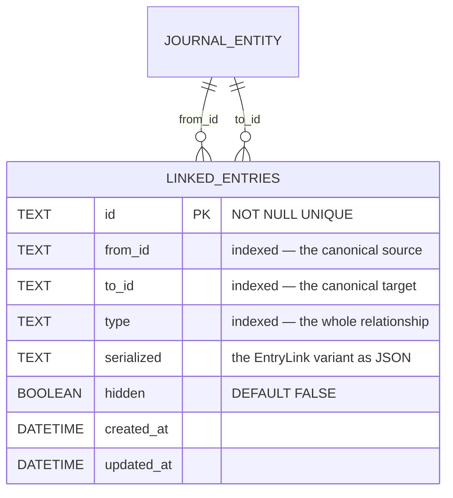
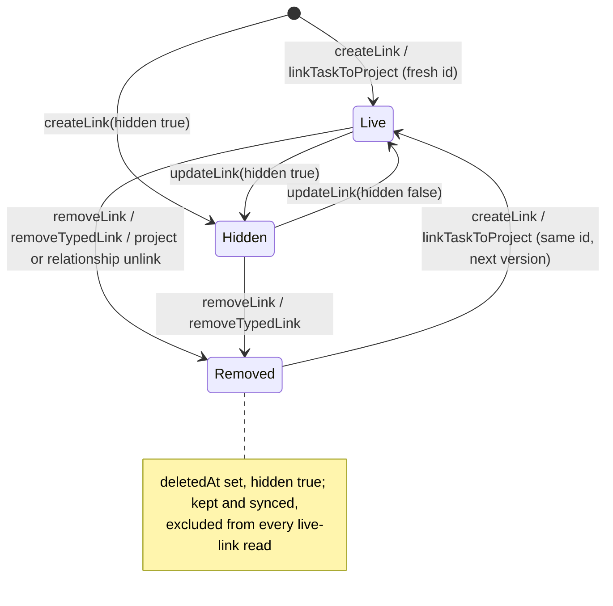

# Nine variants, one shape

`EntryLink` is a union of `basic`, `rating`, `project`, `relationship`,
`blocks`, `followsUp`, `duplicates`, `fixes`, `supersedes` — mirrored by
`EntryLinkType`.

**Every variant has the same shape**: id, `fromId`, `toId`, timestamps, vector
clock. The relationship lives entirely in the **type column**.

That is the load-bearing design decision: because the shape is identical, every
existing `type = 'BasicLink'` consumer — recorded-time attribution, capture
attachment, the generic linked-entries list — stays **structurally blind** to
typed edges. Typed relationships were added without migrating a single consumer.

`UNIQUE(from_id, to_id, type)` is what lets one pair hold several different
relationships while keeping each one singular.

**A type does not always imply an endpoint type.** `relationship` binds a
`RelationshipEntry` to *both* its check-ins and its linked tasks, so a
`RelationshipLink` row alone does not say which it is. Consumers that want one
of the two must resolve the endpoint's journal `type` — see
`JournalDb.getLiveTasksByIds`, which filters on the indexed column so a
person's whole check-in history is never deserialized just to be discarded.

**Only these columns are queryable.** Everything else an `EntryLink` carries —
`vectorClock`, `collapsed`, `deletedAt` — lives inside `serialized`.

That matters for removed links, which stay in the table as tombstones (below).
Every tombstone is `hidden`, so a query that requires `hidden = false` already
excludes it. A query that also returns links the user hid has to test
`json_extract(serialized, '$.deletedAt') IS NULL`. The live-link queries do:
backlinks, parent ids, `linksForIds`, the "show hidden" linked-entries list,
basic links, `typedLinksForTaskIds` and `linksForEntryIdsBidirectional`
(`_linkIsLive` in Dart, the same predicate in `database.drift`).

Replication reads keep tombstones on purpose: `entryLinkById`, `linksBetween`,
`linkRowsFromIdsIncludingHidden` and
`linksForEntryIdsBidirectionalIncludingRemoved`. **A consumer that reads through
one of those must skip `deletedAt != null` itself.** `TaskDependencyResolver`,
`TaskBlockersController` and `TaskLinkGroupsController` also skip removed rows in
Dart, as a second guard over a query that has already excluded them.

# One row per relationship

"Is blocked by" and "has follow-up" are **rendering labels for the reverse
direction of the same row**, never separate rows. Picking an inverse phrase in the
UI swaps `fromId`/`toId` before persisting, so the canonical stored direction is
always the primary one — a `blocks` link's `fromId` is always the blocker.

The schema's `UNIQUE(from_id, to_id, type)` lets one pair hold several different
relationships, and **direction is part of the identity**, so the inverse of an
existing link stays offerable.

`PersistenceLogic.createLink` runs a best-effort local cycle guard for `blocks`
only. **Read-time traversal tolerates cycles regardless**, because two offline
devices can always race one into existence.

# Links are synced first-class

Updating a link emits `UpdateNotifications` **and** writes a sync outbox message
with a fresh vector clock. Links are their own `SyncMessage` family
(`entryLink`), sequence-tracked like journal entities, and every
journal-entity message also embeds a snapshot of its entry's links.

So the same link arrives many times, in any order. `JournalDb.upsertEntryLink`
keeps the newest version and refuses older ones: the later `updatedAt`, then
the larger clock, then the serialized version. An edit — `updateLink`, a
removal, a revival — extends the stored link's clock and is never stamped
earlier than it (`linkEditTimestamp`), so it outranks every copy of what it
replaced
([ADR 0078](../../docs/adr/0078-entry-link-versions-are-ordered.md); the
order is drawn in
[vector clocks and conflicts](../features/sync/vector-clocks-and-conflicts.md#entry-links-one-version-on-every-device)).

# A removal is a synced tombstone

Removing a link writes its next version with `deletedAt` set and `hidden` true,
and sends it like any edit. Every removal path does this.
`JournalRepository.removeTypedLink` removes one type between a pair. It backs
the Undo on the "link created" message, unlinking a row in a task's
relationships, and swapping a new task's plain link for the chosen type.
`removeLink` removes every type between a pair and backs the linked-entries
list's unlink. Both go through `updateLink`. The project unlink
(`ProjectRepository._prepareDeletedLink`) and
`RelationshipRepository.unlinkTask` write the same tombstone. No removal
path deletes a link row, so the removal reaches the peers. It outranks their copy
of the live link, including the one embedded in their journal-entity
messages, which carry tombstones too.

**Linking the same pair and type again revives the tombstone** rather than
minting a second id (`removedVersion`, used by `PersistenceLogic.createLink`
and `ProjectRepository.linkTaskToProject`). A fresh id would be a second row
for one `(from_id, to_id, type)`. A peer still holding the live link refuses
that row as a duplicate, and when the tombstone lands the link is gone there
but live here.

One gap remains ([ADR 0078](../../docs/adr/0078-entry-link-versions-are-ordered.md),
2026-09-25 addendum). Two devices that create the same link offline mint two
ids for one triple. A removal of one id is then refused on the device holding
the other.

# Related

* [Typed relationships and blockedness](../features/tasks/relationships.md) - how the task layer presents and derives from these.
* [Dependency-aware planning](../features/daily_os_next/dependency-aware-planning.md) - how the planner consumes `blocks`.
