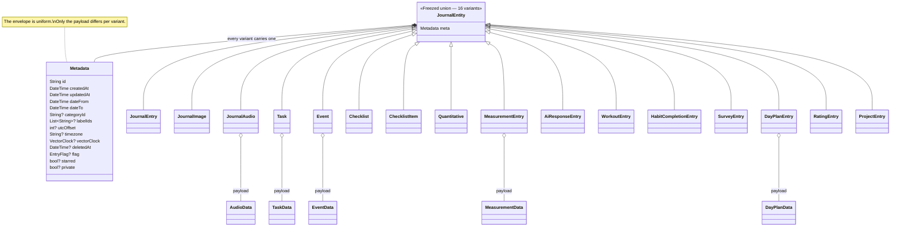

# One union, sixteen variants

Every entry the user *records* is a `JournalEntity` — a Freezed union whose
variants are:

`journalEntry`, `journalImage`, `journalAudio`, `task`, `event`, `checklistItem`,
`checklist`, `quantitative`, `measurement`, `aiResponse`, `workout`,
`habitCompletion`, `survey`, `dayPlan`, `rating`, `project`.

That breadth is why the [journal feature](../features/journal/) is the app's
substrate rather than a note-taking screen: create, browse, search, link, focus
and delete are implemented **once** over the union, and each variant contributes
its own detail widget.

The diagram names the *shape*, not every payload class — `TaskData`, `EventData`,
`AudioData`, `MeasurementData` and `DayPlanData` stand in for the full set listed
under [where variant data lives](#where-variant-data-lives).

**It is not every piece of user data**, and the boundary matters for anything that
walks the whole dataset. What the user *configures* — categories, labels, habits,
dashboards, measurable types — is
[`EntityDefinition`](entity-definitions.md), a separate union that syncs as its own
message family. Settings and agent state live outside both. So backup, migration
and sync coverage that follows only `JournalEntity` is incomplete by construction;
see the [sync message model](../features/sync/message-model.md) for the full set of
families.

# The `Metadata` envelope

Every variant carries the same `Metadata`, which is where the cross-cutting
concerns live:

| Field | Role |
|-------|------|
| `id` | Stable identity across devices |
| `createdAt`, `updatedAt` | Record lifecycle |
| `dateFrom`, `dateTo` | **The entry's own time span** — what timelines, day plans and recorded-time queries read |
| `categoryId` | Ownership, and the scope for AI consent and agent allow-lists |
| `labelIds` | Label assignments — **not** stored in per-variant data |
| `utcOffset`, `timezone` | Preserved so a time reads correctly where it was recorded |
| `vectorClock` | Causal ordering for [sync](../features/sync/vector-clocks-and-conflicts.md) |
| `deletedAt` | **Soft delete** — the row is the tombstone, which is what lets deletion replicate |
| `flag` | `EntryFlag`, e.g. `import` |
| `starred`, `private` | User-facing markers |

Two consequences worth stating:

- **`dateFrom`/`dateTo` are user-editable and independent of `createdAt`.** A
  time entry, an audio recording and a task all use the same pair, so recorded-time
  and timeline queries work uniformly. See
  [the date-time editor](../features/journal/detail-and-saving.md).
- **Deletion is a stamp, not a row removal.** That is what makes "deleted"
  distinguishable from "never existed" on a peer, and it is the same pattern the
  [AI config lifecycle](../features/ai/seeding-and-lifecycle.md) adopted later.
- **But the tombstone is not permanent.** `JournalDb.purgeDeleted` — reachable
  from *Settings → Advanced → Maintenance*, and irreversible by its own
  confirmation copy — hard-deletes every row flagged `deleted`, along with their
  files. After a purge this device can no longer tell "deleted" from "never
  existed", so do not build a sync or backup invariant on the tombstone always
  being there.

# Where variant data lives

Variant-specific payloads are separate classes — `TaskData`, `ChecklistData`,
`ChecklistItemData`, `EventData`, `AudioData`, `ImageData`, `AiResponseData`,
`MeasurementData`, `DayPlanData` and so on — so the envelope stays uniform while
each kind carries what it needs.

**Boundaries that are deliberate**, and easy to get wrong:

- **Labels live on `meta.labelIds`, not in `TaskData`.**
- **Project membership is resolved through the projects feature**, not embedded
  as a task field.
- **Checklist content is modelled as its own entities** (`Checklist`,
  `ChecklistItem`) linked to the task, rather than flattened into the task row —
  which is what allows drag, drop, reorder and cross-checklist movement.

# Related

* [Entry links](entry-links.md) - how entities connect to each other.
* [Entity definitions](entity-definitions.md) - categories, labels, habits, dashboards, measurables.
* [Persistence](../architecture/persistence.md) - how these are stored and how writes reach the UI.
