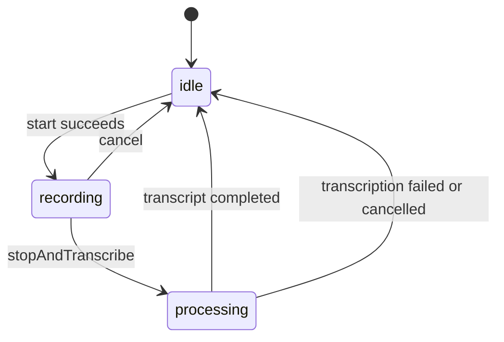

# Ownership and consumers

`AgentChatView` supplies the shared conversation surface used by goal and
relationship agents and [scoped queries](query-chat.md). Query hosts supply
their own projected history and conversation ID, activity and footer slots,
and disable reply-driven scrolling while older evidence is being inspected.
`groupAttachmentsWithReply` places a consumer's supporting widgets inside the
reply surface and its reading width, under a transparent Material ancestor for
interactive disclosures. `composerShape` selects the input shell; pill composers
use an emphasized upward-arrow Send action. Both options default to the existing
separate attachment and rounded-field treatment for other hosts.
`replyTextStyle` lets the host select its answer typography from design tokens;
scoped queries use `bodySmall`, while other hosts retain `bodyMedium`.
Hosts can supply `onLinkTap` to resolve each link against its containing message.
That opt-in preserves the rich reply's accessible text and link actions, with
only author/time on the enclosing semantic node. Other hosts keep the existing
flattened message announcement.
Its composer and the agent improvement input widgets use
the same voice-input primitives under `agents/ui/chat/`:

- `ChatRecorderController` and `ChatRecorderState` manage a temporary recording,
  streamed transcript feedback, and typed errors.
- `chat_amplitude_history.dart` provides bounded history and normalization
  functions; `WaveformBars` renders the normalized samples.
- `chatRecorderErrorMessage` maps error kinds to localized messages.
- `thinking_parser.dart` separates reasoning from visible assistant text;
  `ThinkingDisclosure` renders it collapsed by default in improvement replies.

These helpers have no dependency on a standalone chat feature. Inference and
model discovery belong to [AI batch transcription](../ai/batch-transcription.md).
Daily OS calls that service directly without depending on the agent recorder.
The goal/relationship hosts retain ownership of sending and durable history;
improvement conversations retain their own evolution workflow.

# Recorder lifecycle

Start checks microphone permission, records to an app-scoped temporary `.m4a`
file, samples amplitude, and arms a maximum-duration stop. The injected clock
also supplies elapsed capture time on amplitude updates; a new recording resets
it to zero. Query hosts opt into a stable tabular clock and visible Stop/Cancel
controls, including Cancel during transcription. Stop moves to
`processing`, streams transcription chunks into `partialTranscript`, then
publishes the finished `transcript` or a typed error and returns to `idle`.
The UI consumes the finished transcript into its editable composer. During
processing, the shared composer shows up to three measured lines of partial
text. Overflowing text offers Show more/less; expansion enables scrolling
within six lines and a quarter of the available chat height, whichever is
smaller. This height comes from the host layout, including keyboard constraints.
Progress and Cancel remain outside that scroll area. Short text has no toggle;
empty progress has a localized transcription label. Partial text is never sent
or copied into the draft before transcription finishes.

Hosts can pass a lazy `resolveTranscriptionTarget` callback into `start`. It is
captured for that recording and awaited immediately before transcription;
cancellation or disposal during resolution prevents submission. Scoped queries
supply their [category-default policy](query-chat.md); callers that omit the
callback retain the transcription service's automatic discovery behavior.

Every recording captures a monotonically increasing operation ID before the
first startup await. Cancellation also recognizes pending startup while its
visible status is still idle. Permission, temporary-directory creation and
native start recheck the operation before proceeding. An abandoned startup
releases its local recorder/files before cancellation or disposal finishes; a
new start cannot overtake that cleanup. Amplitude
and transcription callbacks must match that ID and `ref.mounted` before writing
state. Cancel increments the ID before cleanup, so stale callbacks cannot
replace a newer recording's state. Stop captures that operation's recorder,
file and transcription route before awaiting native work, and rechecks its ID
after stop. A stale completion never cleans up shared resources. Cleanup
captures and detaches the owned resources synchronously, and concurrent cancel
calls join one cleanup. Completion and cancellation publish `idle` only after
cleanup finishes, so a new capture cannot overlap deletion of the previous
recording. Disposal invalidates the operation and joins an existing cleanup;
cleanup failures remain best-effort and are caught. If amplitude setup fails
after native recording starts, startup releases the transferred resources before
publishing an idle `startFailed` result, so the composer can record again.

`ChatRecorderState.copyWith` clears transcript, partial transcript, and error
fields when omitted. Status, amplitude history and elapsed time retain their previous values.
Callers preserving a partial result must explicitly pass it again.

# Reasoning rendering

The parser preserves the order of visible and thinking segments, including
open-ended markers during streaming. `EvolutionChatBubble` renders the thinking
segments through `ThinkingDisclosure`, separately from the visible answer.
The disclosure supports keyboard toggling, expanded/collapsed semantics,
Markdown selection, and copying. Collapsing reasoning is presentation; it does
not remove that text from any inference context.

# Invariants

- Cancelled or disposed recording operations do not publish stale results.
- Recording errors reach the UI through localized error kinds, not diagnostic
  English exception strings.
- Waveform history is bounded and normalization clamps out-of-range samples.
- These shared UI primitives own neither user-managed chat persistence nor
  agent wake scheduling.
