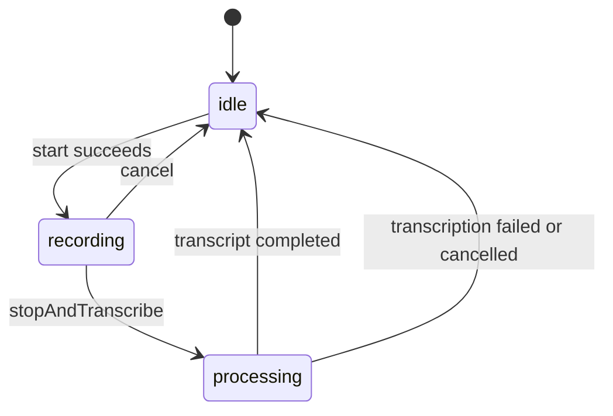

# Ownership and consumers

`AgentChatView` supplies the shared conversation surface used by goal and
relationship agents and [scoped queries](query-chat.md). Query hosts supply
their own projected history and conversation ID, activity and footer slots,
and disable reply-driven scrolling while older evidence is being inspected.
Its composer and the agent improvement input widgets use
the same voice-input primitives under `agents/ui/chat/`:

- `ChatRecorderController` and `ChatRecorderState` manage a temporary recording,
  streamed transcript feedback, and typed errors.
- `chat_amplitude_history.dart` provides bounded history and normalization
  functions; `WaveformBars` renders the normalized samples.
- `chatRecorderErrorMessage` maps error kinds to localized messages.
- `thinking_parser.dart` separates reasoning from visible assistant text;
  `ThinkingDisclosure` renders it collapsed by default in improvement replies.

These helpers have no dependency on a standalone chat feature. Inference and
model discovery belong to [AI batch transcription](../ai/batch-transcription.md).
Daily OS calls that service directly without depending on the agent recorder.
The goal/relationship hosts retain ownership of sending and durable history;
improvement conversations retain their own evolution workflow.

# Recorder lifecycle

Start checks microphone permission, records to an app-scoped temporary `.m4a`
file, samples amplitude, and arms a maximum-duration stop. Stop moves to
`processing`, streams transcription chunks into `partialTranscript`, then
publishes the finished `transcript` or a typed error and returns to `idle`.
The UI consumes the finished transcript into its editable composer.

Every recording captures a monotonically increasing operation ID. Amplitude
and transcription callbacks must match that ID and `ref.mounted` before writing
state. Cancel increments the ID before cleanup, so stale callbacks cannot
replace a newer recording's state. Disposal and completion perform best-effort
cleanup of recorder resources and temporary files; cleanup failures are caught.

`ChatRecorderState.copyWith` clears transcript, partial transcript, and error
fields when omitted. Status and amplitude history retain their previous values.
Callers preserving a partial result must explicitly pass it again.

# Reasoning rendering

The parser preserves the order of visible and thinking segments, including
open-ended markers during streaming. `EvolutionChatBubble` renders the thinking
segments through `ThinkingDisclosure`, separately from the visible answer.
The disclosure supports keyboard toggling, expanded/collapsed semantics,
Markdown selection, and copying. Collapsing reasoning is presentation; it does
not remove that text from any inference context.

# Invariants

- Cancelled or disposed recording operations do not publish stale results.
- Recording errors reach the UI through localized error kinds, not diagnostic
  English exception strings.
- Waveform history is bounded and normalization clamps out-of-range samples.
- These shared UI primitives own neither user-managed chat persistence nor
  agent wake scheduling.
