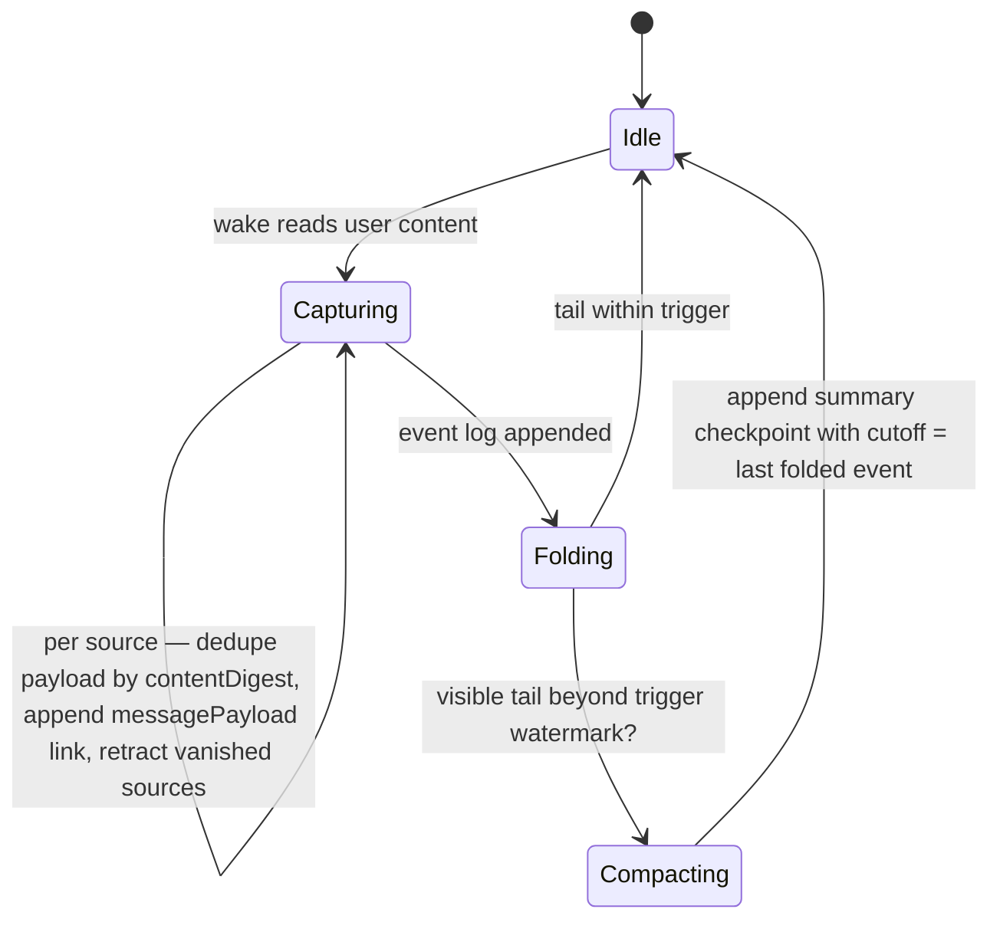
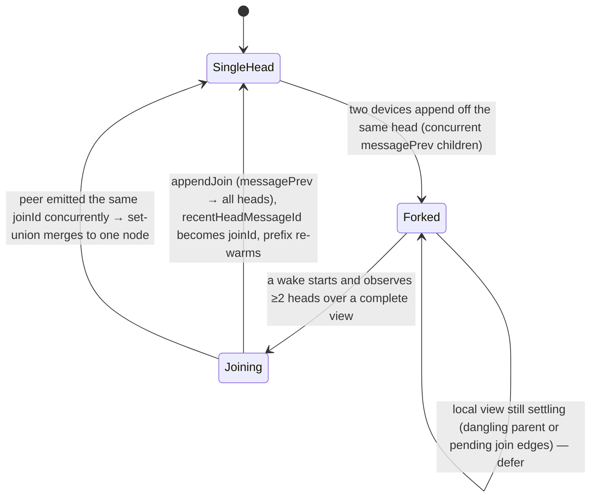

# There is no memory blob

Agent memory is split across durable agent-side records, live journal context,
and a small amount of wake-time derived context. Nothing is a hidden opaque
state object.

| Layer | Contents |
|-------|----------|
| **Durable** (`agent.sqlite`) | Identity and lifecycle, runtime state and slots, the immutable message log (user messages, thoughts, tool actions, tool results), structured observations, reports and heads, change sets and decisions, attention requests and awards, template versions, evolution sessions and recaps, wake token usage and run history |
| **Live journal** | Rebuilt fresh each wake: current task or project data, linked tasks and entries, checklist state, labels, time entries, project-to-task relationships |
| **Retrieval** | Task-agent reports are embedded after the wake commits when both optional embedding dependencies are available, so later semantic retrieval can use the report text |

# The read model is an append-only event log

Agent inputs are **captured** into the log so the wake context is a projection of
the log rather than a live read of the mutable journal (ADR 0020), and that log
is compacted by **summary checkpoints over a log prefix** (ADR 0017).

## Scope

The substrate covers task agents (captured journal entries + observations +
proposal verdicts), project agents (captured project-linked entries +
observations), and day agents (submitted capture transcripts + observations).

The **improver** agent is deliberately out. Its wake context is a per-ritual
*windowed* snapshot — feedback since the last scan watermark, instance reports,
version history — so there is no unbounded per-agent input stream to fold, and
capturing it would duplicate other agents' synced data.

All workflows share one pipeline, `AgentWakeMemory` (capture → fold → assemble →
read-flip gates), so failure isolation and diagnostics are identical everywhere.

## Capture

Each wake snapshots the user-content sources it read — one per linked journal
entry, **rendered text only**. An audio entry contributes its transcript, an
image its AI analyses, never the raw artifact.

- `renderTaskSources` turns linked entries into `RenderedSource`s, keeping each
  entry id as provenance. For image entries it additionally emits one
  `image_analysis` source per linked `AiResponseEntry` — resolved up front by
  `fetchAiResponsesForImages` in one bulk query — with `model` / `refersTo`
  fields the compacted line renderer surfaces as `model:` / `for:` tags. Analysis
  text is immutable, so each analysis is captured exactly once and never re-mints
  the image's own line.
- `reconcileCapture` diffs against the agent's active **input frontier** and
  appends only the delta.
- Each new or changed source becomes a content-addressed
  `AgentMessagePayloadEntity` (id = `ContentDigest.of(content)`, so identical
  content dedupes across wakes *and* agents) plus a `messagePayload` link
  carrying provenance and canonical ordering.
- A vanished source is **soft-retracted** by a `system` message tagged
  `metadata.retractsContentEntryId`. The snapshot stays auditable; the active
  frontier excludes it; a later capture can re-add it.

Because many links may point at one shared payload — two sources rendering
identical bytes, or one source edited back to earlier content — `agent_links`'
natural-key uniqueness on `(from_id, to_id, type)` **deliberately exempts**
`message_payload` via a partial unique index (schema v11).

`projectInputFrontier` folds links plus retractions to the latest non-retracted
content per source — the **write-side** view. The **read side** uses
`projectInputEvents`: the same links and retractions plus the agent's
`observation` messages, as an ordered **event stream**, never folded into
per-source state.

## Ordering and rendering

Every capture link is one event at position `(captureTime, sourceCreatedAt,
key)` — a strict total order over **synced** metadata, so all devices agree.
`sourceCreatedAt` orders a same-instant batch chronologically instead of by
random ids.

The rendered `## Task Log` tail is `visibleTailEvents`: events after the active
checkpoint's cutoff, one line each, **rendered once and frozen forever**. Every
line carries provenance as `id: <sourceId>`.

| Event | Rendering |
|-------|-----------|
| Edit | Appends a new `(id: e1, text, edited)` line at the end — the original line never changes. A ticking running-timer duration is excluded from capture until final, for the same reason |
| Observation | Interleaves as `(id: obs-1, observation)` — one memory substrate, same ordering, same folds |
| Proposal verdict | Interleaves as `(id: cs-1:0, decision)` at resolution time, so the narrative reads *user said X → agent proposed Y → user rejected it*. Inline events via `decisionEventsFromLedger`, derived from the synced ChangeSet/ChangeDecision entities — no payload row |
| Retraction | Appends `(id: e1, retraction) no longer appears in the current task context` — documents the current absence without stripping earlier captured reality or invalidating summaries |

Open proposals are carried once by `## Open Proposal Guard` (current state:
fingerprints for `retract_suggestions`, same-wake dedup). Inline fallback prompts
still render the legacy `## Proposal Ledger` for resolved history, because they
have no trusted event-log replacement.

## Deferred inline events

Day capture transcripts are projected as **deferred** inline events
(`InputEvent.inlineDeferred`): position and id are eager — enough to order the
log and run the completeness check, which keys on id, not content — while the
transcript resolves on demand for only the post-cutoff tail the wake renders.

This exists because the single long-lived planner accumulates captures across
every day it plans; loading every transcript each wake would be O(all captures
ever captured). The workflow loads only the active workspace through
`getCaptureEventMetaForDay`: the capture day is stored in the indexed `subtype`
column and persisted into legacy captures as a stable `dayId`, so timezone
changes cannot make runtime day resolution disagree with the index. Local
writes normalize that stable day before vector-clock stamping, so the database
row and outbound sync envelope carry the same value. The query projects id plus
the two ordering timestamps without the transcript. The compactor then pulls
full text only for the handful of uncovered-tail captures. Folded captures live
in the summary prose and are never reloaded.

# Compaction folds a prefix, not a snapshot

`summary` checkpoint events cover everything up to a **cutoff position**
(persisted as `coverageCutoff`), not a state snapshot.

- **`selectActiveSummary`** picks the valid checkpoint with the greatest cutoff.
  A checkpoint dies only when it is **incomplete against the current log**: sync
  can deliver an event positioned *before* an existing cutoff — a concurrent
  capture, observation, verdict or retraction from another device — which would
  otherwise be in neither the prose nor the post-cutoff tail. The checkpoint is
  discarded, the tail re-expands, and the same wake's fold re-covers everything
  including the late arrival.

  Completeness is checked **by event id**, so a late-arriving *superseded*
  version of a covered source does not invalidate. Edits and retractions after
  the cutoff just append tail events that supersede or qualify the stale prose,
  keeping the prompt prefix byte-stable.
- **`planCompaction`** decides, against a token budget, which oldest event prefix
  to fold so the most-recent suffix fits.
- **`AgentLogLlmSummarizer`** distils the folded events into rolling summary
  prose with a one-shot generation call, using the **wake's resolved
  model/provider** — the agent summarizes its own memory with the brain it thinks
  with. Oversized fold sets are distilled in chronological chunks, rolling the
  summary through each call. An empty model response throws (caught as "no
  compaction this wake") rather than persisting an empty checkpoint that would
  erase folded memory.

## Cadence and prefix caching

`maybeCompact` uses two watermarks:

| Watermark | Default | Role |
|-----------|---------|------|
| `compactionTailBudgetTokens` (trigger) | 50 000 | No summarization while the uncovered tail fits it |
| `compactionTailRetainTokens` (retain) | 20 000 | Once triggered, the fold goes deep, keeping only this much recent verbatim content |

So the summarizer runs roughly once per `trigger − retain` (~30k) tokens of *new*
activity — most tasks never reach the trigger at all — and between folds every
wake is a pure read.

The trigger is sized generously **because the append-only tail is
prefix-cached**. Warm wakes pay cache-read rates for the history (local inference
with a persistent KV cache: nearly nothing). What remains is the cold prefill on
a session's first wake, and attention quality on very long raw logs — which is
why folding exists at all. Small-context or local deployments can pass tighter
values through the workflow constructor.

**Compaction is never destructive.** Every entry stays in the journal and in the
content-addressed captured payloads; only the *prompt* sees the summary.

# The prompt invariant

> Between folds, two consecutive wake prompts are byte-identical up to the end of
> the `## Task Log` block, except for appended lines.

This is machine-checked by the append-only property tests in
`input_events_test.dart` and the end-to-end prefix tests in the compactor and
workflow tests.

Ordering is **strictly by volatility**:

1. System prompt and rare-change context blocks
2. The summary (changes once per fold)
3. The append-only event tail
4. *Only below that*, the volatile tail: the compact markdown task **state**
   (`buildTaskStateMarkdown` — title, status, time, labels, checklist with item
   ids), timer, ledger, trigger tokens

The task state must sit below the log because its time fields tick on every
working wake. **One flipped byte upstream voids the provider prefix cache for
every byte after it.**

## The report is a projection, not memory

The prior report's prose is never injected into the prompt — re-reading its own
stale conclusions creates a feedback loop. `update_report` is conditional: the
agent publishes only when the report would materially change. The first report is
forced via a retry. A wake that successfully mutates task state also forces a
report retry when the executor omits one, preventing an older projection from
remaining visible after the change. A wake with no successful mutation and
nothing report-worthy keeps the existing report and ends with a plain-text note.

## Prompt persistence stores only what is not derivable

A compacted wake no longer persists its full rendered prompt. The embedded log
block is a pure function of the synced event log, so the payload stores just the
non-derivable halves — the live-state head and volatile tail — plus a
reconstruction marker: the active checkpoint's summary id and the position of the
last rendered tail event.

The conversation view rebuilds the full prompt on demand via
`WakePromptReconstructor` → `AgentLogCompactor.assembleContextAsOf`: the pinned
checkpoint (even if since invalidated — the wake really did render its prose)
plus the visible events up to the boundary, with inline events re-derived from
their synced entities.

Retractions are append-only, not suppressing: one past the boundary never reaches
back into the reconstruction, and one inside it renders as its own marker line
beside the content it concerns. The past render stays faithful rather than
retroactively redacted. A late-synced event inside the boundary makes the
reconstruction reflect the **converged** log — semantically auditable rather than
forensically byte-exact.

The day agent splices its log back inside the `<day_log>` tagged section of its
plaintext payload; records persisted before the tagged-plaintext conversion
splice the legacy JSON `"dayLog"` line and stay decodable. Inline fallback wakes
keep full blobs, because their prompts are live journal renders with nothing to
re-derive.

# State as projection

`AgentStateEntity` is a **reconciled cache, not the authority**. The append-only
log — messages plus links — is (ADR 0016).

- **Watermarks** — every place a wake advances a timestamp watermark also emits a
  `system` message tagged with an `AgentMilestone` via
  `AgentSyncService.appendMilestone(...)`. The watermark derives as the
  `max(createdAt)` of messages carrying that milestone.
- **Active slots** — `activeTask/Project/Day/TemplateId` derive from the agent's
  association links.

| Watermark | Milestone | Emitted by |
|-----------|-----------|------------|
| `lastWakeAt` | `wakeCompleted` | task / day / project wakes, including the project dormant-skip path |
| `slots.lastDailyWakeAt` | `dailyWakeCompleted` | project wake when the scheduled daily digest was due |
| `slots.lastFeedbackScanAt` | `feedbackScanCompleted` | improver workflow (skip and ritual-started paths) |
| `slots.lastOneOnOneAt` | `oneOnOneCompleted` | `ImproverAgentService.scheduleNextRitual` |
| `slots.lastWeeklyReviewAt` | `weeklyReviewCompleted` | *no emit site yet — the weekly-review feature is unimplemented* |

**Reads are flipped.** Each wake starts by reading
`AgentSyncService.reconciledAgentState(agentId)`, which folds the log's
watermarks and slots over the cached row and self-heals any value the cache lost
to last-writer-wins under a partition — so two devices cannot miss or
double-count a ritual.

The reconcile is migration-safe: watermarks take `max(derived, cache)` and slots
take `derived ?? cache`, so a value the cache holds but the log lacks yet (an
agent predating the markers) is never nulled. It persists only when something
diverged, so the common path has no churn.

UI and service reads stay on the raw cache (`AgentRepository.getAgentState`) —
eventual and self-healing. Dual-written counters are convergent G-counters;
`awaitingContent` and the device-local scheduling fields are still cache-only,
with no backing log event yet.

# Fork healing

When two devices wake the same agent off a shared head, each appends its own
`messagePrev` child of that head — a **fork**, so the DAG has two or more heads.
**This is legal, not corruption.** The projection is multi-head tolerant: it
returns every tip in `headIds` and context assembly reads across all of them, so
every device converges without coordination.

The cost of an *unhealed* fork is only that the on-device prefix never re-warms —
each branch is a distinct prefix — and context fans out across a widening head
set.

`ForkHealer.maybeHealFork` folds the agent's full log at wake start, and
`planJoin` emits a **join-by-continuation** node when there are two or more heads
over a *complete* view — no dangling parents, and no pending join head whose
edges are still syncing. `AgentSyncService.appendJoin` writes a canonical
`system` message linking to **every** head and advances `recentHeadMessageId`.

- **Content-addressed and deterministic.** The join id is
  `computeJoinId(headIds) = ContentDigest.of({'_tag':'join-v1','parents':sortedHeads})`,
  each edge id `msgprev-${joinId}-${parentId}`. Two devices healing the same fork
  mint the same structural row and edge set, so the log set-unions their
  concurrent emissions into **one** node — no join storm. The join carries no
  payload and no wall-clock, host or clock in its content-addressed identity.
- **Eager at wake start, no cross-wake state.** A fork seen at wake start was
  created by a *prior* cycle, so healing it is faithful to ADR 0018's "≥2 heads
  survive past one wake cycle". Forks never self-resolve, so there is nothing to
  wait out beyond a partially-synced view, which the complete-view and
  pending-join gates cover. The decision is a pure function of the current
  projection; no marker is persisted.
- **Wiring.** The four wake workflows share no base class but all dispatch
  through `WakeOrchestrator`, which fires one optional `onWakeStart` hook just
  before the executor — one seam covering every agent kind. Healing is
  best-effort and non-fatal: a corrupt synced log or a slow load is caught or
  timed out, and the wake proceeds regardless. **Healing is an optimization,
  never a correctness mechanism.**
- **Flag-gated off.** The hook is always wired but consults the default-off
  `enable_fork_healing` config flag **per invocation**, so a Settings toggle
  applies on the next wake without a restart. Off means the hook returns
  immediately and wakes are byte-identical to before.
