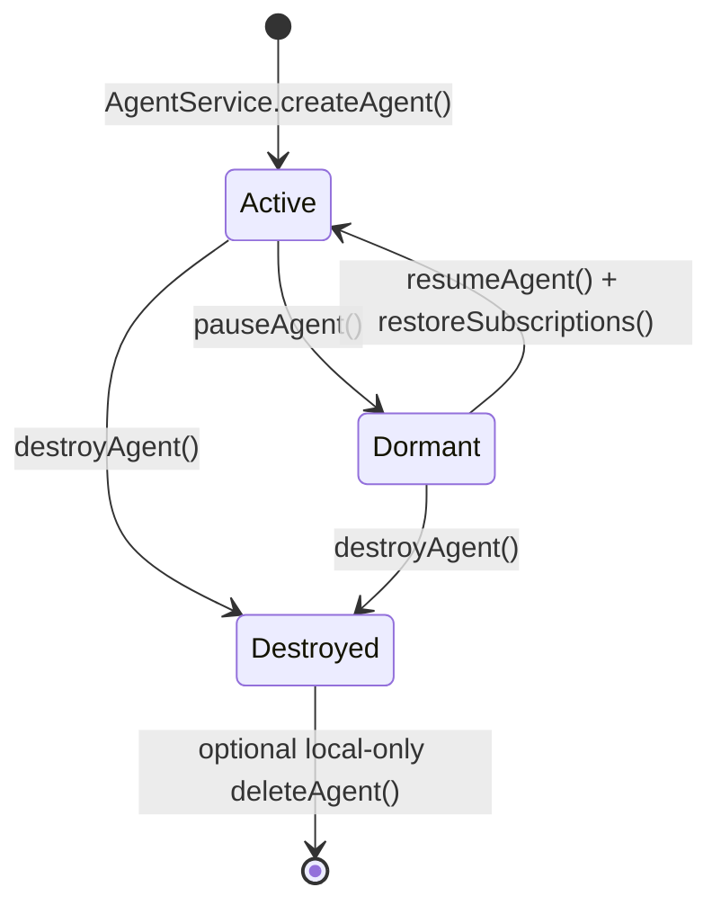
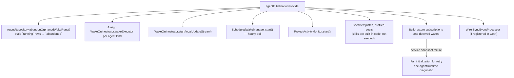

The agents feature owns Lotti's **persisted agent runtime**. It does not
implement model inference — it combines the [`ai` feature's](../ai/) conversation
and profile infrastructure with agent-specific state, wake scheduling, sync and
human review gates.

The split of authority matters:

| Store | Authority over |
|-------|----------------|
| Journal database | Tasks, projects, checklist items, labels, time entries — the user's actual data |
| `agent.sqlite` | Reports, observations, change proposals, evolution sessions, token usage, wake history — the agent's *interpretation* and review state |

The agents feature never mirrors task or project state into `agent.sqlite`. It
reads the journal on demand during a wake.

# Agent kinds

| Kind | Slot | Workflow | Trigger shape |
|------|------|----------|---------------|
| `task_agent` | `activeTaskId` | `TaskAgentWorkflow` | task notifications, creation, reanalysis, transcription-complete |
| `project_agent` | `activeProjectId` | `ProjectAgentWorkflow` | creation, direct project edits, daily scheduled digest |
| `event_agent` | `activeEventId` | `EventAgentWorkflow` | creation (content-gated), direct event edits |
| `template_improver` | `activeTemplateId` | `ImproverAgentWorkflow` | scheduled ritual |
| `day_agent` | day workspace (`day:<dayId>`), no single slot | `DayAgentWorkflow` | day-scoped pre-warms and capture wakes |

The day agent is the single long-lived Daily OS planner (ADR 0022). Its workflow
and service live in [`daily_os_next`](../daily_os_next/), not here — and
**nothing in `features/agents` imports them.**

## How an owning feature plugs a kind in

The first four kinds above are wired directly in `wireWakeExecutor`, because this
feature owns their workflows. `day_agent` is not: it is contributed through the
registries in `agent_runtime_registry.dart`, which default to empty and are
overridden in the composition root (`buildProviderOverrides`) — the one place
allowed to see both features.

| Registry | Contributes | Consumed by |
|----------|-------------|-------------|
| `agentWakeRunnersProvider` | one `AgentWakeRunner` per kind | `wireWakeExecutor`, consulted before the task-agent default |
| `agentRuntimeMaintenanceProvider` | `beforeWakeScan()` / `restoreSubscriptions()` hooks | `scheduledWakeManagerProvider`'s pre-check and the startup restoration pass |
| `promptLogWrapRenderersProvider` | per-`wrap`-kind prompt-log splices | `WakePromptReconstructor` |
| `dailyOsSetupSheetLauncherProvider` | the inference-setup sheet opener | the agent internals "current setup" row |

The dependency therefore points from the owning feature *inward* to the runtime,
never back out. That direction is enforced by a test
(`test/architecture/feature_import_direction_test.dart`), because it was
previously violated: `AgentDomainEntity` itself imported Daily OS domain models,
making the two features a cycle. The shared day vocabulary those variants need
now lives in [`lib/classes/`](../../domain/) instead.

A registry left un-overridden fails silently rather than loudly — an unregistered
kind falls through to the task-agent workflow, and an unrenderable wrap splices
its log verbatim — so the composition-root registrations are pinned by
`test/app_bootstrap_test.dart` (the `agent runtime registrations` group).

**There is no persisted `meta_improver` kind.** A meta-improver is a
`template_improver` whose `recursionDepth > 0`. `recursionDepth` and the ritual
cadence `feedbackWindowDays` live on `AgentConfig` — configuration set at
creation, not mutable state — with a fallback to the legacy `AgentSlots` fields
for agents created before the re-home.

# Lifecycle

The enum also carries `created`, but current creation services instantiate
agents directly in `active`, so that value exists in the model without a normal
service path reaching it.

# Startup

`agentInitializationProvider` runs unconditionally at app start:

`ScheduledWakeManager` polls hourly for **both** due `scheduledWakeAt` state
values and due `ScheduledWakeEntity` records — the Daily OS planner's day-scoped
pre-warms (ADR 0022).

Restoration turns a persisted `nextWakeAt` back into an in-memory `WakeJob`:
future deadlines re-arm the deferred drain timer, overdue deadlines enqueue
immediately and clear the persisted marker. A completed subscription wake only
writes a new `nextWakeAt` when follow-up work is still queued, so the wake
surfaces show pending work rather than a cooldown with nothing left to run.

The startup coordinator invokes task, day and project restoration in parallel.
Each service bulk-loads its own inputs before entering its own per-agent loop:
task and project services load states and typed links, while the day service
loads states after discarding identities with no valid day context. Event
restoration follows the same per-service bulk boundary when invoked. There is no
cross-service snapshot barrier, so one service may already have restored agents
when another service's preload fails. The coordinator records one
`agentRuntime` error and rethrows, keeping initialization failed and eligible
for retry instead of treating partial restoration as success. Re-running the
pass is safe because runtime subscription registration is idempotent. Failures
in in-memory subscription or wake registration after a successful service
snapshot remain isolated to the affected agent, because the database is no
longer queried inside that loop.

Remote `agent_project` links are reconciled live as well as at startup. The
sync processor installs or removes the direct-project subscription when the
link changes and also queries existing links when a project-agent identity
arrives, so either sync ordering closes the snapshot-to-live-update gap.

**Skills are not seeded.** They live as code in
`lib/features/ai/skills/built_in_skills.dart` and are read from
`skillRegistryProvider` at runtime.

# Concepts

* [Wake orchestration](wake-orchestration.md) - how a change becomes a wake, and the three failure modes the design defends against.
* [Memory and compaction](memory-and-compaction.md) - the append-only input log, summary checkpoints, the prompt prefix invariant, and fork healing.
* [Task agents](task-agents.md) - the primary workflow: inference setup, automation, tool policy, proposals and confirmation.
* [Project and event agents](project-and-event-agents.md) - the digest-shaped and recap-shaped variants.
* [Templates, souls and evolution](templates-souls-evolution.md) - what an agent does versus who it is, and how both evolve.
* [Persistence and sync](persistence-and-sync.md) - the `agent.sqlite` entity and link model, plus what syncs and what stays local.
* [UI surfaces](ui-surfaces.md) - the AI summary card, internals panel, settings tabs and sidebar.

# Code reading guide

For the implementation path with the best signal-to-noise ratio:

1. `state/agent_providers.dart`
2. `wake/wake_orchestrator.dart`
3. `wake/wake_queue.dart`
4. `wake/wake_runner.dart`
5. `workflow/task_agent_workflow.dart`
6. `workflow/task_agent_strategy.dart`
7. `service/change_set_confirmation_service.dart`
8. `workflow/project_agent_workflow.dart`
9. `workflow/template_evolution_workflow.dart`
10. `workflow/improver_agent_workflow.dart`
11. `sync/agent_sync_service.dart`

Continue into [the AI feature](../ai/) for the inference stack these workflows
call.

# Known gap

**Profile-aware compaction watermarks.** Trigger and retain thresholds are
global 50k/20k defaults rather than derived from the resolved model's context
window and local-versus-hosted inference. `AgentWakeMemory`'s constructor
parameters are the seam.
