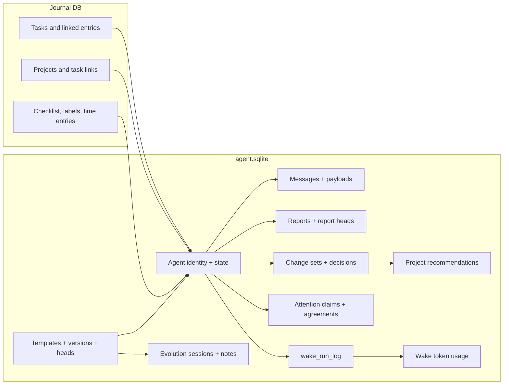
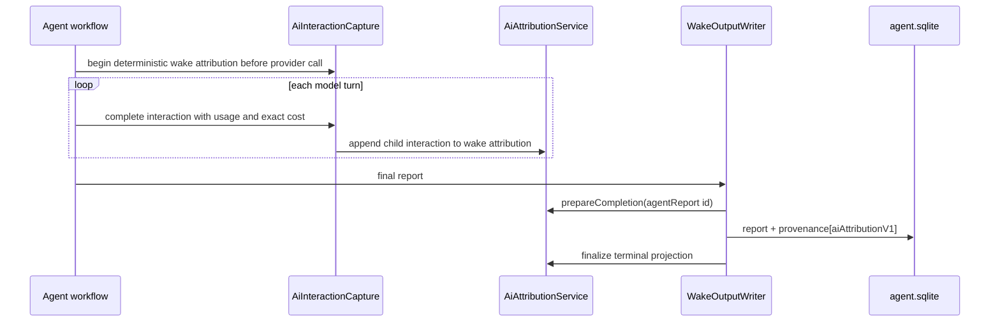

# One database, two shapes

Agent persistence lives in `agent.sqlite` (schema version 19). Syncable domain
objects are modelled as **`AgentDomainEntity` variants** and **`AgentLink`
variants**; wake-run history lives in a dedicated `wake_run_log` table outside
that model.

## Entities

- `AgentIdentityEntity`, `AgentStateEntity`
- `AgentMessageEntity`, `AgentMessagePayloadEntity`
- `AgentReportEntity`, `AgentReportHeadEntity`
- `AgentTemplateEntity`, `AgentTemplateVersionEntity`, `AgentTemplateHeadEntity`
- `EvolutionSessionEntity`, `EvolutionSessionRecapEntity`, `EvolutionNoteEntity`
- `SoulDocumentEntity`, `SoulDocumentVersionEntity`, `SoulDocumentHeadEntity`
- `ChangeSetEntity`, `ChangeDecisionEntity`
- `ProjectRecommendationEntity`, `ProjectRecommendationRunEntity`
- `AttentionRequestEntity`, `AttentionClaimDispositionEntity`,
  `AttentionAwardEntity`
- `StandingAgreementEntity`
- `WakeTokenUsageEntity`
- `ScheduledWakeEntity` — a day-scoped persisted scheduled wake for the Daily OS
  planner (ADR 0022), carrying `workspaceKey`, `triggerTokens` and a
  `pending | consumed` status. Several outstanding day pre-warms therefore
  survive a restart with full day context, instead of sharing one clobberable
  `AgentState.scheduledWakeAt`.
- `PlannerKnowledgeEntity` — the planner's durable knowledge ("memorize what I
  tell you", ADR 0022). **Compaction-exempt**; the active Head set is a pure
  recency-wins projection over the entries, with no separate Head entity.
  Carries optional immutable author-time `tags`, set once at origin.
- Daily OS capture-pipeline and planning variants: `CaptureEntity`,
  `ParsedItemEntity`, `DayPlanEntity`, `DaySummaryEntity`, `DayDirectiveEntity`,
  `DayStatusEventEntity`, `WeekRollupEntity`.
- Goal-agent variants (ADRs 0053–0058): `GoalSpecVersionEntity`,
  `GoalSpecHeadEntity`, `GoalProgressEntity`, `GoalNudgeEntity`. The spec
  version carries the immutable criteria tree; the head points at the active
  version; the progress row is the deterministic per-period register; the nudge
  is the banner ad with its CRDT exposure counters and rating history. All four
  sync as agent-domain entities and validate through `GoalSpecValidator` at
  every decode path.
- `AgentUnknownEntity` — the forward-compat fallback for variants an older
  client cannot decode.

## Links

All eighteen kinds live in `agent_constants.dart`:

- **Ownership** — `agent_state`, `agent_task`, `agent_project`, `agent_day`,
  `agent_event`, `template_assignment`, `improver_target`, `soul_assignment`.
- **The message log** — `message_prev` (the causal chain the fold walks) and
  `message_payload`.
- **Daily OS capture and plan** — `tool_effect`, `capture_to_parsed_item`,
  `parsed_item_to_task`, `capture_to_plan`.
- **Attention negotiation** — `attention_request_evidence`,
  `attention_award_request`, `attention_award_plan`.
- **`basic`** as the generic fallback.

**`agent_day` is legacy.** It linked the old per-day day-agent identity to its
day, back-linking `slots.activeDayId`. ADR 0022's single long-lived planner pins
no `activeDayId` slot and writes no new `agent_day` links — the type and its
projection remain only to read pre-migration data.

## What is deliberately absent

The agents feature does **not** mirror full task or project state into
`agent.sqlite`. The journal database is read on demand during wakes; what
persists here is the agent's own interpretation and review state.

# Bulk reads respect SQLite's variable cap

`getEntitiesByIds`, `getLatestReportsByAgentIds` and `getLinksToMultiple`
deduplicate inputs and split large `IN (...)` lists into **900-id chunks**. This
keeps linked-task and report context collection on the indexed batch path even
when sync or wake preparation considers thousands of ids.

Single-id reads are folded into those batches automatically.
`AgentRepoCore.getEntity` does not issue `WHERE id = ?` per call; it hands the
id to `AgentEntityByIdCoalescer`, which collects every load made in the same
event-loop turn and satisfies them with one `getEntitiesByIds` round trip. The
fan-out this addresses is structural rather than local — independent callers
(Riverpod provider families resolving one row each) firing in the same turn,
with no single loop to batch. The 2026-06/07 logs recorded 92,787 such reads,
peaking at 606 in one second at a median inter-arrival gap of 0.0 ms.

Batches are keyed by `Zone` identity, and the flush is scheduled from the
requesting zone so it runs there. This is load-bearing: drift resolves a
statement's executor from `Zone.current`, so a batch that merged calls from
inside a transaction with calls from outside would run on the wrong executor
and break read-your-writes — `upsertEntity` reads entities back by id inside
its own transaction.

# The proposal ledger is one compound read

`AgentProposalLedger.getProposalLedger` needs three task-scoped row sets:
pending change sets, recent change-set history, and recent item decisions.
They are fetched as **one** `UNION ALL` carrying a per-row `bucket` marker,
not as three queries, and the caller splits the result back apart by bucket.

The three arms are deliberately not merged into a single predicate:

- Each keeps **its own `LIMIT`** — the decision arm's cap is smaller than the
  change-set arms'. One shared limit across the union would silently change
  what the ledger sees.
- The dedicated **pending arm** is what stops a long-lived open change set
  from being buried: the recent arm is newest-first and capped, so once enough
  resolved history accumulates an old-but-still-open set would fall off the
  end of it.

The compound carries an explicit
`ORDER BY bucket, created_at DESC, id DESC`. Each arm's inner `ORDER BY`
decides only which rows survive that arm's `LIMIT`; the order of the *compound*
result is otherwise unspecified. The consumers are first-wins
(`decisionByKey.putIfAbsent`, and the duplicate-proposal collapse in
`unifiedSuggestionList`), so an unordered compound could let an older
retry/audit decision override the newest one.

# Latest reads exclude candidates with a newer row

`latestEntitiesByAgentIds` scans the active agent/type index for requested ids,
with an optional subtype. A correlated `NOT EXISTS` check uses the matching
ordered index to reject each candidate that has a greater `(created_at, id)`
pair in its partition. This avoids carrying historical payloads through a
window function. Candidate index work still grows with history; there is no
constant-work or cross-call caching guarantee. Chunking, per-chunk agent-id
ordering and transaction zones remain unchanged.

Its `outerPredicate` filters the selected result **without constraining the
newer-row check**. `getAgentStatesWithPendingWakes` uses it to exclude the latest
states whose wakes are cleared. Adding that predicate inside `NOT EXISTS`
could promote an older matching state and resurrect a cleared wake. SQLite may
evaluate independent candidate predicates in any physical order; the newer-row
check always sees newer records regardless of their wake fields.

The reproducible experiment and limitations are in
[the agent query benchmark](../../../docs/perf/2026-09-05-agent-query-followup.md).

# The agent identity list is cached

`getAllAgentIdentities` returns a **cached, decoded** list rather than re-reading
and re-decoding every identity. The read is not bursty — 1,449 of its 1,587
occurrences in the 2026-06/07 logs are isolated — so coalescing does nothing for
it; not repeating the work is what helps.

The cache lives on `AgentRepoCore`, and three rules keep it honest:

- **Every path that changes which identities exist must invalidate it.** That is
  `_upsertEntity` (covering local writes, incoming sync writes, and soft
  deletes, which are upserts with `deletedAt` set) **and**
  `AgentRepository.hardDeleteAgent`, which deletes rows directly and never
  reaches the upsert path.
- **A load that raced an invalidation is discarded, not cached.** Each load
  captures a generation counter before querying and compares it after; without
  that, a write landing mid-flight is undone by the older result and the
  pre-write list is served until the next write.
- **Reads inside a transaction never populate the cache.** A transaction can
  write an identity, read the list back, then roll back; caching that read
  would publish a row the database no longer has. `AgentRepoCore` marks its
  transactions with a zone value so the load can tell.

Latest-per-agent checks use active-row indexes that include the
`(created_at DESC, id DESC)` order for both type-only and type-plus-subtype
lookups. The newer-row range check requires no historical payload sort.

Due and pending scheduled-wake reads pin
`idx_agent_entities_pending_scheduled_wake_at`. The partial expression index
provides both the due-time range scan and the pending-list order; pinning it in
the hand-written methods avoids platform-specific SQLite planner choices that
otherwise fall back to the broader active-type index and a temporary sort.

# Sync

`AgentSyncService` wraps local agent writes. It stamps vector clocks and
**buffers outbox messages until the outermost transaction commits**. Nested
transactions share the same zone-local buffer, so a rolled-back inner savepoint
does not leak sync messages for writes that never committed.

**Incoming sync writes do not pass back through `AgentSyncService`.** They write
to `AgentRepository` directly, which is what avoids echo loops. Startup wiring
attaches the sync event processor when one is registered.

Concurrent agent state converges without user involvement — see
[vector clocks and conflicts](../sync/vector-clocks-and-conflicts.md) for the
G-counter merge that keeps concurrent wake counters from being lost.

Legacy `WeekRollupEntity` JSON can omit `weekStart`. The shared
`AgentDomainEntity.fromJson` read boundary repairs it only when the entity id is
an exact `week_rollup:YYYY-MM-DD` or `week_rollup_v2:YYYY-MM-DD` key whose date
is a real Monday, and derives a **UTC-typed** value from those components —
resolving them in the reader's zone would make the repaired field
reader-relative, which is the divergence the canonical rules exist to end. Both
generations are accepted even though only the legacy one can reach the repair
in practice, because an unrecognized generation would be rejected as poison
rather than repaired. This covers both persisted rows and inline or file-backed
sync payloads without mutating the decoded input map. An absent field paired with any other id throws a bounded
`FormatException`; `SyncEventProcessor.prepare` treats that payload as
unrecoverable, and `QueueApplyAdapter` returns a `permanentSkip` instead of
spending the retry budget on deterministic poison data.

The public `AgentDomainEntity.fromJson` factory remains expression-bodied and
delegates those repairs and validations to a private decoder helper. Freezed
uses that factory shape to discover JSON support for every union variant; moving
the logic back into a block-bodied factory makes build generation drop the
union's generated JSON methods.

| Scope | Contents |
|-------|----------|
| **Synced** | Agent identities and state; reports, observations, change sets, decisions, recommendations and token-usage entities; template versions and evolution sessions |
| **Local only** | `wake_run_log` rows and other runtime bookkeeping not modelled as a sync entity |
| **Sent to a provider** | Only the prompt payload assembled for that specific wake |

Because wake workflows resolve an inference profile at run time, the same
template can be routed through different providers without changing the agent
persistence model.

# Retention: what the store may forget

Bounding *reads* stopped per-action cost from growing with install age; it did
nothing about the rows. The coordinator is long-lived and writes on every wake,
forever, so the store grew without limit — felt as database size, sync payload,
backup size and whole-table maintenance long before any indexed query got slow.

`AgentRetentionPolicy` supplies the age windows and sweep limits. Eligibility
is declared by the type-specific repository operations that the retention
service invokes; it is not inferred from row authorship or an exhaustive union
classifier.

| Row | Kept | Why |
|-----|------|-----|
| Captures, plans, summaries, directives, knowledge, reports, souls | Forever | The user's own material |
| `weekRollup` | Forever | ~52 rows/year, and the digest's only month-scale trend source |
| `wakeTokenUsage` | Forever | Aggregated over **all time** by the template page; pruning would silently rewrite a number the user can read |
| `wake_run_log` | Forever | `getLifetimeWakeCount` aggregates the whole table for a figure the evolution UI displays, and the rows carry the user's `user_rating` |
| Change sets, decisions, attention claims | Forever | Audit trail behind proposals the user accepted or rejected |
| `saga_log` | n/a | No writer exists yet; it earns a policy when it earns a writer |
| Observations | **180 days, in ancestor-closed sets only** | See below |
| `dayStatusEvent` | **90 days, floored at the digest watermark** | See below |

Only observations and day-status events currently have delete paths. Every
other entity variant remains outside the sweep, so adding a new union variant
does not make it prunable by default.

## Age alone is not the bound for status events

The digest reads status events from its `dailyWakeCompleted` watermark minus a
12-hour sync-lag slack, and a stale digest window deliberately collapses into a
single catch-up run. So a digest that fails, or stays pending, for longer than
the retention window would find its backlog **already deleted** — silently, and
precisely in the came-back-after-a-break case the collapse exists to serve.

The sweep therefore takes the *earlier* of the age cutoff and that watermark. A
stalled digest holds retention back rather than losing what it has yet to read,
and a store where no digest has ever completed prunes nothing at all. Each day's
**newest** event is kept regardless: `dayAgentPersonaProvider` reads it to decide
how that day is presented, so clearing a day entirely would silently change what
the user sees on scrolling back.

## Why observations need more than a `DELETE`

They are the fastest-growing derived type and the obvious target — and they sit
inside the agent's causal message DAG, which is where a naive sweep does damage:

| Entanglement | What a plain delete breaks | How the sweep answers it |
|---|---|---|
| `message_prev` edges | Deleting a *mid-chain* observation cuts the chain in two. `project()` calls every unreferenced event a head, so the deleted row's parent becomes a second head and the next wake mistakes a retention cut for a real multi-device fork | Only **ancestor-closed** sets are pruned: if a message goes, so does every one of its parents, so no survivor can lose a child |
| Chains that cross threads | `recentHeadMessageId` is per **agent**, and `AgentSyncService._appendMessage` chains each wake's first message off the previous wake's tip — the sync service exists partly to stop a stale head forking the DAG "at the wake boundary". Planning per thread would read a cross-thread parent as absent | The sweep plans over an agent's **whole** message log, never a thread slice |
| A parent that has not synced yet | A `messagePrev` link can arrive before the entity it points at, and an in-flight parent looks identical to one an earlier sweep took. Treating absence as "already gone" prunes the child and forks when the parent lands | A missing parent named by a **link row** blocks the prune; one named only by `prevMessageId`, with no link, was collected by an earlier sweep and is ignored. The sweep deletes the edges into whatever it removes, so the surviving link set is what distinguishes the two — `prevMessageId` alone cannot, and treating it as an edge stalls the sweep after one pass |
| `viewComplete` | A survivor still pointing at a pruned parent leaves a permanent dangling parent, and `planJoin` is gated on `danglingParentIds.isEmpty` — fork healing would switch off for good, unbounding the very context retention exists to bound | Every `message_prev` edge **into** the pruned set is deleted with it, leaving the oldest survivor a parentless root |
| `AgentStateEntity.recentHeadMessageId` | A head pointing at a deleted message is trusted on the next append, creating a permanent dangling parent | `recentHeadMessageId` and `latestSummaryMessageId` are protected, and nothing downstream of them is prunable either |
| `agentMessagePayload` | Payloads written by `AgentInputCaptureService` are **user content**, content-addressed under `sharedContentAgentId` and referenced by `messagePayload` **links** — not by any message's `contentEntryId`. An ownership check based on `contentEntryId` reads them as orphans and deletes them | Payload rows are never deleted. Only the pruned message's own edge to one goes |
| Replayed links | A peer can re-sync a `message_prev` edge for an observation this device pruned, so the link table repopulates from outside | A re-sent edge without its node is a transient dangling parent — exactly the partially-synced view `planJoin` already defers on — and it clears once that peer runs its own sweep |

`planObservationPrune` is a pure function of the log's shape, so those
invariants are testable without a database; `AgentRepoObservationRetention`
only supplies the rows and executes the plan.

**Pruning changes what an old wake prompt reconstructs to.**
`WakePromptReconstructor` rebuilds a retained prompt through
`AgentLogCompactor.assembleContextAsOf`, which reads observation rows via
`getMessagesByKind`. So once observations past the horizon are collected, a
prompt record older than that window re-renders *without* them — it no longer
reproduces the bytes that were actually sent. That is an audit-fidelity loss
rather than a behaviour change (nothing acts on the reconstruction), but it is
silent, and a reconstruction that quietly differs from history is worse than
one that says it cannot be complete. Tracked as `lotti3-1e0`.

**A critical observation is never residue.** `ObservationPriority.critical`
marks a user grievance or excellence note that must be reviewed at the next
one-on-one, so it is excluded from pruning however old it is — and, like a
retained summary, it blocks everything causally after it. The priority lives in
the observation's *payload* rather than its message row, so the sweep reads it
through a single `LEFT JOIN` on `contentEntryId`; per-candidate payload reads
would undo the bounding the sweep is built around.

**Age alone never decides.** Causal and wall-clock order diverge across devices,
so the cutoff only marks *candidates* — a message is prunable when it is an old
observation **and every parent of it is prunable**, which stops dead at the first
summary or still-young message. An agent whose log exceeds `maxAgentMessages` is
skipped rather than partially pruned: ancestor-closure is a property of the chain
from its root, and a truncated read would hide the parents that block a delete.

**What this deliberately does not collect.** Ancestor-closure is *sufficient* to
avoid manufacturing a head, not *necessary*, and the sweep is built on the
sufficient condition. So a retained summary blocks everything causally after it:
in a linear chain the summary has exactly one child, and deleting that child
would strand the summary as a second head. Observations written after the first
durable summary are therefore collected by **compaction**, which folds them into
a summary and rewrites the chain, rather than by this sweep. Retention is the
backstop for what compaction has not reached, not the primary mechanism.

Payload rows are never deleted here either. `contentEntryId` carries journal
entry ids and change-set references as well as agent-owned payload ids, so
deleting by it is the shape of an earlier incident that destroyed user content.
Reclaiming agent-owned payloads needs a positive ownership signal that field
does not carry on its own.

The sweep is budgeted by **rows removed**, not by agents visited. The service
is constructed fresh for each start-up pass, so a cursor carried in a field
would always begin at the front and every start would re-examine the same
leading agents — the starvation the cursor was meant to fix. Paging until the
delete budget is spent means an agent that yields nothing costs one bounded
read and the pass moves past it immediately, with `maxAgentsPerSweep` as the
ceiling for a store where nothing is prunable at all.

Two partial-sync states block a prune outright, because in both the sweep
cannot see enough to be sure:

- **No live head.** If the agent has no state row yet, or its
  `recentHeadMessageId` is null, the whole chain including its tip is
  eligible on paper — and a later state update would then install a head
  pointing at a row that no longer exists, which `_appendMessage` chains off.
- **A parent known only to the entity.** A message carries `prevMessageId` as
  well as its separately-synced `messagePrev` link, and the two are *different
  evidence* — conflating them deadlocks the sweep.

  | What is seen | What it means | Effect |
  |---|---|---|
  | Link row present, parent row absent | The edge synced ahead of its node | **Blocks** — the parent is in flight |
  | `prevMessageId` set, resolves to a present row | A real parent whose link has not arrived | Binding, exactly like an edge |
  | `prevMessageId` set, no link, target absent | The link was deleted with the parent — which is what this sweep does | Ignored — already collected |

  Getting that last row wrong is not academic: treating it as in-flight makes
  the oldest survivor block on the row the sweep just deleted, so retention
  collects **one message per agent and then stalls forever**. The
  `repeated sweeps` tests pin it, seeding chains the way production appends —
  both the link *and* `prevMessageId`, which earlier fixtures did not.

## Hard delete, no tombstone — and no inbound guard

A tombstone per pruned row would grow the sync payload in the exact dimension
retention exists to shrink, and there is nothing to converge on: every device
applies the same rule to the same synced rows and reaches the same conclusion
independently.

**Nothing is dropped on ingest.** An earlier version of this dropped inbound
rows already past the local horizon, to stop a returning peer re-inserting what
every device had agreed to forget. That guard is gone, because no rule here is a
pure per-row age test: status events keep each day's newest, and an
observation's fate depends on whether its ancestors may go. A single arriving
row cannot be judged
against a per-day property — and a guard that ignored it would drop precisely
the event an old day is presented by, on a fresh device or a historical
backfill, where the local store has nothing else for that day.

The cost is churn: a peer replaying old rows re-materializes them, and the next
sweep removes them again. That is a bounded, once-per-reconnect cost against a
correctness one, and the sweep is idempotent by design.

A row sitting exactly on the boundary may survive a few hours longer on one
device than another. For observational data that is invisible, and it converges
as time passes.

**The outbox's JSON sidecars are reclaimed with their rows.** Every synced
entity and link is also written to `/agent_entities/<id>.json` or
`/agent_links/<id>.json` so the pipeline can serve it later. Both paths that
remove rows for good now remove those files too: `hardDeleteAgent` returns the
ids it deleted, and the retention sweep returns the ids it pruned.
`AgentSidecarReclaimer` deletes exactly those, never sweeping the directory.

**What a peer asking for a reclaimed payload gets is a terminal "deleted"
response.** `BackfillResponseHandler._processAgentBackfillEntry` sends one when
the payload cannot be loaded, so the requester stops asking instead of retrying
against silence — no change to the sync contract. That is the right answer
because both callers only reclaim rows that are intentionally gone: a destroyed
agent's lifecycle is broadcast to every device (with the caveat below), and
retention prunes by a rule every device applies to the same rows.

The propagation is asynchronous, though, and worth stating plainly:
`hardDeleteAgent` is local-only, so a peer can still hold the old payload — or
ask for it — until the lifecycle update reaches it. The deleted response is what
makes that window terminate cleanly; it is not something reclamation prevents.

**And it is not guaranteed to close.** A peer that missed the `destroyed`
identity update and then asks for it gets that same deleted response, because
`hardDeleteAgent` has already removed the row it would have been served from.
`SyncSequenceBackfillResponder` marks the counter deleted and moves on, so the
lifecycle is never applied and that peer can keep an agent this device
destroyed. Reclaiming the sidecar does not cause that — the row is gone either
way — but the sentence above should not be read as a promise that every device
converges on the delete.

Reclamation is best-effort. A file that is already absent is the normal case —
the entity may never have synced — and neither a missing documents directory
nor an unreadable file may fail a delete or a sweep that has already committed
its database work.

## Bounded, and safe to interrupt

The sweep rides the once-per-start agent init — last, and **not awaited**, so
housekeeping never sits between the user and a ready app. Each type is capped at
`batchSize × maxBatchesPerSweep` rows, each batch is its own statement, and the
policy is idempotent: a pass killed mid-flight leaves rows for the next start,
and a pass that runs twice removes nothing the second time.

**Day-agent identities are deliberately left to accumulate** (~one per day of
use). Each is tiny and permanently cold, and merging or archiving them would
cost the property that makes them worth having — a day's history stays
addressable by its own id forever.

The aged-corpus benchmark gates this, and states the slope rather than claiming
a flat one: between six and twelve simulated months the retained status events
grow by **exactly one per additional day** — the day's preserved final event —
against six per day unpruned. Observations are asserted to still grow at their
full rate, so their exclusion is visible rather than assumed.

# Diagnostics are content-free

This is a hard rule, not a style preference. `DomainLogger` and direct
`developer.log` calls **may** record tool names, item indexes, counts, byte
sizes, status names, sanitized ids and exception runtime types.

They **must not** record task titles, notes, timer summaries, prompt text, model
output, raw tool arguments, or arbitrary exception strings.

The durable agent message log remains the memory and audit surface; it is never
copied into runtime log files.

For the runtime and workflow classes that share `AgentErrorLogging`
(`agents/util/agent_error_logging.dart`), the rule is enforced in one place: its
no-logger fallback passes `error.runtimeType` to `developer.log`, never the error
object. That mixin replaced a byte-identical copy of the method in each class, so
the rule can no longer be upheld in some places and broken in others.
`DayAgentWorkflow` deliberately does not adopt it — its logger is non-nullable
and it has no fallback branch at all — so it carries the rule on its own.
`GoalAgentWorkflow` (in `features/goals`) does adopt it, so the mixin is no
longer exclusive to `features/agents`.

# AI consumption provenance

Every agent report carrier receives AI-consumption provenance. Task agents
publish through `WakeOutputWriter`; project and event workflows use the same
report-carrier pattern.

Attribution is stored under `provenance[aiAttributionV1]`, linking the
creator/trigger, the calls in the wake, actual provider-reported cost, and the
report output. `ReportInferenceProvenance` separately snapshots model routing and
runtime settings **without credentials or endpoint URLs**.

The wake run key deterministically groups initial calls, tool continuations and
forced-report retries into one attribution. Historical reports are **not**
assigned guessed creator or cost data.

Agent turn recording persists consumption independently from the report: the
report carrier is authoritative and the local attribution projection is updated
after the report write. Log-compaction inference is a separate carrier-less AI
operation, captured before each backend call and terminalized as **partial**
because its checkpoint format has no attribution record.

A wake that fails before it reaches inference, or takes a branch that makes no
call, would otherwise leave its envelope open and look perpetually in flight.
`finalizeCarrierlessAgentAttribution`
(`agents/workflow/carrierless_attribution.dart`) closes it explicitly, and is a
no-op unless **both** `AiInteractionCapture` and `AiAttributionService` are
registered — attribution without capture would be an envelope over nothing. The
close is contained on failure: bookkeeping never converts a successful wake into
a failed one.

**The pair is required to open an envelope as well as to close one.** The
project and event workflows both open theirs through
`prepareAgentReportAttribution` in the same file, which returns `null` — writing
the report with no `aiAttributionV1` provenance — when there is no report or when
`canRecordAgentConsumption` is false. Gating on `AiAttributionService` alone
would attribute a wake whose interaction rows nobody recorded, so the wake would
appear in the consumption surfaces at zero cost rather than not at all.

The task path has not been migrated: `WakeOutputWriter` still opens its envelope
on `AiAttributionService` alone, and `task_agent_execute.dart` still gates its
consumption fields on `AiInteractionCapture` alone. Both halves of that path
would have to move together, so it is left as it is rather than made
half-consistent. `lib/get_it.dart` registers the two services adjacently, so no
shipping configuration reaches the divergent state.
