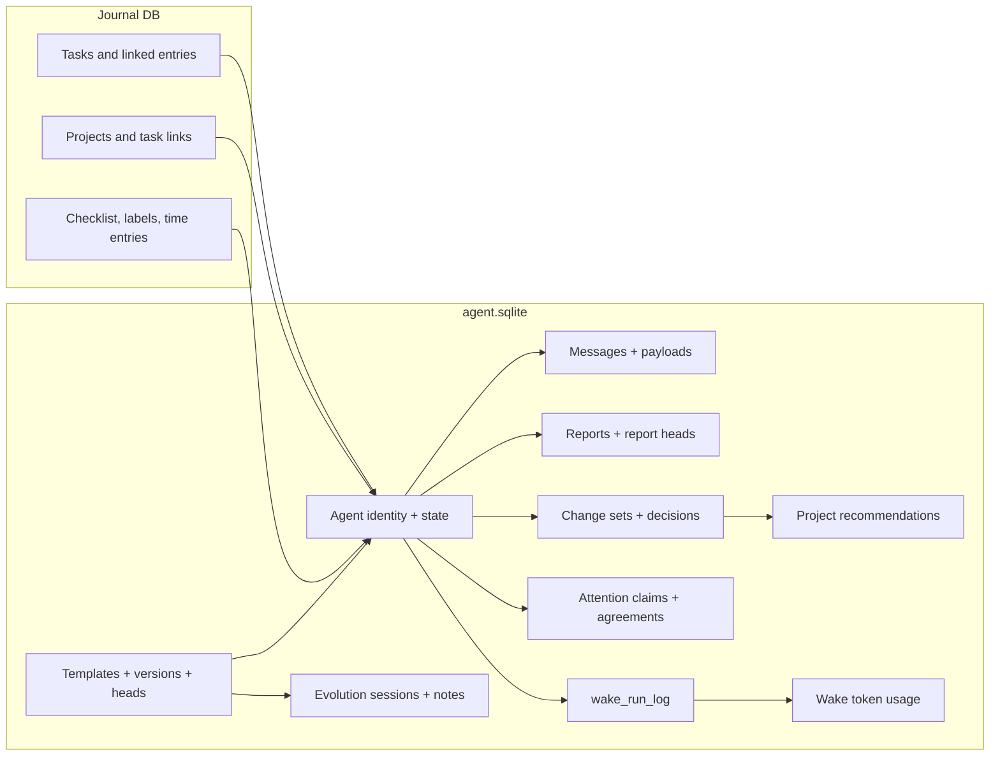
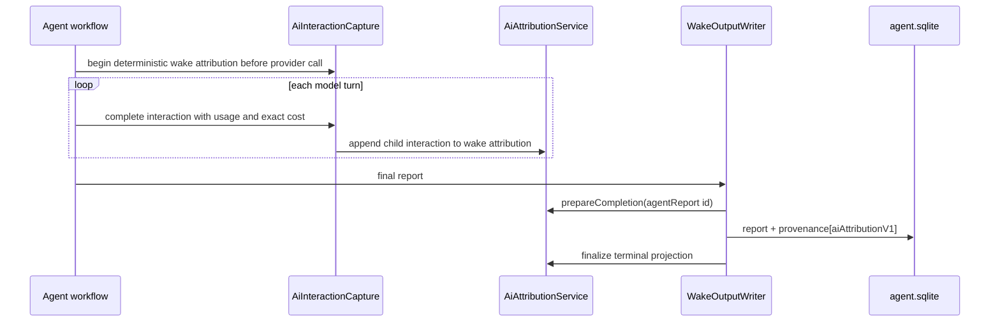

# One database, two shapes

Agent persistence lives in `agent.sqlite` (schema version 17). Syncable domain
objects are modelled as **`AgentDomainEntity` variants** and **`AgentLink`
variants**; wake-run history lives in a dedicated `wake_run_log` table outside
that model.

## Entities

- `AgentIdentityEntity`, `AgentStateEntity`
- `AgentMessageEntity`, `AgentMessagePayloadEntity`
- `AgentReportEntity`, `AgentReportHeadEntity`
- `AgentTemplateEntity`, `AgentTemplateVersionEntity`, `AgentTemplateHeadEntity`
- `EvolutionSessionEntity`, `EvolutionSessionRecapEntity`, `EvolutionNoteEntity`
- `SoulDocumentEntity`, `SoulDocumentVersionEntity`, `SoulDocumentHeadEntity`
- `ChangeSetEntity`, `ChangeDecisionEntity`
- `ProjectRecommendationEntity`
- `AttentionRequestEntity`, `AttentionClaimDispositionEntity`,
  `AttentionAwardEntity`
- `StandingAgreementEntity`
- `WakeTokenUsageEntity`
- `ScheduledWakeEntity` — a day-scoped persisted scheduled wake for the Daily OS
  planner (ADR 0022), carrying `workspaceKey`, `triggerTokens` and a
  `pending | consumed` status. Several outstanding day pre-warms therefore
  survive a restart with full day context, instead of sharing one clobberable
  `AgentState.scheduledWakeAt`.
- `PlannerKnowledgeEntity` — the planner's durable knowledge ("memorize what I
  tell you", ADR 0022). **Compaction-exempt**; the active Head set is a pure
  recency-wins projection over the entries, with no separate Head entity.
  Carries optional immutable author-time `tags`, set once at origin.
- Daily OS capture-pipeline variants: `CaptureEntity`, `ParsedItemEntity`,
  `DayPlanEntity`, `DaySummaryEntity`.
- `AgentUnknownEntity` — the forward-compat fallback for variants an older
  client cannot decode.

## Links

`agent_state`, `agent_task`, `agent_project`, `template_assignment`,
`improver_target`, `soul_assignment`; the Daily OS capture/plan links
`toolEffect`, `captureToParsedItem`, `parsedItemToTask`, `captureToPlan`; the
attention-negotiation links `attentionRequestEvidence`, `attentionAwardRequest`,
`attentionAwardPlan`; and `basic` as the generic fallback.

**`agent_day` is legacy.** It linked the old per-day day-agent identity to its
day, back-linking `slots.activeDayId`. ADR 0022's single long-lived planner pins
no `activeDayId` slot and writes no new `agent_day` links — the type and its
projection remain only to read pre-migration data.

## What is deliberately absent

The agents feature does **not** mirror full task or project state into
`agent.sqlite`. The journal database is read on demand during wakes; what
persists here is the agent's own interpretation and review state.

# Bulk reads respect SQLite's variable cap

`getEntitiesByIds`, `getLatestReportsByAgentIds` and `getLinksToMultiple`
deduplicate inputs and split large `IN (...)` lists into **900-id chunks**. This
keeps linked-task and report context collection on the indexed batch path even
when sync or wake preparation considers thousands of ids.

Latest-per-agent batch reads are backed by active-row indexes that include the
`(created_at DESC, id DESC)` ranking order for both type-only and
type-plus-subtype lookups, so the window-function query needs no temp sort for
the final order term.

Due and pending scheduled-wake reads pin
`idx_agent_entities_pending_scheduled_wake_at`. The partial expression index
provides both the due-time range scan and the pending-list order; pinning it in
the hand-written methods avoids platform-specific SQLite planner choices that
otherwise fall back to the broader active-type index and a temporary sort.

# Sync

`AgentSyncService` wraps local agent writes. It stamps vector clocks and
**buffers outbox messages until the outermost transaction commits**. Nested
transactions share the same zone-local buffer, so a rolled-back inner savepoint
does not leak sync messages for writes that never committed.

**Incoming sync writes do not pass back through `AgentSyncService`.** They write
to `AgentRepository` directly, which is what avoids echo loops. Startup wiring
attaches the sync event processor when one is registered.

Concurrent agent state converges without user involvement — see
[vector clocks and conflicts](../sync/vector-clocks-and-conflicts.md) for the
G-counter merge that keeps concurrent wake counters from being lost.

| Scope | Contents |
|-------|----------|
| **Synced** | Agent identities and state; reports, observations, change sets, decisions, recommendations and token-usage entities; template versions and evolution sessions |
| **Local only** | `wake_run_log` rows and other runtime bookkeeping not modelled as a sync entity |
| **Sent to a provider** | Only the prompt payload assembled for that specific wake |

Because wake workflows resolve an inference profile at run time, the same
template can be routed through different providers without changing the agent
persistence model.

# Diagnostics are content-free

This is a hard rule, not a style preference. `DomainLogger` and direct
`developer.log` calls **may** record tool names, item indexes, counts, byte
sizes, status names, sanitized ids and exception runtime types.

They **must not** record task titles, notes, timer summaries, prompt text, model
output, raw tool arguments, or arbitrary exception strings.

The durable agent message log remains the memory and audit surface; it is never
copied into runtime log files.

# AI consumption provenance

Every agent report carrier receives AI-consumption provenance. Task agents
publish through `WakeOutputWriter`; project and event workflows use the same
report-carrier pattern.

Attribution is stored under `provenance[aiAttributionV1]`, linking the
creator/trigger, the calls in the wake, actual provider-reported cost, and the
report output. `ReportInferenceProvenance` separately snapshots model routing and
runtime settings **without credentials or endpoint URLs**.

The wake run key deterministically groups initial calls, tool continuations and
forced-report retries into one attribution. Historical reports are **not**
assigned guessed creator or cost data.

Agent turn recording persists consumption independently from the report: the
report carrier is authoritative and the local attribution projection is updated
after the report write. Log-compaction inference is a separate carrier-less AI
operation, captured before each backend call and terminalized as **partial**
because its checkpoint format has no attribution record.
