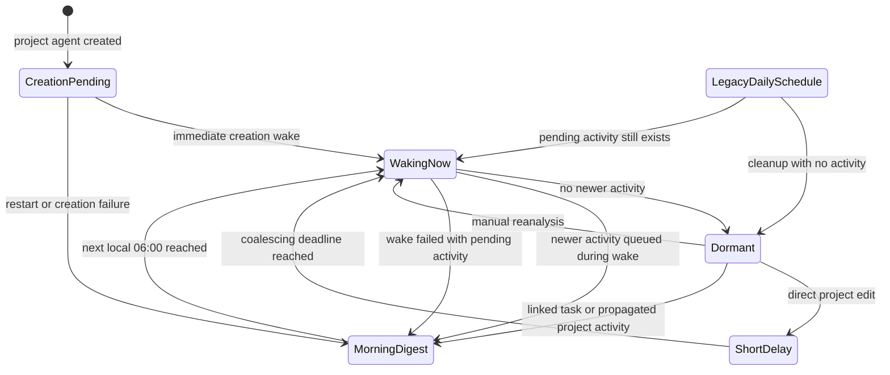
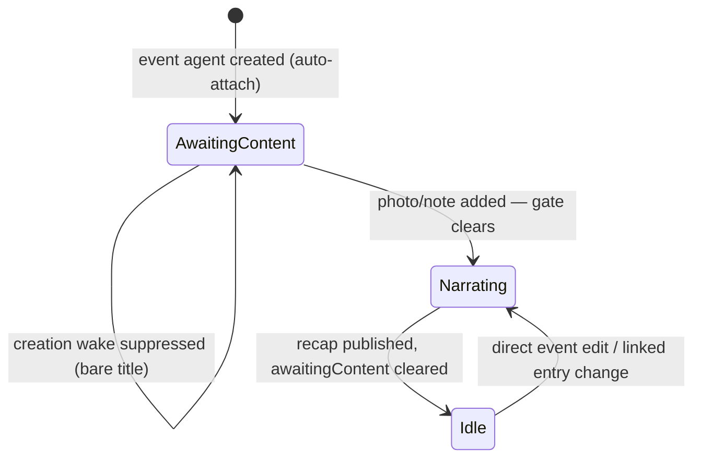

# Project agents

A project agent is **digest-shaped**. Its defining problem is that a project has
many linked tasks, and waking on every one of their edits would be both
expensive and useless.

`ProjectAgentService.createProjectAgent()`:

1. Enforces one project agent per project.
2. Validates the template is a project-agent template.
3. Creates identity and state.
4. Sets `slots.activeProjectId` and marks the explicit creation work pending.
5. Persists a one-shot next-06:00 fallback for the in-memory creation wake.
6. Creates `agent_project` and `template_assignment` links.
7. Announces itself (see below).
8. Registers the project subscription.
9. Enqueues the explicit creation wake.

## Announcing a newly created agent

`projectAgentProvider` and `eventAgentProvider` key their refresh on the
**project / event** id, and nothing in the agent write path emits it — identity,
state and links all go through `AgentSyncService`, which does not notify. Without
an announcement the agent stays invisible until something unrelated pings the
domain entity, in practice the creation wake completing a full inference round
trip.

Both services therefore ping the domain id alongside the agent id through the
`onPersistedStateChanged` callback they already hold:

```dart
onPersistedStateChanged
  ?..call(identity.agentId)
  ..call(eventId);
```

The callback is wired to `persistedStateChangedNotifier`, which routes to
`UpdateNotifications.notifyUiOnly` — so both ids coalesce into one 100 ms batch
and stay off `localUpdateStream`, keeping the orchestrator from reading the agent
system's own write as domain content changing and stacking a second wake on the
creation wake. Its parameter is named `id` rather than `agentId` because it is
whatever token the watchers key on; `DayAgentTriageService` already passed a task
id through it. Task agents solve the same problem one layer up, by calling
`notifyUiOnly` directly — see [task agents](task-agents.md).

## Two different trigger paths



- **Linked-task churn** does not wake the agent immediately.
  `ProjectActivityMonitor` listens to `localUpdateStream`, resolves affected
  project ids, sets `slots.pendingProjectActivityAt`, and arms a one-shot
  `scheduledWakeAt` for the next local 06:00. Project/link notifications also
  use the subscription's persisted `nextWakeAt` path; either path survives a
  restart and the first successful wake clears both.
- **Direct project edits** use the same subscription but take the short
  coalescing path, so an explicit project edit does not wait until morning.
- **Explicit requests** (`creation` and manual `reanalysis`) bypass the
  subscription throttle and enqueue immediately.

## Dormant-by-default scheduling

Project agents do not own a recurring `scheduledWakeAt`. Creation or meaningful
local activity may create a one-shot state schedule, and subscription routing
may additionally persist `nextWakeAt` for its queued job. A successful wake
clears the pending marker and both deadlines when no newer activity remains. A
failed wake with pending activity re-arms the one-shot morning fallback instead
of waiting for another edit. Consequently the Wake tab contains a project-agent
row only while actual work or a retry is pending.

Older installations can still contain the former daily schedule. Startup
restoration clears it when the agent has completed at least one wake and
`pendingProjectActivityAt` is null, re-reading current state first so a
concurrent activity write cannot be overwritten. `ScheduledWakeManager` applies
the same dormant cleanup to overdue rows. Never-woken agents and agents with
pending activity retain the row as a one-shot safety net; every successful
workflow run clears `scheduledWakeAt` instead of rolling it forward.

During the final state transition, `pendingProjectActivityAt` is cleared **only
when no newer activity arrived during the wake**. If fresh activity lands
mid-run, the newer timestamp is retained so the next digest still knows the
summary is stale again.

## Wake flow

`ProjectAgentWorkflow.execute()` loads state and resolves `activeProjectId`,
retires a dormant legacy scheduled wake before inference, loads the project
entity and prior observations, resolves template/version and inference profile,
builds linked-task context **including task-agent reports**, runs the
conversation with `ProjectAgentStrategy`, and persists token usage, final
thought, report, observations, deferred change set and updated state.
Successful persistence clears the legacy `scheduledWakeAt` and clears
`pendingProjectActivityAt` only when no newer activity arrived during the wake.

Project reports follow the same inline task-link contract as task reports: when
linked-task context includes a task id, the report may point at `/tasks/<taskId>`
rather than relegating internal navigation to the external Links block.

## Tools and recommendations

Immediate local tools: `update_project_report`, `record_observations`.

Deferred tools: `recommend_next_steps`, `update_project_status`, `create_task`.

Confirmed `recommend_next_steps` decisions become `ProjectRecommendationEntity`
rows via `ProjectRecommendationService`, which supersedes existing active
recommendations for that project first. Recommendations then move through
`active`, `resolved`, `dismissed` and `superseded`.

# Event agents

An event agent narrates a first-class Event — a trip, a birthday, a gathering —
into a short living recap. An event mostly happens **once**, so the agent is a
*recap writer*, not a continuous watcher.

It is deliberately leaner than the project agent: no compaction or input-capture
log, no daily digest, no deferred change sets beyond one tool, no health band. It
borrows the task agent's content gate so a bare-title event does not burn an
inference run.

## The human-authorship invariant

> **Rating and cover are human-only.** The event's star rating and cover photo
> are the user's own authorship of their memory.

This is enforced at three independent layers, not by directive: the event agent
has **no tool** that can set them, the context builder never renders them, and no
workflow code path writes the `JournalEvent`. By construction there is no
rating/cover tool to misuse.

## Creation and the content gate

`EventAgentService.createEventAgent()` enforces one agent per event, validates
the template kind, creates identity and state, sets `slots.activeEventId` and the
`awaitingContent` flag, creates `agent_event` and `template_assignment` links,
announces itself (see [above](#announcing-a-newly-created-agent)), mirrors
`awaitingContent` into the orchestrator, registers a subscription on the **bare
`eventId`**, and enqueues a creation wake.

The shared gate (`wake_batch_router._shouldSkipForAwaitingContent`) dispatches
per active slot: an `activeEventId` agent routes to `eventContentChecker`, with
**no cross-slot fallback**. The checker treats an event as having content when it
has note text **or** a linked photo/note — a bare title does not pass.



The gate clears in the router on detection and again in the workflow's success
transaction.

## Wake flow

`EventAgentWorkflow.execute()` loads the reconciled agent state and resolves
`activeEventId`, loads the latest recap and the event entity, loads prior
observations, resolves template/version and profile, builds context (title,
status, when, note, plus a linked-entries digest of photos with captions, notes,
voice-memo transcripts and linked tasks), runs `EventAgentStrategy`, and persists
usage, final thought, recap report and head, observations, and the updated state
— clearing `awaitingContent` and emitting the `wakeCompleted` milestone.

## Tools

Immediate local, reusing the task agent's scope-agnostic contract:
`update_report` (`oneLiner` / `tldr` / `content`), `record_observations`.

Deferred: `suggest_follow_up_task` — proposes a concrete follow-up the event
implies. It accumulates as a pending `ChangeSet` keyed by the event id, surfaces
on the detail page as an accept/reject row, and on accept is applied by
`EventToolDispatcher`, which creates a follow-up task linked to the event and
inheriting its category and default profile. Rejection only records the decision.

Accepting a follow-up does **not** re-wake the agent — the new task is its own
entity. A future status write-action that edited the event itself would re-wake
it through the event subscription.

## Auto-attach

`autoAssignCategoryEventAgent` creates a content-awaiting event agent when an
event is created in a category whose `Category.defaultEventTemplateId` is set.
This is independent of the task agents' `defaultTemplateId`, so enabling task
agents does not implicitly spawn event agents.
