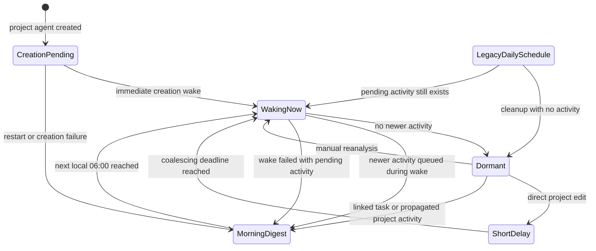
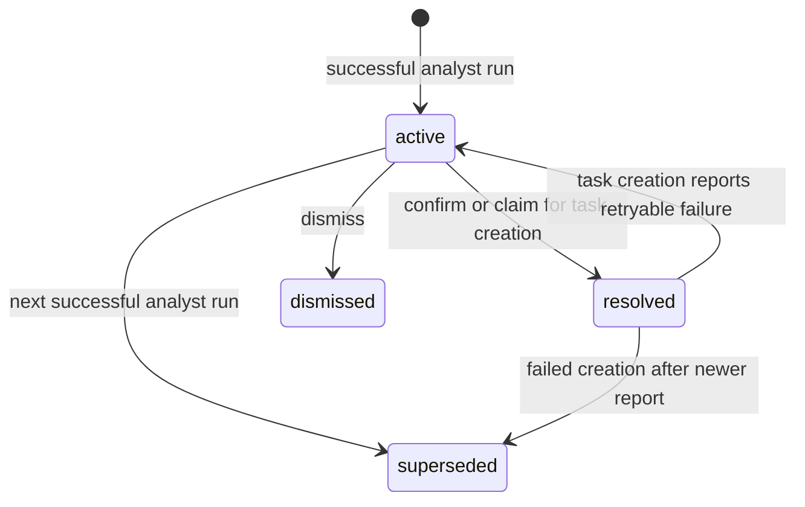
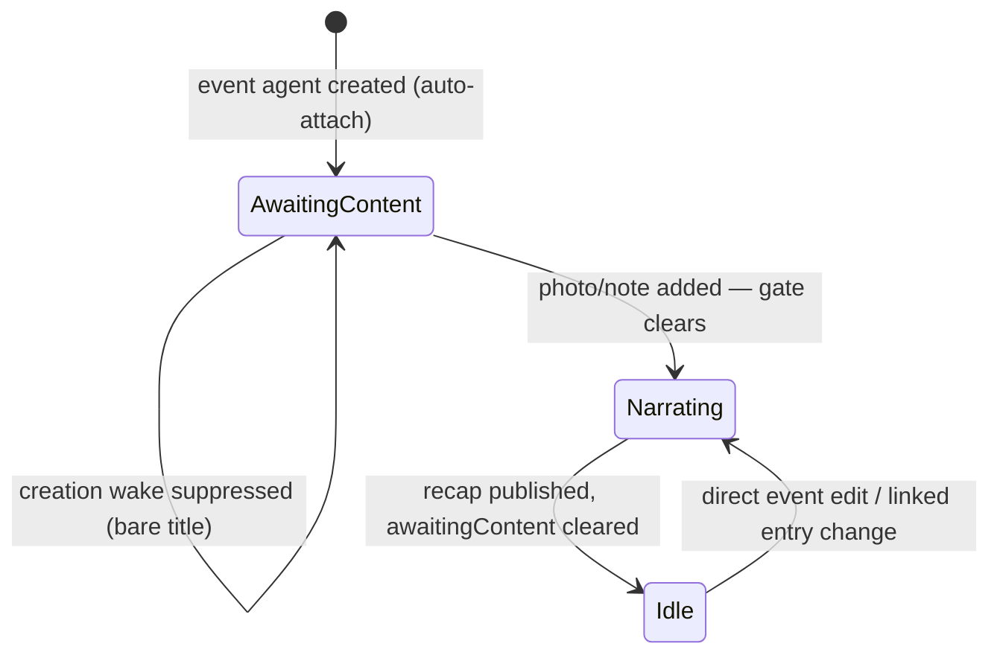

# Project agents

A project agent is **digest-shaped**. Its defining problem is that a project has
many linked tasks, and waking on every one of their edits would be both
expensive and useless.

`ProjectAgentService.createProjectAgent()`:

1. Serializes with category edits and destructive mutation of the same project,
   then verifies the journal project still exists with the requested category.
2. Enforces one project agent per project.
3. Re-reads the template and validates that it is an active project-agent
   template whose category scope still applies to the requested project scope.
4. Creates identity and state.
5. Sets `slots.activeProjectId` and marks the explicit creation work pending.
6. Persists a one-shot next-06:00 fallback for the in-memory creation wake.
7. Creates `agent_project` and `template_assignment` links.
8. Rechecks the journal project and category; a sync tombstone or scope change
   compensates by deleting the just-created agent before it can be announced,
   subscribed, or woken.
9. Announces itself (see below).
10. Registers the project subscription.
11. Enqueues the explicit creation wake.

Project deletion and synced scope reconciliation hold the same per-project
coordinator as provisioning. Deletion lives in `ProjectLifecycleService`; its
cross-store compensation is documented in [Projects](../projects.md).
Scope reconciliation verifies the current journal scope after waiting and reads
identities and assigned templates inside the agent transaction, preserving
unrelated preferences. Missing, deleted, wrong-kind, or category-incompatible
templates retire their agents without granting access to the new category.
Local category changes are rejected while any live agent or linked task exists.
Agent and journal data use separate databases, so the coordinator provides
local exclusion; pre/post-create scope checks cover stale category input and
independent tombstones or category changes arriving through sync.
Because a peer can still apply its tombstone or category move after that final check,
`ProjectActivityMonitor` also listens to `syncUpdateStream` for project rows.
Reconciliation shares the per-project mutation coordinator. When the announced
project is absent, it rechecks absence immediately before each retirement,
cancels queued/running work, and attempts every linked agent even if one fails.
A project restored during link lookup instead receives scope reconciliation.
Surviving projects retain only agents whose templates permit the synced category. This is reconciliation only: synced edits never enter the
local activity path and therefore never arm a new wake.

## Announcing a newly created agent

`projectAgentProvider` and `eventAgentProvider` key their refresh on the
**project / event** id, and nothing in the agent write path emits it — identity,
state and links all go through `AgentSyncService`, which does not notify. Without
an announcement the agent stays invisible until something unrelated pings the
domain entity, in practice the creation wake completing a full inference round
trip.

Both services therefore ping the domain id alongside the agent id through the
`onPersistedStateChanged` callback they already hold:

```dart
onPersistedStateChanged
  ?..call(identity.agentId)
  ..call(eventId);
```

The callback is wired to `persistedStateChangedNotifier`, which routes to
`UpdateNotifications.notifyUiOnly` — so both ids coalesce into one 100 ms batch
and stay off `localUpdateStream`, keeping the orchestrator from reading the agent
system's own write as domain content changing and stacking a second wake on the
creation wake. Its parameter is named `id` rather than `agentId` because it is
whatever token the watchers key on; `DayAgentTriageService` already passed a task
id through it. Task agents solve the same problem one layer up, by calling
`notifyUiOnly` directly — see [task agents](task-agents.md).

## Two different trigger paths



- **Linked-task churn** does not wake the agent immediately.
  `ProjectActivityMonitor` listens to `localUpdateStream`, resolves affected
  project ids, sets `slots.pendingProjectActivityAt`, and arms a one-shot
  `scheduledWakeAt` for the next local 06:00 when automatic updates are allowed.
  With automation explicitly disabled, it still marks the report stale but does
  not create the fallback. Project/link notifications also use the
  subscription's persisted `nextWakeAt` path; either path survives a restart.
- **Direct project edits** use the same subscription but take the short
  coalescing path, so an explicit project edit does not wait until morning.
- **Explicit requests** (`creation` and manual `reanalysis`) bypass the
  subscription throttle and enqueue immediately.
- **Automation policy** is shared across local monitoring, workflow fallback
  creation, startup restoration, and synced identity/link restoration. An
  active legacy project agent with no stored preference retains its shipped-on
  behavior; explicit opt-out, inactive lifecycle, and disabled inference block
  automatic subscription and fallback wakes while observation remains wired.
  Identity, state, and project-link apply paths all reconcile the marker, so
  every valid sync arrival order arms already-pending work once policy becomes
  evaluable; startup restoration performs the same repair after a restart.
  A first state import discards the sender's project fallback deadline and
  its throttle fields (`nextWakeAt` and `sleepUntil`), then derives any
  replacement from the receiving device's policy, clock, and pending marker
  instead of treating another device's deadlines as local work. Before the
  identity arrives, `activeProjectId` identifies the row as project state so
  all peer scheduling fields are still stripped.
  A synced or local opt-out clears every device-local automatic fallback,
  including markerless creation rows, but retains any pending marker so
  re-enabling can arm it again without losing evidence. A synced completion
  does the inverse: when the incoming state consumes the pending marker, the
  receiving device drops its retained fallback, local throttle, and queued
  automatic job while leaving explicit user wakes alone.
  Missing-fallback repair re-reads the current identity policy inside the same
  local transaction as the state write; concurrent opt-in and opt-out changes
  therefore win instead of being overwritten by a stale sync-reconciliation
  decision. Equal or locally dominated identity and state replays still run
  this local repair, so a transient receiver-side failure can recover on
  redelivery; when that repair changes the fallback, it also notifies local
  listeners so the visible countdown updates immediately. Local
  settings, resume-time fallback repair, and startup restoration use the same
  transaction-local policy recheck before enabling runtime; a lifecycle change
  that wins during startup also removes the stale observation subscriptions.
  Disabling the inference setup routes through this reconciliation too, so it
  cannot leave a receiver-local fallback visible after making the agent
  dormant. Startup also re-reads the current state before queue hydration and
  restores a throttle only for still-pending activity or an unfinished initial
  creation wake.

## Dormant-by-default scheduling

Project agents do not own a recurring `scheduledWakeAt`. Creation or meaningful
local activity may create a one-shot state schedule, and subscription routing
may additionally persist `nextWakeAt` for its queued job. A successful wake
clears the pending marker and both deadlines when no newer activity remains. A
failed wake with pending activity re-arms the one-shot morning fallback instead
of waiting for another edit; this includes failures during project/template/
provider setup before inference starts. A failed first-ever legacy creation wake
also advances its markerless scheduled row because `lastWakeAt == null` proves
that creation work has not completed. An overdue fallback advances to the next
morning rather than remaining due on every hourly scan. When automation is
disabled, a manual wake may preserve an already-future explicit schedule but
cannot synthesize a new morning fallback on success or failure. Enabling
automation while the identity is inactive likewise leaves the fallback absent;
resume-time restoration routes by agent kind, restores the direct-project
subscription, and arms it after the lifecycle becomes active. Settings-driven
opt-in and opt-out change only the local `scheduledWakeAt`; they preserve the
synced state timestamp and vector clock so scheduling maintenance cannot
resurrect a peer-completed activity marker. Before opt-out removes a project
fallback, it marks an otherwise-current report stale so a later opt-in requests
an immediate catch-up instead of waiting for the next morning. The report row
itself is authoritative when an older first report has no freshness watermark.
The settings-triggered catch-up uses an automation initiator, so another
opt-out can remove it before dispatch while explicit manual wakes remain
eligible. If an
automation-preference or inference-setup identity transaction commits but its
outbox flush fails, the service confirms the persisted identity, performs the
matching runtime and fallback reconciliation, and then rethrows the sync
failure. Pausing or
destroying a project agent clears the same local
fallback inside the lifecycle transaction while retaining the pending marker
for a later resume. A pause or destroy received from sync also clears this
device's local fallback and disables runtime because the sender cannot clear a
receiver-owned scheduling field. Explicit
cancellation clears `pendingProjectActivityAt`, `nextWakeAt`, and
`scheduledWakeAt` in one persisted state write before clearing queued work; a
transaction rollback therefore leaves the runtime work intact and surfaces an
error in the project detail UI. If the state commits but the subsequent outbox
flush fails, runtime work is still cleared to match storage before that sync
error is surfaced, and the confirmed cancellation cutoff remains committed so
an older activity batch cannot recreate the cleared marker. Because a
transaction can also fail after its callback ran
but before commit, the error path re-reads storage and clears runtime work only
when the cancellation fields are actually absent. Failure persistence and cancellation share the same
serialized sync transaction path, so a retry computed from an older snapshot
cannot restore a marker or deadline that cancellation already removed. The
activity monitor also captures when each local update batch was observed and
serializes its final write with cancellation. A cancellation cutoff rejects
older batches still resolving links, while newer post-cancel edits remain
eligible; rolled-back cancellations remove only their own pending cutoffs, so
even overlapping failures leave no phantom cancellation behind. The final
write also compares the observation time with the current `lastWakeAt`, so a
batch delayed until after a successful wake cannot re-arm already-processed
activity. The
workflow also re-reads the current identity policy inside its final persistence
transaction; an automation toggle made during inference therefore controls
whether success or failure may create another fallback. Consequently the
Wake tab contains a project-agent row only while actual work or a retry is
pending.

Older installations can still contain the former daily schedule. Startup
restoration clears it when the agent has completed at least one wake and
`pendingProjectActivityAt` is null. It re-reads, validates, and writes current
state in one raw local transaction, so concurrent activity or manual scheduling
cannot be overwritten. Both retirement and missing-fallback repair change only
`scheduledWakeAt`, preserving the synced `updatedAt` and vector clock so local
scheduling maintenance cannot win a later peer merge.
`ScheduledWakeManager` applies the same dormant cleanup to overdue rows.
That due-scan cleanup re-reads lifecycle and state in a raw local transaction,
clears only `scheduledWakeAt`, and preserves the current `nextWakeAt`, pending
marker, `updatedAt`, and vector clock. An obsolete due-query snapshot therefore
cannot restore consumed scheduling data, erase newer activity, or win a peer
merge.
Explicitly opted-out agents are stricter: startup clears every fallback,
including a never-woken markerless creation row left by an interrupted upgrade.
Otherwise, never-woken agents and agents with pending activity retain the row
as a one-shot safety net. Before retiring a row, the manager re-reads state and rechecks both
the due deadline and pending marker, so activity or a replacement schedule that
arrives during the scan wins. Every successful workflow run clears
`scheduledWakeAt` when it
consumed the newest activity.
Before enqueueing a due fallback, the manager checks for queued or running work
for the same agent after re-reading authoritative state at the enqueue boundary,
leaving the fallback durable instead of stacking a second inference. That
ordering closes the interval in which another wake can start while the state
read is awaiting. Dormant-schedule retirement makes its fresh decision and
whole-row write inside one transaction, so newly committed activity cannot be
restored away by an older snapshot. If cancellation clears the deadline or
moves it into the future while the scan is awaiting, the stale due snapshot
cannot launch a wake.

Older-client identity rewrites may omit automation and inference-setup fields.
Sync apply overlays those absent fields from the local identity for both task
and project agents; explicit incoming values still win. A legacy rewrite can
therefore rename or otherwise update a project agent without silently undoing
its local automation opt-out or disabled inference setup.
Older project-state payloads may likewise omit `pendingProjectActivityAt`.
Sync apply detects field presence before deserialization: omission preserves
the receiving device's pending marker and fallback, while an explicit null
still records that the originating device consumed the work and cancels the
receiving device's automatic wake. Outbox bundles retain each raw child
envelope beside its deserialized message, including file-backed manifest
children, so bundling cannot erase that omission signal.

Failure persistence notifies state consumers only after the retry deadline is
successfully written. The project detail report prefers the subscription
deadline and falls back to the durable state schedule, so retry and creation
fallbacks remain visible through the existing countdown and cancel control.

During the final state transition, `pendingProjectActivityAt` is cleared **only
when no newer activity arrived during the wake**. If fresh activity lands
mid-run, the newer timestamp and a future one-shot fallback are retained so the
next digest still knows the summary is stale even if the in-memory follow-up is
lost to suspension. Activity and report-freshness writers both re-read the
latest state inside their write transactions, so either update preserves fields
the other committed while it was waiting.

## Wake flow

`ProjectAgentWorkflow.execute()` loads state and resolves `activeProjectId`,
retires a dormant legacy scheduled wake before inference, loads the project
entity and prior observations, resolves template/version and inference profile,
builds linked-task context **including task-agent reports**, runs the
conversation with `ProjectAgentStrategy`, and persists token usage, final
thought, report, observations, deferred change set and updated state.
State that lacks `activeProjectId` enters the same shared failure path as a
missing project or provider, advancing any overdue fallback instead of leaving
it due on every scheduler scan.
Successful persistence clears `scheduledWakeAt` and
`pendingProjectActivityAt` only when no newer activity arrived during the wake;
otherwise it preserves a future fallback for the retained marker.

Project reports follow the same inline task-link contract as task reports: when
linked-task context includes a task id, the report may point at `/tasks/<taskId>`
rather than relegating internal navigation to the external Links block.

## Tools and recommendations

Immediate local tools: `update_project_report`, `record_observations`.

Deferred mutations: `update_project_status`, `create_task`.

`recommend_next_steps` is accumulated during the conversation, then published as
individual `ProjectRecommendationEntity` rows by
`ProjectRecommendationService.replaceForRun` inside the successful wake's
transaction. Each run supplies a complete replacement, including an empty list;
failed wakes retain the last list. Stable IDs derived from agent, project, run
and position make replay idempotent without reviving user decisions.

The recommendations provider upgrades legacy pending batches transactionally.
It materializes only the newest pending run unless a newer recommendation list
already exists, and retracts pending recommendation items across old change sets.
A newer report without a corresponding batch also makes old batches stale.
Other tools and previously decided items retain their state. This is a durable
migration, not a display-only filter.

Confirm and dismiss operate on individual active recommendations. Creating a
task claims the recommendation before dispatching `create_task` through
`ProjectToolDispatcher`, preserving title, rationale, priority and project scope.
Known failures restore it for retry unless a newer report has superseded the
step. Failed rollback and unexpected exceptions leave the claim consumed because
task persistence may already have committed. Successful task
creation remains consumed even if optional agent assignment returns a warning.



Legacy confirmed change-set decisions still use
`recordConfirmedRecommendations`; newly generated next steps bypass that batch
confirmation path.

# Event agents

An event agent narrates a first-class Event — a trip, a birthday, a gathering —
into a short living recap. An event mostly happens **once**, so the agent is a
*recap writer*, not a continuous watcher.

It is deliberately leaner than the project agent: no compaction or input-capture
log, no daily digest, no deferred change sets beyond one tool, no health band. It
borrows the task agent's content gate so a bare-title event does not burn an
inference run.

## The human-authorship invariant

> **Rating and cover are human-only.** The event's star rating and cover photo
> are the user's own authorship of their memory.

This is enforced at three independent layers, not by directive: the event agent
has **no tool** that can set them, the context builder never renders them, and no
workflow code path writes the `JournalEvent`. By construction there is no
rating/cover tool to misuse.

## Creation and the content gate

`EventAgentService.createEventAgent()` enforces one agent per event, validates
the template kind, creates identity and state, sets `slots.activeEventId` and the
`awaitingContent` flag, creates `agent_event` and `template_assignment` links,
announces itself (see [above](#announcing-a-newly-created-agent)), mirrors
`awaitingContent` into the orchestrator, registers a subscription on the **bare
`eventId`**, and enqueues a creation wake.

The shared gate (`wake_batch_router._shouldSkipForAwaitingContent`) dispatches
per active slot: an `activeEventId` agent routes to `eventContentChecker`, with
**no cross-slot fallback**. The checker treats an event as having content when it
has note text **or** a linked photo/note — a bare title does not pass.



The gate clears in the router on detection and again in the workflow's success
transaction.

## Wake flow

`EventAgentWorkflow.execute()` loads the reconciled agent state and resolves
`activeEventId`, loads the latest recap and the event entity, loads prior
observations, resolves template/version and profile, builds context (title,
status, when, note, plus a linked-entries digest of photos with captions, notes,
voice-memo transcripts and linked tasks), runs `EventAgentStrategy`, and persists
usage, final thought, recap report and head, observations, and the updated state
— clearing `awaitingContent` and emitting the `wakeCompleted` milestone.

## Tools

Immediate local, reusing the task agent's scope-agnostic contract:
`update_report` (`oneLiner` / `tldr` / `content`), `record_observations`.

Deferred: `suggest_follow_up_task` — proposes a concrete follow-up the event
implies. It accumulates as a pending `ChangeSet` keyed by the event id, surfaces
on the detail page as an accept/reject row, and on accept is applied by
`EventToolDispatcher`, which creates a follow-up task linked to the event and
inheriting its category and default profile. Rejection only records the decision.

Accepting a follow-up does **not** re-wake the agent — the new task is its own
entity. A future status write-action that edited the event itself would re-wake
it through the event subscription.

## Auto-attach

`autoAssignCategoryEventAgent` creates a content-awaiting event agent when an
event is created in a category whose `Category.defaultEventTemplateId` is set.
This is independent of the task agents' `defaultTemplateId`, so enabling task
agents does not implicitly spawn event agents.
