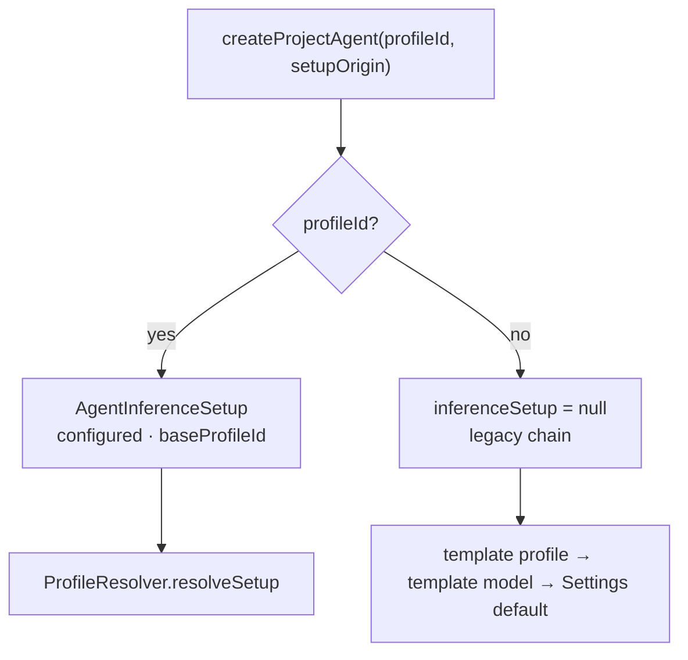
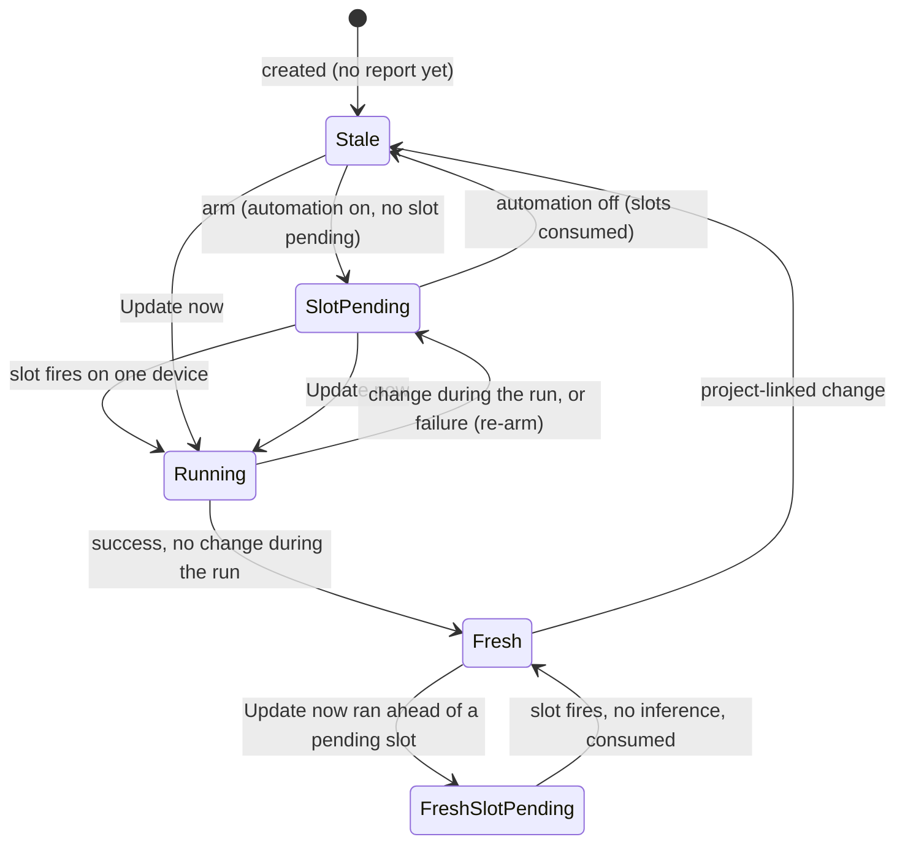
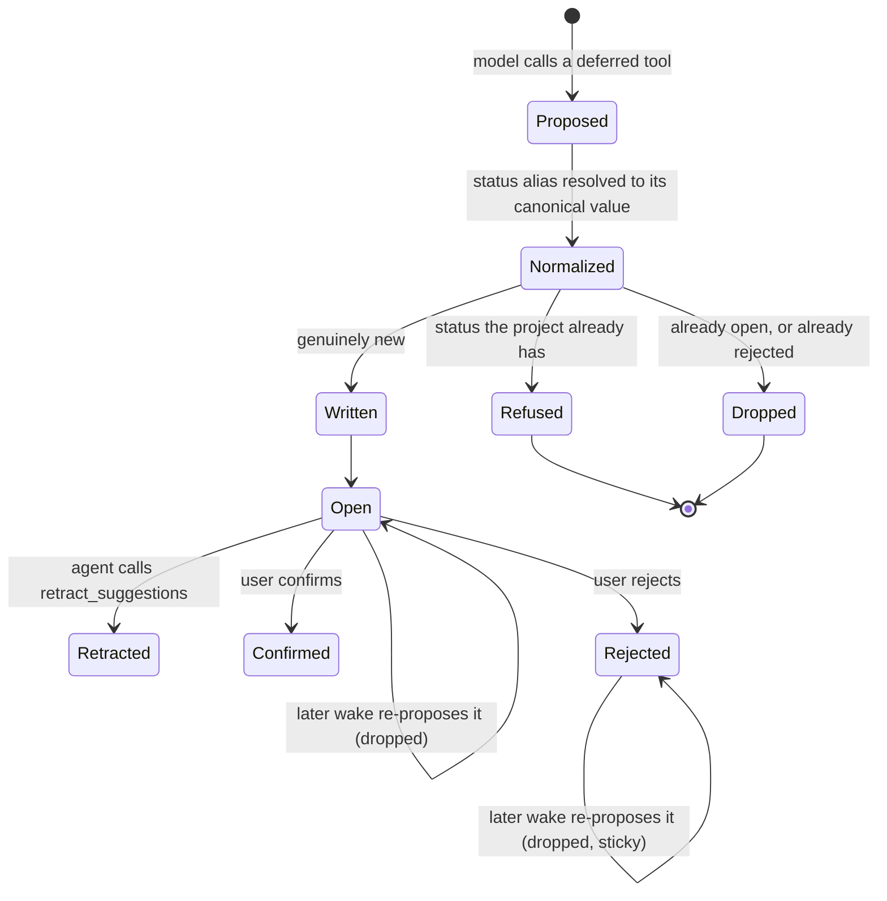
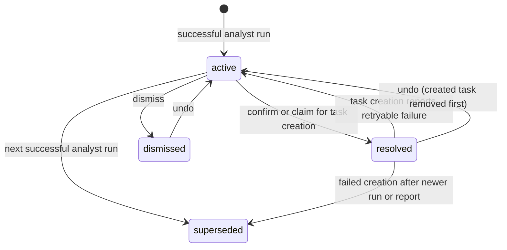
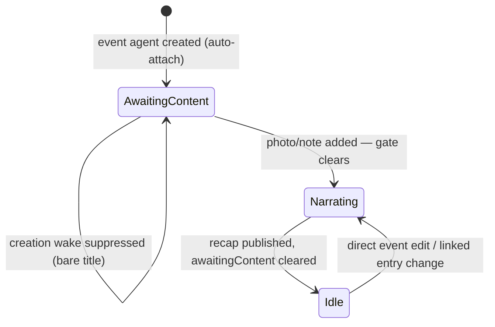

Project recommendation replacement owns retirement of the previous recommendation
sets for a run. The subsequent staged-retraction pass excludes
`recommend_next_steps` items, avoiding a second write/decision and a false
“already retracted” race against the workflow's own replacement. Other staged
suggestion retractions still use their normal ownership checks.

# Project agents

A project agent is **digest-shaped**. Its defining problem is that a project has
many linked tasks, and waking on every one of their edits would be both
expensive and useless.

`ProjectAgentService.createProjectAgent()`:

1. Serializes with category edits and destructive mutation of the same project,
   then verifies the journal project still exists with the requested category.
2. Enforces one project agent per project.
3. Re-reads the template and validates that it is an active project-agent
   template whose category scope still applies to the requested project scope.
4. Creates identity and state, with the inference setup described below.
5. Sets `slots.activeProjectId` and marks the explicit creation work pending.
6. Marks the report stale; the creation wake is durable through its wake
   intent, so no deadline is written.
7. Creates `agent_project` and `template_assignment` links.
8. Rechecks the journal project and category; a sync tombstone or scope change
   compensates by deleting the just-created agent before it can be announced,
   subscribed, or woken.
9. Announces itself (see below).
10. Registers the project subscription.
11. Enqueues the explicit creation wake.

## Inference profile at creation

A project agent is created with the profile it is handed, and a handed profile
is stored as a **typed, authoritative** `AgentInferenceSetup` (`configured`,
`baseProfileId` = that profile). Typed setups never fall through to template or
legacy defaults, so the agent runs on exactly that profile.

- **New project** (`ProjectCreateForm`): the category's `defaultProfileId`,
  with `setupOrigin: categorySnapshot` and the category id as origin entity —
  the same default a new task's agent takes from its category (see
  [task agents](task-agents.md)). The two differ when the category has no
  default: a task agent is then created with a *disabled* setup, while a
  project agent gets no typed setup and falls back to the legacy chain below.
- **Assign agent** on a project without one: the profile picked in the
  creation modal, `setupOrigin: user`.
- **No profile** (a category without a default): no typed setup is written,
  so the agent keeps the legacy chain in `ProfileResolver` — template profile,
  then the template's built-in model (the seeded templates carry
  `models/gemini-3-flash-preview`), then the device's Settings default. That
  chain is what every project agent used before, which is why projects ran on
  Gemini regardless of the category.


```mermaid
flowchart TD
  Create["createProjectAgent(profileId, setupOrigin)"] --> Has{"profileId?"}
  Has -->|yes| Typed["AgentInferenceSetup<br/>configured · baseProfileId"]
  Has -->|no| Legacy["inferenceSetup = null<br/>legacy chain"]
  Typed --> Resolve["ProfileResolver.resolveSetup"]
  Legacy --> Chain["template profile → template model → Settings default"]
```

Project deletion and synced scope reconciliation hold the same per-project
coordinator as provisioning. Deletion lives in `ProjectLifecycleService`; its
cross-store compensation is documented in [Projects](../projects.md).
Scope reconciliation verifies the current journal scope after waiting and reads
identities and assigned templates inside the agent transaction, preserving
unrelated preferences. Missing, deleted, wrong-kind, or category-incompatible
templates retire their agents without granting access to the new category.
Local category changes are rejected while any live agent or linked task exists.
Agent and journal data use separate databases, so the coordinator provides
local exclusion; pre/post-create scope checks cover stale category input and
independent tombstones or category changes arriving through sync.
Because a peer can still apply its tombstone or category move after that final check,
`ProjectActivityMonitor` also listens to `syncUpdateStream` for project rows.
Reconciliation shares the per-project mutation coordinator. When the announced
project is absent, it rechecks absence immediately before each retirement,
cancels queued/running work, and attempts every linked agent even if one fails.
A project restored during link lookup instead receives scope reconciliation.
Surviving projects retain only agents whose templates permit the synced category. This is reconciliation only: synced edits never enter the
local activity path and therefore never arm a new wake.

## Announcing a newly created agent

`projectAgentProvider` and `eventAgentProvider` key their refresh on the
**project / event** id, and nothing in the agent write path emits it — identity,
state and links all go through `AgentSyncService`, which does not notify. Without
an announcement the agent stays invisible until something unrelated pings the
domain entity, in practice the creation wake completing a full inference round
trip.

Both services therefore ping the domain id alongside the agent id through the
`onPersistedStateChanged` callback they already hold:

```dart
onPersistedStateChanged
  ?..call(identity.agentId)
  ..call(eventId);
```

The callback is wired to `persistedStateChangedNotifier`, which routes to
`UpdateNotifications.notifyUiOnly` — so both ids coalesce into one 100 ms batch
and stay off `localUpdateStream`, keeping the orchestrator from reading the agent
system's own write as domain content changing and stacking a second wake on the
creation wake. Its parameter is named `id` rather than `agentId` because it is
whatever token the watchers key on; `DayAgentTriageService` already passed a task
id through it. Task agents solve the same problem one layer up, by calling
`notifyUiOnly` directly — see [task agents](task-agents.md).

## Stale reports and update slots

A project agent never wakes because something changed. A change makes its
report **stale**; the report is refreshed in the agent's next **update slot**,
on one device, at most once per slot
([ADR 0113](../../../docs/adr/0113-project-agents-update-in-synced-slots.md),
model-checked in `specs/tla/ProjectWakeGovernor.tla`).

Staleness is the agent state's two max-joined watermarks, `reportStaleAt` and
`reportFreshAt`; a report is stale while `reportStaleAt >= reportFreshAt`.
Both sync, and a join never lowers either, so staleness converges on every
device whichever order the writes arrive in.


```mermaid
stateDiagram-v2
  [*] --> Stale: created (no report yet)
  Fresh --> Stale: project-linked change
  Stale --> SlotPending: arm (automation on, no slot pending)
  SlotPending --> Running: slot fires on one device
  Stale --> Running: Update now
  SlotPending --> Running: Update now
  SlotPending --> Stale: automation off (slots consumed)
  Running --> Fresh: success, no change during the run
  Running --> SlotPending: change during the run, or failure (re-arm)
  Fresh --> FreshSlotPending: Update now ran ahead of a pending slot
  FreshSlotPending --> Fresh: slot fires, no inference, consumed
```

- **What marks a report stale.** `ProjectActivityMonitor` listens to the local
  update stream — direct project edits, task links, edits to linked tasks and
  their entries — and writes `slots.pendingProjectActivityAt` and
  `reportStaleAt = max(stored, now)` in one transaction that re-reads the row,
  so it cannot lower a later watermark a peer wrote meanwhile. It then asks
  the cadence to arm. Project-agent subscriptions are `reportStaleOnly`: a
  match marks the report stale and queues nothing. Creation writes
  `reportStaleAt = now`; the creation wake itself is durable through its wake
  intent.
- **Arming** (`ProjectUpdateCadence.arm`). In one transaction: if the agent
  is a project agent whose automation is allowed, no slot of it is pending,
  and its report is stale, it writes a pending `ScheduledWakeEntity` for the
  next slot. The record id is derived from the agent and the slot's start, so
  every device that arms "the next slot" arms the same row; a slot that
  already has a record (consumed early) is skipped, up to 48 ahead. Arming is
  inert — it starts no work — and idempotent, so every path that might have
  noticed staleness calls it: the monitor, the end of a run, sync arrival of
  the identity, state or `agent_project` link, startup restoration, resume,
  and turning automation on.
- **The grid** (`project_update_slots.dart`). Slots are cut from the agent's
  update interval, anchored at 06:00 local time: hourly slots start on the
  hour, an eight-hour one at 06:00, 14:00 and 22:00, a daily one at 06:00.
  `AgentConfig.updateIntervalMinutes` is synced on the identity; null, or a
  value outside `ProjectUpdateSlots.choices` (1, 2, 4, 8 hours, a day), reads
  as hourly.
- **Firing.** The scheduled-wake manager fires a slot through its lease —
  claim, settle, confirm — and two further rules found by TLC: it claims and
  fires only while the [`SyncLeaseGate`](wake-orchestration.md#update-slots-are-leased-and-gated)
  is open, and it fires only the earliest pending slot of an agent and then
  consumes all of them. A run reads the agent as of its start, so it covers
  every change any pending slot was armed for.
- **The drain refuses anything else.** An automatic project wake that does
  not carry `ProjectUpdateSlots.triggerToken` — a subscription match, a
  restored intent, anything that queued automatic work by another route — is
  refused as `notAnUpdateSlot`. Explicit wakes ("Update now", creation) run,
  and every wake still passes the
  [daily wake budget](wake-orchestration.md#the-daily-wake-budget).
- **A slot over a fresh report runs no inference.** An "Update now" or a
  peer's run that freshened the report first read everything the slot was
  armed for; the workflow returns success without capturing input or calling
  the model, and the manager consumes the slot.
- **The end of a run.** Success stamps `reportFreshAt` with the run's start
  (when the run wrote a report) and, for a slot update, `lastDailyWakeAt`;
  a change that landed during the run is newer, keeps the report stale and
  re-arms. A failure counts in `consecutiveFailureCount`, leaves the report
  stale and re-arms, so a failing agent retries once per slot, bounded by the
  budget. Both paths call the cadence after the state write.
- **Automation off.** Turning automation off, disabling inference, or a
  resumed agent whose automation is off consumes every pending slot
  (`ProjectUpdateCadence.consumeAll`); the stale mark stays for the card to
  show. A paused agent's slot that still fires is refused by the drain
  (`agentInactive`), and the pause itself halts running work.
- **The automation policy** is shared by the monitor, the cadence, startup and
  sync restoration. A project agent with no stored preference has automation
  **off**, exactly as the switch shows it: until 2026-10 the runtime read a
  missing value as on while the switch showed off
  ([ADR 0112](../../../docs/adr/0112-a-daily-wake-budget-bounds-every-agent-wake.md)).
  Startup restoration re-reads the identity after its bulk listing, so a
  concurrent pause or opt-out controls the runtime it restores; sync
  reconciliation re-reads it inside the transaction that reads the state.

The agent internals countdown shows the next pending slot
(`projectNextUpdateProvider`); project agents have no Skip, since consuming a
slot only to have the next change arm another skips nothing.

## Legacy deadlines

Builds before update slots scheduled project wakes with device-local
deadlines: a one-shot `scheduledWakeAt` for the next 06:00, and the
subscription throttle's `nextWakeAt`. Neither is honoured any more, and each
is retired wherever it is met:

- `ProjectAgentService.restoreSubscriptions` clears both and the in-memory
  throttle before arming.
- `ScheduledWakeManager` retires a due project state schedule without firing
  it — never-woken creation rows and rows with pending activity included —
  re-reading the row in the write transaction, so a deadline cleared meanwhile
  writes nothing.
- Sync reconciliation of an identity, state or link clears them, and a first
  state import strips a peer's scheduling fields (`scheduledWakeAt`,
  `nextWakeAt`, `sleepUntil`); `activeProjectId` marks the row as project
  state before its identity has arrived.

Each retirement is a raw local write that keeps the synced `updatedAt` and
vector clock, so scheduling maintenance cannot become a newer synced version
of otherwise stale state.

Older-client identity rewrites may omit automation, inference-setup, budget
and interval fields. Sync apply overlays those absent fields from the local
identity for both task and project agents; explicit incoming values still win.
A legacy rewrite can therefore rename or otherwise update a project agent
without silently undoing its local automation opt-out, disabled inference
setup, wake budget or update interval.
Older project-state payloads may likewise omit `pendingProjectActivityAt`.
Sync apply detects field presence before deserialization: omission preserves
the receiving device's pending marker, while an explicit null still records
that the originating device consumed the work and cancels the receiving
device's queued automatic wake. Outbox bundles retain each raw child envelope
beside its deserialized message, including file-backed manifest children, so
bundling cannot erase that omission signal.

During the final state transition, `pendingProjectActivityAt` is cleared **only
when no newer activity arrived during the wake**. Activity and report-freshness
writers both re-read the latest state inside their write transactions, so
either update preserves fields the other committed while it was waiting.

## Wake flow

`ProjectAgentWorkflow.execute()` loads state and resolves `activeProjectId`;
for an update slot it re-reads the state and returns without inference when
the report is already fresh. Otherwise it loads the project entity and prior
observations, resolves template/version and inference profile, builds
linked-task context **including task-agent reports**, reads the proposal
ledger for the project, runs the conversation with `ProjectAgentStrategy`, and
persists token usage, final thought, report, observations, staged
retractions, the deduplicated deferred change set and updated state.
State that lacks `activeProjectId` enters the same shared failure path as a
missing project or provider: the failure is counted and the next slot armed.

Project reports follow the same inline task-link contract as task reports: when
linked-task context includes a task id, the report may point at `/tasks/<taskId>`
rather than relegating internal navigation to the external Links block.

## Tools and recommendations

Immediate local tools: `update_project_report`, `record_observations`, and —
only on a wake that has open proposals — `retract_suggestions`.

Deferred mutations: `update_project_status`, `create_task`. Both are
idempotent across devices (ADR 0097): `create_task` derives its task's id
from the item's effect key and writes nothing when that task exists, and
`update_project_status` records the status it was proposed against — the
canonical word and the status entry's id — and applies only while the
project still holds it. The Undo (`ProjectProposalService`) deletes the
created task or restores the replaced status — while the item still shows it
confirmed, so it cannot be confirmed again meanwhile — then reopens the item
under a new effect key so confirming it again creates anew; a refused revert
leaves the item confirmed. A reopen that fails after the revert keeps the
memo, and the retry finds the task already gone or the status already
restored and reopens the item. It acts only while the item still shows the
decision its own session made; see
[task agents](task-agents.md#applying-an-item-on-two-devices).

### Proposals do not accumulate

A pending `ChangeSet` outlives the wake that wrote it: it sits in the project
card's **Proposed changes** band until the user decides it. Wakes used to be
blind to that and wrote a fresh set every time, so an agent that believed a
project should be Active proposed exactly that on every wake — one report was
seen carrying thirteen identical "Update project status to Active" rows, none
of which the agent could take back.

Four guards, deliberately separate, because each catches a different mistake:

| Guard | Where | Catches |
|---|---|---|
| `normalizeProjectProposalArgs` | `ProjectAgentStrategy`, as the call is queued | a status **alias** — `on_track`, `blocked`, `done` — which the apply path and the row both collapse anyway, so storing the raw word made two identical-looking proposals compare as different everywhere downstream |
| `projectStatusProposalIsRedundant` | `ProjectAgentStrategy`, at the tool call | a status the project already has — applying it is a no-op, and the model is told so inside the wake rather than losing the call silently |
| `reconcileProjectProposals` | `project_agent_execute.dart`, at persist time | a proposal matching one still open (by structural fingerprint **or** rendered summary), one the user already rejected, and a duplicate proposed twice in one wake — on both keys, so two `create_task` calls sharing a title but not their optional args collapse to one row rather than creating the task twice |
| `retract_suggestions` | `SuggestionRetractionService`, shared with the task agent | one the *agent* judges stale — the project moved on, the user did it by hand |

Normalization comes first on purpose: it is what makes the comparisons below
it correct without any of them having to know about status aliases. `on_hold`
keeps its reason, which is user-facing text the apply path treats as a real
change, so two holds for different reasons stay two proposals.

The first three are deterministic and hold whatever the model does. The fourth
needs the model to know what is open, so `ProjectAgentContextBuilder` reads
`AgentRepository.getProposalLedger(agentId, taskId: projectId)` before the
conversation and renders an **Open Proposal Guard** section — one line per open
proposal carrying the `fp=…` fingerprint `retract_suggestions` addresses it by
— as the last block of the user message, after the trigger tokens. The tool is
withheld when nothing is open, so an agent with nothing to withdraw cannot
hallucinate a fingerprint. A ledger read that fails is non-fatal: the wake runs
without the guard rather than not at all.

The redundancy check compares through `canonicalProjectStatusOf`, the reverse
of the `canonicalProjectStatus` alias table, so `on_track` is recognised as the
`active` the project already is. `on_hold` also compares its reason: the same
reason is redundant, a new one is a real change.

Retractions are **staged, not written**, while the conversation runs, and
applied inside the wake's persistence transaction alongside the proposals that
replace them — the band never reads empty between a withdrawal and its
replacement. A fingerprint the agent retracts *and* re-proposes in the same
wake is skipped (`skipFingerprints`): the re-proposal has already been dropped
as a duplicate, so applying the retraction would make a stable row vanish and
reappear under the user's finger.


```mermaid
stateDiagram-v2
  [*] --> Proposed: model calls a deferred tool
  Proposed --> Normalized: status alias resolved to its canonical value
  Normalized --> Refused: status the project already has
  Normalized --> Dropped: already open, or already rejected
  Normalized --> Written: genuinely new
  Written --> Open
  Open --> Open: later wake re-proposes it (dropped)
  Open --> Retracted: agent calls retract_suggestions
  Open --> Confirmed: user confirms
  Open --> Rejected: user rejects
  Rejected --> Rejected: later wake re-proposes it (dropped, sticky)
  Refused --> [*]
  Dropped --> [*]
```

The final `recommend_next_steps` call in a conversation replaces any earlier
payloads in that run, then is published as
individual `ProjectRecommendationEntity` rows by
`ProjectRecommendationService.replaceForRun` inside the successful wake's
transaction. Each run supplies a complete replacement, including an empty list;
failed wakes retain the last list. Stable IDs derived from agent, project, run
and position make replay idempotent without reviving user decisions.
Each publication also persists an immutable `ProjectRecommendationRunEntity`
with membership, even for an empty list. After sync the latest `(createdAt, id)`
run wins. The timestamp is the wake start time, so a timed-out executor finishing
after a newer wake cannot replace its result. Older completions make no writes.
The provider durably supersedes known losing runs and displays only the winner.
Rows whose run snapshot has not arrived remain hidden without being retracted,
so out-of-order delivery cannot destroy the eventual winner. Actions recheck
membership before consuming a suggestion.

The recommendations provider upgrades legacy pending batches transactionally.
It materializes only the newest pending run unless a newer recommendation list
already exists, and retracts pending recommendation items across old change sets.
A newer report without a corresponding batch also makes old batches stale.
Other tools and previously decided items retain their state. Final retractions
use the shared change-set resolution timestamp contract. This is a durable
migration, not a display-only filter.

Confirm and dismiss operate on individual active recommendations. Creating a
task claims the recommendation before dispatching `create_task` through
`ProjectToolDispatcher`, preserving title, rationale, priority and project scope.
Known failures restore it for retry unless a newer run or report has superseded the
step. Failed rollback and unexpected exceptions leave the claim consumed because
task persistence may already have committed. Successful task
creation remains consumed even if optional agent assignment returns a warning.
Individual confirmation, dismissal, and successful task creation record a
single-item resolved change set and user decision with the original summary and
arguments, preserving the existing template-feedback extraction path. Failed
creation does not emit acceptance feedback. A successful creation also stores
the new task's id on the step (`createdTaskId`), which is what lets a surface
link an added step to its task and tell "added" apart from "marked done".

The detail surface reads the newest run through
`ProjectRecommendationService.currentRunSnapshot` (exposed as
`projectNextStepsProvider`): every step of the winning run in the agent's
order — open, added, done or dismissed — plus the run's start time. Decided
rows therefore keep their place until the next run replaces the list; only
open rows of a known losing run are superseded by that read.

A decision on a step of the current run can be undone. `restoreRecommendation`
reopens a dismissed or added step and clears its timestamps and task link. The
recorded decision is rewritten as *deferred*, dated at the undo so the rewrite
wins last-writer-wins on other devices, and its single-item source change set
is tombstoned; feedback extraction reads the verdict off the decision, so
tombstoning the set alone would have left the undone verdict training the
template. For an added step the created task is soft-deleted through the
injected `taskRemover` *before* the step reopens, and the remover proves the
deletion by reading the tombstone back rather than trusting the repository's
return value; if the task still reads, the step stays resolved so a retry
cannot leave it orphaned. The current-run check is repeated inside the restore
transaction: a run that wins while the task is being removed leaves the
replaced step out of the snapshot instead of bringing it back to life. Steps
replaced by a newer run cannot be restored.


```mermaid
stateDiagram-v2
  [*] --> active: successful analyst run
  active --> resolved: confirm or claim for task creation
  active --> dismissed: dismiss
  active --> superseded: next successful analyst run
  resolved --> active: task creation reports retryable failure
  resolved --> active: undo (created task removed first)
  dismissed --> active: undo
  resolved --> superseded: failed creation after newer run or report
```

Legacy confirmed change-set decisions still use
`recordConfirmedRecommendations`; newly generated next steps bypass that batch
confirmation path.

# Event agents

An event agent narrates a first-class Event — a trip, a birthday, a gathering —
into a short living recap. An event mostly happens **once**, so the agent is a
*recap writer*, not a continuous watcher.

It is deliberately leaner than the project agent: no compaction or input-capture
log, no daily digest, no deferred change sets beyond one tool, no health band. It
borrows the task agent's content gate so a bare-title event does not burn an
inference run.

## The human-authorship invariant

> **Rating and cover are human-only.** The event's star rating and cover photo
> are the user's own authorship of their memory.

This is enforced at three independent layers, not by directive: the event agent
has **no tool** that can set them, the context builder never renders them, and no
workflow code path writes the `JournalEvent`. By construction there is no
rating/cover tool to misuse.

## Creation and the content gate

`EventAgentService.createEventAgent()` enforces one agent per event, validates
the template kind, creates identity and state, sets `slots.activeEventId` and the
`awaitingContent` flag, creates `agent_event` and `template_assignment` links,
announces itself (see [above](#announcing-a-newly-created-agent)), mirrors
`awaitingContent` into the orchestrator, registers a subscription on the **bare
`eventId`**, and enqueues a creation wake.

The shared gate (`wake_batch_router._shouldSkipForAwaitingContent`) dispatches
per active slot: an `activeEventId` agent routes to `eventContentChecker`, with
**no cross-slot fallback**. The checker treats an event as having content when it
has note text **or** a linked photo/note — a bare title does not pass.


```mermaid
stateDiagram-v2
  [*] --> AwaitingContent: event agent created (auto-attach)
  AwaitingContent --> AwaitingContent: creation wake suppressed (bare title)
  AwaitingContent --> Narrating: photo/note added — gate clears
  Narrating --> Idle: recap published, awaitingContent cleared
  Idle --> Narrating: direct event edit / linked entry change
```

The gate clears in the router on detection and again in the workflow's success
transaction.

## Wake flow

`EventAgentWorkflow.execute()` loads the reconciled agent state and resolves
`activeEventId`, loads the latest recap and the event entity, loads prior
observations, resolves template/version and profile, builds context (title,
status, when, note, plus a linked-entries digest of photos with captions, notes,
voice-memo transcripts and linked tasks), runs `EventAgentStrategy`, and persists
usage, final thought, recap report and head, observations, and the updated state
— clearing `awaitingContent` and emitting the `wakeCompleted` milestone.

## Tools

Immediate local, reusing the task agent's scope-agnostic contract:
`update_report` (`oneLiner` / `tldr` / `content`), `record_observations`.

Deferred: `suggest_follow_up_task` — proposes a concrete follow-up the event
implies. It accumulates as a pending `ChangeSet` keyed by the event id, surfaces
on the detail page as an accept/reject row, and on accept is applied by
`EventToolDispatcher`, which creates a follow-up task linked to the event and
inheriting its category and default profile. Rejection only records the decision.

Accepting a follow-up does **not** re-wake the agent — the new task is its own
entity. A future status write-action that edited the event itself would re-wake
it through the event subscription.

## Auto-attach

`autoAssignCategoryEventAgent` creates a content-awaiting event agent when an
event is created in a category whose `Category.defaultEventTemplateId` is set.
This is independent of the task agents' `defaultTemplateId`, so enabling task
agents does not implicitly spawn event agents.
