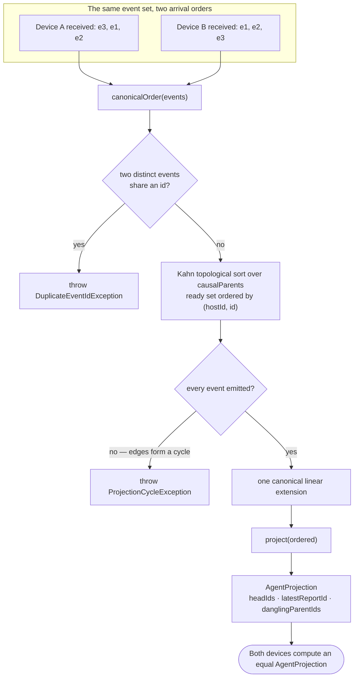

A **pure, deterministic** projection over an event-set view of the agent log:
given a *set* of agent events, produce a canonical linear order and fold it into
derived state.

The thesis it proves:

> The same event set yields equal projected state regardless of arrival order or
> branching.

**If that permutation-invariance holds, the "log is the agent / convergent DAG"
design is real** — which is why this exists as its own testable kernel rather than
as logic scattered through the wake path.

Three properties of that pipeline carry the whole design:

- **The tie-break is total.** Among events whose present parents are all emitted,
  the smallest `(hostId, id)` goes next — so concurrent branches, which the partial
  order leaves genuinely unordered, still linearise identically everywhere.
- **A dangling parent is not an error.** A `causalParents` id that is absent from
  the input — a partial sync window, or a parent compacted away — imposes no edge,
  so the event is treated as a root and the id is reported in
  `danglingParentIds`. It never throws.
- **The fold reads only structure.** `headIds`, `latestReportId` and
  `danglingParentIds` come from event ids, `kind` and the parent graph — never
  from vector clocks or wall-clock time. Nothing in the output can depend on when
  an event happened to arrive.

It is the foundation under [state-as-projection and fork
healing](memory-and-compaction.md): multi-head tolerance is only safe if
the fold cannot depend on which head arrived first.

# Above the kernel: `DerivedAgentState`

The kernel is deliberately small. `DerivedAgentState` (`derived_agent_state.dart`)
is the **storage-coupled composite** built on top of it, and the fold **is** on the
wake critical path today:

`AgentSyncService.reconciledAgentState` — called at the start of every task,
project, event, improver and day-agent wake — loads the `system` milestone markers
and the agent's outbound links, runs `reconcileAgentState` (which calls
`deriveAgentState`) over the cached row, and returns the reconciled value. So a
watermark or active slot the cache lost to last-writer-wins under a partition
**self-heals before the agent decides anything**, and the healed row is persisted
only when something actually diverged.

Two boundaries make that precise:

- **The reconcile is not a blind "log wins".** Watermarks take `max(derived,
  cache)` because they are monotonic; active slots take `derived ?? cache`. Fields
  the log does not own — `recentHeadMessageId`, the G-counters, device-local
  scheduling — stay on the cache by construction.
- **Only the wake path reads this way.** UI and service reads stay on the raw cache
  via `AgentRepository.getAgentState`, which is eventual and self-healing. And the
  reconcile loads *markers*, not the full message log, so its cost does not grow
  with an agent's history.

A malformed synced log (a duplicate id or a cycle from a peer) makes the fold
throw; the wake falls back to the cached row and logs, rather than aborting.

The composite's own header still says it "drives no production read" — that
sentence predates the cutover it predicted, and `agent_sync_service.dart` is the
authority:

- It calls `project(canonicalOrder(...))` for the structural part — heads and the
  latest report — and aggregates the rest **directly off the messages and links**:
  milestone watermarks as `max(createdAt)`, active slots from the agent's
  association links.
- Every field is a pure function of the log's *set*, so the convergence property
  the kernel proves extends to the composite: two devices holding the same
  messages and links derive an equal state regardless of arrival order. That is
  the guarantee **the mutable cache cannot make** under last-write-wins.

`compareShadowProjection` (`shadow_projection.dart`) is the other half: it checks
the projection against the live mutable state and returns a
`ShadowProjectionReport` — match or divergence — used as a test assertion and an
optional debug-mode runtime check. There is no `ShadowProjection` type; the pieces
are the function, that report and `ShadowProjectionStatus`. It never drives a read;
it makes a drifted cache **detectable** where the reconcile above makes it
**self-healing**.

The projection is plain Dart with no I/O, so it can be exercised with property
tests over shuffled event sets — the only honest way to test a claim about
permutation invariance.
