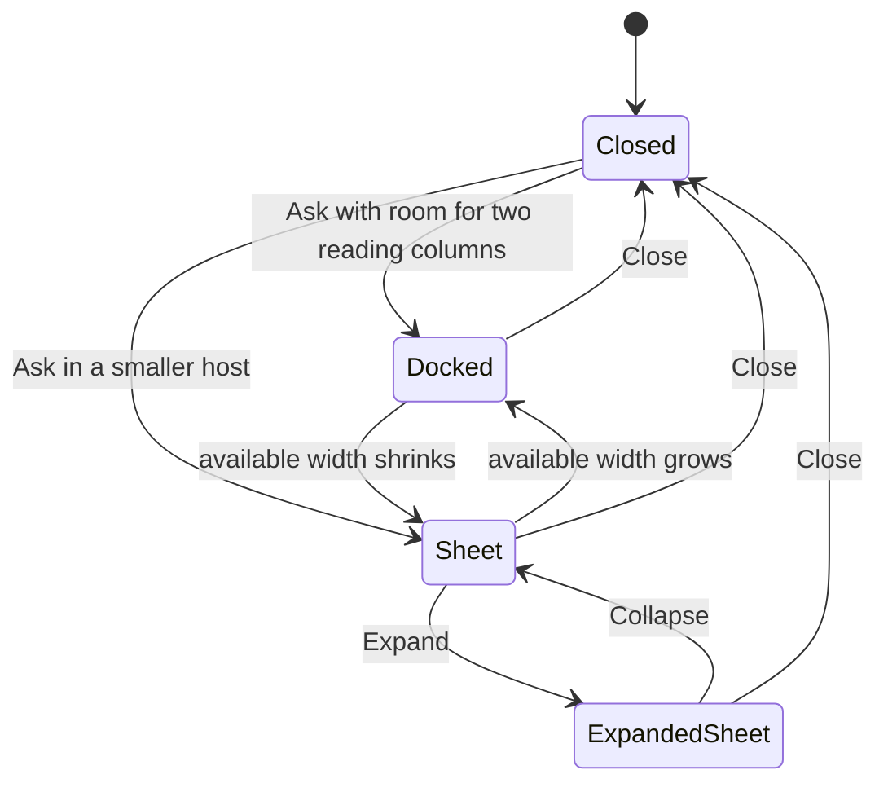
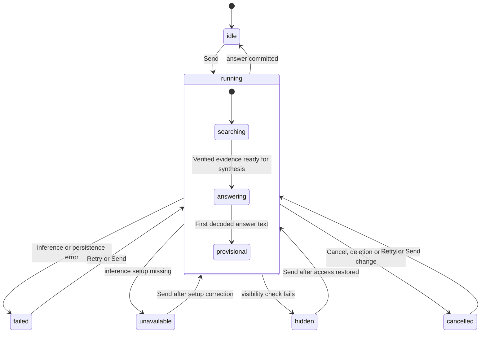
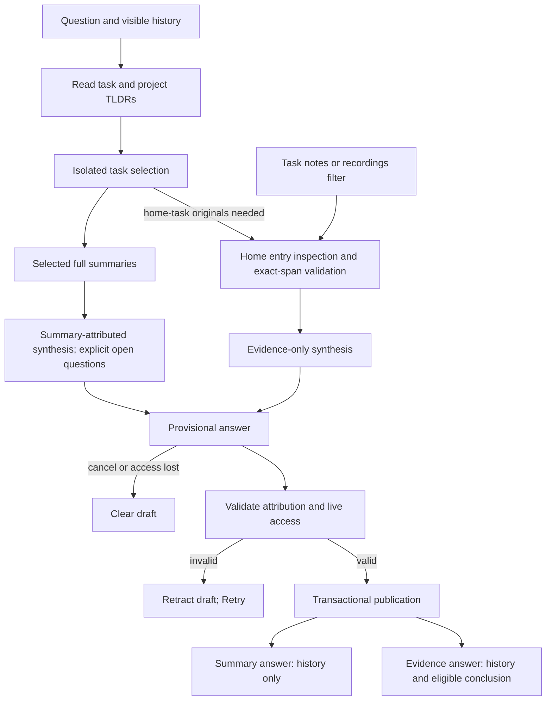
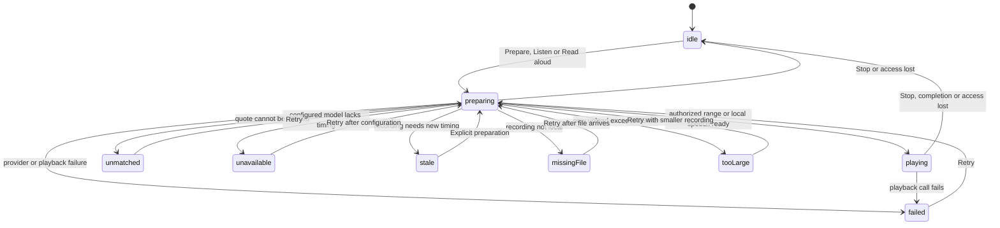

# Ownership and entry points

The **Ask** action opens a discussion without running inference. Task headers
and task/project summary cards expose the action; the task action bar remains
reserved for time tracking and capture. Project and saved-category details still
open `QueryChatPane` in place of their detail page.

Tasks use `QueryCompanion`, keeping the detail subtree mounted and usable.
The companion wraps data-dependent loading/missing-task branches as well, so
a sync deletion cannot remove the chat Close control or strand its open flag. With
enough width, chat docks on the right with a keyboard- and pointer-resizable
divider. Fit uses the existing chat/detail reading measures at the current text
scale. `TasksRootPage` temporarily hides the mounted task list when both reading
columns would otherwise be squeezed, and suppresses the metadata column.
`AppScreen` hides its mounted day-view column while the selected task's chat is
open. Neither suppression writes the saved pane preferences. Close restores the
previous arrangement; explicitly showing the task list closes chat when space
cannot accommodate both.

Smaller hosts use an attached draggable sheet, initially half height, with an
explicit Expand/Collapse control. While a keyboard is visible, the sheet uses the full
available height and hides its collapse control; dismissing the keyboard restores
the expansion controls. Dragging cannot shrink below the half-height detent. The task remains beneath the sheet. Changing window size
reparents the same keyed chat state between sheet and dock; the detail retains
its parent. Close unmounts chat so its recorder subscription cannot consume a
later unrelated recording. The host retains the chat's `PageStorageBucket` for
scroll restoration; selected chat, draft and running request remain owned by the
query controller. Close cancels recording and returns focus to the opener when
it is still mounted. Navigation away also cancels recording. The scope belongs
to the owning task page: selecting another task never reuses the old task's chat
with a new scope.

The header leads with the current scope title and provides a dedicated Close
control in companion mode. Narrow or enlarged-text headers place the chat picker
on its own row; search reach stays visible and optional filters open through a
labelled disclosure. Wide standalone headers show the agent attribution and
filters inline. The empty view centers three question cards beneath a
scope-specific welcome. Choosing a question populates an editable draft.

Each answer keeps its numbered evidence inside the reply surface. Evidence
starts with source metadata and a short summary; expanding reveals selectable
exact text, with explicit omission markers outside the quotation. Surrounding
text can be shown, while Copy quote always copies only the stored passage.
The pill composer emphasizes Send when a draft is present. A running search
keeps the next draft editable while Send remains disabled. Scope filters keep
caption typography and a compact painted pill centered in the design-system
touch-height target.
Saved-text inspection shows the representation's edit/transcript date when
available; legacy records without a date show “Version date unavailable”.
Every expanded passage identifies itself as a saved excerpt, even when the
quote fills its entire stored text window. Copy excludes that disclosure.
Changed sources open through an “Open current entry” action. Inline numbered
citations expand, focus and scroll to the matching card in that answer after a
fresh visibility check; duplicate citation numbers in other answers are unrelated.
Evidence action labels include the source name and disclosure semantics expose
expanded state. The chat switcher exposes its selected title and expanded state;
archived-chat disclosure exposes its expanded state as well.

Query dictation resolves the current category's `defaultProfileId` and that
profile's transcription slot at submission time. It does not inherit the task
agent's model override or use automatic model discovery. Missing or unusable
category transcription setup (including undownloaded Sherpa models) fails
with the existing audio-setup error; it never silently chooses an installed
Sherpa model. Scope visibility, category membership and default setup are rechecked before handing audio to the service.

`queryChatTargetProvider` reuses the task or project summary's identity. If no
identity exists, the pane explains that an agent must first be assigned. A
category lazily gets the deterministic identity `category_agent:<categoryId>`;
this is a query-only identity with no wake subscription or automatic report.
It is not added to the template-driven Instances inventory.

Task/project queries resolve the agent's existing inference setup, including
an explicit disabled setup. Category queries resolve the live category default
profile. A missing usable setup retains the draft and presents a recoverable
error. These calls do not alter automatic-update preferences.

`queryProfileProvider` keeps itself and its watched setup dependencies alive
until its lookup completes, including a null result or error. Send and audio
preparation read its future imperatively without a widget subscription; an
unretained auto-disposed provider can otherwise fail during a database read
before a question is saved. The temporary keep-alive link closes in `finally`,
so completed lookups do not retain unused profiles or their dependencies.

# Summary-first discovery

The production `queryBuilderFactoryProvider` supplies a `QuerySummaryReader` to
`QueryAnswerBuilder`. Query chat first reads maintained task TL;DRs and the parent
project TL;DR, including completed tasks. One-liners do not enter retrieval.
Reports are authorized as artifacts using the owning task/project's current
visibility, deletion state and category. Query chat does not reconstruct their
underlying entry dependencies or generate substitute summaries. A new question
reads the latest published reports; a single question uses the same report
revision across its TL;DR and full-summary layers.

| Scope | Initial task summaries | Wider summary discovery |
|-------|------------------------|-------------------------|
| Task | Own task and direct visible linked tasks | Same-category tasks |
| Project | Visible same-category project tasks | Same-category tasks |
| Category | Visible tasks in the category | Same category only |
| Uncategorized task | Own task and directly linked uncategorized tasks | None |

The home-only chip disables wider task discovery. Hidden/deleted links grant no
access. The reader batches report lookup, includes all task statuses and caps
the task catalog at 200, prioritizing the home task and its neighbourhood.
Missing reports and bounds mark discovery incomplete. The selection request has
its own complete-input UTF-8 byte bound (24,000 by default); omitted TL;DRs also
mark incomplete coverage. These are byte bounds, not token estimates.

`QuerySummaryAnswerBuilder` uses one isolated call to select at most six task IDs
from the supplied TL;DRs. The second call reads full report bodies for the
selected tasks. This avoids declaring a gap merely because a TL;DR is thin.
Oversized full reports fall back to their TL;DR with incomplete coverage. Rejected
summary text stays out of synthesis. The answer identifies its summary basis and
attributes claims by owner title. Its structured owner IDs must match the
supplied reports; numbered original-evidence citations are rejected.

Summary answers have no `QueryEvidence` cards and create no shared durable
conclusion. The answer itself is saved as chat history with owner visibility
dependencies and a `summaryBased` marker. The marker survives sync and reload;
`QueryAccessSnapshot.allowsEvent` hides saved summary answers when an owner is
deleted or changes category. Historical exact-entry answers retain their
existing tombstone behavior. Summary reads do not increment original-source
inspection counts.
Every inference authorization reload also requires live history dependencies
in the active category, so a move or deletion during selection cannot carry
old context into synthesis.
The final `unresolved` flag marks unanswered parts as incomplete coverage.
Questions left open by another task's full summary need that task's own agent;
agent-to-agent questions are not yet implemented, and the pipeline does not
substitute a crawl of that other task's original entries.

# Home-task original evidence

A question specifically requiring the home task's original wording/details can
request the original-entry route. An explicit notes/recordings filter in a task
chat also selects that route. Project/category source filters remain in the
summary path and cannot authorize other tasks' raw entries.

`QueryJournalCrawler` then inspects only the home task and directly linked
visible entries in its category, excluding linked task/project bodies. The
`ownTaskOnly` mode rejects non-task scopes. Neither insufficiency nor a summary
lookup failure silently expands this route across other tasks.

Fitting home inputs use one isolated whole-source inspection and evidence-only
synthesis. Larger inputs retain bounded shortlisting/windows. A preceding
summary-selection call, when needed to choose this route, is an additional
completion. The batch input is bounded to 24,000 UTF-8 bytes and its source text
to 12,000 Dart string characters. Source IDs, fingerprint, representation version
and representation date guard reuse within an attempt.

The original pipeline remains available to the matched evaluation control by
constructing `QueryAnswerBuilder` without a summary reader. That control permits
same-category keyword/recent-entry expansion, unlike production summary-first
routing. Its historical batching measurements are in the
[latency evaluation](../../../docs/perf/2026-09-12-penguin-query-latency-eval.md);
they are not measurements of summary-first retrieval. The task wake's compacted
prefix is not imported into query chat.

Visibility and category membership are checked around each batch and before
individual source inspection. A malformed batch, unknown ID or non-contiguous
quote fails the request into the normal Retry path. Missing transcripts and
limits contribute to incomplete coverage; a failed database or inference
operation is retryable, not a claim that no discussion occurred.

Text comes from one stored representation: `entryText.plainText` if present,
otherwise the newest audio transcript or a task/project/checklist title. Empty
descriptions on title-bearing entries fall back to the title; an intentionally
empty audio edit does not revive an older transcript. Notes-only queries do not
count excluded recordings as missing transcripts. Binary audio and
images are not inspected by this crawler.

# Request lifecycle and context

`QueryChatController` maintains separate drafts, narrowing choices, cancellation
tokens and request status for each chat. Requests in different chats can run
concurrently. Drafts and running operations survive navigation in the current
app session; they are not synced or persisted across application restart.
History is persisted. A restarted unanswered question can be retried.

The activity panel and conversation switcher describe the current phase:
searching during planning, shortlisting and memory selection, checking other
category entries only while inspecting an outside-home source, then preparing
an answer when final synthesis begins. Progress changes before each source
inspection and resets after inspection. Saved `coverage.expanded` records
whether any outside-home source was checked; it is separate from current
activity. The transient `answering` flag resets on each Send or Retry.

Synthesis alone can display a provisional answer. `QueryTextInference` decodes
only the leading JSON `answer` string incrementally, buffering incomplete
escapes and surrogate pairs; other field orders stay buffered. Inspection,
reasoning and the durable conclusion are never rendered. The draft uses plain
text with a visible unverified label, so citations and URLs are inert. The final
parsed text must extend the displayed prefix without changing it; existing
citation and live-access checks still run before transactional publication.

`QueryChatLocal.provisional` holds the answer's dependencies and text only in
memory. Active history notifications recheck those dependencies and category
membership, including sources not yet in persisted history. Privacy/lockdown
changes, unavailable access, forgotten recalled memory and chat deletion cancel
the request and clear the draft. Normal publication keeps it only until the
saved answer is visible in the history projection. A failed draft is removed
and a content-free verification message appears beside the same question's
Retry action. Nothing starts audio playback or TTS from provisional text.

A single activity bubble groups phase, visible checked-source count and Cancel,
with a live-region announcement. The query composer omits the duplicate helper
status. The switcher exposes running/unread indicators, last-message previews,
one labelled overflow menu per chat and the archived count. The selected chat
uses the design-system activated row fill as well as selected semantics.
Archive confirms that conclusions
remain available; Delete names the selected keep/forget consequence.

Recovery belongs to each unanswered question, including earlier failed turns.
Retry assembles conversation history only through the selected question and
excludes conclusions created later in the same chat.
`requestQuestionId` identifies the current/last attempt's saved question and
resets before a new send, so failures before question persistence retain footer
feedback and the draft rather than disappearing behind an older answer.
Unavailable inference setup links directly to AI settings beside its saved
question, alongside Retry so the saved request can resume after setup changes;
failures before persistence keep that recovery in the composer footer.
A short caption flags incomplete coverage above evidence cards; the expanded
coverage panel explains what missing evidence does and does not establish.
Its counts and recovery rows share a leading alignment.

Coverage stores nullable home/category inspection counts (null for older
answers), plus references to unreadable recordings. These references also enter
answer dependencies and are rechecked for live visibility/category membership
before synthesis and publication. The UI describes their unreadable state as
historical, marks later category moves, and reauthorizes immediately before
opening a recording. Incomplete coverage is visible beside the answer; the
expanded disclosure lists scope counts and the excluded-category boundary.

Recalled conclusions expand into their visible saved text and links to visible
origin chats. Each accessible conclusion shows its saved timestamp. An absent
origin link makes no claim about deletion or privacy. The disclosure describes
past use by this answer; when no recalled conclusion remains accessible, it is
omitted entirely, without exposing hidden content or an empty disclosure.
Each expansion and selectable text has its own PageStorage key so saved booleans
and scroll offsets cannot collide. Evidence cards use stable storage identities
separate from their navigation keys to retain disclosure across chat switches.

Unexpected failures are logged under `chat/query.send` with their stage,
exception type and a numeric Melious HTTP status when available. Exception
messages and response bodies are not logged: they may contain private source
text or credentials. The diagnostic stack identifies the failing code path.
Cancellation, visibility changes and an unavailable inference setup do not
emit error logs. Failure copy does
not claim the question was saved, because setup or persistence can fail before
that write.

Long-source inspection uses overlapping 12,000-character windows with a 10,000
character stride, at most 90 inspection completions and 12 accepted passages.
Each source/window contributes at most three passages; discarding additional
passages marks coverage incomplete.
A batch consumes one inspection completion; planning, shortlist, separate memory
selection and synthesis are additional completions. Each completion has isolated
context, bounded response size and a two-minute collection deadline. Rejected
candidate text never reaches synthesis or durable history. Source instructions
are treated as untrusted data. Window extraction can discard a malformed quote
and mark coverage incomplete; batch response validation rejects malformed or
foreign passages as a whole. Evidence summaries are interpretations, not quotes.

`QueryTextInference` uses the profile's thinking route through the existing
cloud inference repository. Synthesis requests `preferStreaming`; inspection
retains the accounting-oriented buffered path. The transport fallback and the
absence of streamed Melious cost/energy fields are described in
[provider routing](../ai/provider-routing.md#melious-reports-cost-and-impact-only-off-the-streaming-path).
The optional registered `AiInteractionCapture`
records agent/chat attribution, route IDs, usage and request/response digests;
it does not retain an additional raw prompt log. The live query evaluator
records first synthesis content-token time, first decoded visible-answer time
and total built-answer time separately. Streamed-answer equality is an explicit
quality gate; a missing provider cost is unavailable, never zero.

# Evidence, memory and deletion

`QueryEvidence` saves one identified source representation, its fingerprint,
version, source date, affiliations and character offsets within the saved
surrounding-text window (at most 12,000 characters). A long source is not copied
in full for every passage; overlapping windows deduplicate by original source
position before converting to saved-window offsets. Labels are capped at 120
characters. The offsets are Dart string offsets, **not audio timestamps**. The UI shows a short summary,
expandable exact text and optional surrounding text. Source edits, deletion or
category moves leave the saved quote intact with a note; machine transcripts
are identified as stored wording that has not been checked against the audio.
Opening or copying rechecks visibility immediately before acting.

A useful conclusion accompanied by verified evidence can be stored automatically
under the same agent. Other chats select only relevant visible conclusions from
the newest 40 eligible candidates. Recalled conclusions are distinguished from
newly verified evidence. This shared query memory is separate from the automatic
wake's working log; unsuccessful source checks do not enter either log.

Chats can be renamed, archived/restored, switched and deleted. Archived chats
are readable but cannot accept new questions. Delete always asks whether to
keep or forget the chat's shared conclusions; Cancel changes nothing. Both
choices leave source entries untouched. Forget also invalidates retained
conclusions derived through chains of recall from that chat. Other chats'
already-written answers remain historical conversation content.

`AgentQueryChatEventEntity` uses the generic synced entity table, keyed by agent
and chat, without a schema migration. Creation, rename, archive, read, question,
answer, failure, cancellation, memory and deletion are append-only event data.
The pure projection orders events by timestamp and ID; any deletion marker wins
over later replies or edits. Deletion tombstones the chat's other events, with
optional retained memories. Answer/memory IDs derive from the question ID, and
publication checks the chat and memory projection inside the sync transaction,
preventing duplicate or late replies from resurrecting a deleted chat.

# Privacy and refresh invariants

- Current source metadata outranks the evidence's historical metadata. Public
  deletion tombstones permit saved quotes; private tombstones do not. An unknown
  or purged source fails closed.
- Summary answers follow their task/project owners' visibility; entry changes
  are handled by the existing summary lifecycle, not a query-side provenance graph.
- Hidden private sources also hide derived answers, recalled memory, titles and
  previews. The pane conservatively hides an entire chat if any of its events
  is no longer visible; it exposes no hidden-content counter or placeholder.
- Authoring privacy travels with a draft or open rename dialog across awaits;
  hiding private entries before the write completes rejects that write instead
  of relabeling its contents as public. The rename modal removes its text field
  before dismissal when source access or authoring visibility is lost.
- Content authored while private entries are shown is conservatively marked
  private even if its known source dependencies are public.
- Entry privacy, category privacy and lockdown apply before inference, before
  publication and at render time. The synchronous visibility setting overrides
  a snapshot fetched before the setting changed. Hiding private entries or
  changing lockdown cancels active requests and dictation.
- `queryChatDataProvider` observes both agent and journal table updates, including
  category and visibility changes. Revision numbers discard older reads that
  finish late. Established history survives background refresh/errors. Only an
  initial load uses the full loading/error shell.
- Controllers retain database subscriptions after leaving the pane only while
  requests are active. Keeping an unsent draft does not keep crawling history
  on every journal change.
- Category details keep their edit controller subscribed while the query pane
  replaces the form. Returning from chat therefore preserves unsaved category
  fields; the controller still disposes when the details page is left.

# Voice input

The shared [agent recorder](chat-input-and-reasoning.md) provides record, stop,
transcribe and editable draft. Submitting the question remains explicit;
transcription may already have sent the audio to the configured transcription
provider. Both progress and draft feedback disclose this distinction.
Switching chats or
leaving the pane cancels pending dictation so a late transcript cannot land in
the next conversation.

# Audio evidence and spoken answers

`QueryEvidenceAudioControls` adds an explicit preparation or Listen action to
recording evidence. Opening a chat or expanding a quote does not transcribe
anything. Listen uses `media_kit` start/end boundaries on the original local
file; it does not create another recording or export a clip. A missing local
recording produces a recoverable state.

Preparation uses the agent/category profile's **transcription slot**, resolved
through the same `queryProfileProvider` as the question-answering setup. The
timing adapters support Melious Whisper models and the dedicated Mistral
`voxtral-mini-latest` / `voxtral-mini-transcribe-*` batch models. Melious Voxtral,
realtime and instruction-following audio models are excluded. A request never
substitutes a provider or model. The preparation action discloses the upload;
an unsupported profile explains what to configure. Timing preparation requires
a valid HTTPS provider URL and disables HTTP redirects, so the new upload path
cannot send credentials or private audio over an insecure connection.

Both the [Mistral segment timestamp contract](https://docs.mistral.ai/studio/audio/speech_to_text/offline_transcription)
and [Melious Whisper verbose JSON](https://melious.ai/docs/reference/audio) are
decoded by `parseTimedTranscriptSegments` in
`lib/features/ai/repository/transcription_repository.dart` into integer
milliseconds. Speaker labels are not needed to locate sound bites. Missing,
malformed, unordered or excessive segment lists fail as a whole. Ordinary
text transcription still accepts a response without timings. Melious reuses
the [bounded upload pipeline](../ai/provider-routing.md#melious); each
twenty-minute part is offset back into the original recording, and timing is
exposed only after all uploads succeed. The query preparation action currently
limits new uploads to 25 MB before reading bytes into memory. This bounds the
base64/multipart working set and avoids the upload pipeline’s whole-recording
PCM decoding on mobile. Larger recordings show an explicit size message; their
existing timing can still be played.

`QueryAudioTimingService` owns one cancellable HTTP client per request and uses
`AiInteractionCapture` for attribution when registered, including Melious cost
and environmental impact. Returned text stays out
of chat history, retrieval context and shared memory. The persisted
`AudioData.transcriptTimings` map retains a sidecar per source fingerprint. Each contains the submitted recording's SHA-256,
source text fingerprint/version, provider/model and timed text segments. Older
entries deserialize without it. Enrichment preserves the note and its existing
transcripts. `QueryAudioTimingWriter` compares the complete expected entry
inside a journal transaction before writing through normal persistence/sync;
a concurrent edit or deletion rejects the result. Preparing a newer source representation
preserves timing for older saved quotes.

`queryAudioExcerpt` matches the saved quote against those segments using a
linear word matcher. It tolerates case, punctuation, whitespace and generated
speaker labels, but does not infer substituted words. A repeated or unmatched
passage has no playable range. The sidecar must carry the saved source text
fingerprint, and the local recording's checksum is checked before playback.
A short quote gets about a minute of listening context, clamped to the recording;
a long quote retains its full segment span with a little context. When imported
duration metadata is zero, the last timed speech bounds the excerpt instead. Provider
segments determine every boundary: character offsets never become seconds.

Audio recovery stays beside the affected quote or answer. Preparation offers
Cancel; playback offers Stop audio. A missing recording offers Open recording
and Retry audio; an unmatched quote or oversized upload offers Open recording
without implying another identical request will help. Unsupported timing setup
offers a short explanation beside AI Settings and Retry audio, with detailed
provider requirements behind Setup details. Playback identifies the fixed
excerpt interval; speech identifies that the answer is being read aloud. These
are activity labels, not elapsed-time progress. Transient playback and speech
failures offer Retry audio. Opening a recording uses the pane's fresh source
access check. The upload notice remains visible before timing preparation,
including retries that can upload audio; opening an entry does not upload it.

A retained historical quote can use already-matching timing after a text edit.
Generating new timing requires the source text and category still to match the
saved evidence. Public deletion still retains the written quote, but does not
grant access to deleted audio. A changed recording requires another explicit
preparation; unambiguous text matching is still required afterward.

`QueryAudioController` belongs to the selected visible chat, not to a scrolled
message. It re-reads the chat and all of its privacy dependencies before upload,
persistence and playback. Evidence must belong to a saved answer. Leaving the
chat, switching chats, hiding private entries or changing lockdown cancels work
and releases playback; a delayed provider/native completion cannot start it
again. Disposal releases ownership before awaiting native cleanup and reports
failures in the speech logging domain without exposing recording paths or
content. Existing journal audio and query playback stop each other from
speaking simultaneously.

Read answer aloud uses the existing on-device [TTS engine](../tts.md), including
its settings and `enable_ai_summary_tts` gate. It reads a saved answer, is always
user-triggered, and rechecks chat visibility after synthesis before playing.
The shared TTS controller invalidates cancelled preparation, serializes native
synthesis and removes its temporary WAV on completion or cancellation.

An agent face/avatar remains outside this implementation. Exporting audio clips,
realtime conversational turn-taking and additional timestamp-provider adapters
are separate follow-ups.
