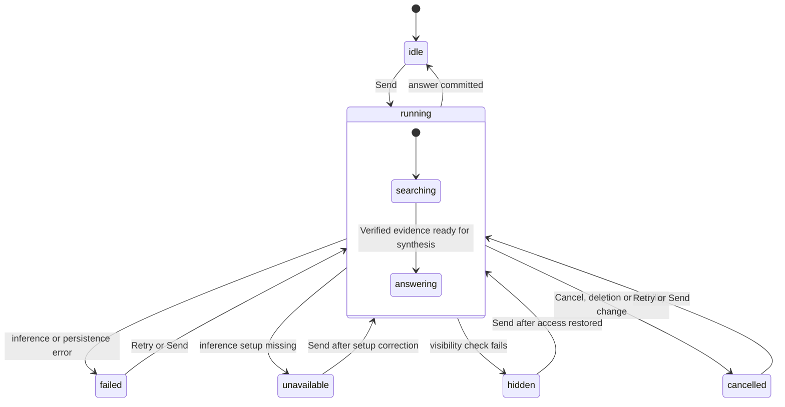
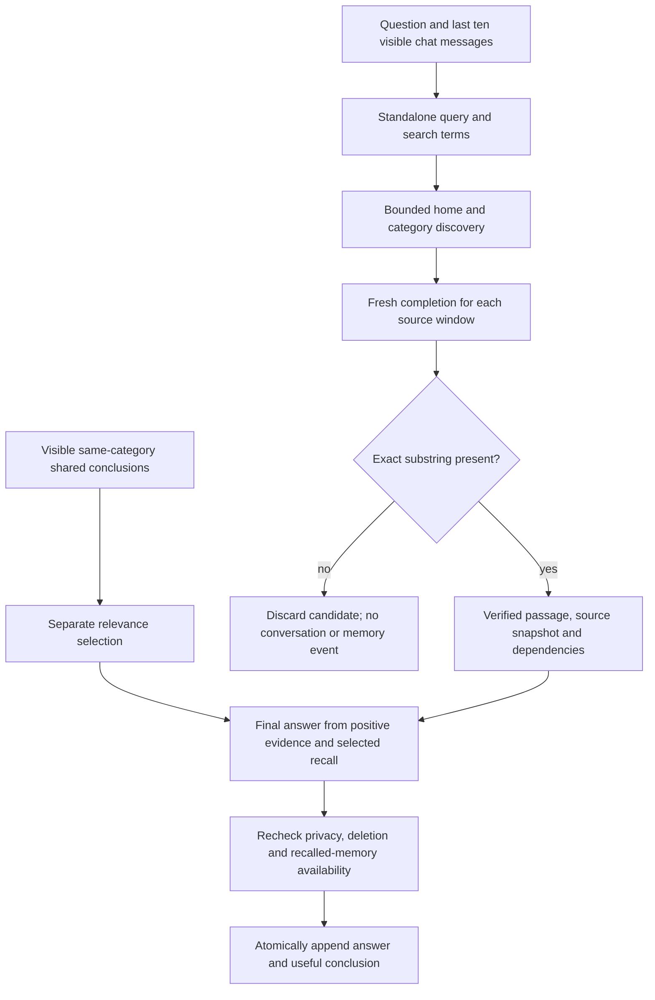
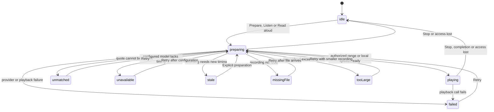

# Ownership and entry points

The **Ask** action opens `QueryChatPane` in place of the task, project or saved
category detail. Desktop retains the surrounding list; mobile uses the detail
route's full page. Task headers and task/project summary cards expose the same action. The task
action bar is reserved for time tracking and capture. Opening never runs inference.
The compact header identifies the agent and links back to its scope; outlined
filters sit below it. The empty view centers three question cards beneath a
scope-specific welcome. Choosing a question populates an editable draft.

Each answer keeps its numbered evidence inside the reply surface. Evidence
starts with source metadata and a short summary; expanding reveals selectable
exact text, with explicit omission markers outside the quotation. Surrounding
text can be shown, while Copy quote always copies only the stored passage.
The pill composer emphasizes Send when a draft is present. A running search
keeps the next draft editable while Send remains disabled. Scope filters keep
caption typography and use the design-system touch-height pill variant.
Saved-text inspection shows the representation's edit/transcript date when
available; legacy records fall back to their stored version date or content
fingerprint. Surrounding text explicitly identifies itself as a bounded saved
excerpt, and changed sources open through an “Open current entry” action.

Query dictation resolves the current category's `defaultProfileId` and that
profile's transcription slot at submission time. It does not inherit the task
agent's model override or use automatic model discovery. Missing or unusable
category transcription setup (including undownloaded Sherpa models) fails
with the existing audio-setup error; it never silently chooses an installed
Sherpa model. Scope visibility, category membership and default setup are rechecked before handing audio to the service.

`queryChatTargetProvider` reuses the task or project summary's identity. If no
identity exists, the pane explains that an agent must first be assigned. A
category lazily gets the deterministic identity `category_agent:<categoryId>`;
this is a query-only identity with no wake subscription or automatic report.
It is not added to the template-driven Instances inventory.

Task/project queries resolve the agent's existing inference setup, including
an explicit disabled setup. Category queries resolve the live category default
profile. A missing usable setup retains the draft and presents a recoverable
error. These calls do not alter automatic-update preferences.

`queryProfileProvider` keeps itself and its watched setup dependencies alive
until its lookup completes, including a null result or error. Send and audio
preparation read its future imperatively without a widget subscription; an
unretained auto-disposed provider can otherwise fail during a database read
before a question is saved. The temporary keep-alive link closes in `finally`,
so completed lookups do not retain unused profiles or their dependencies.

# Discovery boundaries

`QueryJournalCrawler` reads journal data without writing tasks, notes or links.

| Home | Initial corpus | Permitted expansion |
|------|----------------|---------------------|
| Task | Task and its direct visible links in either direction | Entries in the task's current category |
| Project | Project, its visible same-category tasks, and direct links from that initial set | Entries in the project's category |
| Category | Category-filtered keyword candidates and recent entries | Same category only |
| Uncategorized task | Task and directly linked uncategorized entries | None; no keyword or general uncategorized crawl |

Hidden/deleted links do not grant access. Every discovered entry must pass
current entry privacy, category privacy and lockdown before its text is used.
Category expansion applies category/privacy filtering before the SQL limit,
then rechecks candidates against live metadata. The optional home-only and
notes/recordings chips narrow discovery. There is no cross-category control.
Task/project affiliations come from visible links and the task-to-project map;
project names also become privacy dependencies of the answer.

Discovery still gathers home and permitted category candidates before
inspecting source text. The reach label describes that combined scope without
promising sufficiency-driven home-first expansion. Home-only narrowing has its
own reach label. Home-first batching remains separate work.

The current search is bounded keyword retrieval plus recent-category fallback,
not an exhaustive semantic index. Up to eight sanitized OR terms feed FTS; ID
lookups are chunked. Discovery caps the readable corpus at 60 documents. Corpora of more than four
sources share one shortlisting request containing bounded extractive previews
(up to 800 source characters each, plus labels and dates). Short entries are
included whole; long entries contribute their opening and a search-term window
or ending. Entries do not share a standard stored summary field, so this step
does not claim these previews are generated summaries. The model ranks up to
eight source IDs for exact-text inspection. IDs outside the supplied corpus or
malformed output fail the request; previews never become evidence. Skipping any
candidate marks coverage incomplete. Small corpora avoid the extra call.
Visibility and category membership are rechecked for the entire overview before
it is sent, then again before every selected source is inspected. Missing
transcripts and limits contribute to incomplete coverage; a failed database or
inference operation is retryable, not a claim that no discussion occurred.

Text comes from one stored representation: `entryText.plainText` if present,
otherwise the newest audio transcript or a task/project/checklist title. Empty
descriptions on title-bearing entries fall back to the title; an intentionally
empty audio edit does not revive an older transcript. Notes-only queries do not
count excluded recordings as missing transcripts. Binary audio and
images are not inspected by this crawler.

# Request lifecycle and context

`QueryChatController` maintains separate drafts, narrowing choices, cancellation
tokens and request status for each chat. Requests in different chats can run
concurrently. Drafts and running operations survive navigation in the current
app session; they are not synced or persisted across application restart.
History is persisted. A restarted unanswered question can be retried.

The activity panel and conversation switcher describe the current phase:
searching during planning, shortlisting and memory selection, checking other
category entries only while inspecting an outside-home source, then preparing
an answer when final synthesis begins. Progress changes before each source
inspection and resets after inspection. Saved `coverage.expanded` records
whether any outside-home source was checked; it is separate from current
activity. The transient `answering` flag resets on each Send or Retry.

A single activity bubble groups phase, visible checked-source count and Cancel,
with a live-region announcement. The query composer omits the duplicate helper
status. The switcher exposes running/unread indicators, last-message previews,
archive/delete actions and the archived count. Archive confirms that conclusions
remain available; Delete names the selected keep/forget consequence.

Recovery belongs to each unanswered question, including earlier failed turns.
`requestQuestionId` identifies the current/last attempt's saved question and
resets before a new send, so failures before question persistence retain footer
feedback and the draft rather than disappearing behind an older answer.
Unavailable inference setup links directly to AI settings.

Coverage stores nullable home/category inspection counts (null for older
answers), plus references to unreadable recordings. These references also enter
answer dependencies and are rechecked for live visibility/category membership
before synthesis and publication. The UI describes their unreadable state as
historical, marks later category moves, and reauthorizes immediately before
opening a recording. Incomplete coverage is visible beside the answer; the
expanded disclosure lists scope counts and the excluded-category boundary.

Recalled conclusions expand into their visible saved text and links to visible
origin chats. Retained conclusions from deleted chats have no origin link. If
no recalled conclusion is still available, the historical recall line remains
plain text without an empty disclosure. Each expansion and selectable text has
its own PageStorage key so saved booleans and scroll offsets cannot collide.

Unexpected failures are logged under `chat/query.send` with their stage,
exception type and a numeric Melious HTTP status when available. Exception
messages and response bodies are not logged: they may contain private source
text or credentials. The diagnostic stack identifies the failing code path.
Cancellation, visibility changes and an unavailable inference setup do not
emit error logs. Failure copy does
not claim the question was saved, because setup or persistence can fail before
that write.

Source inspection uses overlapping 12,000-character windows with a 10,000
character stride, at most 90 source calls and 12 accepted passages. Each call
has a fresh context, a cancellable stream and bounded response size. Negative
candidate text never reaches the final answer prompt or durable history.
Source instructions are explicitly treated as untrusted data. Model quotes
must be exact substrings; fabricated quotations are discarded and coverage is
marked incomplete. Summaries remain model interpretations, not verified quotes.

`QueryTextInference` uses the profile's thinking route through the existing
cloud inference repository. The optional registered `AiInteractionCapture`
records agent/chat attribution, route IDs, usage and request/response digests;
it does not retain an additional raw prompt log.

# Evidence, memory and deletion

`QueryEvidence` saves one identified source representation, its fingerprint,
version, source date, affiliations and character offsets within the saved
surrounding-text window (at most 12,000 characters). A long source is not copied
in full for every passage; overlapping windows deduplicate by original source
position before converting to saved-window offsets. Labels are capped at 120
characters. The offsets are Dart string offsets, **not audio timestamps**. The UI shows a short summary,
expandable exact text and optional surrounding text. Source edits, deletion or
category moves leave the saved quote intact with a note; machine transcripts
are identified as stored wording that has not been checked against the audio.
Opening or copying rechecks visibility immediately before acting.

A useful conclusion accompanied by verified evidence can be stored automatically
under the same agent. Other chats select only relevant visible conclusions from
the newest 40 eligible candidates. Recalled conclusions are distinguished from
newly verified evidence. This shared query memory is separate from the automatic
wake's working log; unsuccessful source checks do not enter either log.

Chats can be renamed, archived/restored, switched and deleted. Archived chats
are readable but cannot accept new questions. Delete always asks whether to
keep or forget the chat's shared conclusions; Cancel changes nothing. Both
choices leave source entries untouched. Forget also invalidates retained
conclusions derived through chains of recall from that chat. Other chats'
already-written answers remain historical conversation content.

`AgentQueryChatEventEntity` uses the generic synced entity table, keyed by agent
and chat, without a schema migration. Creation, rename, archive, read, question,
answer, failure, cancellation, memory and deletion are append-only event data.
The pure projection orders events by timestamp and ID; any deletion marker wins
over later replies or edits. Deletion tombstones the chat's other events, with
optional retained memories. Answer/memory IDs derive from the question ID, and
publication checks the chat and memory projection inside the sync transaction,
preventing duplicate or late replies from resurrecting a deleted chat.

# Privacy and refresh invariants

- Current source metadata outranks the evidence's historical metadata. Public
  deletion tombstones permit saved quotes; private tombstones do not. An unknown
  or purged source fails closed.
- Hidden private sources also hide derived answers, recalled memory, titles and
  previews. The pane conservatively hides an entire chat if any of its events
  is no longer visible; it exposes no hidden-content counter or placeholder.
- Authoring privacy travels with a draft or open rename dialog across awaits;
  hiding private entries before the write completes rejects that write instead
  of relabeling its contents as public. The rename modal removes its text field
  before dismissal when source access or authoring visibility is lost.
- Content authored while private entries are shown is conservatively marked
  private even if its known source dependencies are public.
- Entry privacy, category privacy and lockdown apply before inference, before
  publication and at render time. The synchronous visibility setting overrides
  a snapshot fetched before the setting changed. Hiding private entries or
  changing lockdown cancels active requests and dictation.
- `queryChatDataProvider` observes both agent and journal table updates, including
  category and visibility changes. Revision numbers discard older reads that
  finish late. Established history survives background refresh/errors. Only an
  initial load uses the full loading/error shell.
- Controllers retain database subscriptions after leaving the pane only while
  requests are active. Keeping an unsent draft does not keep crawling history
  on every journal change.
- Category details keep their edit controller subscribed while the query pane
  replaces the form. Returning from chat therefore preserves unsaved category
  fields; the controller still disposes when the details page is left.

# Voice input

The shared [agent recorder](chat-input-and-reasoning.md) provides record, stop,
transcribe and editable draft. Submitting the question remains explicit;
transcription may already have sent the audio to the configured transcription
provider. Both progress and draft feedback disclose this distinction.
Switching chats or
leaving the pane cancels pending dictation so a late transcript cannot land in
the next conversation.

# Audio evidence and spoken answers

`QueryEvidenceAudioControls` adds an explicit preparation or Listen action to
recording evidence. Opening a chat or expanding a quote does not transcribe
anything. Listen uses `media_kit` start/end boundaries on the original local
file; it does not create another recording or export a clip. A missing local
recording produces a recoverable state.

Preparation uses the agent/category profile's **transcription slot**, resolved
through the same `queryProfileProvider` as the question-answering setup. The
timing adapters support Melious Whisper models and the dedicated Mistral
`voxtral-mini-latest` / `voxtral-mini-transcribe-*` batch models. Melious Voxtral,
realtime and instruction-following audio models are excluded. A request never
substitutes a provider or model. The preparation action discloses the upload;
an unsupported profile explains what to configure. Timing preparation requires
a valid HTTPS provider URL and disables HTTP redirects, so the new upload path
cannot send credentials or private audio over an insecure connection.

Both the [Mistral segment timestamp contract](https://docs.mistral.ai/studio/audio/speech_to_text/offline_transcription)
and [Melious Whisper verbose JSON](https://melious.ai/docs/reference/audio) are
decoded by `parseTimedTranscriptSegments` in
`lib/features/ai/repository/transcription_repository.dart` into integer
milliseconds. Speaker labels are not needed to locate sound bites. Missing,
malformed, unordered or excessive segment lists fail as a whole. Ordinary
text transcription still accepts a response without timings. Melious reuses
the [bounded upload pipeline](../ai/provider-routing.md#melious); each
twenty-minute part is offset back into the original recording, and timing is
exposed only after all uploads succeed. The query preparation action currently
limits new uploads to 25 MB before reading bytes into memory. This bounds the
base64/multipart working set and avoids the upload pipeline’s whole-recording
PCM decoding on mobile. Larger recordings show an explicit size message; their
existing timing can still be played.

`QueryAudioTimingService` owns one cancellable HTTP client per request and uses
`AiInteractionCapture` for attribution when registered, including Melious cost
and environmental impact. Returned text stays out
of chat history, retrieval context and shared memory. The persisted
`AudioData.transcriptTimings` map retains a sidecar per source fingerprint. Each contains the submitted recording's SHA-256,
source text fingerprint/version, provider/model and timed text segments. Older
entries deserialize without it. Enrichment preserves the note and its existing
transcripts. `QueryAudioTimingWriter` compares the complete expected entry
inside a journal transaction before writing through normal persistence/sync;
a concurrent edit or deletion rejects the result. Preparing a newer source representation
preserves timing for older saved quotes.

`queryAudioExcerpt` matches the saved quote against those segments using a
linear word matcher. It tolerates case, punctuation, whitespace and generated
speaker labels, but does not infer substituted words. A repeated or unmatched
passage has no playable range. The sidecar must carry the saved source text
fingerprint, and the local recording's checksum is checked before playback.
A short quote gets about a minute of listening context, clamped to the recording;
a long quote retains its full segment span with a little context. When imported
duration metadata is zero, the last timed speech bounds the excerpt instead. Provider
segments determine every boundary: character offsets never become seconds.

A retained historical quote can use already-matching timing after a text edit.
Generating new timing requires the source text and category still to match the
saved evidence. Public deletion still retains the written quote, but does not
grant access to deleted audio. A changed recording requires another explicit
preparation; unambiguous text matching is still required afterward.

`QueryAudioController` belongs to the selected visible chat, not to a scrolled
message. It re-reads the chat and all of its privacy dependencies before upload,
persistence and playback. Evidence must belong to a saved answer. Leaving the
chat, switching chats, hiding private entries or changing lockdown cancels work
and releases playback; a delayed provider/native completion cannot start it
again. Disposal releases ownership before awaiting native cleanup and reports
failures in the speech logging domain without exposing recording paths or
content. Existing journal audio and query playback stop each other from
speaking simultaneously.

Read answer aloud uses the existing on-device [TTS engine](../tts.md), including
its settings and `enable_ai_summary_tts` gate. It reads a saved answer, is always
user-triggered, and rechecks chat visibility after synthesis before playing.
The shared TTS controller invalidates cancelled preparation, serializes native
synthesis and removes its temporary WAV on completion or cancellation.

An agent face/avatar remains outside this implementation. Exporting audio clips,
realtime conversational turn-taking and additional timestamp-provider adapters
are separate follow-ups.
