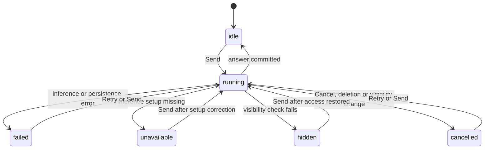
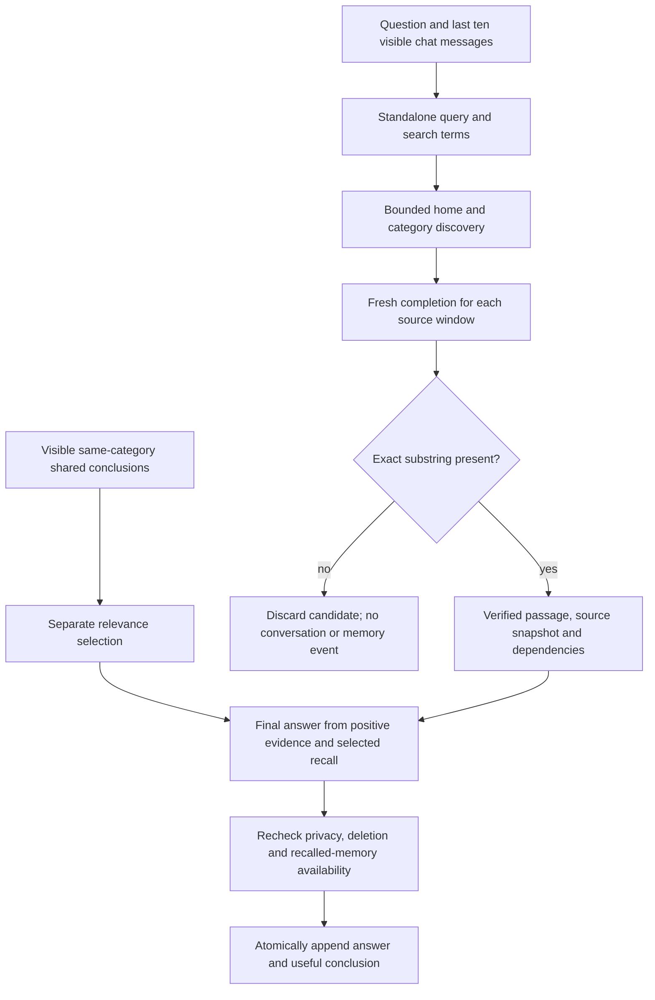

# Ownership and entry points

The **Ask** action opens `QueryChatPane` in place of the task, project or saved
category detail. Desktop retains the surrounding list; mobile uses the detail
route's full page. Task headers, the task action bar and task/project summary
cards expose the same action. Opening never runs inference.

`queryChatTargetProvider` reuses the task or project summary's identity. If no
identity exists, the pane explains that an agent must first be assigned. A
category lazily gets the deterministic identity `category_agent:<categoryId>`;
this is a query-only identity with no wake subscription or automatic report.
It is not added to the template-driven Instances inventory.

Task/project queries resolve the agent's existing inference setup, including
an explicit disabled setup. Category queries resolve the live category default
profile. A missing usable setup retains the draft and presents a recoverable
error. These calls do not alter automatic-update preferences.

# Discovery boundaries

`QueryJournalCrawler` reads journal data without writing tasks, notes or links.

| Home | Initial corpus | Permitted expansion |
|------|----------------|---------------------|
| Task | Task and its direct visible links in either direction | Entries in the task's current category |
| Project | Project, its visible same-category tasks, and direct links from that initial set | Entries in the project's category |
| Category | Category-filtered keyword candidates and recent entries | Same category only |
| Uncategorized task | Task and directly linked uncategorized entries | None; no keyword or general uncategorized crawl |

Hidden/deleted links do not grant access. Every discovered entry must pass
current entry privacy, category privacy and lockdown before its text is used.
Category expansion applies category/privacy filtering before the SQL limit,
then rechecks candidates against live metadata. The optional home-only and
notes/recordings chips narrow discovery. There is no cross-category control.
Task/project affiliations come from visible links and the task-to-project map;
project names also become privacy dependencies of the answer.

The current search is bounded keyword retrieval plus recent-category fallback,
not an exhaustive semantic index. Up to eight sanitized OR terms feed FTS; ID
lookups are chunked. Discovery caps the readable corpus at 60 documents. Missing
transcripts and limits contribute to incomplete coverage; a failed database or
inference operation is retryable, not a claim that no discussion occurred.

Text comes from one stored representation: `entryText.plainText` if present,
otherwise the newest audio transcript or a task/project/checklist title. Empty
descriptions on title-bearing entries fall back to the title; an intentionally
empty audio edit does not revive an older transcript. Notes-only queries do not
count excluded recordings as missing transcripts. Binary audio and
images are not inspected by this crawler.

# Request lifecycle and context

`QueryChatController` maintains separate drafts, narrowing choices, cancellation
tokens and request status for each chat. Requests in different chats can run
concurrently. Drafts and running operations survive navigation in the current
app session; they are not synced or persisted across application restart.
History is persisted. A restarted unanswered question can be retried.

Source inspection uses overlapping 12,000-character windows with a 10,000
character stride, at most 90 source calls and 12 accepted passages. Each call
has a fresh context, a cancellable stream and bounded response size. Negative
candidate text never reaches the final answer prompt or durable history.
Source instructions are explicitly treated as untrusted data. Model quotes
must be exact substrings; fabricated quotations are discarded and coverage is
marked incomplete. Summaries remain model interpretations, not verified quotes.

`QueryTextInference` uses the profile's thinking route through the existing
cloud inference repository. The optional registered `AiInteractionCapture`
records agent/chat attribution, route IDs, usage and request/response digests;
it does not retain an additional raw prompt log.

# Evidence, memory and deletion

`QueryEvidence` saves one identified source representation, its fingerprint,
version, source date, affiliations and character offsets within the saved
surrounding-text window (at most 12,000 characters). A long source is not copied
in full for every passage; overlapping windows deduplicate by original source
position before converting to saved-window offsets. Labels are capped at 120
characters. The offsets are Dart string offsets, **not audio timestamps**. The UI shows a short summary,
expandable exact text and optional surrounding text. Source edits, deletion or
category moves leave the saved quote intact with a note; machine transcripts
are identified as stored wording that has not been checked against the audio.
Opening or copying rechecks visibility immediately before acting.

A useful conclusion accompanied by verified evidence can be stored automatically
under the same agent. Other chats select only relevant visible conclusions from
the newest 40 eligible candidates. Recalled conclusions are distinguished from
newly verified evidence. This shared query memory is separate from the automatic
wake's working log; unsuccessful source checks do not enter either log.

Chats can be renamed, archived/restored, switched and deleted. Archived chats
are readable but cannot accept new questions. Delete always asks whether to
keep or forget the chat's shared conclusions; Cancel changes nothing. Both
choices leave source entries untouched. Forget also invalidates retained
conclusions derived through chains of recall from that chat. Other chats'
already-written answers remain historical conversation content.

`AgentQueryChatEventEntity` uses the generic synced entity table, keyed by agent
and chat, without a schema migration. Creation, rename, archive, read, question,
answer, failure, cancellation, memory and deletion are append-only event data.
The pure projection orders events by timestamp and ID; any deletion marker wins
over later replies or edits. Deletion tombstones the chat's other events, with
optional retained memories. Answer/memory IDs derive from the question ID, and
publication checks the chat and memory projection inside the sync transaction,
preventing duplicate or late replies from resurrecting a deleted chat.

# Privacy and refresh invariants

- Current source metadata outranks the evidence's historical metadata. Public
  deletion tombstones permit saved quotes; private tombstones do not. An unknown
  or purged source fails closed.
- Hidden private sources also hide derived answers, recalled memory, titles and
  previews. The pane conservatively hides an entire chat if any of its events
  is no longer visible; it exposes no hidden-content counter or placeholder.
- Authoring privacy travels with a draft or open rename dialog across awaits;
  hiding private entries before the write completes rejects that write instead
  of relabeling its contents as public. The rename modal removes its text field
  before dismissal when source access or authoring visibility is lost.
- Content authored while private entries are shown is conservatively marked
  private even if its known source dependencies are public.
- Entry privacy, category privacy and lockdown apply before inference, before
  publication and at render time. The synchronous visibility setting overrides
  a snapshot fetched before the setting changed. Hiding private entries or
  changing lockdown cancels active requests and dictation.
- `queryChatDataProvider` observes both agent and journal table updates, including
  category and visibility changes. Revision numbers discard older reads that
  finish late. Established history survives background refresh/errors. Only an
  initial load uses the full loading/error shell.
- Controllers retain database subscriptions after leaving the pane only while
  requests are active. Keeping an unsent draft does not keep crawling history
  on every journal change.

# Voice and future scope

The shared [agent recorder](chat-input-and-reasoning.md) provides record, stop,
transcribe and editable draft. Submitting the question remains explicit;
transcription may already have sent the audio to the configured transcription
provider. Both progress and draft feedback disclose this distinction.
Switching chats or
leaving the pane cancels pending dictation so a late transcript cannot land in
the next conversation.

Phase 2 is not implemented: no timestamp alignment, audio snippet extraction,
text-to-speech conversation or agent face. Sound bites require segment/word
alignment against the chosen transcript version and playback/export ranges;
current evidence offsets must never be interpreted as seconds.
