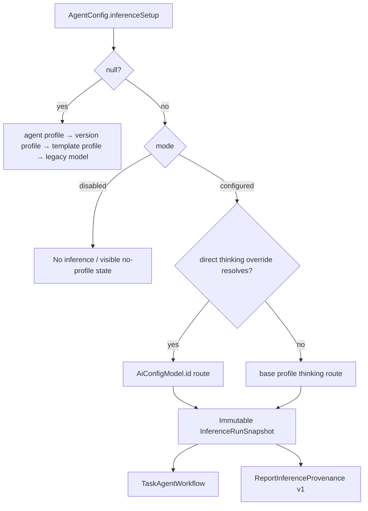
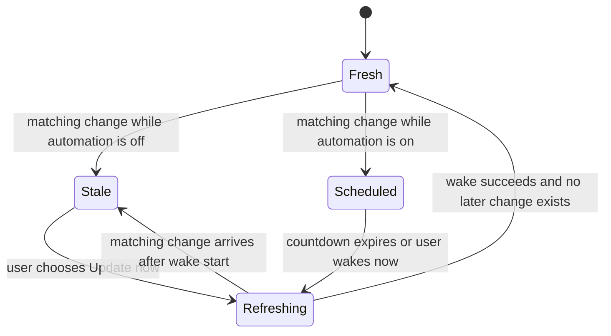
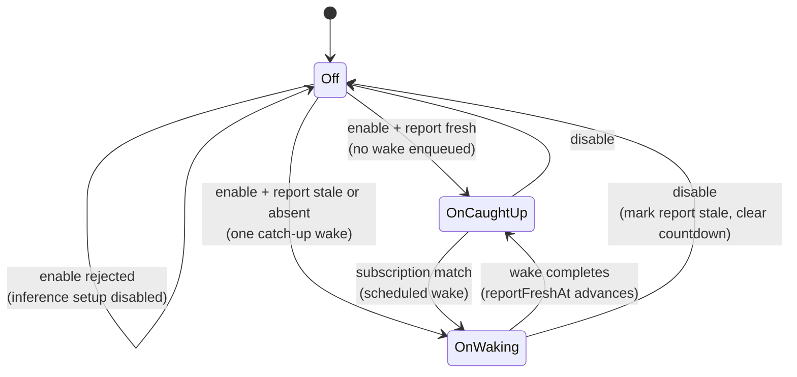
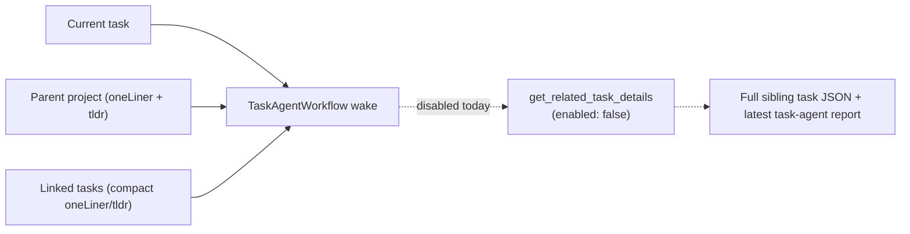
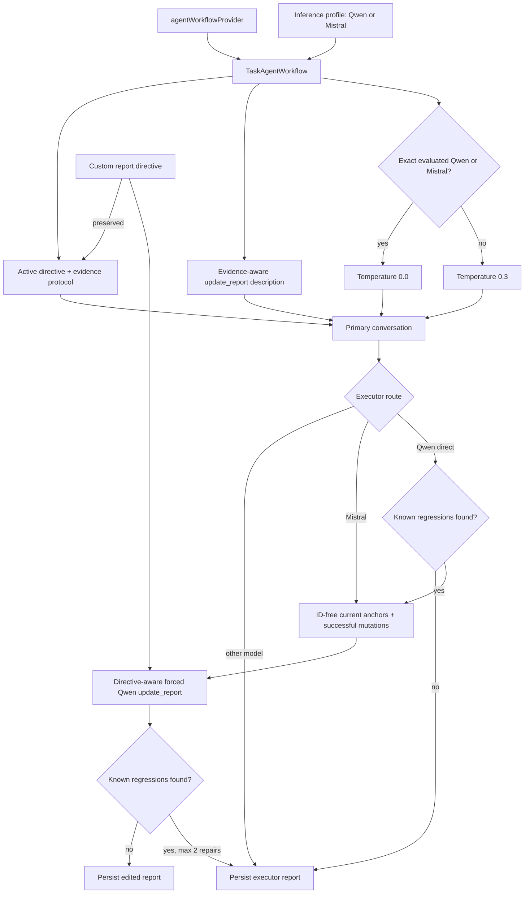
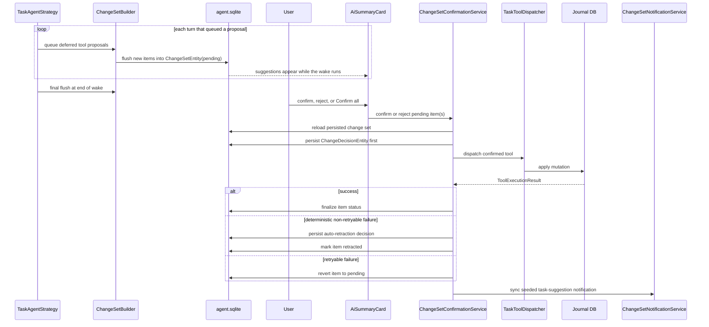
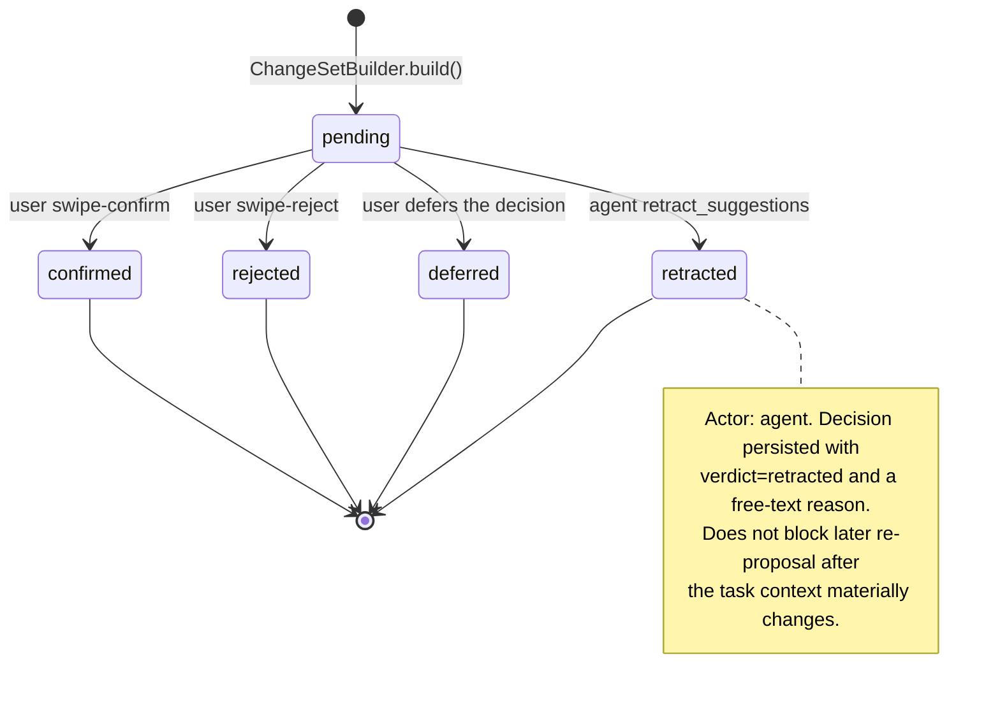

# Creation

`TaskAgentService.createTaskAgent()` runs inside an agent-sync transaction:

1. Validate the task has no task agent already.
2. Resolve a template, defaulting to the seeded Laura template when present.
3. Create the agent identity and state.
4. Set `slots.activeTaskId`.
5. Create `agent_task` and `template_assignment` links.
6. Announce the assignment on `UpdateNotifications` **after the transaction
   commits**.
7. Register a task subscription.
8. Enqueue a creation wake — callers can merge extra entity ids into its trigger
   tokens via `additionalWakeTokens` (the onboarding first-task flow passes the
   already-transcribed audio entry, so the first turn attends to the spoken
   capture).

## The category seeds automatic updates

Step 3 seeds `AgentConfig.automaticUpdatesEnabled` from the caller's argument,
filled from `CategoryDefinition.automaticAgentWakesEnabled`. It hardcoded `false`
before the category could express a preference, so **an absent category value
still produces exactly that**.

**Seeding sets the agent's *starting* preference only.** The per-task switch on
the AI summary card owns it from then on, and a later category edit does not reach
back into existing agents.

**The seed is mirrored into the orchestrator, not just persisted.** Step 6 calls
`enableAutomaticUpdatesRuntime` when it is on and
`disableAutomaticUpdatesRuntime` when it is off. The orchestrator keeps its own
`_automaticUpdatesDisabledAgents` set, and an agent parked there only leaves it
via an explicit per-task toggle or the next app start's `restoreSubscriptions` —
**so persisting alone would make the category switch look dead until a restart.**

Five category-default paths construct a task agent and each forwards those
defaults itself:

- `assignCategoryDefaultTaskAgent()` — the shared helper, called from
  `create_entry.dart` for UI task creation **and** from the day agent's capture
  tools, so it is not a UI-only path
- `_assignCategoryAgentForTask()` in `day_agent_capture_service_tools.dart` — a
  task the day agent creates from a capture, which reaches the helper above
- `ProjectToolDispatcher._tryAutoAssignTaskAgent()` — tasks a project agent creates
- `FollowUpTaskHandler._tryAutoAssignAgent()` — follow-up tasks a task agent creates
- `OnboardingCaptureToTaskService._assignCategoryAgent()` — the first task of a reused area

The manual *Assign agent* CTA is **excluded on purpose**: the user picks template
and profile in a modal and the result is marked `setupOrigin: user`, so it is an
explicit setup gesture rather than the category acting on the user's behalf.

The three non-helper paths deliberately do **not** route through
`assignCategoryDefaultTaskAgent`, because it also passes
`setupOrigin: categorySnapshot` — which makes a category without a
`defaultProfileId` produce a *disabled* agent rather than falling back to the
template's profile. **Any new category default has to be added to all three.**

## Why the announcement exists

`taskAgentProvider` — what the AI summary card watches — keys its refresh on the
**task** id, and nothing in the agent write path emitted that token: identity,
state and links all go through `AgentSyncService`, which does not notify at all.
Callers make it worse by design, `unawaited`-ing `autoAssignCategoryAgent` and
navigating immediately, so the provider's first read usually lands before the
agent exists.

The only notification that ever carried the task id was `_notifyWakeCompletion`,
which fires when a wake *finishes* — a full inference round trip after creation.
The card therefore sat empty for seconds on a freshly created task, reading as
"no agent was assigned".

`createTaskAgent` now calls `UpdateNotifications.notifyUiOnly({agentId, taskId,
agentNotification})` immediately after commit and before the creation wake is
enqueued. **`notifyUiOnly` keeps it off `localUpdateStream`**, so the orchestrator
does not read the agent system's own write as task content changing and stack a
second wake on the creation wake.

# Inference setup

A task agent owns a nullable typed `AgentInferenceSetup`.

- `null` means a **legacy instance** and preserves the historic resolution chain.
- Once a setup is written it is **authoritative**: `disabled` never falls
  through, while `configured` resolves a direct thinking-model override first and
  its base profile second.
- The direct override stores an `AiConfigModel.id`, **not** a provider-native
  model id.
- The same `ProfileResolver.resolveDetailed` result drives both wake execution
  and the AI-summary identity header, so the two can never disagree.

New agents snapshot where their setup came from (`user`, category, or template).
Category assignment with no default profile creates an explicit **disabled**
setup even if the selected template has a profile; the header then shows *No
profile selected* and *Update now* stays disabled until a profile or direct
thinking model is chosen.

Task-agent wakes pass the resolved profile's `thinkingModel?.geminiThinkingMode`
into `CloudInferenceWrapper`. Thinking level is profile-driven — there is no
Gemini-Flash-specific override or hard-coded budget in this feature.

# Freshness watermarks

`reportStaleAt` and `reportFreshAt` are **monotonic** watermarks that merge by
latest timestamp during sync conflict resolution. Stale and fresh persistence
share one serialized write chain per agent, so an older async state snapshot
cannot overwrite a later watermark.

A report is stale when the stale watermark is later than the fresh watermark. A
successful wake records **its start time** as `reportFreshAt`, so a task edit
that arrives during inference remains visibly stale and is not erased by the
older wake finishing later.

# The automation switch

`TaskAgentService.updateAutomaticUpdates()` owns every transition. Two guards run
inside the write transaction: the agent must exist, and **enabling is rejected
outright when `config.inferenceSetup.mode` is `disabled`** — there is nothing to
run inference with. Runtime effects apply only to an `active` agent.

Enabling schedules **one catch-up wake** rather than replaying accumulated
changes, and skips even that when the report is already current — so flipping the
switch right after a manual wake costs no tokens. An agent that has never
produced a report always wakes, otherwise its card would stay empty until the
next task edit. The wake is enqueued after the runtime is enabled and
subscriptions are restored, so it cannot race its own scheduling.

Disabling clears the countdown and queued automatic jobs. If that countdown
represented a pending report refresh, the report is marked stale **first**, so
removing the timer cannot leave the card claiming an older report is current.
Subscriptions keep observing and keep marking the report stale while automation
is off.

New task agents persist `automaticUpdatesEnabled` as `false`; a missing legacy
value also resolves to `false`.

# Wake flow

`TaskAgentWorkflow.execute()`:

1. Load agent state, resolve `activeTaskId`.
2. Load the latest report and prior observation messages.
3. Build task JSON through `AiInputRepository`.
4. Build linked-task context.
5. Resolve the assigned template and active version.
6. Resolve the effective inference profile with `ProfileResolver`.
7. Fetch pending change sets for the task.
8. Build the system prompt and user message.
9. Create a conversation and persist the user message into the agent log.
10. Run the conversation with `TaskAgentStrategy`.
11. When a supported report route applies, scan the new report for known
    regressions and conditionally rewrite it.
12. Persist executor and editor token usage under their respective model ids.
13. Persist the final thought, report, observations, change set and updated state.
14. Optionally embed the persisted report.

## Prompt composition

Blocks are ordered **stable-first** so the header stays byte-identical across
wakes and a prompt prefix cache can restore it:

The wake prompt is assembled from current task JSON, the latest persisted report,
prior observations, linked-task context, pending change sets, active
`AttentionRequestEntity` claims (loaded through
`getAttentionClaimsForTarget` so the prompt never scans the append-only source
table), the active running timer, and editable historical time entries.

Two context details are load-bearing:

- **Parent project context** carries only the project agent's latest `oneLiner`
  and `tldr` — the full report body is omitted to keep wake prefill small.
  Linked-task context does the same via `agent_task` links and `agentReportHead`.
  `latestSummary` payloads are stripped before submission.
- **The running timer is scoped.** If the timer's source task matches the wake's
  task, the agent gets full details (id, started, tracked range, elapsed minutes,
  entry text) and is steered toward `update_running_timer` instead of a parallel
  `create_time_entry`. If the timer belongs to a *different* task, only the
  tracked range is exposed — no id, no other-task identity, no entry text — so
  the agent can avoid proposing overlapping intervals without learning about
  another task.

Reports may include Markdown links to known task ids as `[Title](/tasks/<taskId>)`
when the context exposed the id. The trailing Links block stays reserved for
external URLs; internal task links belong inline.

# Evidence-first inference

Evidence-first is the **permanent execution contract** for every task-agent wake
— no config lookup, no second legacy prompt path. The resolved inference profile
still selects the executor model.

Common changes across the path:

- `TaskAgentPromptBuilder` replaces **only** the seeded/default report directive
  with the evaluated compact directive and appends the evidence-synthesis
  protocol. An explicitly customized template directive remains authoritative.
  Because that substitution means the stored text is never what the agent
  received, `EvolutionContextBuilder` shows a task agent's evolution session the
  **effective** directive via `TaskAgentPromptBuilder.effectiveReportDirective`.
  `propose_directives` takes a complete rewrite rather than a delta, so a
  session shown the seeded text would rewrite a contract that was never in
  effect and have it adopted wholesale.
- **Whether a directive is Lotti's own is decided by provenance, not by text.**
  `AgentAuthors.isSystemAuthored(version.authoredBy)` — exactly `system` —
  settles both checks before any comparison; the exact-match against the seeded
  constant is only the fallback for versions whose author cannot settle it.
  Comparing text alone misclassified every install seeded before a constant was
  last edited as *customised*, which disabled the model-tuned report contract for
  it and left the superseded "call `update_report` every wake" text in force.
  `system:config_change` deliberately does **not** count as system authorship —
  it marks a version that copied directives forward, so on an evolved template it
  sits on evolved text — and that copy-forward now preserves the original author.
- The **general** directive follows the same rule via
  `effectiveGeneralDirective`: the seeded `taskAgentGeneralDirective` resolves to
  empty because the scaffold's constitution already asserts user sovereignty,
  tool discipline, the no-op rules, checklist sovereignty, priority/due-date
  sovereignty and input handling. Only an evolved or hand-written directive is
  rendered, and it is appended after the constitution — it adds, never replaces
  (ADR 0052). Both scaffolds behave identically here; the compact one already
  did.
- **Precedence is stated in the prompt, and the template's instruction wins.**
  `TaskAgentPromptBuilder.templateDirectivePrecedence` precedes a template's own
  directive: the scaffold is *default behaviour* for cases no instruction covers,
  and a directive that changes a default is the feature, not a conflict. Only
  two things stand regardless, because they are not preferences — no fabrication,
  and the agent never undoes the user's own actions on its own judgement (a
  directive may lift that only by saying when to act on the user's behalf). An
  override is expected to **declare** what it replaces and why; an undeclared
  contradiction is still followed but recorded as an observation, which is what
  carries it into the next evolution session. A *customised* report directive
  additionally gets `reportDirectivePrecedence`, scoping it to the report's shape
  and voice rather than to whether a report is published at all. Neither
  statement appears for a stock template, so the shipped prompt is unchanged
  (ADR 0052).
- The compact contract treats a concrete, committed multi-step plan as checklist
  intent even without the words "create a checklist"; it does **not** treat
  speculation or a description of current state as authority.
- Owners and dates inside an action stay **in that checklist item** — they do not
  authorize owner or task-due-date field mutations without an explicit request.
- `TaskAgentContextBuilder` adds evidence requirements to `update_report` and
  explicit authority boundaries to checklist, due-date and status mutation
  descriptions.
- A required report omitted after a successful mutation gets a forced report
  call; a true no-op wake does not.

**Routing is exact at the model/provider boundary.** Compact scaffolds,
model-specific directives and temperature `0.0` apply only to the two evaluated
ids — `qwen3.5-122b-a10b` and `mistral-small-4-119b-instruct`. Other Mistral or
Qwen models keep the common scaffold and `0.3` until evaluated explicitly.

## The isolated report editor

For the exact Melious `mistral-small-4-119b-instruct` executor:

- Mistral remains the only model allowed to inspect task context and call
  mutation tools.
- `TaskAgentStrategy` records **only** mutations that applied successfully or
  were successfully queued. Failed, denied, duplicate and redundant calls never
  become report facts.
- A fresh, report-only Qwen conversation receives the active report directive,
  the Mistral draft, and **ID-free** material facts. Mutations override current
  anchors because they describe the post-wake state.
- Qwen is forced to call only `update_report`; it never receives journal ids, the
  full task prompt, or mutation tools.
- Evolved and manually customized report directives remain authoritative for
  voice, structure, emphasis and presentation; grounding, privacy and
  successful-mutation constraints still take precedence.
- Candidates are checked for lost dates or estimates, active-risk loss, locale
  register, fake link sections, process narration, unsupported priority claims,
  and causal claims inferred from a user checkmark.
- Direct Qwen uses a **separate, narrower** detector derived from captured
  regressions. It is not a semantic validator, quality score, or parser for
  arbitrary evolved directives; standalone words such as `Goal`, `Checklist` and
  `No blockers` do not trigger it.
- **Direct Qwen does not rate its own work.** A local rule match triggers an
  isolated rewrite with specific correction codes, written to the `reportEditor`
  domain log without report text or task data.
- Up to two repair attempts receive the sanitized rejected candidate and the
  exact failed checks; a candidate leaking deferred scope is withheld entirely.
  After three invalid attempts, or any editor failure, the original Mistral draft
  remains the report.
- Executor and editor usage persist separately, so model-level cost accounting
  stays accurate.

# Tool policy

The tool list a wake advertises is **not a constant**. Two complementary
mechanisms narrow it behind the `narrowToolSurface` flag (off by default,
additive): a per-wake **fact gate** that drops tools the wake cannot legitimately
use, and a **staged exposure** that withholds `update_report` from the opening
turn. With the flag off, `TaskAgentWakeFacts.permissive` and a single fixed tool
list reproduce today's behaviour exactly, so both can be evaluated side by side
before either becomes default (ADR 0051).

## Agenda-gated exposure (ADR 0051)

`visibleTaskAgentToolNames(TaskAgentWakeFacts)` drops a tool when the fact that
makes it usable is absent. `_resolveWakeFacts` computes each fact from state the
wake already loads — no extra inference turn, inverting the rejected "ask the
model what it intends" design whose arithmetic doubled input to save a fraction
of the payload.

| Tool | Withheld when |
|-----|---------------|
| `update_checklist_items` | the task has no checklist items |
| `update_running_timer` | no timer is running **for this task** (a timer on another task reaches the prompt only as an opaque range, so there is no id to update — offering the tool would invite a hallucinated one) |
| `update_time_entry` | the task has no editable time records |
| `assign_task_labels` | no label definitions exist for the category |
| `retract_suggestions` | the proposal ledger holds no open proposals |
| `resolve_attention_request` | this agent holds no active attention claim on the task |

Tools with no precondition — `set_task_title`, `update_task_estimate`,
`update_task_due_date`, `update_task_priority`, `set_task_status`,
`set_task_language`, `add_multiple_checklist_items`, `create_follow_up_task`,
`link_task`, `record_observations`, `request_attention`,
`migrate_checklist_items` — are always offered. `migrate_checklist_items` is
only meaningful after `create_follow_up_task`, but that happens mid-wake and
the tool list is fixed for the turn, so it cannot be gated on it.

Every fact defaults to **permissive**: a caller that has not been taught to
compute one gets the tool, so adding a gate can never silently remove a
capability from a wake that was not updated. A gate has to be asked for.

`hasNewerContentThanReport` is deliberately left permissive in `_resolveWakeFacts`.
A note that arrives saying nothing new is still newer than the report, and
whether its content matters is a judgement the timestamps cannot make, so gating
`update_report` on it would withhold the tool from wakes that genuinely need it.
`update_report` is narrowed by the **staged exposure** below instead — a
structural fix that does not require the app to judge materiality.

## Staged exposure

`TaskAgentStagedToolExposure` withholds `update_report` from the **opening
turn** only, so the wake does the work before it reports on it. The shipped
directive is evidence-first — establish what changed, then report it — and a
model that can publish on turn one can satisfy the wake protocol before looking
at anything; weaker models do exactly that. From the second turn onward the
full list is advertised, so nothing is permanently unreachable and a wake can
always finish its report. `record_observations` is deliberately *not* withheld:
observations are the agent's private notes for later wakes, and a model that
wants to note something on its first turn should be able to.

A wake with genuinely nothing to do is unaffected: finishing with a plain-text
note and no tool call is available on the first turn and is still the correct
ending. The one case that pays a turn is a report-only wake, where nothing needs
changing but the report does — that model must wait for turn two to publish.
Whether that trade is worth it is a measurement, not an assumption, which is
why both mechanisms sit behind `narrowToolSurface` rather than shipping on by
default.

## Locally short-circuited tools

Four tools are short-circuited **locally** in `TaskAgentStrategy` and never reach
`AgentToolExecutor`: `update_report`, `record_observations`,
`get_related_task_details`, `retract_suggestions`.

Two run immediately but route through `AgentToolExecutor` → `TaskToolDispatcher`:

- `request_attention` — writes an evidence-backed `AttentionRequestEntity` into
  the synced agent log. Intentionally immediate because it is an auditable claim
  for the day planner, not a user-visible mutation.
- `resolve_attention_request` — writes an `AttentionClaimDispositionEntity` for
  one of this agent's own active planner requests.

**Deferred (user-gated) task tools:** `set_task_title`,
`update_task_estimate`, `update_task_due_date`, `update_task_priority`,
`set_task_status`, `set_task_language`, `add_multiple_checklist_items`,
`update_checklist_items`, `assign_task_labels`, `create_follow_up_task`,
`link_task`, `migrate_checklist_items`, `create_time_entry`,
`update_time_entry`, `update_running_timer`.

## Typed-relationship tools (ADR 0042)

`link_task {relation, targetTaskId}` records one typed edge between the wake's
task and an existing task; `create_follow_up_task` accepts the same optional
`relation` so a spoken "this task is blocked by a new task X" creates X and
the canonical `blocks` edge in one confirmable proposal. The `relation` values
are the eleven `DirectedRelation.wireName` values exposed by
`relationshipDirectedOptions` (`lib/features/tasks/model/directed_relation.dart`),
read with the current task as subject. Inverse phrases swap `fromId`/`toId`
before persisting, so the stored direction always matches the picker's (see
[typed relationships](../tasks/relationships.md)).

Both are deferred and multi-use per wake (they join the batch tools in the
single-use carve-out). `link_task` proposals are validated **fail-closed at
queue time** in the strategy: an unparseable relation, a self-link, or a
`targetTaskId` that does not resolve to a live task is rejected with
model-facing feedback, and a relationship the pair already holds (canonical
`fromId|toId|type` triple) is suppressed rather than queued. On apply,
`TaskLinkHandler` re-validates, treats an already-existing edge as a no-op
success, and surfaces the `blocks` cycle-guard refusal from
`PersistenceLogic.createLink` as an explicit error.

The wake's `## Linked Tasks` rows carry a `relations` array — the directed
phrases from the current task's perspective, produced by one
`linksForEntryIdsBidirectional` query — so the model reads existing
relationships in exactly the vocabulary it would use to propose new ones, and
the prompt forbids re-proposing a listed relation.

There are no other immediate task-mutating tools. Non-local writes go through
`AgentToolExecutor`, which enforces the agent's allowed category set, captures
post-write vector clocks when a journal entity changes, and persists audit
messages for tool actions and results.

## `get_related_task_details` is disabled

The read-only sibling drill-down defines a handler but carries `enabled: false`
in `tools/task_planning_tool_definitions.dart` — the only such tool in `tools/`.
`_buildToolDefinitions` filters out disabled tools, so it is never advertised;
`allowedRelatedTaskIds` is never wired and defaults to empty, so even a
hallucinated call is rejected; and no related-task directory section is injected
into the wake prompt, so the drill-down has no source to draw from.

Re-enabling it requires building the directory section *and* wiring the
allowlist. Re-enabling or removing it is a deliberate follow-up, not an
oversight.

## The initial-field carve-out

`set_task_title` and `set_task_language` can run on the **immediate** path on
first population. When the current field is null or empty-after-trim, the call
routes through `AgentToolExecutor` like any immediate tool, so a freshly dictated
task gets a meaningful name without an empty-looking suggestion sitting in the
panel awaiting approval.

Both share `_shouldAutoApplyInitialField`, which deliberately **re-runs the
metadata resolver on every call** rather than trusting the cached snapshot — so a
field populated by a concurrent user edit, a prior auto-apply in the same wake,
or a synced edit from another device is seen before dispatch.

If `AgentToolExecutor` rejects the autonomous write with a category-policy
denial, the strategy converts the same call back into a normal change-set
proposal instead of returning the denial to the model.

After a successful auto-apply or policy fallback, the strategy marks the tool
name in `_usedDeferredTools`, so a repeat call in the same wake cannot re-apply
on the pre-write snapshot. The dispatcher itself stays simple: it is the single
write path for both auto-applied values and user-confirmed edits, so the
"don't overwrite a populated field" invariant lives at the **strategy** boundary,
not the mutation boundary where it would block legitimate edits.

# Proposals and confirmation

`ChangeSetBuilder` owns the deferred path. It explodes batch tools into
individually reviewable items, deduplicates identical proposals within a wake,
keeps only the newest `update_running_timer` proposal (retracting older pending
ones), and suppresses proposals that would not change current state.

The builder **flushes at every turn boundary that queued a proposal**, not once
at the end of the wake. A wake spends most of its wall clock on round trips the
user cannot see — the separate `update_report` turn, its forced retry, and any
report-editor pass — so holding proposals until `WakeOutputWriter` ran meant
the agent had decided what to suggest a full inference or three before anything
appeared. `TaskAgentStrategy.flushChangeSet` closes that gap; the end-of-wake
build is now a final flush that picks up whatever the last turn staged.

A flush is only half the job: writing the change set does **not** refresh the
UI. The suggestion providers re-query when `agentUpdateStreamProvider` emits,
`AgentSyncService.upsertEntity` does not notify, and `_notifyWakeCompletion`
(`agent_wiring.dart`) fires only after `execute` returns. So each flush calls
`UpdateNotifications.notifyUiOnly` itself — `notifyUiOnly`, never `notify`,
because `notify` also feeds `localUpdateStream`, which drives wake
orchestration and would let a wake re-trigger itself. Without that call the
whole feature is invisible.

The final report has the same post-commit requirement. `WakeOutputWriter`
calls `UpdateNotifications.notifyUiOnly` after the encompassing transaction
commits, with the agent id, active task id and shared agent topic. When the
subsequent outbox flush fails, the writer confirms the report is durable before
notifying and then preserves the original sync error. Task headers and
linked-task tagline batches therefore refresh immediately after a local wake
publishes a report, without feeding the local wake-orchestration stream or
exposing a report that rolled back.

The `incremental` flag separates the two modes. A mid-wake flush is narrow on
purpose; the end-of-wake build is the only one allowed to reshape existing
sets:

|  | incremental flush | end-of-wake build |
| --- | --- | --- |
| Dedups against | pre-wake sets + own set | same |
| Writes to | own set only | consolidates everything into one survivor |
| Split groups | held back | released |
| Inbox alert | never | always, exactly once |
| Runs relative to `applyStaged` | before | after |
| Transaction | its own (`runInTransaction` at the call site) | `WakeOutputWriter`'s |

Repeated flushes are safe by construction:

- The builder tracks the **fingerprints** it has already written, and appends
  only what is new. Fingerprints rather than a positional watermark because
  `_items` is not append-only — a fresh `update_running_timer` proposal drops
  the earlier one.
- An incremental flush **never writes to a pre-wake set**. Consolidating early
  would retire it, which marks its pending items retracted and copies them into
  the survivor as pending — and `applyStaged` then skips the original row it
  staged, because it is no longer pending, leaving the copy open forever. Only
  the final build consolidates, and by then retractions have landed.
- A set the user resolved mid-wake is **never appended to**. Pending queries
  return only `pending`/`partiallyResolved`, so a proposal added to a resolved
  row would persist but be invisible in both the UI and the ledger. The flush
  opens a fresh set instead.
- **Split groups are held back** until the end of the wake. A
  `create_follow_up_task` and the `migrate_checklist_item`s targeting its
  placeholder share a `groupId`; surfacing the follow-up alone would let the
  user reject it mid-wake, and `cascadeRejectMigrationItems` only sees the
  items present at that moment — migrations flushed afterwards would reference
  a rejected placeholder and could never be confirmed.
- Items dropped by dedup are deliberately **not** marked flushed, so an item an
  early flush suppressed against a still-open proposal gets one more chance
  once that proposal is retracted.
- A failed flush advances nothing: the items stay staged and the end-of-wake
  build writes them. Each flush runs in its own transaction, so a failure part
  way through cannot leave a superseded-timer `ChangeDecisionEntity` behind for
  the retry to duplicate.
- **The inbox alert fires once, from the final build only.** An incremental
  flush must not raise it: the count would come from its own set while
  `createTaskSuggestion` retracts the pre-wake row, and a second flush
  appending to the same set reuses its id as the `idSeed`, so a row the user
  already dismissed could never be revived for the later suggestions. The
  final build alerts even when it has nothing left to persist — otherwise a
  wake whose proposals all landed mid-conversation would never ring the bell.
  `raiseInboxAlert` **re-reads the set** before alerting: the card has been on
  screen since the first flush, so the user may have resolved items on it, and
  the snapshot this builder wrote would report an inflated count or raise a
  fresh active row for a card they already cleared. Alerting stays
  fire-and-forget — a failed re-read skips the alert rather than failing the
  wake.
- **Superseded running timers are resolved by the final build.** The timer ids
  come from everything the wake proposed, not just what the current pass is
  writing: on a consolidation-only build the replacement was already flushed,
  so keying on the new items alone would leave a pre-wake proposal for the same
  timer pending. Matches inside the builder's own set are excluded so the
  replacement cannot retract itself.
- **A wake that dies after a flush still alerts.** `WakeOutputWriter` never
  runs, so the workflow's failure path calls `raiseInboxAlert` itself;
  otherwise committed, on-screen suggestions would never ring the bell.
  Consolidation is deliberately *not* attempted there — it retires the pre-wake
  sets, and the staged retractions that must land first die with the wake. The
  surplus card is folded by the next wake's end-of-wake build. Because nothing
  was consolidated, that alert is **skipped** when a pre-wake set is still
  pending: `createTaskSuggestion` retracts every other open row for the task,
  so alerting from the wake's set alone would drop those older suggestions out
  of the inbox. Their existing row is still open and still accurate.

A wake with pre-existing proposals therefore shows a second card while it runs,
which the final build folds into one. That is the deliberate trade for never
touching a set the retraction step still needs. The end-of-wake build is
consequently never a no-op when the wake wrote anything: it still has to fold
the pre-wake sets and raise the alert.

Retractions keep their end-of-wake placement for the opposite reason they used
to: proposals now land *first*, so the suggestion list can never read empty
between a retraction and its replacement.

`ChangeSetConfirmationService` applies one item at a time: re-read the persisted
change set (avoiding stale UI snapshots), **persist the decision first**, mark
the item confirmed, dispatch, revert retryable failures to `pending`, and
auto-retract deterministic failures the dispatcher marks non-retryable. This
includes `update_running_timer` when the active timer changed before acceptance
and version-fenced goal revisions whose base version is stale or whose legacy
contract cannot be applied safely.

It also resolves follow-up-task placeholder ids across later migration items and
suppresses rejected label assignments so the same label is not immediately
re-proposed. After a decision it hands the fresh change set to
`ChangeSetNotificationService`: pending items left → refresh the seeded
suggestion notification with the new count and retract older open rows for the
task; none left → mark every open suggestion notification acted-on so it leaves
the inbox and syncs that lifecycle to other devices.

## Running-timer proposals are stricter

`update_running_timer` names a specific live timer id. If the user stops that
timer, starts another task's timer, or the snapshot otherwise changes before
acceptance, retrying cannot succeed. The service therefore records a
`ChangeDecisionEntity{verdict: retracted, actor: agent, retractionReason}` and
moves the item to `retracted` rather than leaving a dead retry button. The next
wake sees the reason in the ledger and can propose `update_time_entry` for the
now-completed entry.

Only one running-timer update may be open per task; a later, better proposal
supersedes older pending ones as agent retractions.

# The proposal ledger and agent-autonomous retraction

Every wake receives the task's ledger from `AgentRepository.getProposalLedger`.
Each entry carries a stable fingerprint (`toolName + args`).

Retraction via `retract_suggestions` is **two-phase**, so it commits atomically
with the wake's new proposals:

- **`plan(...)`** runs while the LLM is mid-turn. It looks each fingerprint up
  across pending change sets and returns per-entry outcomes (`retracted` /
  `notOpen` / `notFound`) plus the matched items as `StagedRetraction`s. It
  **persists nothing**. The strategy accumulates staged retractions and feeds
  `plan` the keys staged so far, so repeated calls in one wake stay idempotent
  without an intervening write.
- **`applyStaged(...)`** runs at end-of-wake inside the same transaction as
  `ChangeSetBuilder.build()`, and just before it so the builder's dedup sees the
  freshly-retracted statuses. It groups by parent change set and applies each in
  a single re-read → flip-all → write, re-validating every target by bounds,
  status and fingerprint.

**Why deferring the write matters:** the old behaviour persisted each retraction
the instant the tool was called, so the card dropped the retracted rows seconds
before the replacement proposals landed. Staging collapses that into one
end-of-wake update — the list transitions straight from the old set to the new
one. It is also strictly safer, since each retraction re-reads its parent and
skips anything a concurrent user decision already resolved.

## The churn guard

Weaker models routinely retract an open proposal **and** re-propose an identical
one in the same wake. Even committed atomically, that swaps a stable suggestion
for a brand-new change item — which, right after the user confirmed a sibling,
looks like accepting one suggestion wiped the rest.

The workflow passes `ChangeSetBuilder.proposedFingerprints` as
`applyStaged(..., skipFingerprints: …)`: any staged retraction whose target
shares a fingerprint with something proposed this wake is dropped, and the
matching new proposal is then dropped by the builder's dedup against the
still-open original. The original is left untouched. Stale retractions and true
supersedes (a different fingerprint) are unaffected.

The agent is separately instructed to retract **only when that proposal itself is
stale** — never to withdraw the rest of a batch because the user acted on one
sibling.

`ChangeSetBuilder` excludes both `confirmed` and `retracted` items from its dedup
basis while keeping `pending`, `rejected` and `deferred` sticky. The agent can
therefore re-propose something it previously retracted if circumstances change,
but cannot re-propose a user rejection without materially different args.

Ledger reads are defensive: an item is exposed as open only when the parent set
is still `pending` or `partiallyResolved` **and** the effective item state is
still `pending`. Decision rows close stale embedded snapshots before the prompt
or UI sees them, and retired resolved-set rows with no decision are filtered out.

When several pending change sets are consolidated, the newest becomes the
survivor and pending items in retired sets are marked `retracted` first — so no
resolved parent row contains an actionable-looking pending child.

Feedback-extraction heuristics read `rejectionReason` to detect user grievances
and are explicitly decoupled from `retractionReason`, so agent self-talk never
pollutes the user feedback signal.
