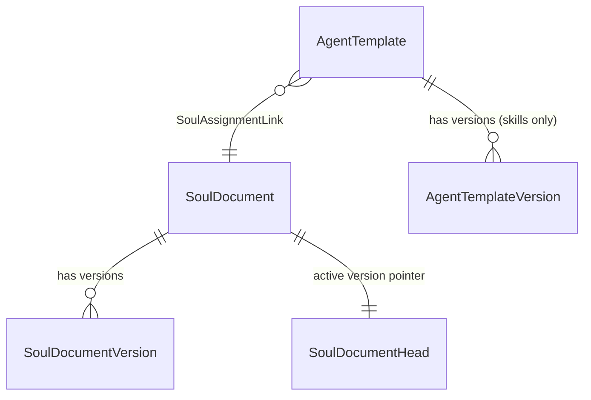
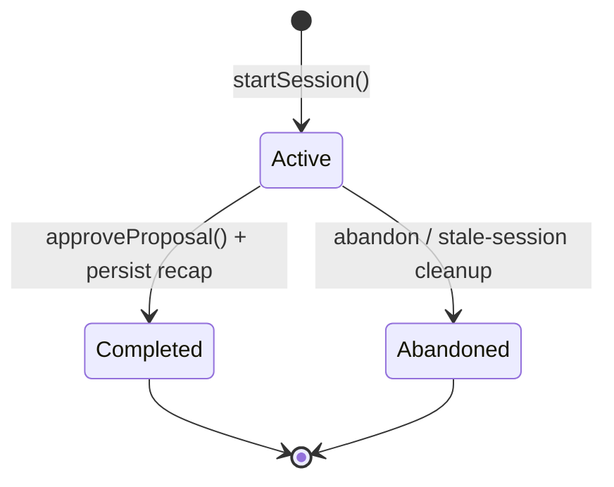
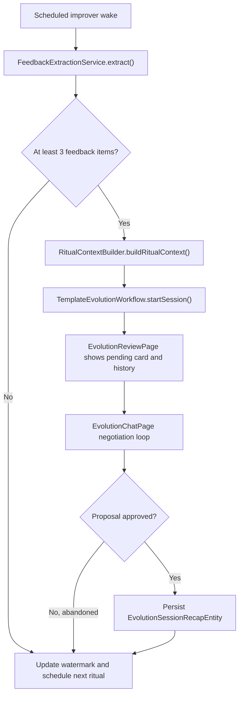
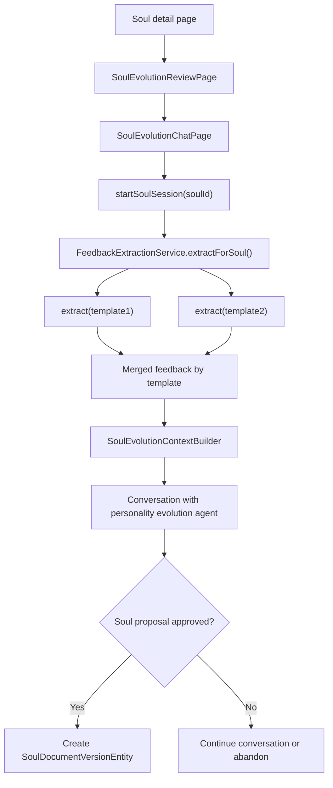

# Two axes: skills and personality

The feature separates **what an agent does** from **who it is**:

| | Owns | Versioned as |
|---|------|--------------|
| **Template** | Operational directives — skills | Template row + version rows + head pointer |
| **Soul** | `voiceDirective`, `toneBounds`, `coachingStyle`, `antiSycophancyPolicy` | Soul row + version rows + head pointer |

**Key invariant: one active soul per template.** Multiple templates can share a
soul. Instances inherit their soul through their template assignment.

At wake time, `TaskAgentWorkflow` and `ProjectAgentWorkflow` resolve the active
soul and inject personality under `## Your Personality`, while skills go under
`## Your Operational Directives`. Templates without a soul assignment fall back
to the legacy combined `## Your Personality & Directives` format.

# Seeded defaults

`AgentTemplateService.seedDefaults()` seeds seven named templates:

| Template | Kind |
|----------|------|
| `Laura` | `taskAgent` |
| `Tom` | `taskAgent` |
| `Project Analyst` | `projectAgent` |
| `Scribe` | `eventAgent` |
| `Shepherd` | `dayAgent` (Daily OS) |
| `Template Improver` | improver |
| `Meta Improver` | improver |

`Scribe` is what makes event recaps usable out of the box: a category opts in by
pointing `Category.defaultEventTemplateId` at it (or at any other
`eventAgent`-kind template). Without a seeded event template the category picker
would have nothing to offer.

Six seeded souls form a personality palette — Laura, Tom, Max, Iris, Sage and
Kit — with three default assignments: Laura soul → Laura task template, Tom soul
→ Tom task template, Laura soul → Project Analyst. Max, Iris, Sage and Kit are
available for manual assignment.

`SoulDocumentService` manages the lifecycle: `createSoul()` (entity + initial
version + head), `createVersion()` (archive old, create new active),
`assignSoulToTemplate()`, `resolveActiveSoulForTemplate()` (link → head → version
chain), and `getTemplatesUsingSoul()` for reverse lookup.

# The evolution session

`TemplateEvolutionWorkflow` is the multi-turn session runtime, handling both
template evolution (skill changes) and soul evolution (personality changes):

1. Gather template context, metrics and soul context.
2. Create an `EvolutionSessionEntity`.
3. Start a conversation with `EvolutionStrategy`.
4. Record evolution notes, structured ritual recap state and proposal state.
5. Create a new template version **only after approval** (`propose_directives`).
6. Optionally create a new soul version (`propose_soul_directives`) — this
   affects **all** templates sharing the soul.
7. Persist an `EvolutionSessionRecapEntity` from the explicit
   `publish_ritual_recap` tool payload plus the approved-change rationale,
   ratings and transcript snapshot.

**Only one active evolution session per template** at a time.

The UI splits into two surfaces: `EvolutionReviewPage` (a history-first ritual
home with a pending-session card, compact metrics and persisted history) and
`EvolutionChatPage` (the active negotiation loop). Session history cards prefer
the persisted recap `tldr`, falling back to `session.feedbackSummary` when it is
absent or empty.

`EvolutionMessageInput` reuses the chat recorder controller for batch voice
input. Successful transcripts populate the composer; failures render the
provider's diagnostic detail in an error toast and clear the consumed recorder
result so the same failure is not replayed on rebuild.

`ritualSummaryMetricsProvider` exposes only the retained signals: lifetime wake
count, wakes since the last completed ritual, token usage since the last
completed ritual, and 30-day wake activity buckets.

# Improver agents

An improver is a scheduled agent whose job is to open evolution sessions with
richer context.

`ImproverAgentWorkflow` loads `activeTemplateId`, extracts classified feedback
since the last watermark, **skips the ritual when fewer than 3 feedback items
exist**, builds ritual context from feedback, reports, observations, versions and
metrics, starts the session, then updates the feedback scan watermark and
schedules the next ritual.

Meta-improvers reuse the same workflow, distinguished only by
`recursionDepth > 0` (ADR 0012).

# Standalone soul evolution

Soul personality evolves two ways:

1. **During a template ritual** — the evolution agent can opportunistically
   propose soul changes via `propose_soul_directives` alongside skill changes.
2. **A standalone soul session** — a dedicated 1-on-1 focused exclusively on
   personality.

`startSoulSession(soulId)` aggregates feedback from **all templates sharing the
soul**, `SoulEvolutionContextBuilder` builds personality-focused context with
cross-template feedback grouped by source template, only
`propose_soul_directives` is available (no `propose_directives`), and
`completeSoulSession()` creates a new `SoulDocumentVersionEntity`.

Session entities reuse `EvolutionSessionEntity` with `agentId = soulId` and
`templateId = soulId`.
