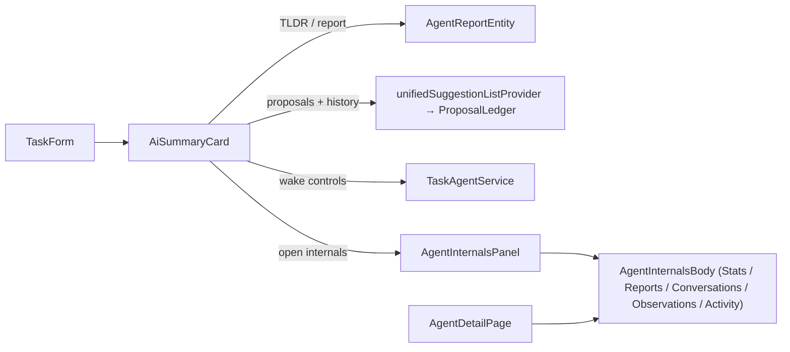
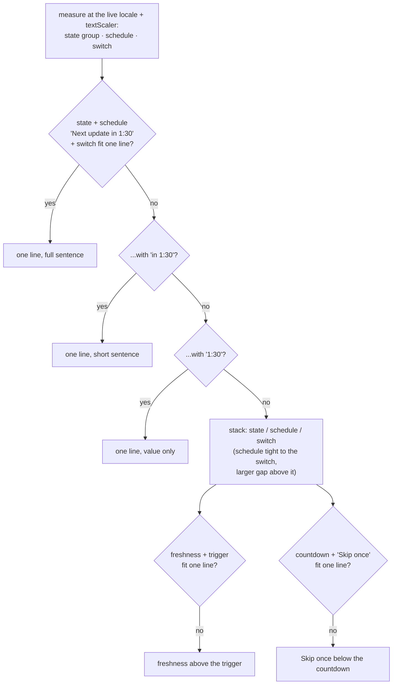
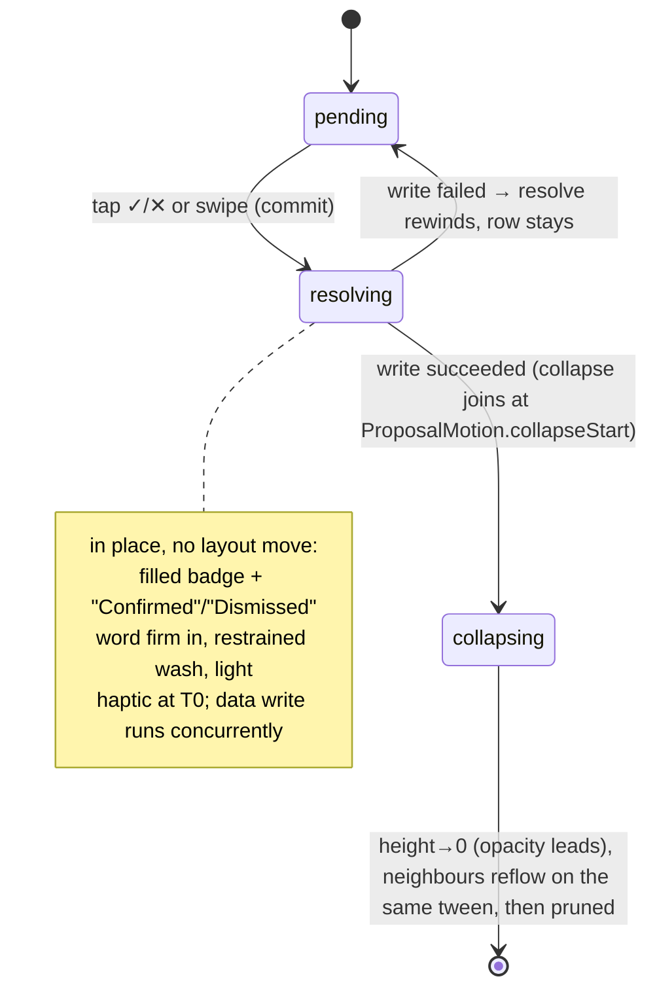
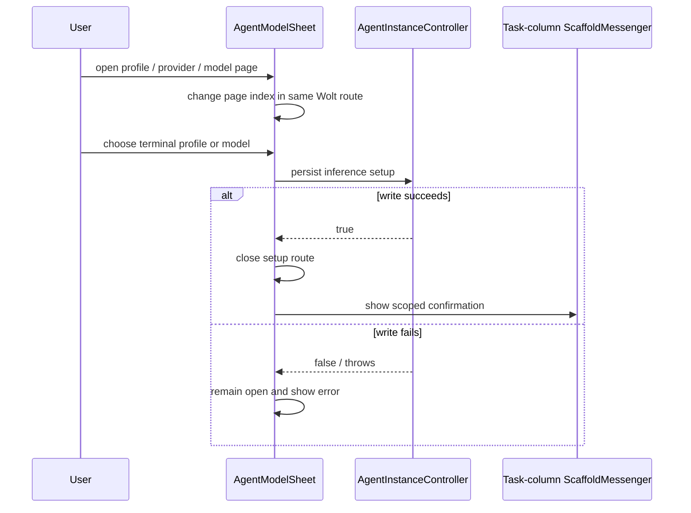
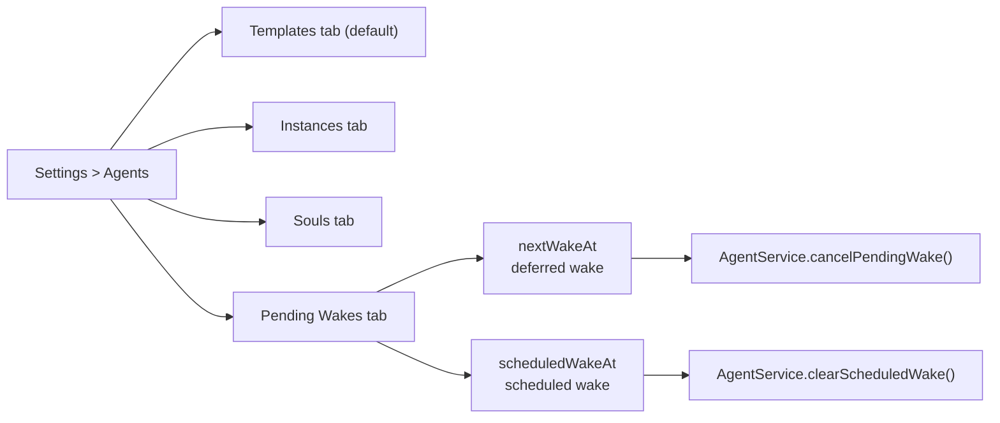
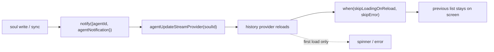
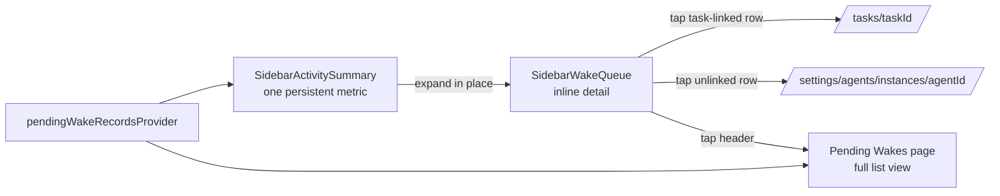

None of these widgets owns business logic. They read from the providers in
`state/agent_providers.dart` and dispatch through the same services.

Agent markdown renders through `AgentMarkdownView`, which wires
`handleMarkdownLinkTap` and `buildMarkdownLink` from `utils/markdown_link_utils`.
That shared handler beams app-local routes such as `/tasks/<id>` or
`lotti://tasks/<id>` through `NavService`; external URLs use the platform
launcher.

# `AiSummaryCard` — the task-details AI surface

The single AI surface on the task detail page, replacing the earlier
`AgentSuggestionsPanel` + `TaskAgentReportSection` split. It renders **below**
the task's checklists so the user's own work comes first.

Contents:

- **TLDR header** (`AgentReportEntity.tldr`, falling back to the report's first
  paragraph) plus an inline expandable Goal / Achieved / Next / Learnings block
  under a *Read more / Show less* pill.
- **Proposed changes** — rows from `unifiedSuggestionListProvider`, each a
  `PendingSuggestion`, confirmable or rejectable by tap or swipe (`> 70px` →
  confirm, `< -70px` → reject; in between snaps back). All confirms route
  through `ChangeSetConfirmationService`. *Confirm all* batches `confirmAll` over
  distinct change sets.
- **`History · N`** — lazily expands resolved ledger entries with
  `Confirmed` / `Dismissed` tags and a strikethrough.
- **The controls footer** — a composition root over `TaskAgentAutomationRow` and
  `TaskAgentIdentityRegion`.

## Reading column and information grouping

Report reading and agent controls sit in separate information groups. The report
is the hero: header, TLDR (reading measure capped at ~75 characters even when the
card is wider, rendered with the editor-aligned `body.bodySmall` token),
disclosure and proposals form one linear reading column at every width. With no
open proposals the `0 pending` pill carries the empty state — no placeholder
band. Proposal prose uses the same unmodified `body.bodySmall` metrics as the
report rather than a separate line height.

Each proposal is a neutral hairline row leading with its content: the change kind
renders as an inline meta-toned prefix of the row text ("Update · …") at the
body's own size. Colour alone separates it — **taxonomy never gets a chip or the
accent family**. One anatomy at every width: text leads, verdict actions trail
vertically centred, capped at the summary's reading measure. The per-row ✕
(neutral wash) and ✓ (accent wash) are matched in weight and asymmetric in hue,
each in a 40×40 hit zone with a `step2` dead band between them.

## The controls band is the only surface

All secondary controls live in a quiet, flat footer pinned to the card bottom.
The band answers **two** questions and keeps each one in one place:

| Question | Where |
|----------|-------|
| *Is this current, and can I refresh it now* | Freshness word plus the manual trigger, on the leading edge |
| *Does it refresh itself, and when next* | The automatic-updates switch with the countdown as its own readout, on the trailing rail |

The model identity sits below both.

**Grouping the countdown with the switch rather than the trigger is deliberate** —
it is the switch's readout, and putting the trigger between the two halves made
"Automatic updates" read as a caption for the button.

Its `aiCard.footerWash` and top hairline **are** the container; nothing inside
draws a second fill, border or radius. An earlier revision boxed the automation
controls in a nested card, costing a nesting level, two horizontal insets and a
third leading edge — and in the light theme that inner fill *was* the band's own
fill, so it was invisible anyway.

The band pays `spacing.step4` horizontally and each row adds `spacing.step2`, so
every glyph lands on `spacing.cardPadding`, sharing one leading edge with the
summary prose and proposal rows, while interactive rows still get ink that
breathes around their content.

## The manual trigger is never absent

*Update now* occupies the same slot in every state, and a run in flight swaps its
label and glyph in place (`DesignSystemButton.isLoading` → spinner +
`Thinking…`) rather than vacating the row. Until #3568 the countdown *replaced*
the trigger, so running the agent by hand meant cancelling the schedule first.

Cancelling one pending run is a worded `Skip once` grouped with the countdown it
cancels — not a bare glyph beside the switch it does not control. It calls
`cancelScheduledWake` and leaves automatic updates on.

**Accent is spent on the trigger alone.** It sits at
`DesignSystemButtonSize.dense` — the caption tier — so accent means "this starts
work", and nothing in the settings band shares a type tier with `Confirm all`.

`Skip once` is the trigger's opposite and is inked at `aiCard.bodyText`: the
same register as the countdown it acts on. An action rendered *fainter* than the
static text beside it inverts the two. It carries no underline — the shared
hover fill is the affordance, and a decorated cancel out-decorated the value it
cancels while giving the band a third dialect for "this is tappable".

**The alert tint is spent on the freshness glyph alone.** The word stays
`aiCard.bodyText` in both states. Tinting it too made the quiet settings band
the loudest thing on the card — louder than `Confirm all`, the action that
actually changes the task — and in dark it read at *lower* contrast than the
plain ink it replaced. The state is already said twice, in the glyph and in the
word, so colour is not carrying it alone.

Both `Skip once` and the model-identity row are `DesignSystemInlineAction`s
rather than open-coded `Material`/`InkWell` scaffolds, so they share one radius,
target, inset and state-layer behaviour — and one accessibility fix, since both
predecessors excluded semantics *above* their `InkWell` and so published a
button with no tap action.

One layout detail is easy to get wrong: **`DesignSystemButton` pays its own
content inset**, so a button box on the leading edge puts its *glyph* inside the
inset — invisible until the row stacks, and then reading as a broken column. The
trigger sets `alignsLabelToLeadingEdge` to cancel it.

## Prose degrades before payloads do

`TaskAgentAutomationRow` measures its localized labels with a `TextPainter` at
the live `MediaQuery.textScalerOf` rather than branching on a pixel breakpoint —
no constant can know whether "Automatische Aktualisierungen" fits beside a
trigger at 1.3× text scale.

The schedule wording steps down `Next update in 1:30` → `in 1:30` → `1:30`; when
no rung fits the row stacks onto the shared leading edge, and at the narrowest
measures **the state pair and the schedule pair each split onto their own lines
too**. **The countdown value, the trigger and the switch never degrade**; the
automatic-updates label wraps to two lines rather than truncating.

**Ticking digits move nothing.** The schedule label reserves the width of the
wording captured when the deadline was latched, and the fit decision is taken
against that same reserved width — so a `1:00:00` → `59:59` transition can
neither resize the label nor flip the row between its two forms. The reservation
is measured in the *painted* style: tabular figures change digit advance, and
measuring without them clips the payload.

Freshness is a glyph **and** a word, never colour alone; the full sentence lives
in the tooltip. With automation on and nothing pending the line reads "Updates
when this task changes", so flipping the switch never leaves a hole that resizes
the card. The toggle keeps a full `spacing.step9` interaction slot around its
40×24 track. When setup is missing, the disabled toggle explains itself via an
info tooltip and the trigger is disabled rather than hidden.

## The setup region

It compares the live route fingerprint with the immutable final-author route on
the visible report. Equal routes collapse to one editable identity line;
different routes render separate *Current setup* and *This report* lines.

Both rows **shrink-wrap** — a stretching `Column` hands its children a *tight*
width, which silently defeats the `MainAxisSize.min` they declare and inflates
their ink, tooltip and tap target to the full reading measure.

**Routes shed segments rather than wrapping or ellipsising.** A route is
structured, so `inferenceRouteIdentityTiers` drops whole segments —
`Qwen 3.5 Plus · Alibaba · via Melious.ai` → `Qwen 3.5 Plus · Melious.ai` →
`Qwen 3.5 Plus` — instead of ellipsising away the serving provider and leaving the
connective "via" stranded behind it. **Only the last rung may ellipsise.** The
fixed `This report` label never gives ground; its route does. The full route stays
in the semantics label, and the setup row's tooltip **names its action**
(`Change AI setup`) rather than repeating a route that is usually fully visible.

**Both rows are the same row box**, sharing a horizontal inset and a `step8`
minimum height. That is what keeps the card's bottom margin constant whether or
not the attribution line exists. Padding alone could not: the tappable row's ink
box centres a `step5` glyph in `step8` and so contributes optical air below its
text that a bare text row does not, so a revision that equalised the *declared*
padding still shifted the card's bottom edge on screen as a report aged into a
different route. Space row boxes, not text.

## Proposal accept/reject motion

Timing and curves come from the hand-authored `MotionDurations` / `MotionCurves`
/ `ProposalMotion` tokens in `motion_tokens.dart` (M3 duration scale + emphasized
easing). They are **not** in the generated `ThemeExtension` pipeline because
`Duration` and `Curve` are not lerp-able.

Each `ProposalRow` runs a two-beat exit on two controllers:

Invariants:

- **The committed row never moves on the action frame.** It acknowledges in place
  for `ProposalMotion.resolveHold`, then collapses; the height collapse *is* the
  reflow (`SizeTransition`, `alignment: topCenter`), so neighbours slide up on
  the same tween with no snap. The inter-row gap lives inside the collapse so
  nothing snaps on prune.
- **The shell, not the provider, removes the row.** `_AiSummaryShellState` keeps
  a `Set<String> _exitingFingerprints`; `onResolveStart` records a fingerprint so
  the visible list re-inserts it even after the provider drops it, and
  `onResolveEnd(removed:)` prunes on animation complete — or keeps the row on a
  failed write.
- **Confirm-all** is a staggered resolve→collapse sweep (per-row
  `ProposalMotion.staggerStep * cascadeIndex`) with **one** light haptic for the
  whole gesture. At gesture time the shell synchronously adds every batch
  fingerprint to `_exitingFingerprints` *before* either persistence or the
  stagger timers begin, so a provider re-query that resolves proposals
  immediately cannot unmount a row mid-animation. This matters most for
  `update_checklist_item`: checking an existing item is fast enough to beat a
  later row's stagger, whereas the slower checklist insert path used to hide the
  race.
- **Tap-guard:** while any row is collapsing the shell passes `settling: true`,
  so surviving rows treat tap and swipe as inert until the exit completes — a
  fast second action cannot hit a row that moved under the pointer.
- **Swipe hint:** a one-shot, one-directional nudge on the first row, gated by
  the session-scoped `proposalSwipeNudgePlayedProvider` so it never re-fires on
  promotion; suppressed under reduced motion.
- **Accessibility:** on commit an assertive `SemanticsService.sendAnnouncement`
  speaks the verdict plus remaining count; the committed row is
  `ExcludeSemantics`'d immediately so there is no ghost focus; action buttons
  carry explicit `Semantics(button:)` roles and labels.
- **Entrance reveal** — the dual of the exit. Sections the agent produces *live
  during a wake* reveal their height open from zero with a fade via
  `EnterTransition`, so linked entries below ease down instead of being shoved in
  one frame. It is gated on the agent's `isRunning` flag, so statically loaded
  content stays instant. `EnterTransition` is one-shot and built on
  `SizeTransition` rather than `AnimatedSize` on purpose: it reveals once then
  sits inert, leaving a proposal row collapsing *inside* it entirely to that
  row's own choreography — an enclosing `AnimatedSize` would try to re-drive and
  assert on that inner per-frame size change.
- **Reduced motion** (`MediaQuery.disableAnimations`): no resolve/collapse
  travel, instant prune, instant pill swap, instant entrance — but the haptic
  still fires, because it is feedback rather than motion.

### The off-screen card anchor

While the card has scrolled **fully above** the viewport, `TaskDetailsPage` pins
the seam just below it — a second `ScrollAnchor` keyed on the linked-entries
sliver — instead of pinning the proposals, so neither a new proposal growing the
card nor a resolved row collapsing it moves the visible area.

The collapse side matters for *every* tool and *both* verdicts: `_confirm` and
`_reject` share the choreography, so a dismissed proposal shrinks the card
exactly as an accepted one does. `_suggestionsAnchor` cannot cover it — it
locates `ProposalsSection`'s own top, and a row collapsing *inside* that section
never moves it, so the anchor measures zero drift and does nothing.
`set_task_language` was the clearest reproducer: nothing above the card renders
the language, so the card's collapse is that tool's entire page-layout effect.

While off-screen the band also reports its own height delta
(`ViewportStableSizeReporter(offscreenOnly: true)`), so the correction lands
pre-paint rather than one frame late per frame of the collapse. The two anchors
are mutually exclusive — they sit either side of the card, so the correction that
holds one moves the other by exactly the card's height change.
`TaskDetailsPage` evaluates the off-screen predicate once per resolve and arms
exactly one.

## Holding the list steady during a wake

The card keeps the last visible suggestion list in widget state while a wake
runs. If the provider briefly reloads to an empty or partial open list without
ledger entries resolving the missing fingerprints, the card merges those
unresolved previous rows back in. Explicit resolution still wins: confirmed,
rejected and retracted fingerprints in the ledger remove the matching row
immediately.

# `AgentModelSheet` — one adaptive Wolt route

The setup sheet is a single multi-page Wolt route. Its overview branches to
embedded profile, provider and model pages by **changing the route's page
index** — it never opens a second picker modal over the setup sheet. A single
provider skips the provider page; multiple providers drill down and use the Wolt
back affordance to return within the same route.

Every branch uses `DesignSystemSelectionRow`, and the provider/model branches
reuse `InferenceProviderSelectionRow` / `InferenceModelSelectionRow`, so branding
and selection markers stay identical to the standalone inference picker without
coupling the setup flow to their modal wrappers.

The overview is a **settings summary, not another picker page**: a grouped
*Current setup* card exposes the active profile and effective thinking route as
noun-labelled navigation rows. Automation is intentionally absent because the
card owns that task-level control. The destructive *Turn off AI for this agent*
action is isolated below the setup group and expands its confirmation in place.
"No AI setup" is deliberately not another page — tapping it reveals a compact
inline explanation with Cancel/confirm directly under the originating row.

Profile and model rows are **terminal choices**: the flow controller persists the
new `AgentInferenceSetup` first, then closes the whole route and shows the
localized confirmation through the `ScaffoldMessenger` captured from the
task-details column. Model rows optimistically move the selection marker as soon
as a tap is accepted while a busy guard prevents a second write; a failed write
restores the persisted selection, leaves the route open, and reports the error
there.

Navigation and toast delivery use the **stable** navigator and messenger captured
when the sheet opens, so a database-driven Wolt page rebuild cannot misclassify a
successful save as a failure. The controller binds the exact modal route and
closes only while that route is still current, so completing a save after manual
dismissal cannot pop the task screen underneath.

`taskAgentSetupOptionsProvider` retains the loaded profile/model/provider catalog
across independently mounted Wolt pages, and consumers unwrap the last successful
async value during refreshes, so navigation never flashes an empty page.

Daily OS reuses the same resolution and picker primitives without depending on
the task-agent service: the planner's Stats tab detects `AgentKinds.dayAgent` and
opens `DailyOsInferenceSetupSheet`. All paths persist through `DayAgentService`
before closing. A profile choice clears the direct model override; a later model
choice retains that profile as its base. The general default stays on the
day-agent template, so the instance sheet cannot silently change the default for
future planner creation.

# `AgentInternalsPanel` and `AgentInternalsBody`

The panel is a dismissable right-side overlay (clamped 600–800 px) reachable from
two affordances inside the AI card: the agent name link in the header, and the
*Open agent internals* pill under the expanded report. It is a thin shell —
header, close button, scrim — hosting `AgentInternalsBody` once
`agentIdentityProvider` resolves. A `barrierDismissible: true` route plus an
explicit full-screen `GestureDetector` cover both pop paths.

`AgentInternalsBody` is the shared tabbed body — **Stats / Reports /
Conversations / Observations / Activity** — used both inside the panel and as the
body of the standalone `AgentDetailPage`. Each tab is owned by an existing
component plus a Stats card wrapping the agent's template, profile, controls and
current `AgentStateEntity`. There is no panel-specific logic; both consumers see
the same tabs and behaviour.

# Settings surfaces

*Settings → Agents* is the operator entry point, with four tabs (`Templates` is
the default landing):

The **pending-wakes dashboard is intentionally narrower than the full message
log** — it shows only wake records that can still fire: `nextWakeAt` (the
per-device deferred subscription deadline), `scheduledWakeAt` (used by project
agents and template improvers), and pending `ScheduledWakeEntity` records (the
Daily OS day pre-warms, whose subject is the day id derived from the
`day:<dayId>` `workspaceKey`).

Each pending-wake card owns its own one-second timer and recomputes remaining
time from `clock.now()` on every tick, so the page does not rebuild the whole
list every second and the timer does not drift when frames arrive late. Deleting
a card clears only the represented marker.

The **instances dashboard stays deliberately lightweight**: it drives the shared
`AgentListingShell` with kind and lifecycle/status filter axes, showing a single
result count and a per-group active-count badge when grouped by status. There is
no aggregate total/active/dormant/destroyed breakdown line.

Templates and Souls are the only tabs exposing create FABs, wrapped with the
shared bottom-navigation clearance so they do not sink behind the floating app
shell on narrow layouts.

## History sections and reload behaviour

Four list sections on the template and soul detail pages read a
`FutureProvider.autoDispose.family`:

| Section | Provider | Reloads while open? |
|---|---|---|
| Soul → Info → Version History | `soulVersionHistoryProvider` | yes — every soul write |
| Soul → Info → Soul Evolution History | `soulEvolutionSessionHistoryProvider` | yes — every soul write |
| Template → Reports tab | `templateRecentReportsProvider` | yes, but only on some events |
| Template → Stats → Version History | `templateVersionHistoryProvider` | no |

`agentUpdateStreamProvider(id)` filters `UpdateNotifications.updateStream` down
to sets *containing* `id`. Soul sections are well served: soul entities carry
`agentId: soulId`, so every soul write lands the id in the set.

Templates are patchier, because **a template id is not an agent id**. It reaches
a notification set from agent initialization, template evolution, and from sync
only for `WakeTokenUsageEntity`. **A report landing therefore does not refresh
the Reports tab**, and `templateVersionHistory` watches no stream at all. Both
are known gaps rather than intended behaviour; closing them means widening a
producer's notification set or subscribing to the shared `agentNotification`
topic — and the latter has real blast radius, since the same providers back
`SoulEvolutionReviewPage` and `TemplateTokenUsageSection`, whose `when` calls
still take the defaults.

Each `when` passes `skipLoadingOnReload: true` **and** `skipError: true`. The
distinction matters: `AsyncValue.when` already defaults `skipLoadingOnRefresh` to
true, so an explicit `invalidate` was never the risk — a *reload* from a watched
dependency is, and it defaults to showing the spinner. `skipError` covers the
other half: a reload that throws yields `AsyncError` carrying the previous value,
and the default would swap the list for the error widget. Either would collapse
the section's height and shift everything below it mid-read. An initial load
still shows the spinner and an initial failure still shows the error, because
neither has a previous value to keep.

# Sidebar wake queue

`SidebarActivitySummary` owns the persistent desktop-sidebar representation. It
watches `ongoingWakeRecordsProvider` and `pendingWakeRecordsProvider`, counts
scheduled wakes inside a **one-hour lookahead**, and contributes one compact
`auto_awesome + total` metric beside recording and timer activity.

Selecting the summary expands `SidebarWakeQueue` **in place**, surfacing a quiet
sentence-case `Agents` sublabel with a summary such as `1 active · 2 queued`, the
top running wake (green dot, `Working · mm:ss`, linked title), the next compact
scheduled row (neutral dot, `Queued · ETA`), and a compact overflow row when more
are hidden.

It renders as a quiet neutral card with no accent rail or tint, and reserves no
permanent sidebar height — the summary's expanded state *is* the detail surface.
**Agent activity is always observed; no feature flag can hide active or queued
work.**

Rows are actionable: task-linked wakes route to `/tasks/<taskId>` with a small
open-task glyph, while unlinked or project-only wakes fall back to the agent
instance route. The trailing cancel button is a separate hit target, so opening
the work item and stopping the wake never compete.

Rows are driven by the page-scoped `wakeCountdownTickerProvider`, so the sidebar
shares one ticker instead of spawning a timer per row. Wakes outside the one-hour
lookahead stay out of the inline sidebar and remain on the full page; additional
in-window wakes collapse into the overflow row rather than turning the navigation
rail into a wake manager. The collapsed icon-only sidebar suppresses the slot
entirely.
