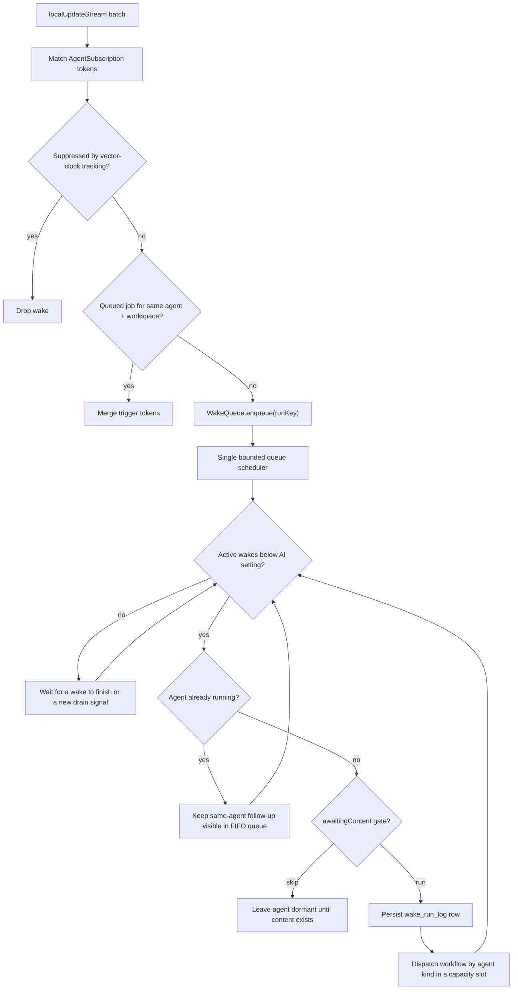
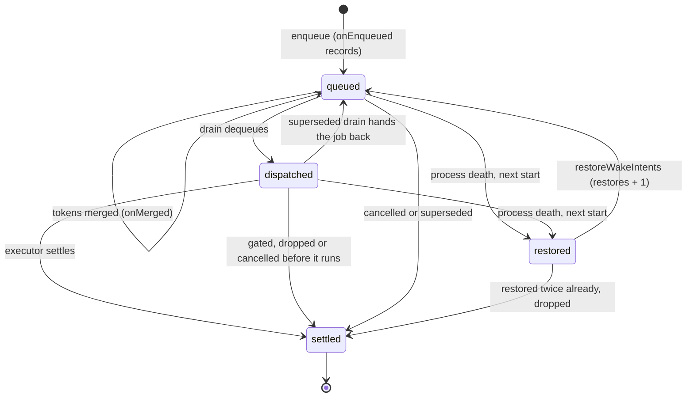

# Why the design is this defensive

`WakeOrchestrator` is shaped around three specific background-agent failure
modes. Reading it as over-engineering misses that each mitigation exists because
the corresponding failure is easy to reach:

1. **Wake storms** after rapid local edits.
2. **Self-trigger loops** after an agent writes to the entities it watches.
3. **Duplicate execution** when an agent is already running.

Two further guarantees are model-checked in `specs/tla/WakeRuntime.tla`
([ADR 0066](../../../docs/adr/0066-model-checked-agent-wakes-and-confirmations.md)):
`SingleFlight` — one live run per agent, even across an abort — and
`NoLostWake` — every trigger is eventually covered by a run that completes,
across a process death.

# The path from change to wake

Note the input: **`localUpdateStream`, not `updateStream`**. A synced change must
not wake an agent on the receiving device for work the originating device
already did. See [persistence](../../architecture/persistence.md).

# Suppression is pre-registered

Suppression state is registered **before** execution starts, then replaced with
the actual mutated-entity vector clocks afterwards.

That ordering closes the race between "the agent already wrote to the database"
and "the suppression tracker recorded the write". Register afterwards and the
agent's own write can slip through as a fresh notification and re-wake it.

# Workspace partitioning

`WakeJob.workspaceKey` partitions merging, superseding and cancellation by
`(agentId, workspaceKey)` — required by ADR 0022, where the Daily OS planner is
**one identity handling many day workspaces** (`day:<dayId>`).

Without it, a day-B capture wake would merge into — or cancel — a day-A draft
wake, because both belong to the same agent id.

The key is asymmetric across run-key factories, deliberately:

| Factory | Includes `workspaceKey`? | Why |
|---------|--------------------------|-----|
| `RunKeyFactory.forSubscription` | **No** | Subscription matches for one agent should still coalesce |
| `RunKeyFactory.forManual` | **Yes** | Two day-scoped manual wakes enqueued in the same tick must get distinct run keys instead of the second being deduped away |

A null workspace (task, project, improver agents) only partitions with other
null workspaces, so their behaviour is unchanged.

# Wake reasons

`WakeReason` has five values: `subscription`, `creation`, `reanalysis`,
`scheduled`, `transcriptionComplete`.

**`transcriptionComplete` bypasses the throttle**, so a user who just finished
speaking does not wait out the 120-second coalescing window. Both transcript
paths — the local `AutomaticPromptTrigger` and the synced
`SyncedAudioInferenceDispatcher` — route through
`WakeOrchestrator.requestContentWake`, which honours the automatic-updates
opt-in: with automation off, the transcript only persists the stale watermark
(surfacing the manual *Update now* CTA) instead of enqueuing inference. The
enqueued wake carries `WakeInitiator.automation`, so toggling automation off
sweeps a still-queued transcript wake from the queue.

**Image analyses deliberately have no analogous reason.** A stored analysis is an
`AiResponseEntry` linked *from the image*, so its creation notifies only the
image and response ids — never the tasks, since notification propagation is one
hop. Instead, `SkillInferenceRunner.runImageAnalysis` emits the standard
child-changed pairs (`taskId` + `PROPAGATED::taskId`) after persisting, for
**every parent task of the image** (an image can be linked from several tasks;
non-task parents are skipped since only task contexts render analyses), unioned
with the resolved `linkedTaskId`. Each parent agent's normal `subscription` wake
picks it up on the 120-second coalesced path, so it merges with the image-add
wake instead of racing it.

# Throttling

Subscription-driven wakes are throttled with a **120-second** window.

A subscription can opt into daily-digest deferral for propagated-only matches.
Project-agent subscriptions use that path, so linked-task churn waits for the
scheduled project digest; task-agent subscriptions opt out, so child-entry and
task-context updates refresh on the normal coalesced path.

Project agents never carry a recurring clock wake. Their subscription job uses
`nextWakeAt` only while queued, while `ProjectActivityMonitor` arms a one-shot
state-level `scheduledWakeAt` whenever local project-linked work becomes
pending. Creation uses the same one-shot field as a restart fallback for its
immediate in-memory job, and a failed project wake re-arms it for the next local
06:00, advancing an already-overdue deadline instead of retrying every scan.
The shared project-agent automation policy gates local monitoring, startup and
sync-restored subscriptions, and workflow fallback creation. With explicit
opt-out, observation subscriptions remain registered but their matches cannot
queue or persist automatic wakes, and a manually requested wake cannot
synthesize a new fallback afterward. Opt-out clears every existing project
fallback, including markerless creation rows from older state. Direct project
edits still use the shorter
coalescing deadline when automation is allowed, while manual requests bypass
throttling. A successful wake with no remaining creation or project activity
clears `scheduledWakeAt`. The scheduled-wake manager separately clears legacy
completed rows only after at least one successful wake and only when no pending
activity remains; it preserves never-woken creation work and rows whose pending
marker proves that work remains, and skips enqueue while equivalent work is
already queued or running. Retirement re-reads the state at the write boundary
and rechecks that its schedule is still due and dormant, so an activity marker,
deferred deadline, or replacement manual schedule written during the scan is
never erased. A successful wake retains a future fallback when
newer activity landed during the run. Every failure after state
resolution—including setup failures before inference—uses the same
create-or-advance deadline policy. Explicit cancellation persists removal of
`pendingProjectActivityAt`, `nextWakeAt`, and `scheduledWakeAt` atomically, then
clears queued work, so an in-flight
failure cannot re-arm cancelled work and a storage failure cannot leave the UI
falsely showing a completed cancellation. A post-commit outbox failure still
clears runtime work to honor the committed cancellation before surfacing the
sync error; an ambiguous transaction failure first re-reads the row and leaves
runtime work intact unless those fields are confirmed absent. Retry and success paths read the
current identity policy inside that same persistence transaction, so toggling
automation during a long wake cannot be undone by policy captured at wake
start. The drain also re-reads policy immediately before executor launch, after
runner acquisition, content gating, run persistence, and the pre-wake hook, so
an automatic job already removed from the queue cannot race a late opt-out into
paid inference.

Persisted throttle set/clear operations read and write state inside the same
repository transaction as other partial state writers. This keeps the
local `nextWakeAt` mutation from restoring a consumed project marker or
erasing activity persisted by the project monitor concurrently.

Clear requests made in the same synchronous burst share one transaction. A
single-agent batch uses its direct state lookup; a multi-agent batch uses the
existing chunked pending-wake query and only decodes states with pending wakes.
States carrying only `scheduledWakeAt` are left untouched. Only states whose
`nextWakeAt` is still set are written, and change callbacks run after commit.
Each callback failure is logged separately and leaves later notifications running.
A microtask starts the worker, which runs at most one clear batch at a time;
requests arriving during that batch wait for the next one. Failed transactions
produce no change callbacks and release requests so a later clear can retry.

Repeated clears for one agent share their pending completion. Setting or
hydrating a new deadline starts a new generation: its later clear cannot join
an older request, and completing that older request cannot evict the newer one.
Completion releases the sharing state, so later clears still check for
unhydrated stale deadlines. The worker checks in-memory deadlines before the
transaction and again after the state read, preserving re-armed cooldowns.
Routine clear diagnostics use counted sampling rather than one line per call.

A subscription can instead opt **out of the window entirely** with
`AgentSubscription.drainImmediately`: matches enqueue and dispatch once the
whole batch has routed (never mid-loop — a second matching subscription must
still find the job to merge into), no deadline is armed, and registering the
subscription retires any persisted `nextWakeAt` left by the defer-first
policy. The policy travels **on the queued job** (`WakeJob.drainImmediately`,
upgraded monotonically on merge): the throttle is per-agent, so an agent
holding both a deferred and an immediate subscription dispatches the
immediate job past a deadline the deferred job still honours, and the
post-run path arms the follow-up deadline only for deferred queued work.
Goal-agent signal subscriptions use this — a habit check-off is atomic
evidence and the wake it triggers is the deterministic €0 Phase A tier, so
deferral protects nothing and delays the user-visible acknowledgment. Bursts
stay safe because the runner single-flights per agent and queued jobs merge
tokens.

Manual wakes — `creation`, `reanalysis`, and scheduled jobs enqueued by
`ScheduledWakeManager` — bypass subscription matching and the throttle.

# The content gate

Task agents auto-provisioned from category defaults can start with
`awaitingContent = true`. The orchestrator skips the wake until the task or one
of its linked entries has meaningful text, then clears the flag and lets the wake
proceed. Event agents use the same shared gate with their own checker.

Without it, auto-provisioning would burn an inference run on a bare title.

# Concurrency

Two independent limits apply:

- **Global**: up to the device-local AI concurrency setting — range **1–8**,
  default **3** (`AiRuntimeSettings`). It lives in AI Settings and the scheduler
  re-reads it whenever capacity frees up, so tuning takes effect without a
  restart. Setting it to 1 restores the former globally sequential behaviour.
- **Per agent**: `WakeRunner` enforces single-flight, so two wakes for the same
  agent cannot hold the runner simultaneously. The drain also skips an agent
  while an earlier executor of it is still live — one an abort, the run
  timeout or a stale-drain reset detached from its lease — so a follow-up wake
  cannot overlap it. That hold lasts at most `hungExecutorAfter`
  (**30 minutes**, three run caps): an executor still running then is reported
  once as hung and stops blocking, so a future that never settles cannot wedge
  its agent until the next launch. When a held-back executor does settle, it
  kicks the drain for the agent's queued work.

Two probes answer "is this work still live?" for callers that must not start a
replacement beside it. `hasPendingOrActiveWake(agentId, workspaceKey)` and
`liveRunKeyWithToken(token)` both count a job that is queued, one a drain pass
has taken out of the queue — awaiting the policy read before its lease, or held
back until the pass requeues it — one holding the runner lock, and an executor
running on after an abort. `liveRunKeyWithToken` stops counting an executor once
it is past `hungExecutorAfter`, as the drain does. The coordinator digest's
crash recovery uses the first; Daily OS processing jobs use the second to find
their request's wake by its `processing_job:` token (ADR 0070). A probe that
missed the drain-held window let the digest recovery re-arm a digest whose run
was about to start.

Each acquisition carries an ownership lease. Stale-drain recovery releases
only the superseded generation's individually stale leases before starting its
replacement. Healthy concurrent leases retain their agent locks until their
own executors settle, while late cleanup or timeout callbacks from a stale lease
cannot release or abort the newer run that now owns the same agent lock. Each
lease keeps its own progress time, so unrelated healthy wakes cannot hide a
stalled slot by refreshing only the generation-wide clock. A healthy lease
retained from a superseded generation is excluded from the replacement
generation's stale calculation, but every later scheduler pass evaluates it
independently and releases it if its own progress becomes stale. A dequeued job
also rechecks its drain
generation after every pre-dispatch await. Before run-log insertion, a
superseded drain returns the job to the queue and wakes the active scheduler;
after insertion, it returns a persisted continuation that resumes the same run
key without inserting a duplicate row. Drain-owned jobs remain visible to
manual supersession and cancellation while outside the queue, so an obsolete
older request is discarded rather than resurrected by a late continuation.
Run-key history remains intact until both the visible queue and the drain-owned
handoff set are empty, preventing restoration from duplicating an in-flight
logical wake.

Only the scheduler mutates `WakeQueue`, suppression state, throttle state and
run-key history. Concurrent work begins only after a job has acquired its
`WakeRunner` agent lock. Workflows and conversation managers are created per
wake; agent sync transaction buffers are zone-local; Drift serialises database
work on its connection. Independent partial state writers use
`AgentSyncService.updateAgentState` or an equivalent transaction-scoped re-read
and merge. In particular, report-stale watermarks cannot erase project activity
markers, and project activity cannot erase a concurrently-written freshness
watermark.

The bounded limit also keeps provider, API and database pressure finite. A
downstream provider rate-limit or connection failure continues through the
per-wake failure path and does not cancel other active wakes.

# Wake execution bound

A single wake may run for at most **10 minutes**. This cap accommodates slower
local reasoning models and multi-turn workflows while still releasing a stuck
runner eventually. Crossing it marks the wake run `aborted` and releases the
agent lock. Dart cannot cancel the executor's underlying future, so inference
may continue in the background; its eventual result is ignored by the drain,
and the agent's next wake waits for it (see the per-agent limit above).
Workflows must therefore continue to treat late writes as normal database
mutations that can produce a later notification.

`waitForAgentExecutors(agentId)` is the explicit settlement barrier for
operations that cannot tolerate those late writes. It waits for tracked
executors across every workspace, including futures detached by an earlier
abort, and observes both successful and failed completion. Callers first retire
the agent and cancel queued/drain-owned jobs so no replacement executor can
start. Project deletion uses the barrier before writing the journal tombstone;
`runCompletions` or a released runner lock alone is not evidence of settlement.

The scheduler only treats a drain as stale after **12 minutes without
progress**. Dispatching or completing a wake resets that clock, so a healthy
drain can process several slow wakes without being judged by its total age. If
work remains queued, the one-minute safety net re-enters stale detection even
while a drain is active; this recovers terminal persistence stalls without
waiting for another enqueue. Recovery releases each individually stale runner
lease before replacement dispatch, so a terminal status write cannot consume a
global slot indefinitely, but it preserves newer healthy leases from the same
superseded generation. The threshold deliberately exceeds the wake cap, leaving
room for the bounded pre-wake hook and terminal status persistence. Progress is
refreshed again immediately before the executor timer is armed, so pre-execution
persistence and policy latency never shorten the executor's own ten-minute
window.

Runtime initialization watches the feature maintenance registry for its entire
lifetime. Reading it only during scans would pause its configuration listeners
between scans and delay recovery after a profile is repaired.

The safety net skips a drain when every queued job is a subscription wake whose
throttle deadline is still in the future. The deadline timer dispatches it when
due; an expired deadline, immediate job, or active drain still permits the
minute check. This avoids repeated idle queue scans without weakening stale-drain
recovery.

Task and project workflow logs include `wake stages` with sanitized agent/run
identifiers and `preparationMs`, `modelToolsMs`, and `persistenceMs`. Preparation
includes context and prompt setup; model/tools includes follow-up model calls
and tool work; persistence covers final output handling. The log is emitted from
conversation cleanup on success and failure, so a failed inference still exposes
where time was spent. Memory preparation has separate compaction diagnostics.

# Wake intents survive a process death

The queue lives in memory, so a crash used to drop every queued wake — and
a wake whose run the crash interrupted was never retried either. The
device-local `WakeIntentStore` (one JSON list under `AGENT_WAKE_INTENTS` in
the settings database) closes that: **one intent per queued job**, keyed by
its run key. Two kinds of wake are excluded because a durable record of their
own already owns their recovery, and a second path beside it runs the work
twice:

- Wakes carrying a Daily OS `processing_job:` token: the
  [day processing outbox](../daily_os_next/processing-outbox.md) owns their
  recovery, cancellation, separate job payloads, and artifact run-key
  provenance.
- The coordinator's `digest:` wake: its scheduled-wake record is retried by
  `DayAgentService` when a crash interrupted the run
  ([coordination protocol](../daily_os_next/coordination-protocol.md)). As an
  intent too, the digest ran twice — the record's retry and the restored
  intent both fired, and an intent whose settle had not reached disk replayed
  a digest that had already completed (`specs/tla/DigestRecovery.tla`,
  ADR 0070).

Startup discards legacy intent copies of both rather than replaying them, and
ordinary restored wakes never merge into a queued job of either kind.

- The queue's `onEnqueued` hook records a job's intent; `onMerged` adds the
  tokens merged into it while it waits. Tokens merge only into jobs still in
  the queue, so a run covers exactly its own job's intent — a trigger that
  arrives mid-run belongs to another job and stays owed.
- The intent is settled when the job's run settles — for a detached executor,
  when it actually settles, not when its lease was aborted — or when the job
  is dropped for good: the content gate or policy drop it, or a cancellation
  or a superseding manual wake removes it. A job the drain hands back to the
  queue after a superseded generation stays owed.
- At startup, after the subscription passes, `restoreWakeIntents` re-queues
  every intent the previous process left unsettled — only those loaded from
  disk, once, never the jobs this process has queued since. Intents of one
  agent and workspace become one job — two manual wakes enqueued in the same
  tick would share a run key, and the queue would drop the second — which is
  user-initiated if any of its intents was. It merges into a job already
  queued there, unless that would put a user's wake on an automation job that
  disabling automatic updates drops; then it is queued on its own.
- An intent restored twice without a run of it settling is dropped with an
  error log: a wake that kills the process every time must not crash every
  future launch.

The store reads the settings database once — a re-run initialization reuses
that read — and every write waits for it, so an early write never replaces the
persisted intents with a partial snapshot. Writes are coalesced: a burst of
triggers costs one or two settings writes. A
Glados trace in `wake_orchestrator_intents_test.dart` drives the real
orchestrator and store through generated triggers, run completions and a
crash, and checks `NoLostWake` after a final restart; it is what showed that
settling per agent with a sequence cutoff lost a trigger queued in a second
job of the same agent.

Two queries let other writers depend on the store. `flushWakeIntents`
completes once every intent recorded so far is on disk, and `owesWake` says
whether the wake firing one scheduled-wake window is owed — queued, running,
or left by the previous process for startup to restore; it waits for the
store's read, so a restorable intent is never missed. The window — the record
id and its deadline — is tagged onto the job's intent by
`markScheduledWindow`, survives into the next process and moves with the
intent when a restored one is adopted by a queued job. Matching on the agent,
workspace and tokens instead would take the record's next window, which often
carries the same ones, for the one before it. The
scheduled-wake manager uses both: it consumes a record only after its wake's
intent is durable, and consumes rather than re-fires a record whose wake is
already owed
([scheduled wakes](../daily_os_next/coordination-protocol.md#one-device-per-window-elected-by-the-register-itself),
[ADR 0069](../../../docs/adr/0069-model-checked-scheduled-wake-leases.md)).

# Completion signalling

`runCompletions` is a broadcast `Stream<WakeRunCompletion>` — one event per
finished wake (`completed` / `failed` / `aborted`, carrying the error object for
failures), keyed by the run key `enqueueManualWake` returns. Each event also
names the `agentId`, `reason` and `triggerTokens` of the job (run keys are
opaque hashes, so agent- or purpose-scoped listeners cannot recover them from
the key) and a `finishedAt` stamp, so a listener can reconcile an in-process
outcome against durable state that arrived later by sync.

It is **in-process only, never persisted**. Callers that enqueued a wake and
need its precise outcome without polling — the Daily OS durable
`draftPlan`/`refinePlan` job executor (ADR 0032 phase 1) — subscribe *before*
enqueueing and filter on the returned run key. The goals feature's
`goalReportWakeOutcomeProvider` (session-kept-alive, since the broadcast
stream does not replay across navigation) filters to one goal agent's
*decisive* report-wake outcomes: `WakeRunCompletion.isDecisive` (completed,
failed, or the executor-timeout abort — a superseded or cancelled abort is
bookkeeping for a replaced run and neither surfaces as an error nor clears
one), scoped to report-refresh (immediate and deferred) and escalation
tokens — chat runs and Phase A subscription ticks share the agent id but
never touch the standing report — and dropping a completed refresh whose
`reportUpdated` is false, which decided nothing. It feeds the goal read
card's update-failure line. The durable record of the same outcome remains
the `wake_run_log` row.

# Deferred deadlines are device-local

All three scheduling fields — `nextWakeAt`, `sleepUntil`, `scheduledWakeAt` —
are device-local. Each device schedules its own wakes, so the sync apply path
preserves the local row's scheduling rather than letting a peer's
`AgentStateEntity` overwrite it (`_preserveLocalScheduling`). When a peer state
consumes project activity, the local one-shot fallback is cleared rather than
preserved; the receiving device also clears its throttle and removes queued
automatic work for that batch while preserving explicit user wakes. On a
project state's first arrival, the peer fallback is likewise
discarded and rebuilt only when local policy and a pending marker require one,
using the receiving device's clock. `activeProjectId` supplies the project-row
signal when state arrives before identity. Startup and sync-arrival repairs that add or remove only that
fallback write directly through the repository without changing `updatedAt` or
the vector clock. This applies to both fallback repair and dormant-schedule
retirement: local scheduling maintenance must never become a newer synced
version of otherwise stale state. Settings opt-in/opt-out and resumed-agent
restoration follow the same raw local transaction rule. Startup also removes
markerless or pending fallbacks unconditionally when the project agent has
explicitly opted out; the completed-wake guard applies only to legacy cleanup
for agents whose automation remains allowed.
