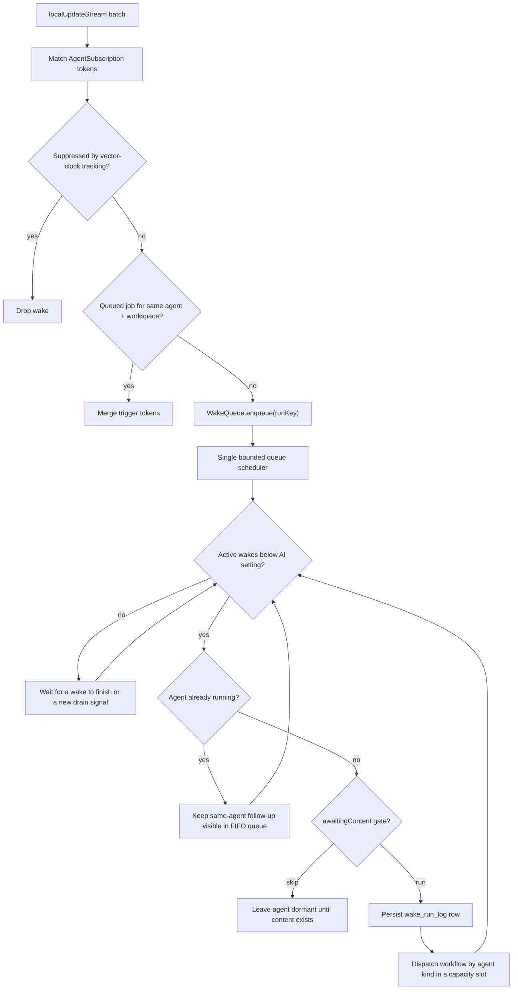

# Why the design is this defensive

`WakeOrchestrator` is shaped around three specific background-agent failure
modes. Reading it as over-engineering misses that each mitigation exists because
the corresponding failure is easy to reach:

1. **Wake storms** after rapid local edits.
2. **Self-trigger loops** after an agent writes to the entities it watches.
3. **Duplicate execution** when an agent is already running.

# The path from change to wake

Note the input: **`localUpdateStream`, not `updateStream`**. A synced change must
not wake an agent on the receiving device for work the originating device
already did. See [persistence](../../architecture/persistence.md).

# Suppression is pre-registered

Suppression state is registered **before** execution starts, then replaced with
the actual mutated-entity vector clocks afterwards.

That ordering closes the race between "the agent already wrote to the database"
and "the suppression tracker recorded the write". Register afterwards and the
agent's own write can slip through as a fresh notification and re-wake it.

# Workspace partitioning

`WakeJob.workspaceKey` partitions merging, superseding and cancellation by
`(agentId, workspaceKey)` — required by ADR 0022, where the Daily OS planner is
**one identity handling many day workspaces** (`day:<dayId>`).

Without it, a day-B capture wake would merge into — or cancel — a day-A draft
wake, because both belong to the same agent id.

The key is asymmetric across run-key factories, deliberately:

| Factory | Includes `workspaceKey`? | Why |
|---------|--------------------------|-----|
| `RunKeyFactory.forSubscription` | **No** | Subscription matches for one agent should still coalesce |
| `RunKeyFactory.forManual` | **Yes** | Two day-scoped manual wakes enqueued in the same tick must get distinct run keys instead of the second being deduped away |

A null workspace (task, project, improver agents) only partitions with other
null workspaces, so their behaviour is unchanged.

# Wake reasons

`WakeReason` has five values: `subscription`, `creation`, `reanalysis`,
`scheduled`, `transcriptionComplete`.

**`transcriptionComplete` bypasses the throttle**, so a user who just finished
speaking does not wait out the 120-second coalescing window. Both transcript
paths — the local `AutomaticPromptTrigger` and the synced
`SyncedAudioInferenceDispatcher` — route through
`WakeOrchestrator.requestContentWake`, which honours the automatic-updates
opt-in: with automation off, the transcript only persists the stale watermark
(surfacing the manual *Update now* CTA) instead of enqueuing inference. The
enqueued wake carries `WakeInitiator.automation`, so toggling automation off
sweeps a still-queued transcript wake from the queue.

**Image analyses deliberately have no analogous reason.** A stored analysis is an
`AiResponseEntry` linked *from the image*, so its creation notifies only the
image and response ids — never the tasks, since notification propagation is one
hop. Instead, `SkillInferenceRunner.runImageAnalysis` emits the standard
child-changed pairs (`taskId` + `PROPAGATED::taskId`) after persisting, for
**every parent task of the image** (an image can be linked from several tasks;
non-task parents are skipped since only task contexts render analyses), unioned
with the resolved `linkedTaskId`. Each parent agent's normal `subscription` wake
picks it up on the 120-second coalesced path, so it merges with the image-add
wake instead of racing it.

# Throttling

Subscription-driven wakes are throttled with a **120-second** window.

A subscription can opt into daily-digest deferral for propagated-only matches.
Project-agent subscriptions use that path, so linked-task churn waits for the
scheduled project digest; task-agent subscriptions opt out, so child-entry and
task-context updates refresh on the normal coalesced path.

Project agents never carry a recurring clock wake. Their subscription job uses
`nextWakeAt` only while queued, while `ProjectActivityMonitor` arms a one-shot
state-level `scheduledWakeAt` whenever local project-linked work becomes
pending. Creation uses the same one-shot field as a restart fallback for its
immediate in-memory job, and a failed project wake re-arms it for the next local
06:00, advancing an already-overdue deadline instead of retrying every scan.
The shared project-agent automation policy gates local monitoring, startup and
sync-restored subscriptions, and workflow fallback creation. With explicit
opt-out, observation subscriptions remain registered but their matches cannot
queue or persist automatic wakes, and a manually requested wake cannot
synthesize a new fallback afterward. Opt-out clears every existing project
fallback, including markerless creation rows from older state. Direct project
edits still use the shorter
coalescing deadline when automation is allowed, while manual requests bypass
throttling. A successful wake with no remaining creation or project activity
clears `scheduledWakeAt`. The scheduled-wake manager separately clears legacy
completed rows only after at least one successful wake and only when no pending
activity remains; it preserves never-woken creation work and rows whose pending
marker proves that work remains, and skips enqueue while equivalent work is
already queued or running. Retirement re-reads the state at the write boundary
and rechecks that its schedule is still due and dormant, so an activity marker,
deferred deadline, or replacement manual schedule written during the scan is
never erased. A successful wake retains a future fallback when
newer activity landed during the run. Every failure after state
resolution—including setup failures before inference—uses the same
create-or-advance deadline policy. Explicit cancellation persists removal of
`pendingProjectActivityAt`, `nextWakeAt`, and `scheduledWakeAt` atomically, then
clears queued work, so an in-flight
failure cannot re-arm cancelled work and a storage failure cannot leave the UI
falsely showing a completed cancellation. A post-commit outbox failure still
clears runtime work to honor the committed cancellation before surfacing the
sync error; an ambiguous transaction failure first re-reads the row and leaves
runtime work intact unless those fields are confirmed absent. Retry and success paths read the
current identity policy inside that same persistence transaction, so toggling
automation during a long wake cannot be undone by policy captured at wake
start. The drain also re-reads policy immediately before executor launch, after
runner acquisition, content gating, run persistence, and the pre-wake hook, so
an automatic job already removed from the queue cannot race a late opt-out into
paid inference.

Persisted throttle set/clear operations re-read and write the state inside the
same repository transaction as other partial state writers. This keeps the
device-local `nextWakeAt` mutation from restoring a consumed project marker or
erasing activity that was persisted by the project monitor concurrently.

A subscription can instead opt **out of the window entirely** with
`AgentSubscription.drainImmediately`: matches enqueue and dispatch once the
whole batch has routed (never mid-loop — a second matching subscription must
still find the job to merge into), no deadline is armed, and registering the
subscription retires any persisted `nextWakeAt` left by the defer-first
policy. The policy travels **on the queued job** (`WakeJob.drainImmediately`,
upgraded monotonically on merge): the throttle is per-agent, so an agent
holding both a deferred and an immediate subscription dispatches the
immediate job past a deadline the deferred job still honours, and the
post-run path arms the follow-up deadline only for deferred queued work.
Goal-agent signal subscriptions use this — a habit check-off is atomic
evidence and the wake it triggers is the deterministic €0 Phase A tier, so
deferral protects nothing and delays the user-visible acknowledgment. Bursts
stay safe because the runner single-flights per agent and queued jobs merge
tokens.

Manual wakes — `creation`, `reanalysis`, and scheduled jobs enqueued by
`ScheduledWakeManager` — bypass subscription matching and the throttle.

# The content gate

Task agents auto-provisioned from category defaults can start with
`awaitingContent = true`. The orchestrator skips the wake until the task or one
of its linked entries has meaningful text, then clears the flag and lets the wake
proceed. Event agents use the same shared gate with their own checker.

Without it, auto-provisioning would burn an inference run on a bare title.

# Concurrency

Two independent limits apply:

- **Global**: up to the device-local AI concurrency setting — range **1–8**,
  default **3** (`AiRuntimeSettings`). It lives in AI Settings and the scheduler
  re-reads it whenever capacity frees up, so tuning takes effect without a
  restart. Setting it to 1 restores the former globally sequential behaviour.
- **Per agent**: `WakeRunner` enforces single-flight, so two wakes for the same
  agent never overlap even when global capacity is free.

Each acquisition carries an ownership lease. Stale-drain recovery releases the
superseded generation's leases before starting its replacement; late cleanup or
timeout callbacks from the old generation cannot release or abort the newer
run that now owns the same agent lock. Each lease keeps its own progress time,
so unrelated healthy wakes cannot hide a stalled slot by refreshing only the
generation-wide clock. A dequeued job also rechecks its drain
generation after every pre-dispatch await. Before run-log insertion, a
superseded drain returns the job to the queue and wakes the active scheduler;
after insertion, it returns a persisted continuation that resumes the same run
key without inserting a duplicate row. Drain-owned jobs remain visible to
manual supersession and cancellation while outside the queue, so an obsolete
older request is discarded rather than resurrected by a late continuation.
Run-key history remains intact until both the visible queue and the drain-owned
handoff set are empty, preventing restoration from duplicating an in-flight
logical wake.

Only the scheduler mutates `WakeQueue`, suppression state, throttle state and
run-key history. Concurrent work begins only after a job has acquired its
`WakeRunner` agent lock. Workflows and conversation managers are created per
wake; agent sync transaction buffers are zone-local; Drift serialises database
work on its connection. Independent partial state writers use
`AgentSyncService.updateAgentState` or an equivalent transaction-scoped re-read
and merge. In particular, report-stale watermarks cannot erase project activity
markers, and project activity cannot erase a concurrently-written freshness
watermark.

The bounded limit also keeps provider, API and database pressure finite. A
downstream provider rate-limit or connection failure continues through the
per-wake failure path and does not cancel other active wakes.

# Wake execution bound

A single wake may run for at most **10 minutes**. This cap accommodates slower
local reasoning models and multi-turn workflows while still releasing a stuck
runner eventually. Crossing it marks the wake run `aborted` and releases the
agent lock. Dart cannot cancel the executor's underlying future, so inference
may continue in the background; its eventual result is ignored by the drain.
Workflows must therefore continue to treat late writes as normal database
mutations that can produce a later notification.

The scheduler only treats a drain as stale after **12 minutes without
progress**. Dispatching or completing a wake resets that clock, so a healthy
drain can process several slow wakes without being judged by its total age. If
work remains queued, the one-minute safety net re-enters stale detection even
while a drain is active; this recovers terminal persistence stalls without
waiting for another enqueue. Recovery releases the superseded generation's
runner leases before replacement dispatch, so a terminal status write cannot
consume the only global slot indefinitely. The threshold deliberately exceeds
the wake cap, leaving room for the bounded pre-wake hook and terminal status
persistence. Progress is refreshed again immediately before the executor timer
is armed, so pre-execution persistence and policy latency never shorten the
executor's own ten-minute window.

# Completion signalling

`runCompletions` is a broadcast `Stream<WakeRunCompletion>` — one event per
finished wake (`completed` / `failed` / `aborted`, carrying the error object for
failures), keyed by the run key `enqueueManualWake` returns.

It is **in-process only, never persisted**. Callers that enqueued a wake and
need its precise outcome without polling — the Daily OS durable
`draftPlan`/`refinePlan` job executor (ADR 0032 phase 1) — subscribe *before*
enqueueing and filter on the returned run key. The durable record of the same
outcome remains the `wake_run_log` row.

# Deferred deadlines are device-local

All three scheduling fields — `nextWakeAt`, `sleepUntil`, `scheduledWakeAt` —
are device-local. Each device schedules its own wakes, so the sync apply path
preserves the local row's scheduling rather than letting a peer's
`AgentStateEntity` overwrite it (`_preserveLocalScheduling`). When a peer state
consumes project activity, the local one-shot fallback is cleared rather than
preserved; the receiving device also clears its throttle and removes queued
automatic work for that batch while preserving explicit user wakes. On a
project state's first arrival, the peer fallback is likewise
discarded and rebuilt only when local policy and a pending marker require one,
using the receiving device's clock. `activeProjectId` supplies the project-row
signal when state arrives before identity. Startup and sync-arrival repairs that add or remove only that
fallback write directly through the repository without changing `updatedAt` or
the vector clock. This applies to both fallback repair and dormant-schedule
retirement: local scheduling maintenance must never become a newer synced
version of otherwise stale state. Settings opt-in/opt-out and resumed-agent
restoration follow the same raw local transaction rule. Startup also removes
markerless or pending fallbacks unconditionally when the project agent has
explicitly opted out; the completed-wake guard applies only to legacy cleanup
for agents whose automation remains allowed.
