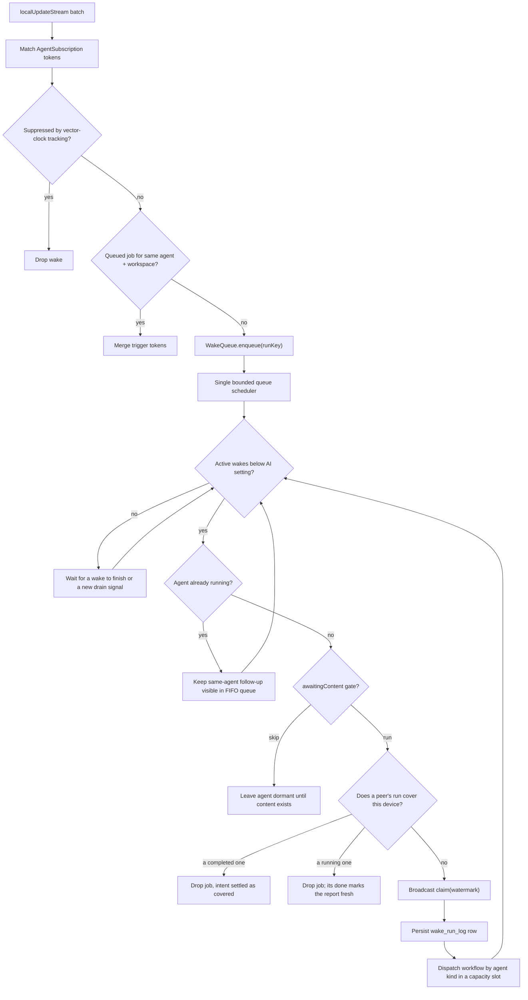
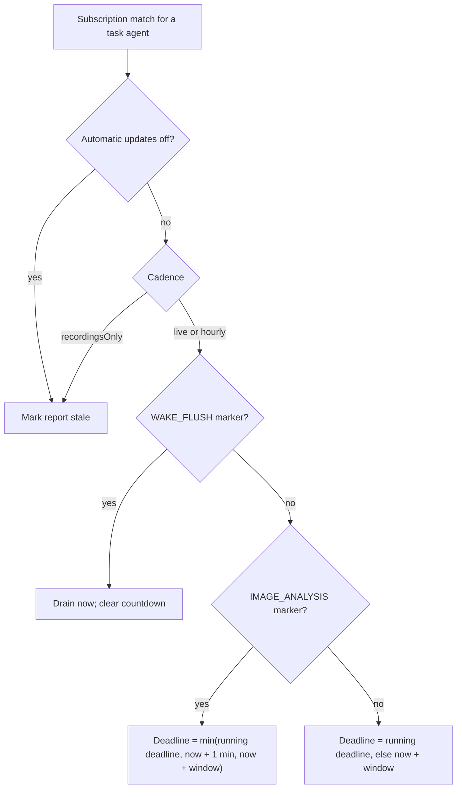
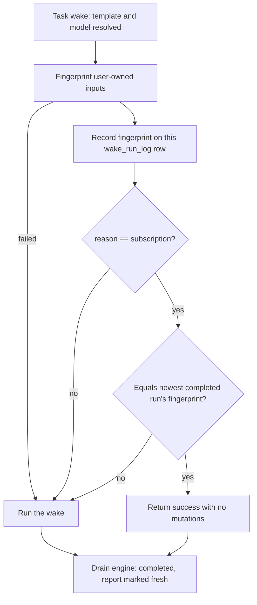
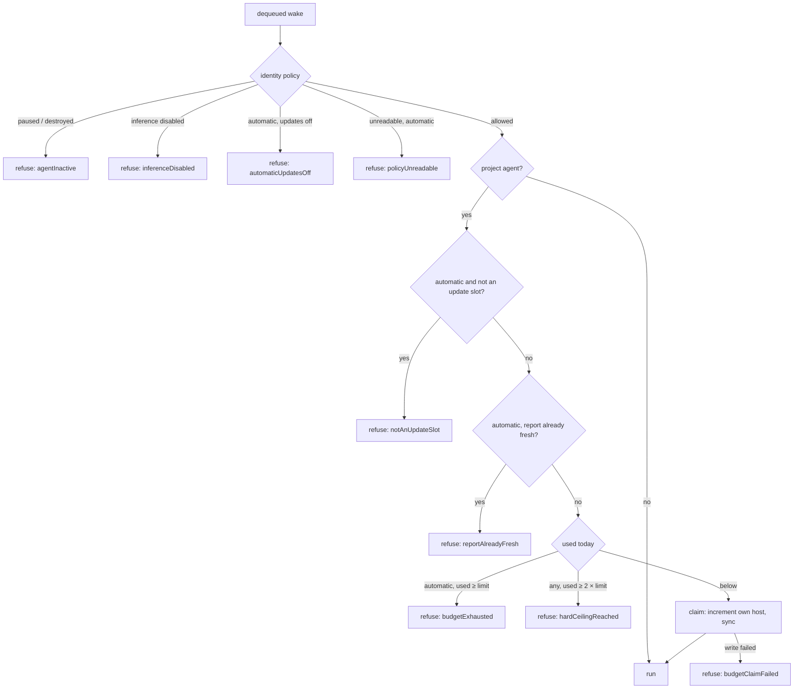
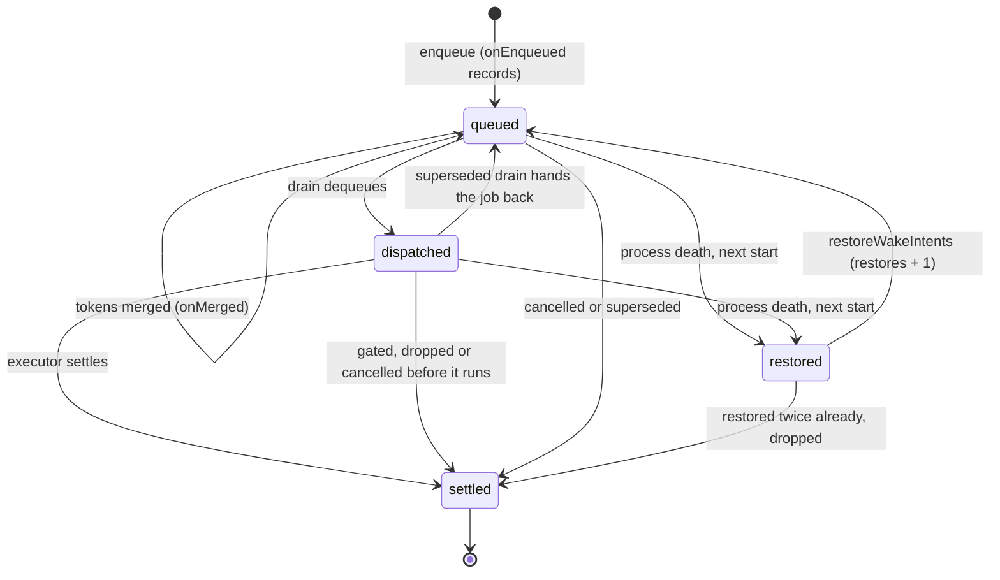
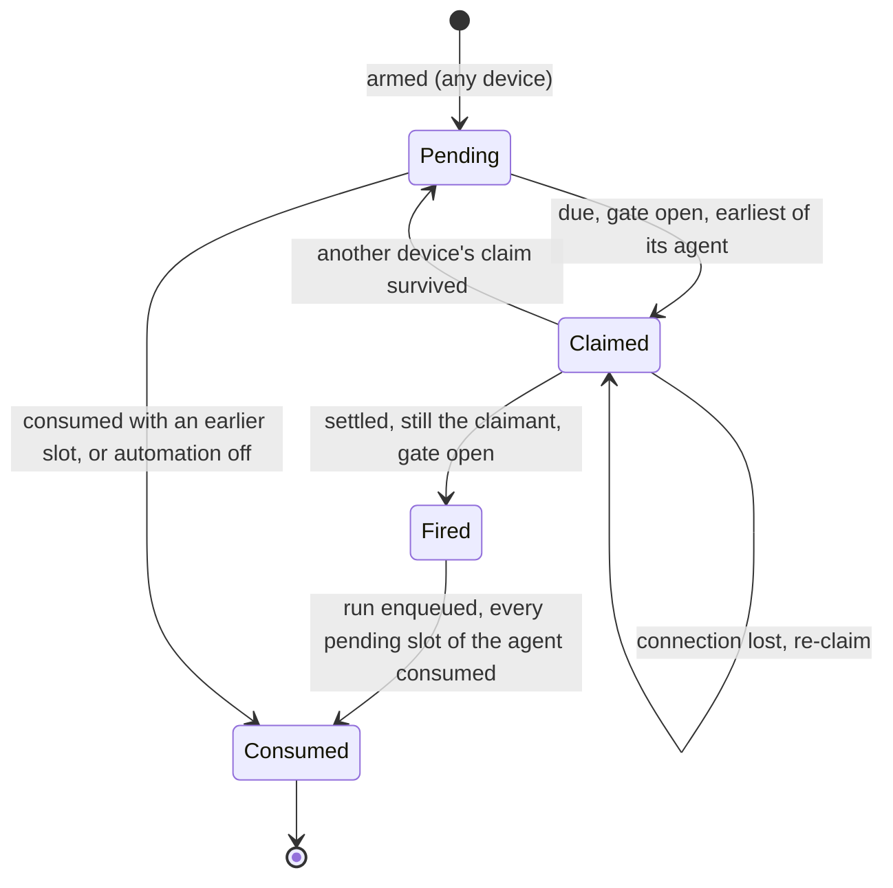
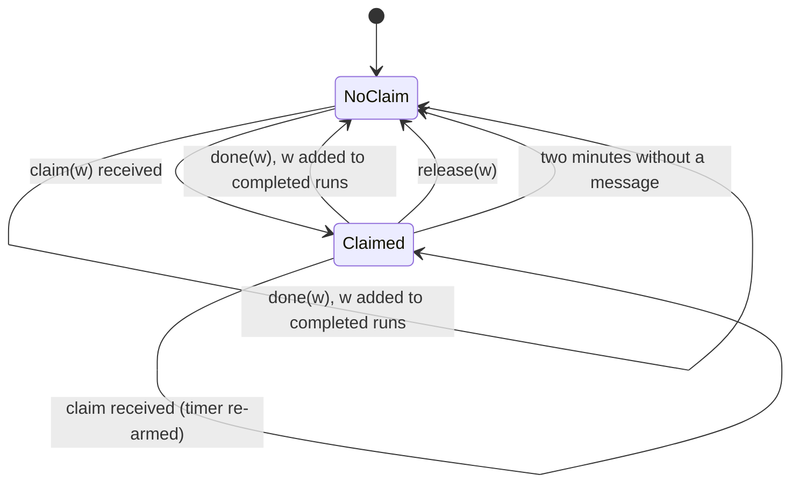

# Why the design is this defensive

`WakeOrchestrator` is shaped around three specific background-agent failure
modes. Reading it as over-engineering misses that each mitigation exists because
the corresponding failure is easy to reach:

1. **Wake storms** after rapid local edits.
2. **Self-trigger loops** after an agent writes to the entities it watches.
3. **Duplicate execution** when an agent is already running.

Two further guarantees are model-checked in `specs/tla/WakeRuntime.tla`
([ADR 0066](../../../docs/adr/0066-model-checked-agent-wakes-and-confirmations.md)):
`SingleFlight` — one live run per agent, even across an abort — and
`NoLostWake` — every trigger is eventually covered by a run that completes,
across a process death.

Both guard against doing too *little*. Neither bounds how much work runs, and
in 2026-10 a project agent ran several hundred paid wakes a day. A fourth
defence therefore sits below every trigger path: the
[daily wake budget](#the-daily-wake-budget), enforced at the last check before
the executor ([ADR 0112](../../../docs/adr/0112-a-daily-wake-budget-bounds-every-agent-wake.md)).

# The path from change to wake


```mermaid
flowchart TD
  Update["localUpdateStream batch"] --> Match["Match AgentSubscription tokens"]
  Match --> Suppress{"Suppressed by vector-clock tracking?"}
  Suppress -->|yes| Drop["Drop wake"]
  Suppress -->|no| Merge{"Queued job for same agent + workspace?"}
  Merge -->|yes| Coalesce["Merge trigger tokens"]
  Merge -->|no| Queue["WakeQueue.enqueue(runKey)"]
  Queue --> Drain["Single bounded queue scheduler"]
  Drain --> Capacity{"Active wakes below AI setting?"}
  Capacity -->|no| WaitSlot["Wait for a wake to finish or a new drain signal"]
  WaitSlot --> Capacity
  Capacity -->|yes| Busy{"Agent already running?"}
  Busy -->|yes| KeepQueued["Keep same-agent follow-up visible in FIFO queue"]
  KeepQueued --> Capacity
  Busy -->|no| Content{"awaitingContent gate?"}
  Content -->|skip| Wait["Leave agent dormant until content exists"]
  Content -->|run| Coord{"Does a peer's run cover this device?"}
  Coord -->|a completed one| Covered["Drop job, intent settled as covered"]
  Coord -->|a running one| HandedOver["Drop job; its done marks the report fresh"]
  Coord -->|no| Claim["Broadcast claim(watermark)"]
  Claim --> Persist["Persist wake_run_log row"]
  Persist --> Exec["Dispatch workflow by agent kind in a capacity slot"]
  Exec --> Capacity
```

Note the input: **`localUpdateStream`, not `updateStream`**. A synced change must
not wake an agent on the receiving device for work the originating device
already did. See [persistence](../../architecture/persistence.md).

# Suppression is pre-registered

Suppression state is registered **before** execution starts, then replaced with
the actual mutated-entity vector clocks afterwards.

That ordering closes the race between "the agent already wrote to the database"
and "the suppression tracker recorded the write". Register afterwards and the
agent's own write can slip through as a fresh notification and re-wake it.

# Workspace partitioning

`WakeJob.workspaceKey` partitions merging, superseding and cancellation by
`(agentId, workspaceKey)` — required by ADR 0022, where the Daily OS planner is
**one identity handling many day workspaces** (`day:<dayId>`).

Without it, a day-B capture wake would merge into — or cancel — a day-A draft
wake, because both belong to the same agent id.

The key is asymmetric across run-key factories, deliberately:

| Factory | Includes `workspaceKey`? | Why |
|---------|--------------------------|-----|
| `RunKeyFactory.forSubscription` | **No** | Subscription matches for one agent should still coalesce |
| `RunKeyFactory.forManual` | **Yes** | Two day-scoped manual wakes enqueued in the same tick must get distinct run keys instead of the second being deduped away |

A null workspace (task, project, improver agents) only partitions with other
null workspaces, so their behaviour is unchanged.

# Wake reasons

`WakeReason` has five values: `subscription`, `creation`, `reanalysis`,
`scheduled`, `transcriptionComplete`.

**`transcriptionComplete` bypasses the throttle**, so a user who just finished
speaking does not wait out the agent's coalescing window — whatever its
[wake cadence](#task-agent-wake-cadence), including *recordings only*. Both transcript
paths — the local `AutomaticPromptTrigger` and the synced
`SyncedAudioInferenceDispatcher` — route through
`WakeOrchestrator.requestContentWake`, which honours the automatic-updates
opt-in: with automation off, the transcript only persists the stale watermark
(surfacing the manual *Update now* CTA) instead of enqueuing inference. The
enqueued wake carries `WakeInitiator.automation`, so toggling automation off
sweeps a still-queued transcript wake from the queue.

**Image analyses deliberately have no analogous reason.** A stored analysis is an
`AiResponseEntry` linked *from the image*, so its creation notifies only the
image and response ids — never the tasks, since notification propagation is one
hop. Instead, `SkillInferenceRunner.runImageAnalysis` emits the standard
child-changed pairs (`taskId` + `PROPAGATED::taskId`) after persisting, for
**every parent task of the image** (an image can be linked from several tasks;
non-task parents are skipped since only task contexts render analyses), unioned
with the resolved `linkedTaskId`. Each parent agent's normal `subscription` wake
picks it up on its coalesced path, so it merges with the image-add wake instead
of racing it. The batch also carries an `IMAGE_ANALYSIS::taskId` marker, which
brings that coalesced wake to within a minute (see
[task-agent wake cadence](#task-agent-wake-cadence)).

# Throttling

Subscription-driven wakes are throttled with a coalescing window: **120 seconds**
(`WakeOrchestrator.throttleWindow`) for every agent without a wake cadence, and
the cadence's window for a task agent (next section).

## Task-agent wake cadence

A task agent whose automatic updates are on wakes at an `AgentWakeCadence`
(`lib/classes/agent_wake_cadence.dart`). The on/off switch stays
the consent gate — with it off nothing below applies, and the agent only runs
when asked.

| Cadence | A change runs after | Stopped timer, task done | Image analysis |
|---------|--------------------|--------------------------|----------------|
| `live` | 2 minutes | now | ≤ 1 minute |
| `hourly` (default) | 1 hour | now | ≤ 1 minute |
| `recordingsOnly` | never — marks the report stale | no effect | no effect |

A finished transcript wakes every cadence at once (`requestContentWake`).

**Resolution is live and most-specific-first**: the task's own
`AgentConfig.wakeCadence`, else its category's
`CategoryDefinition.agentWakeCadence`, else the device's
`AiRuntimeSettings.defaultWakeCadence`, else `hourly`
(`resolveAgentWakeCadence`). The orchestrator keeps only each task agent's own
choice and category (`mirrorTaskWakeCadence`, from the identity's single
`allowedCategoryIds` entry) and resolves through `taskWakeCadenceResolver` on
every match, reading the category from `EntitiesCacheService` — so a changed
category or device default applies to the next change without re-registering
anything. A countdown already running keeps its deadline. Agents absent from
that runtime map — every non-task kind — have no cadence and keep 120 seconds.

`AgentConfig.wakeCadence` is deliberately **not** in the sync merge that
overlays a peer's missing config keys: null is a real choice there ("follow the
category"), so the incoming value always wins. An older client that does not
know the field therefore resets a task to its category's cadence when it writes
the identity.

Two marker tokens (`lib/services/db_notification.dart`) carry the moments that
should not wait:

- **`WAKE_FLUSH::taskId`** — the user finished a piece of work: `EntryController`
  stopping a timer started from the task, or `updateTaskImpl` moving the task
  into DONE outside an agent wake. The router marks the agent's job
  `drainImmediately`, clears its countdown and dispatches after the batch.
- **`IMAGE_ANALYSIS::taskId`** — `SkillInferenceRunner.runImageAnalysis`
  finished an analysis. The requested deadline becomes `now + 1 minute` when
  that is sooner than the agent's window, and a running countdown is only ever
  pulled forward, never extended — several images in a row share one run.

Markers name the entity, so one arriving in a later batch than its write still
reaches the agent watching it.


```mermaid
flowchart TD
  M["Subscription match for a task agent"] --> Off{"Automatic updates off?"}
  Off -->|yes| Stale["Mark report stale"]
  Off -->|no| C{"Cadence"}
  C -->|recordingsOnly| Stale
  C -->|live or hourly| F{"WAKE_FLUSH marker?"}
  F -->|yes| Now["Drain now; clear countdown"]
  F -->|no| I{"IMAGE_ANALYSIS marker?"}
  I -->|yes| Min["Deadline = min(running deadline, now + 1 min, now + window)"]
  I -->|no| W["Deadline = running deadline, else now + window"]
```

A subscription can opt into daily-digest deferral for propagated-only matches;
task-agent subscriptions opt out, so child-entry and task-context updates
refresh on the normal coalesced path.

A subscription can instead be **report-stale-only** (`reportStaleOnly`): a
match marks the agent's report stale and queues nothing. Every project-agent
subscription is one. Project agents do automatic work only in
[update slots](#update-slots-are-leased-and-gated); what marks their reports
stale, how a slot is armed and what a run does with it is in
[project agents](project-and-event-agents.md#stale-reports-and-update-slots).
The drain re-reads policy immediately before executor launch, after runner
acquisition, content gating, run persistence, and the pre-wake hook, so an
automatic job already removed from the queue cannot race a late opt-out into
paid inference.

Persisted throttle set/clear operations read and write state inside the same
repository transaction as other partial state writers. This keeps the
local `nextWakeAt` mutation from restoring a consumed project marker or
erasing activity persisted by the project monitor concurrently. The write
leaves `updatedAt` alone: it is the synced last-writer-wins timestamp, and a
local stamp peers never see would let this device keep a row in a concurrent
conflict that every other device resolves the other way (ADR 0068).

Clear requests made in the same synchronous burst share one transaction. A
single-agent batch uses its direct state lookup; a multi-agent batch uses the
existing chunked pending-wake query and only decodes states with pending wakes.
States carrying only `scheduledWakeAt` are left untouched. Only states whose
`nextWakeAt` is still set are written, and change callbacks run after commit.
Each callback failure is logged separately and leaves later notifications running.
A microtask starts the worker, which runs at most one clear batch at a time;
requests arriving during that batch wait for the next one. Failed transactions
produce no change callbacks and release requests so a later clear can retry.

Repeated clears for one agent share their pending completion. Setting or
hydrating a new deadline starts a new generation: its later clear cannot join
an older request, and completing that older request cannot evict the newer one.
Completion releases the sharing state, so later clears still check for
unhydrated stale deadlines. The worker checks in-memory deadlines before the
transaction and again after the state read, preserving re-armed cooldowns.
Routine clear diagnostics use counted sampling rather than one line per call.

A subscription can instead opt **out of the window entirely** with
`AgentSubscription.drainImmediately`: matches enqueue and dispatch once the
whole batch has routed (never mid-loop — a second matching subscription must
still find the job to merge into), no deadline is armed, and registering the
subscription retires any persisted `nextWakeAt` left by the defer-first
policy. The policy travels **on the queued job** (`WakeJob.drainImmediately`,
upgraded monotonically on merge): the throttle is per-agent, so an agent
holding both a deferred and an immediate subscription dispatches the
immediate job past a deadline the deferred job still honours, and the
post-run path arms the follow-up deadline only for deferred queued work.
Goal-agent signal subscriptions use this — a habit check-off is atomic
evidence and the wake it triggers is the deterministic €0 Phase A tier, so
deferral protects nothing and delays the user-visible acknowledgment. Bursts
stay safe because the runner single-flights per agent and queued jobs merge
tokens.

Manual wakes — `creation`, `reanalysis`, and scheduled jobs enqueued by
`ScheduledWakeManager` — bypass subscription matching and the throttle.

# The content gate

Task agents auto-provisioned from category defaults can start with
`awaitingContent = true`. The orchestrator skips the wake until the task or one
of its linked entries has meaningful text, then clears the flag and lets the wake
proceed. Event agents use the same shared gate with their own checker.

Without it, auto-provisioning would burn an inference run on a bare title.

# The unchanged-input gate

The content gate guards a task's *first* run; this one guards every later
automatic run. Many writes that match a task subscription change nothing the
agent reads: saving a running timer's note unedited stamps a new `dateTo`, a
geolocation backfill re-notifies a fresh entry, a task is re-saved as it was.
Each used to cost a full inference run.

The task workflow (`TaskAgentExecute`, in
`lib/features/agents/workflow/task_agent_execute.dart`) fingerprints the
user-owned inputs right after resolving the template and model, before the
ledger, compaction and prompt assembly. The fingerprint
(`taskWakeInputFingerprint`, in
`lib/features/agents/workflow/task_wake_input_fingerprint.dart`) covers the
task state rendered **without time spent**, the rendered log sources, the
ids linked to and from the task, the category brief, and the template version,
soul version and model. Time spent is left out because a running timer moves
it; finished entries still contribute their own durations through their
sources, so stopping a timer is a change.


```mermaid
flowchart TD
  Start["Task wake: template and model resolved"] --> FP["Fingerprint user-owned inputs"]
  FP -->|"failed"| Run["Run the wake"]
  FP --> Record["Record fingerprint on this wake_run_log row"]
  Record --> Auto{"reason == subscription?"}
  Auto -->|no| Run
  Auto -->|yes| Same{"Equals newest completed run's fingerprint?"}
  Same -->|no| Run
  Same -->|yes| Skip["Return success with no mutations"]
  Skip --> Done["Drain engine: completed, report marked fresh"]
  Run --> Done
```

- **Only subscription wakes skip.** Manual, creation, scheduled and transcript
  wakes always run, but record their fingerprint too, so a no-op edit right
  after "Update now" is recognised.
- **The comparison is per device.** The fingerprint lives in the device-local
  `wake_run_log.input_fingerprint` column, and the reference is the agent's
  newest *completed* run on this device. A null there — older runs, a run whose
  fingerprint failed — never counts as unchanged.
- **It fails open.** Any error while fingerprinting lets the wake run.
- **A skip is a completed run.** It returns an empty mutation map, so the drain
  engine marks the report fresh: the report already reflects these inputs.
- **Deliberately not covered:** other agents' reports shown as project and
  linked-task context, and pull request state. They change out of band and do
  not wake this agent on their own, so they cannot be the reason a wake fired.
- **Known cost:** a tool that applies a change directly during a run, rather
  than proposing it, changes the next fingerprint, so the first automatic wake
  after such a run always goes ahead.

# Concurrency

Two independent limits apply:

- **Global**: up to the device-local AI concurrency setting — range **1–8**,
  default **3** (`AiRuntimeSettings`). It lives in AI Settings and the scheduler
  re-reads it whenever capacity frees up, so tuning takes effect without a
  restart. Setting it to 1 restores the former globally sequential behaviour.
- **Per agent**: `WakeRunner` enforces single-flight, so two wakes for the same
  agent cannot hold the runner simultaneously. The drain also skips an agent
  while an earlier executor of it is still live — one an abort, the run
  timeout or a stale-drain reset detached from its lease — so a follow-up wake
  cannot overlap it. That hold lasts at most `hungExecutorAfter`
  (**30 minutes**, three run caps): an executor still running then is reported
  once as hung and stops blocking, so a future that never settles cannot wedge
  its agent until the next launch. When a held-back executor does settle, it
  kicks the drain for the agent's queued work.

Two probes answer "is this work still live?" for callers that must not start a
replacement beside it. `hasPendingOrActiveWake(agentId, workspaceKey)` and
`liveRunKeyWithToken(token)` both count a job that is queued, one a drain pass
has taken out of the queue — awaiting the policy read before its lease, or held
back until the pass requeues it — one holding the runner lock, and an executor
running on after an abort. `liveRunKeyWithToken` stops counting an executor once
it is past `hungExecutorAfter`, as the drain does. The coordinator digest's
crash recovery uses the first; Daily OS processing jobs use the second to find
their request's wake by its `processing_job:` token (ADR 0070). A probe that
missed the drain-held window let the digest recovery re-arm a digest whose run
was about to start.

Each acquisition carries an ownership lease. Stale-drain recovery releases
only the superseded generation's individually stale leases before starting its
replacement. Healthy concurrent leases retain their agent locks until their
own executors settle, while late cleanup or timeout callbacks from a stale lease
cannot release or abort the newer run that now owns the same agent lock. Each
lease keeps its own progress time, so unrelated healthy wakes cannot hide a
stalled slot by refreshing only the generation-wide clock. A healthy lease
retained from a superseded generation is excluded from the replacement
generation's stale calculation, but every later scheduler pass evaluates it
independently and releases it if its own progress becomes stale. A dequeued job
also rechecks its drain
generation after every pre-dispatch await. Before run-log insertion, a
superseded drain returns the job to the queue and wakes the active scheduler;
after insertion, it returns a persisted continuation that resumes the same run
key without inserting a duplicate row. Drain-owned jobs remain visible to
manual supersession and cancellation while outside the queue, so an obsolete
older request is discarded rather than resurrected by a late continuation.
Run-key history remains intact until both the visible queue and the drain-owned
handoff set are empty, preventing restoration from duplicating an in-flight
logical wake.

Only the scheduler mutates `WakeQueue`, suppression state, throttle state and
run-key history. Concurrent work begins only after a job has acquired its
`WakeRunner` agent lock. Workflows and conversation managers are created per
wake; agent sync transaction buffers are zone-local; Drift serialises database
work on its connection. Independent partial state writers use
`AgentSyncService.updateAgentState` or an equivalent transaction-scoped re-read
and merge. In particular, report-stale watermarks cannot erase project activity
markers, and project activity cannot erase a concurrently-written freshness
watermark.

The bounded limit also keeps provider, API and database pressure finite. A
downstream provider rate-limit or connection failure continues through the
per-wake failure path and does not cancel other active wakes.

# Wake execution bound

A single wake may run for at most **10 minutes**. This cap accommodates slower
local reasoning models and multi-turn workflows while still releasing a stuck
runner eventually. Crossing it marks the wake run `aborted` and releases the
agent lock. Dart cannot cancel the executor's underlying future, so the
executor keeps running; its eventual result is ignored by the drain, and the
agent's next wake waits for it (see the per-agent limit above). Workflows must
therefore continue to treat late writes as normal database mutations that can
produce a later notification.

What an aborted executor no longer does is **pay for more model turns**. The
drain runs it in a zone carrying `agentWakeAbortedZoneKey`, a check that turns
true once the lease is aborted — by the timeout, the user's cancel or a pause —
and `ConversationRepository` reads `isAgentWakeAborted` before every turn. An
aborted wake stops at the next turn boundary instead of finishing its
conversation in the background.

# The daily wake budget

Project agents answer to a per-agent daily budget
([ADR 0112](../../../docs/adr/0112-a-daily-wake-budget-bounds-every-agent-wake.md)).
`AgentConfig.maxWakesPerDay` is synced on the identity; null reads as **10**
and every value is clamped to 1–24 (`effectiveMaxWakesPerDay`). The ledger is
`AgentStateEntity.dailyWakes`, a G-counter keyed `<local day>|<host>`: each
device increments only its own key, and the concurrent resolver joins the two
sides element-wise, so concurrent claims on two devices add up.

The drain decides twice. Before dispatch it reads the ledger only, so a
refused wake leaves no run row. Immediately before the executor, after every
other await, `_currentPolicyDecision(job, claimBudget: true)` reads the state,
decides and increments in one `updateAgentState` transaction — claim, then
execute. That point is the one every wake path reaches, so the bound holds
whatever queued the job.


```mermaid
flowchart TD
  Job["dequeued wake"] --> Identity{"identity policy"}
  Identity -->|"paused / destroyed"| Inactive["refuse: agentInactive"]
  Identity -->|"inference disabled"| Disabled["refuse: inferenceDisabled"]
  Identity -->|"automatic, updates off"| Off["refuse: automaticUpdatesOff"]
  Identity -->|"unreadable, automatic"| Unreadable["refuse: policyUnreadable"]
  Identity -->|"allowed"| Kind{"project agent?"}
  Kind -->|"no"| Run["run"]
  Kind -->|"yes"| Slot{"automatic and not an update slot?"}
  Slot -->|"yes"| NotSlot["refuse: notAnUpdateSlot"]
  Slot -->|"no"| Fresh{"automatic, report already fresh?"}
  Fresh -->|"yes"| AlreadyFresh["refuse: reportAlreadyFresh"]
  Fresh -->|"no"| Used{"used today"}
  Used -->|"automatic, used ≥ limit"| Exhausted["refuse: budgetExhausted"]
  Used -->|"any, used ≥ 2 × limit"| Ceiling["refuse: hardCeilingReached"]
  Used -->|"below"| Claim["claim: increment own host, sync"]
  Claim -->|"write failed"| ClaimFailed["refuse: budgetClaimFailed"]
  Claim --> Run
```

- **Automatic** wakes stop at the limit. **Explicit** ones (`WakeInitiator.user`
  — "Update now", creation) run past it, and count, up to twice the limit.
- A claimed wake counts even if it fails or is aborted: it may have spent
  tokens. A run key claims at most once, so a superseded drain handing a run
  back does not count it twice.
- A refused job completes `aborted` with `WakeRefusedError(cause)`; one
  refused after its run row was written records `wake refused: <cause>` as the
  row's error.
- Agent internals render the budget for project agents
  (`AgentWakeBudgetRow`): "3 of 10 used today", "Limit reached — automatic
  updates resume tomorrow" once it is, and a stepper over `WakeBudget.choices`
  that writes through `AgentService.updateMaxWakesPerDay`.
- Bound: per device, `limit` automatic and `2 × limit` total wakes a day.
  Devices that see each other's claims share it, except one crossing claim
  each; devices partitioned all day each spend their own.

# Pause halts

`WakeOrchestrator.haltAgent` is the kill-switch: it removes the agent's
subscriptions and throttle, cancels its queued work in every workspace and
aborts a running wake (which then stops before its next model turn). Pause,
destroy and delete call it, and so does sync apply when another device's pause
or destroy arrives. Before, a pause only removed subscriptions: a queued wake
was dropped only if the drain happened to re-check policy, and a running one
finished its conversation.

# Every decision is logged once

Each routing, enqueue and dispatch decision writes one line under the
`wakeAudit` sub-domain (`formatWakeAudit`):

```
wake suppressed stage=execute agent=… cause=budgetExhausted reason=subscription initiator=automation source=… tokens=3 budget=10/10
```

`stage` is `route` (the batch router declined to queue), `enqueue` (every job
entering the queue, whoever asked), `dispatch` (the pre-dispatch check) or
`execute` (the final check). `cause` is a `WakeDecisionCause` name. Ids are
sanitized and trigger tokens are counted, never printed. Grepping one agent's
`wakeAudit` lines across devices reconstructs why each of its wakes ran or did
not.

`waitForAgentExecutors(agentId)` is the explicit settlement barrier for
operations that cannot tolerate those late writes. It waits for tracked
executors across every workspace, including futures detached by an earlier
abort, and observes both successful and failed completion. Callers first retire
the agent and cancel queued/drain-owned jobs so no replacement executor can
start. Project deletion uses the barrier before writing the journal tombstone;
`runCompletions` or a released runner lock alone is not evidence of settlement.

The scheduler only treats a drain as stale after **12 minutes without
progress**. Dispatching or completing a wake resets that clock, so a healthy
drain can process several slow wakes without being judged by its total age. If
work remains queued, the one-minute safety net re-enters stale detection even
while a drain is active; this recovers terminal persistence stalls without
waiting for another enqueue. Recovery releases each individually stale runner
lease before replacement dispatch, so a terminal status write cannot consume a
global slot indefinitely, but it preserves newer healthy leases from the same
superseded generation. The threshold deliberately exceeds the wake cap, leaving
room for the bounded pre-wake hook and terminal status persistence. Progress is
refreshed again immediately before the executor timer is armed, so pre-execution
persistence and policy latency never shorten the executor's own ten-minute
window.

Runtime initialization watches the feature maintenance registry for its entire
lifetime. Reading it only during scans would pause its configuration listeners
between scans and delay recovery after a profile is repaired.

The safety net skips a drain when every queued job is a subscription wake whose
throttle deadline is still in the future. The deadline timer dispatches it when
due; an expired deadline, immediate job, or active drain still permits the
minute check. This avoids repeated idle queue scans without weakening stale-drain
recovery.

Task and project workflow logs include `wake stages` with sanitized agent/run
identifiers and `preparationMs`, `modelToolsMs`, and `persistenceMs`. Preparation
includes context and prompt setup; model/tools includes follow-up model calls
and tool work; persistence covers final output handling. The log is emitted from
conversation cleanup on success and failure, so a failed inference still exposes
where time was spent. Memory preparation has separate compaction diagnostics.

# Wake intents survive a process death

The queue lives in memory, so a crash used to drop every queued wake — and
a wake whose run the crash interrupted was never retried either. The
device-local `WakeIntentStore` (one JSON list under `AGENT_WAKE_INTENTS` in
the settings database) closes that: **one intent per queued job**, keyed by
its run key. Two kinds of wake are excluded because a durable record of their
own already owns their recovery, and a second path beside it runs the work
twice:

- Wakes carrying a Daily OS `processing_job:` token: the
  [day processing outbox](../daily_os_next/processing-outbox.md) owns their
  recovery, cancellation, separate job payloads, and artifact run-key
  provenance.
- The coordinator's `digest:` wake: its scheduled-wake record is retried by
  `DayAgentService` when a crash interrupted the run
  ([coordination protocol](../daily_os_next/coordination-protocol.md)). As an
  intent too, the digest ran twice — the record's retry and the restored
  intent both fired, and an intent whose settle had not reached disk replayed
  a digest that had already completed (`specs/tla/DigestRecovery.tla`,
  ADR 0070).

Startup discards legacy intent copies of both rather than replaying them, and
ordinary restored wakes never merge into a queued job of either kind.

- The queue's `onEnqueued` hook records a job's intent; `onMerged` adds the
  tokens merged into it while it waits. Tokens merge only into jobs still in
  the queue, so a run covers exactly its own job's intent — a trigger that
  arrives mid-run belongs to another job and stays owed.
- The intent is settled when the job's run settles — for a detached executor,
  when it actually settles, not when its lease was aborted — or when the job
  is dropped for good: the content gate or policy drop it, or a cancellation
  or a superseding manual wake removes it. A job the drain hands back to the
  queue after a superseded generation stays owed.
- At startup, after the subscription passes, `restoreWakeIntents` re-queues
  every intent the previous process left unsettled — only those loaded from
  disk, once, never the jobs this process has queued since. Intents of one
  agent and workspace become one job — two manual wakes enqueued in the same
  tick would share a run key, and the queue would drop the second — which is
  user-initiated if any of its intents was. It merges into a job already
  queued there, unless that would put a user's wake on an automation job that
  disabling automatic updates drops; then it is queued on its own.
- An intent restored twice without a run of it settling is dropped with an
  error log: a wake that kills the process every time must not crash every
  future launch.


```mermaid
stateDiagram-v2
  [*] --> queued: enqueue (onEnqueued records)
  queued --> queued: tokens merged (onMerged)
  queued --> dispatched: drain dequeues
  dispatched --> queued: superseded drain hands the job back
  dispatched --> settled: executor settles
  dispatched --> settled: gated, dropped or cancelled before it runs
  queued --> settled: cancelled or superseded
  queued --> restored: process death, next start
  dispatched --> restored: process death, next start
  restored --> queued: restoreWakeIntents (restores + 1)
  restored --> settled: restored twice already, dropped
  settled --> [*]
```

The store reads the settings database once — a re-run initialization reuses
that read — and every write waits for it, so an early write never replaces the
persisted intents with a partial snapshot. Writes are coalesced: a burst of
triggers costs one or two settings writes. A
Glados trace in `wake_orchestrator_intents_test.dart` drives the real
orchestrator and store through generated triggers, run completions and a
crash, and checks `NoLostWake` after a final restart; it is what showed that
settling per agent with a sequence cutoff lost a trigger queued in a second
job of the same agent.

Two queries let other writers depend on the store. `flushWakeIntents`
completes once every intent recorded so far is on disk. Background write
failures are logged, but this durability barrier throws; a later flush retries
the current snapshot even without another mutation. A fired window that settles
before its scheduled record can be consumed retains an in-memory receipt.
`owesWake` includes that receipt so subsequent scans do not repeat a completed
inference during a storage outage. Consumption (or observing a newer window)
acknowledges the receipt and removes the tag from any still-running intent; the
intent itself remains restorable. Receipts do not survive process death: the
existing finish-before-consume crash limitation remains. `owesWake` says
whether the wake firing one scheduled-wake window is owed — queued, running,
or left by the previous process for startup to restore; it waits for the
store's read, so a restorable intent is never missed. The window — the record
id and its deadline — is tagged onto the job's intent by
`markScheduledWindow`, survives into the next process and moves with the
intent when a restored one is adopted by a queued job. Matching on the agent,
workspace and tokens instead would take the record's next window, which often
carries the same ones, for the one before it. The
scheduled-wake manager uses both: it consumes a record only after its wake's
intent is durable, and consumes rather than re-fires a record whose wake is
already owed
([scheduled wakes](../daily_os_next/coordination-protocol.md#one-device-per-window-elected-by-the-register-itself),
[ADR 0069](../../../docs/adr/0069-model-checked-scheduled-wake-leases.md)).

# Completion signalling

`runCompletions` is a broadcast `Stream<WakeRunCompletion>` — one event per
finished wake (`completed` / `failed` / `aborted`, carrying the error object for
failures), keyed by the run key `enqueueManualWake` returns. Each event also
names the `agentId`, `reason` and `triggerTokens` of the job (run keys are
opaque hashes, so agent- or purpose-scoped listeners cannot recover them from
the key) and a `finishedAt` stamp, so a listener can reconcile an in-process
outcome against durable state that arrived later by sync.

It is **in-process only, never persisted**. Callers that enqueued a wake and
need its precise outcome without polling — the Daily OS durable
`draftPlan`/`refinePlan` job executor (ADR 0032 phase 1) — subscribe *before*
enqueueing and filter on the returned run key. The goals feature's
`goalReportWakeOutcomeProvider` (session-kept-alive, since the broadcast
stream does not replay across navigation) filters to one goal agent's
*decisive* report-wake outcomes: `WakeRunCompletion.isDecisive` (completed,
failed, or the executor-timeout abort — a superseded or cancelled abort is
bookkeeping for a replaced run and neither surfaces as an error nor clears
one), scoped to report-refresh (immediate and deferred) and escalation
tokens — chat runs and Phase A subscription ticks share the agent id but
never touch the standing report — and dropping a completed refresh whose
`reportUpdated` is false, which decided nothing. It feeds the goal read
card's update-failure line. The durable record of the same outcome remains
the `wake_run_log` row.

# Deferred deadlines are device-local

All three scheduling fields — `nextWakeAt`, `sleepUntil`, `scheduledWakeAt` —
are device-local. Each device schedules its own wakes, so the sync apply path
preserves the local row's scheduling rather than letting a peer's
`AgentStateEntity` overwrite it (`_preserveLocalScheduling`). When a peer state
consumes project activity, the receiving device clears its throttle and
removes queued automatic work for that batch while preserving explicit user
wakes. A project agent honours none of these fields any more: its schedule is
the synced update slot, and a deadline left by an older build is retired
wherever it is met ([legacy deadlines](project-and-event-agents.md#legacy-deadlines)).
Retirement writes directly through the repository without changing
`updatedAt` or the vector clock: local scheduling maintenance must never become
a newer synced version of otherwise stale state.

# Update slots are leased and gated

A project update slot is a synced `ScheduledWakeEntity` (workspace
`project_update:<UTC start>`, id derived from agent and slot) that every
device sees, so it must fire on one of them. `ScheduledWakeManager` gives it
the same lease as the coordinator digest — claim, settle for `leaseSettle`
(3 minutes), confirm the surviving claimant, fire — and three rules on top,
each one a property TLC broke without it (`specs/tla/ProjectWakeGovernor.tla`):

| Rule | What it prevents | Spec switch |
|------|------------------|-------------|
| Claim and fire only while `SyncLeaseGate.ready()` — sync off, or connected with the inbox drained within two minutes | A claim made offline settles where no peer sees it; a device back from a long absence must apply the backlog, which may hold a peer's consume, before it decides | `InboxGate`, `ConnectedClaims` |
| A claim made before a connection loss (an earlier `SyncLeaseGate.epoch`) is re-made, not confirmed | A claim written, then not uploaded before the drop, proves nothing about the election | `ConnectedClaims` |
| Of an agent's pending slots, only the earliest fires, and firing consumes them all (`exclusiveGroupOf`) | Two devices that armed different slots for one change would each run one | `EarliestSlot` |


```mermaid
stateDiagram-v2
  [*] --> Pending: armed (any device)
  Pending --> Claimed: due, gate open, earliest of its agent
  Claimed --> Claimed: connection lost, re-claim
  Claimed --> Pending: another device's claim survived
  Claimed --> Fired: settled, still the claimant, gate open
  Fired --> Consumed: run enqueued, every pending slot of the agent consumed
  Pending --> Consumed: consumed with an earlier slot, or automation off
  Consumed --> [*]
```

The gate is `null` where sync is not wired; with sync disabled it is always
open and its epoch never moves. It is seeded from
`Connectivity.checkConnectivity()` before its first decision — a
connectivity stream need not replay the state it started in, and a device
that started offline must not claim — and a stream report outranks the seed. A
due-records pass asks the gate once per connectivity epoch, so one backlog
waits out the drain timeout once rather than once per gated record. A closed gate leaves the slot pending and
retries after `syncGateRetry` (one minute). The dispatched wake carries
`ProjectUpdateSlots.triggerToken`; the drain refuses any automatic project
wake without it (`notAnUpdateSlot`), refuses one over a report that is
already fresh before the budget is read or claimed (`reportAlreadyFresh`), and
the budget still applies. The manager consumes a slot before its wake reaches
the drain, so `wireProjectSlotRefusals` re-arms after any refusal of a slot
wake (`ProjectUpdateCadence.rearmAfterRefusal`): a budget refusal arms the
first slot of the next budget day, any other the next slot, which the cadence
declines when the policy or a fresh report says none is owed.

# One device per state: cross-device coordination

Each device wakes a task agent on its own local edits, so edits made on two
devices close together — a change on the desktop, a checklist item checked
off on the phone — leave a wake on each. The first to run has usually synced
the other's edit, and then the second run reads nothing the first did not.
`AgentWakeCoordinator` lets the second stand down
([ADR 0090](../../../docs/adr/0090-cross-device-agent-wake-coordination.md),
amended by
[ADR 0091](../../../docs/adr/0091-wake-coordination-by-vector-clock-coverage.md)
and [ADR 0093](../../../docs/adr/0093-what-a-task-wake-reads.md)).
The protocol is model-checked in
[`AgentWakeCoordination.tla`](../../../specs/tla/AgentWakeCoordination.tla);
each coordinator method names the action it implements.

A peer's run **covers** a device when it read every write the device's inputs
rest on. The claim carries the sender's **watermark** when the run started:
per host, the counter up to which it holds all of that host's writes
(`SyncDatabase.contiguousWatermarks`, the sync sequence log's gap-free prefix;
for its own host, `VectorClockService.lastReservedCounter`), whether its
context reads private entries, and a digest of the label and category
definitions it reads. Journal entities, links and agent entities share one
counter per host, so a handful of integers describe the run. The receiver
checks the vector clocks of its own inputs against it. `taskWakeInputs` reads
the rows the context reads that someone other than this agent's wakes wrote:

- the task, every link from or to it and the entity at the other end, its
  checklists and items, and one ring further for linked images and linked
  tasks;
- the agent link and current report of each linked task's agent and of the
  parent project's agent;
- the user's decisions on this agent's proposals for the task;
- the template and soul assignments, heads and active versions;
- other agents' attention requests on the task.

Removed links and deleted entities are read too, because a removal is a write
and only a row that is read gets its clock checked. A row saved before its type carried a
clock — old entry links are common — has no write a watermark could vouch for,
so the claim names the clockless rows its run read, and such a row counts as
covered when the peer named it; refusing every one made each older task
uncoverable ([ADR 0110](../../../docs/adr/0110-a-clockless-row-counts-as-covered.md)). The agent's own outputs —
its report, observations, messages, change sets and attention requests — are
not inputs. A peer's run writes its own, above the watermark its claim
carried, so counting them would make every completed run look uncovering.
Definitions carry no host counter, so for them only an equal digest covers.
**Keep every row the context builders read among these inputs**: a row the
context reads but the inputs miss could be dropped unprocessed. The running
timer, the "changed since last wake" hints and the model choice are
device-local and not inputs (ADR 0093). Agent kinds without an inputs reader
run uncoordinated.

The drain asks the coordinator after the content gate. **Cancel** when a peer
completed, or is running, a wake covering this device: the job is dropped and
its intent settled, since the peer's run covers its triggers
([ADR 0109](../../../docs/adr/0109-a-running-peer-wake-covers-at-once.md)). A
started run is trusted to finish; one that fails stays owed on its own device,
and its retry covers what was handed to it. If a completed run refreshed its
report — `done` carries the verdict — this device's report is marked fresh as
of the check. A wake handed to a running one is remembered, and
`WakeDrainEngine.settleHandOver` marks the report fresh when a covering `done`
arrives; until then the report stays outdated.
The drain does not wait for the countdown to find out: every peer event that
can cover or free a job — a claim that is new or changes coverage, a `done`,
a release, a lapse (`AgentWakeCoordinator.onPeerStateChanged`, wired to
`WakeOrchestrator.onPeerWakeStateChanged`) — has the next drain check that
agent's queued wake even while its throttle runs. A covered wake is dropped
there, its countdown cleared with it; any other stays held back by the
throttle. **Proceed** otherwise — a write the peer's run lacks is new work —
and broadcast `claim`, repeated every 45 seconds while the run lives. A successful run broadcasts `done`; `_executeJob`'s
outer `finally` broadcasts `release` for any run that ended otherwise, which
is a no-op after `done`. A wake the user asked for explicitly is never
deferred or cancelled, but still claims.

What a device holds about one peer's wakes of one agent:


```mermaid
stateDiagram-v2
  [*] --> NoClaim
  NoClaim --> Claimed: claim(w) received
  Claimed --> Claimed: claim received (timer re-armed)
  Claimed --> NoClaim: done(w), w added to completed runs
  Claimed --> NoClaim: release(w)
  Claimed --> NoClaim: two minutes without a message
  NoClaim --> NoClaim: done(w), w added to completed runs
```

The completed runs (the last eight) are kept apart from the claim, so a
peer's next claim cannot erase them: TLC found that a device still at the
older state otherwise ran it again. A receiver drops a peer's message older
than the last it applied, by that peer's own timestamps; the timer runs from
receipt on the receiver's clock, so clock skew between devices does not
matter.

Every decision is logged in the agent-runtime domain under `coordination`,
with, for a proceed, the first write each known peer run lacks — and every
claim, done and release sent and received. That is what tells a duplicate
caused by late sync from one the protocol should have caught.

The message goes over the wire as `agentWakeCoverage`: 1.1.29 sent a digest
under `agentWakeCoordination` and would retry, not skip, a message missing it.
Each version skips the other's, so a mixed pair runs uncoordinated.

Everything fails open. The coordination state is in memory, inputs that
cannot be read proceed uncoordinated, and a crash, a lost message, a peer that
never returns or claims that cross within one delivery delay can each cost a
duplicate run — never a lost one, which the model's `CancelCovered` and
`NoLostEdit` check.
