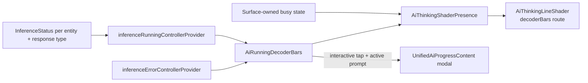
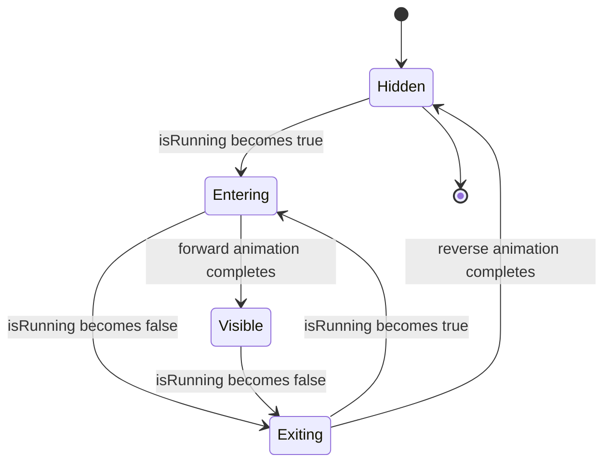

# Two shaders, registered in pubspec

| Asset | Renders |
|-------|---------|
| `shaders/ai_voice_input.frag` | The transparent tension-loop voice orb |
| `shaders/ai_thinking_line.frag` | Five horizontal thinking routes — quiet thread, packet scan, circuit trace, probability band, decoder bars — sized for action-bar use |

`ai_state_shader_animation.dart` is the barrel: it holds the assets, the program
cache and the shared `aiSetShaderColor` uniform helper, and re-exports the voice
and thinking widget/painter families from their standalone libraries.

## The voice shader

It contains **only** the production program — unused experimental variants are
not compiled into the runtime effect. `AiVoiceInputShader` creates one
`FragmentShader` per loaded program and reuses it while animation time and live
dBFS uniforms change, rather than allocating a native shader every frame.

The widget accepts a dBFS value (`-80..0` by default), matching
`record.Amplitude.current` and `computeDbfsFromPcm16`.

**Five shared quadrature harmonic pairs and four bounded pressure lobes drive
every contour.** Each ribbon gets a different phase by mixing those bases rather
than evaluating a new trigonometric pressure field, and **the render path
contains no `exp` or `pow`.** It composites two hero ribbons, secondary contours,
hairlines and reusable halos into a transparent premultiplied result.

The production recording modal supplies the design-system interactive teal as the
body colour and the high-emphasis text colour to two broader pressure-lit
ribbons, resolving those tokens through the ambient theme — so the accent blooms
white in dark mode and dark in light mode while the fine structure stays teal.

# Two adapters

**`AiRunningDecoderBars`** is the provider-driven adapter. It watches
`inferenceRunningControllerProvider` for one entity and a set of response types,
listens to the matching `inferenceErrorControllerProvider` instances, and
delegates its visual lifecycle to `AiThinkingShaderPresence`. Interactive hosts
also use it as the labelled tap target that resolves the active prompt and opens
`UnifiedAiProgressContent`.

It appears in `TaskDetailsPage` (above the sticky action row),
`UnifiedAiProgressContent` (while running but before progress text), and
`EntryDetailsPage` (as the interactive bottom overlay for image analysis, audio
transcription and prompt generation).

**`AiThinkingShaderPresence`** is the local-state adapter for surfaces that
already own a busy flag and therefore must not depend on an entry inference
provider: the cover-art generation modal, the Daily OS draft/refinement surfaces,
and the onboarding hero. The cover-art modal keeps the presence widget mounted in
a fixed status region while its local `isRunning` changes, so the shader can
complete its exit envelope as the error or completion icon appears.

# The presence envelope is a lifecycle, not a toggle

`AiRunningDecoderBars` animates both the reserved vertical height and the shader
amplitude and opacity when activity starts or stops, then removes the shader
subtree once the exit animation is fully collapsed — so a finished inference
leaves no reserved space behind.

# Failures are separate from the lifecycle

Skill inference failures are retained separately from the coarse
`InferenceStatus` by `inferenceErrorControllerProvider`. The task and entry
activity widgets listen for that detail: when the running animation ends in an
error, they show a design-system error toast containing the provider HTTP
message, timeout and request id, then **consume it** so rebuilds do not replay
the same failure.

# Widgetbook

`widgetbook/ai_shader_animations_widgetbook.dart` is the tuning surface, with
knobs for speed, intensity, geometry, colours, randomness and dBFS. The thinking
matrix renders every route at once for side-by-side comparison.

The voice playground has a Widgetbook-only recorder control that starts a metered
mic session and polls `AudioRecorder.getAmplitude()` every 20 ms. The shader
input runs through a dBFS envelope with **instant attack and slower release**, so
voice onsets stay responsive while short dips do not collapse the rings abruptly.

The default metered path writes only to a temporary file and deletes it when
recording stops. A PCM stream mode remains available as a diagnostic and fallback
dBFS source, with input-device selection and raw peak/RMS diagnostics to catch
silent default devices. The readout uses tabular numeric features so dBFS and
counter changes do not move the surrounding UI, and voice processing defaults off
to match the production recorder path.
