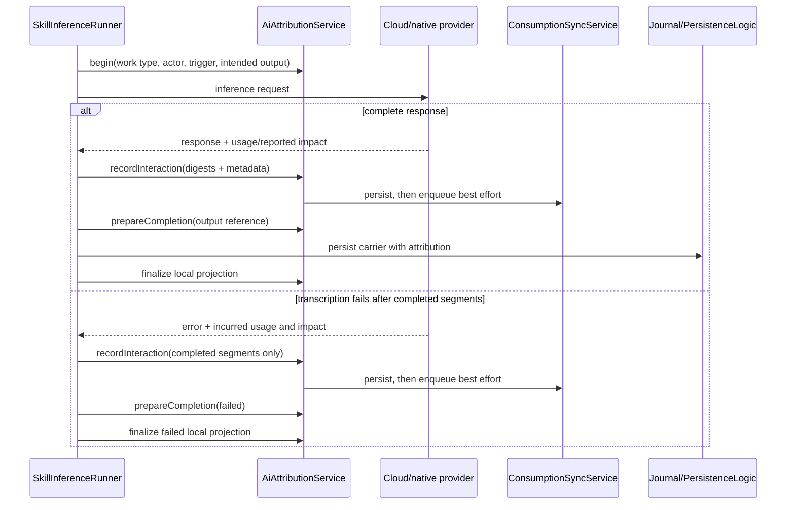

# The boundary

The `ai` feature **creates output carriers**; `features/ai_consumption` owns
their **audit model and interaction ledger**. Neither reaches into the other's
job.

`SkillInferenceRunner` begins an in-memory attribution session **before**
transcription, image analysis, prompt generation or image generation. Each
logical call records usage, digests, and provider-reported cost/impact. The
completed output embeds the authoritative attribution, and only then is the local
query projection updated.

Segmented transcription aggregates its physical calls. If a later segment fails,
`TranscriptionException` carries the completed segments' usage and impact; the
runner records those incurred quantities once and finalizes a failed local
attribution. No partial transcript carrier is written. Its output reference is
an intended artifact, not evidence that an artifact exists. A canceled subscriber
cannot receive this exception; cancellation accounting needs a separate caller
lifecycle hook and is not captured by this failure path.

# Carrier mapping is uniform

| Output | Carrier field |
|--------|---------------|
| Generated text, authoritative image-analysis results | `AiResponseData.aiAttribution` |
| Generated images | `ImageData.aiAttribution` |
| Transcripts | `AudioTranscript.id` / `aiAttribution` |

`UnifiedAiInferenceRepository` begins before provider invocation, **reuses one
owner and output id across automatic language reruns**, and finalizes the local
projection after the carrier write.

Attributed image analysis is stored as the authoritative `AiResponseEntry`
instead of also duplicating the response into journal entry text.

# Rules that keep the ledger honest

- **No invented cost.** Embedding indexing records one interaction per chunk with
  digests only and no monetary figure, because none is reported.
- **The carrier is authoritative.** For agent reports the local attribution
  projection is updated *after* the report write, never before.
- **Carrier-less operations terminalize as partial.** Log-compaction inference is
  captured before each backend call and marked partial, because its checkpoint
  format has no attribution record.
- **Historical outputs are never backfilled with guesses.** Reports predating
  attribution get no invented creator or cost data.

For the agent-side view of the same mechanism — the deterministic wake run key
that groups initial calls, tool continuations and forced-report retries into one
attribution — see
[agent persistence and sync](../agents/persistence-and-sync.md).
