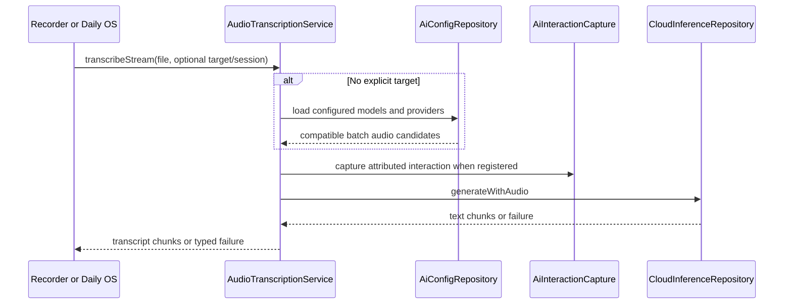

# Ownership

`AudioTranscriptionService` transcribes an existing local file through configured
AI providers. It is shared by [agent voice input](../agents/chat-input-and-reasoning.md)
and Daily OS capture/outbox processing. It does not record audio, persist journal
transcripts, or own a chat session. `audioTranscriptionServiceProvider` supplies
the service through Riverpod.

# Request flow

An explicit model/provider target bypasses discovery. Otherwise discovery
loads models and providers, keeps audio-capable models, excludes Mistral
realtime-only models, and excludes unavailable embedded speech models. The
selection order is available embedded models, Mistral chat/transcription/batch
candidates, then Melious Whisper/transcription/chat candidates, then the Gemini
fallback match or first remaining model. Provider-specific routing stays in
[provider routing](provider-routing.md).

The file is encoded and submitted with the batch transcription prompt. The
service yields provider text chunks; `transcribe` joins them for callers that
need one string. A successful request containing no non-whitespace transcript
is treated as a transcription failure.

# Attribution and errors

When `AiInteractionCapture` is registered, it records audio-transcription work
with provider/model, text, usage, and available impact evidence. A caller may
supply an existing attribution session and control failure terminalization;
success is terminalized here only when the service owns the session.

`AttributedTranscriptionException` distinguishes a recorded provider failure
from an uncertain attribution-publication outcome. Callers can therefore avoid
terminalizing the same attributed failure twice. Without capture, provider
failures retain their underlying exception/state-error behavior. See
[AI work attribution](attribution.md) for the ledger contract.

# Invariants

- Discovery does not select realtime-only Mistral models for batch requests.
- Explicit targets do not silently fall back to another model.
- Transcription yields text; source persistence and timed transcript alignment
  are responsibilities outside this service.
