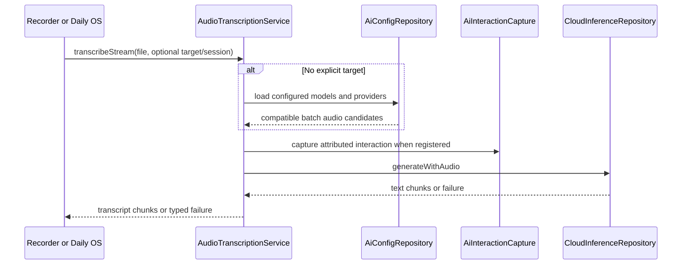

# Ownership

`AudioTranscriptionService` transcribes an existing local file through configured
AI providers. It is shared by [agent voice input](../agents/chat-input-and-reasoning.md)
and Daily OS capture/outbox processing. It does not record audio, persist journal
transcripts, or own a chat session. `audioTranscriptionServiceProvider` supplies
the service through Riverpod.

# Request flow

```mermaid
sequenceDiagram
  participant Caller as Recorder or Daily OS
  participant Service as AudioTranscriptionService
  participant Config as AiConfigRepository
  participant Usage as AiInteractionCapture
  participant Provider as CloudInferenceRepository
  Caller->>Service: transcribeStream(file, optional target/session)
  alt No explicit target
    Service->>Config: load configured models and providers
    Config-->>Service: compatible batch audio candidates
  end
  Service->>Usage: capture attributed interaction when registered
  Service->>Provider: generateWithAudio
  Provider-->>Service: text chunks or failure
  Service-->>Caller: transcript chunks or typed failure
```

An explicit model/provider target bypasses discovery. Scoped query dictation
supplies one using its [category-default routing contract](../agents/query-chat.md);
other callers retain their existing target or discovery behavior. Otherwise discovery
loads models and providers, keeps audio-capable models, excludes Mistral
realtime-only models, and excludes unavailable embedded speech models. The
selection order is available embedded models, Mistral chat/transcription/batch
candidates, then Melious Whisper/transcription/chat candidates, then the Gemini
fallback match or first remaining model. Provider-specific routing stays in
[provider routing](provider-routing.md).

The file is encoded and submitted with the batch transcription prompt. The
service yields provider text chunks; `transcribe` joins them for callers that
need one string. A successful request containing no non-whitespace transcript
is treated as a transcription failure.

# The speech dictionary

These callers take the words back instead of leaving them on a recording, so
the runner's [post-processing](execution-paths.md#audio-summaries) never sees
them; the speech dictionary reaches them here instead:

- **A vocabulary hint for every request.** The caller's `knownTerms` lead the
  [speech dictionary](../speech/dictionary.md) entries that reach
  `dictionaryCategoryId` — with none, the entries that apply to every
  category — and the merged list goes to the engine as
  `speechDictionaryTerms`. Today every caller passes no category, so each
  hears the global entries; a query chat's category is not threaded through
  yet. An unreadable dictionary gives no terms, never a failed request.
- **A correction by sound and spelling for every chunk.** Each yielded chunk
  is corrected against the same terms (`correctTranscriptTerms`) — free and
  local, so chat drafts and onboarding get it with no extra latency.
- **A model's correction where the caller can wait for one.**
  `correctTranscript` asks a tool-capable model, in one pinned
  `report_transcript_corrections` call, for quoted corrections against the
  entries; code applies them (`applyRecordingCorrections`) and learns each as
  a misheard spelling. Its spend is captured like the transcription's. No
  entry, an empty text or any failure returns the words as heard. Only Daily
  OS uses it: `correctHeardTranscript` runs it on the planner profile's audio
  post-processing route (`dailyOsTranscriptCorrectionTargetProvider` — its
  slot, else its thinking model, when it can call tools and resolves here),
  for words a speech-to-text engine heard, before the foreground capture
  stores or shows them and for each outbox retry alike. A multimodal model,
  or discovery, heard words it spelled as given; those are left alone.

# Attribution and errors

When `AiInteractionCapture` is registered, it records audio-transcription work
with provider/model, text, usage, and available impact evidence. A caller may
supply an existing attribution session and control failure terminalization;
success is terminalized here only when the service owns the session.

`AttributedTranscriptionException` distinguishes a recorded provider failure
from an uncertain attribution-publication outcome. Callers can therefore avoid
terminalizing the same attributed failure twice. Without capture, provider
failures retain their underlying exception/state-error behavior. See
[AI work attribution](attribution.md) for the ledger contract.

# Invariants

- Discovery does not select realtime-only Mistral models for batch requests.
- The speech dictionary improves the words and never costs them: an
  unreadable dictionary, a missing correction model or a failed correction
  call leaves the transcript as heard.
- Explicit targets do not silently fall back to another model.
- Transcription yields text; source persistence and timed transcript alignment
  are responsibilities outside this service.
