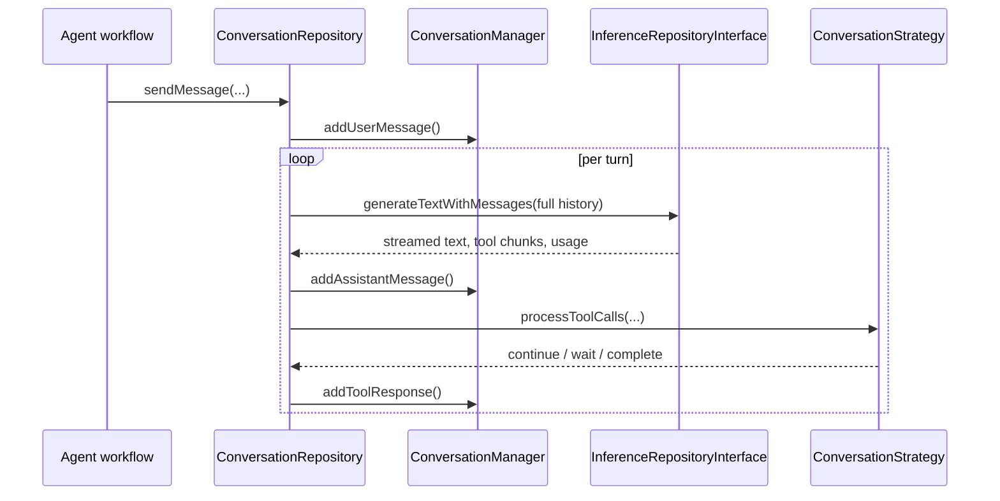

`ConversationRepository` and `ConversationManager` provide the reusable
multi-turn loop used by every agent-style tool-calling workflow.

Responsibilities:

- Preserve conversation history.
- Emit conversation events for the UI.
- Accumulate streamed tool calls across chunks.
- Keep Gemini thought signatures between turns.
- Re-enter the loop through a `ConversationStrategy` after tool execution.

`CloudInferenceWrapper` adapts `CloudInferenceRepository` to
`InferenceRepositoryInterface`, so cloud and local providers participate in the
same loop without the loop knowing which is which.

# The details that matter

- **Tool-call arguments are buffered by stable tool-call id or index**, so
  streamed JSON is reassembled safely rather than parsed per chunk.
- **Gemini thought signatures are stored in `ConversationManager` and replayed on
  later turns.** Dropping them breaks Gemini's reasoning continuity across a
  tool-call round trip.
- **Gemini-style multi-call chunks arriving without stable ids** get
  provider-specific handling in the repository.

The strategy layer is what makes the loop reusable: `TaskAgentStrategy`,
`ProjectAgentStrategy`, `EventAgentStrategy` and `EvolutionStrategy` each decide
which tools short-circuit locally, which are deferred as proposals, and when the
conversation is complete. See [task agents](../agents/task-agents.md) for the
richest example.
