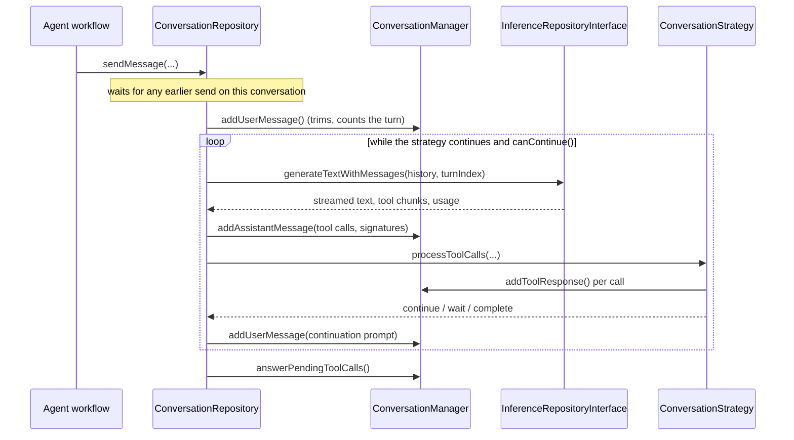
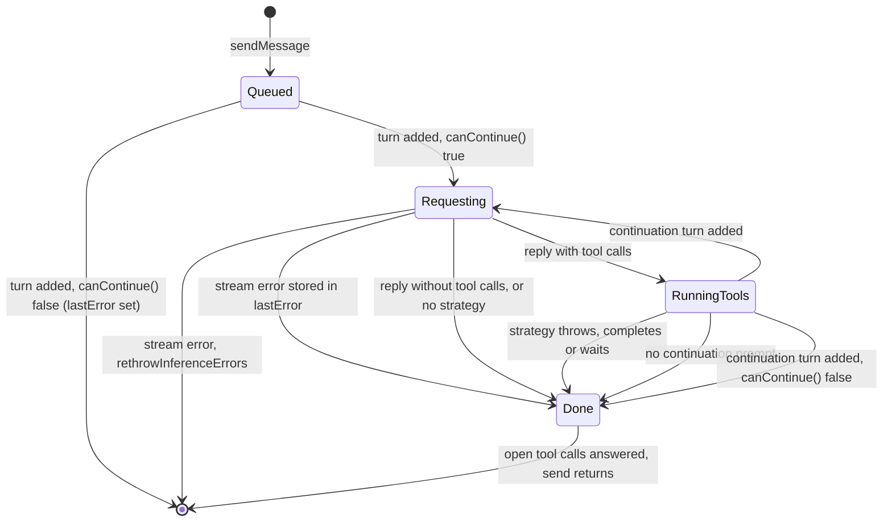

`ConversationRepository` and `ConversationManager` provide the reusable
multi-turn loop used by every agent-style tool-calling workflow: task, project,
event, day, goal and relationship wakes, and the template and soul evolution
chats.

`CloudInferenceWrapper` adapts `CloudInferenceRepository` to
`InferenceRepositoryInterface`, so cloud and local providers participate in the
same loop without the loop knowing which is which.

# One send, as a state machine

`Queued` waits until every earlier `sendMessage` on the same conversation has
returned; sends run one at a time, in the order they were made. Without that, a
second message could land between an assistant's tool calls and their results
while the tools run, which strict providers reject for the rest of the
conversation.

# The turn limit and trimming

- **`turnCount` counts the user turns ever added**, the opening message and
  every continuation prompt, since `initialize`. It never goes back.
  `canContinue()` is `turnCount < maxTurns`, checked after each user turn is
  added, so one send makes at most `maxTurns - 1` requests after its opening
  turn. Wakes pass `maxTurnsPerWake` (10 by default); evolution sessions keep
  the default of 20. The count is per conversation: a send made after the loop
  used every turn — the task agent's forced `update_report` retry — is refused
  at once.
- **The history is trimmed to `maxHistorySize`** (100) whenever a user turn is
  added: the system prompt, a truncation notice, and the newest messages,
  cut so the retained tail opens on a user turn. A cut inside a tool round
  would otherwise leave tool results whose call was dropped, or an assistant
  tool call with no user turn before it, which Gemini rejects.
- Before the turn count was independent of trimming it counted the user
  messages left in the trimmed history. A round with `k` tool calls adds
  `k + 2` messages, so that count stopped growing and a wake calling nine tools
  a round never reached its limit; a task strategy continues until
  `update_report`, so the wake kept calling the model.

# Tool calls and their ids

- **Tool-call arguments are buffered per call** so streamed JSON is reassembled
  safely rather than parsed per chunk. A chunk with an id continues the call
  with that id, or starts a new call when the id is new (some providers number
  every call 0); a chunk without an id, or with an empty one, continues the call
  at its index.
- **Ids the loop synthesizes are turn-scoped**, `tool_turn<turn>_<n>` from
  `turnCount`: for Gemini-style multi-call chunks, which arrive complete and
  without ids, and for an OpenAI-style call without one. The Gemini adapters
  synthesize the same format from the turn index the loop passes them. Because
  the turn never goes back, no id repeats in a conversation.
- **Gemini thought signatures are stored in `ConversationManager`, keyed by
  tool-call id, and replayed on later turns** — that is why the ids must not
  repeat: a reused id overwrites an earlier call's signature, and Gemini's
  request builder maps each tool result back to its function name by id.
  Signatures of trimmed turns stay in the map but are no longer sent.
- **Every tool call gets a result.** When the loop ends with calls of its last
  round unanswered — a strategy threw part-way, returned without answering, or
  there was no strategy — `answerPendingToolCalls` records an error result for
  each, so the next message on the conversation is still well-formed.

The protocol is model-checked in
[`ConversationLoop`](../../../specs/tla/README.md#conversationloop--the-multi-turn-tool-calling-loop):
bounded rounds, termination, unique tool-call ids, and that every request opens
on a user turn with each tool call and result paired.

The strategy layer is what makes the loop reusable: `TaskAgentStrategy`,
`ProjectAgentStrategy`, `EventAgentStrategy` and `EvolutionStrategy` each decide
which tools short-circuit locally, which are deferred as proposals, and when the
conversation is complete. See [task agents](../agents/task-agents.md) for the
richest example.
