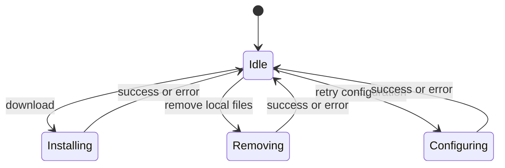
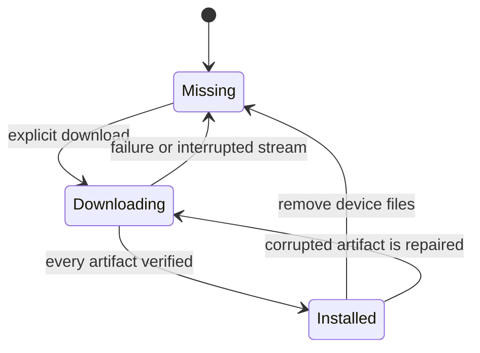
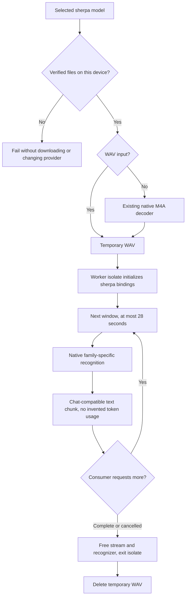

# Installation and configuration

`InferenceProviderType.sherpa` is an embedded ASR provider. It requires neither
an API key nor a server URL. Its catalog contains 22 multilingual INT8 exports:
eight Whisper variants (Large v3, Turbo, Medium, Small, Base, Tiny, Large v2 and
Large v1), Parakeet TDT v3, SenseVoice, two Dolphin sizes, three Omnilingual
variants, FireRed ASR2 and ASR2 CTC, bilingual and trilingual Paraformer, WeNet
Cantonese/Chinese/English, Qwen3 ASR and FunASR Nano. Single-language exports are
excluded. The catalog is the source for both download manifests and known model
configurations; each entry identifies its publisher, recognizer architecture,
artifact roles, pinned revision, sizes and SHA-256 checksums.

Model files are downloaded only after the user presses Download. Search reuses
`AiSettingsSearchBar`, also used by Melious, and matches model identity, family,
publisher and declared language metadata. A single family dropdown narrows the
catalog, with a result count and localized empty state. Filtering preserves row
state; busy operations and errors remain visible even when the query excludes
them. Short language sets are shown explicitly. Model and family names are
upstream product metadata; surrounding controls are localized. Sherpa appears in
both the first-run and full provider pickers without a desktop-only restriction.

The model section groups compact download actions beside model identity and
localized download size/language metadata. Actions wrap below the metadata on
narrow screens. Installation shows a named progress bar and percentage; removal
has its own busy action. Downloaded status describes device files, while inference
profiles select the model to use.

While an operation runs, that model's other actions are disabled. A failed
removal preserves any outstanding configuration error and its retry action.

Text, image-input, and multi-turn chat calls reject this ASR-only provider
before constructing an HTTP client, including when stale configuration carries
an old server URL.

Configuration rows sync normally; downloaded files do not. Files live below
application support in `sherpa_models/<model>/<revision>/`. The manifest pins
Hugging Face revisions, byte lengths, and SHA-256 digests. Unknown model ids
cannot become paths or download URLs. Installation verifies every artifact's
checksum. Readiness checks cache verification in memory against each file's size,
modification time and change time; unchanged files need only a metadata probe.
Concurrent cold probes share verification, and a successful installation seeds
the cache without reading the published weights again. Changed files are hashed
again, missing files are unavailable, and install/remove invalidate cached
verification. A fresh process verifies existing files once. This cache avoids
repeated gigabyte-scale reads during settings, discovery and transcription; it
is not protection against modifications that preserve all cached metadata. Availability probes treat unknown synced
ids as unavailable; explicit installation rejects them.

Downloads stream into `.part` files, verify size and digest, then rename into
place. Concurrent requests for the same model share one future. Partial files
are deleted on failure; valid completed artifacts can be reused on retry.
Removing files preserves synced model configurations and profile references.
Provider creation and startup backfill never seed sherpa catalog rows. A model
configuration is created after a verified download, preserving existing synced
identities. Already-installed files without a configuration offer Add model,
which restores the provider association without downloading again. Sherpa's
installed section has no manual model-add or configuration-only delete action;
local file removal remains in the catalog.

Provider cards, detail headers, installed sections, the Models tab and model
selection all use verified device availability. Provider identity must be
resolved before admitting a saved row, including while streams load in either
order. Raw configurations remain available for profile reference mapping and
sync; a missing local assignment is displayed as unavailable without deleting
its stored ID. Counts and candidates refresh after downloads and removals. Both operations also republish changed sync-node
capabilities without requiring an app restart. A failed broadcast does not undo
the successful local file operation. If model configuration persistence fails
after installation, the row retains its downloaded state and shows a separate
configuration error. Retry saves only the missing configuration, reusing verified
files and preserving existing model identities and edits. During retry, the Retry
button stays busy and removal is disabled; deletion remains available afterward.
Removing a model during its download is rejected.

# Runtime flow

The archived source remains unchanged. Each request owns its worker and native
recognizer. Long recordings are covered by contiguous windows with no omitted
or duplicated samples. For non-final windows the boundary prefers the quietest
100 ms region in the final five seconds. This reduces mid-word cuts; it is not
a voice activity detector. The decoded waveform still occupies memory for the
whole recording.

Native decoding is synchronous inside the worker, never on Flutter's UI isolate.
The consumer requests one segment at a time. Cancellation sends a stop command;
the active segment finishes before native resources are freed. The caller waits
for worker exit before deleting the WAV. Force-killing the isolate would leak
native allocations. Empty results and worker failures propagate as errors.

The adapter transcribes rather than translates. The native configuration is
built from the catalog's artifact roles. NeMo transducers declare their model
type explicitly; Qwen3 ASR and FunASR Nano use tokenizer directories rather than
a tokens file. Nested tokenizer artifacts retain their upstream relative paths.
Qwen3 ASR allows up to 512 output tokens in a 1024-token total sequence per
window. The adapter does not currently supply task context or speech-dictionary
hotwords. It emits text with no fabricated token usage or cloud charges.

Families that require an explicitly selected spoken language (Canary and Cohere
Transcribe) are not in this automatic-recognition catalog. Adding them requires
a persisted language control and propagation to each recognition request; an
English default must not masquerade as multilingual automatic detection.

# Selection and sync

Installed sherpa models precede HTTP providers in automatic transcription
selection; model names break ties. Uninstalled models are excluded from direct
fallback and capture discovery. Explicit profile targets remain explicit: a
missing local model fails instead of sending the recording elsewhere.

Sherpa counts as local for profile locality and remains available on mobile.
The sync-node probe advertises `NodeCapability.sherpa` only after finding at
least one verified local model. A capability identifies a runner, not proof that
every model in an incoming profile has been downloaded on that node.

# Native packaging

`sherpa_onnx` is pinned to 1.13.7. Its native platform packages supply the C API
and binaries, including Linux x64/ARM64, Apple platforms, Android, and Windows.
The existing ONNX plugin continues to own Supertonic TTS.

Linux packages one ONNX Runtime from sherpa. Its `libonnxruntime.so` also has a
`libonnxruntime.so.1` symlink for the TTS plugin's SONAME dependency. The official
ORT headers/download and Flatpak runtime are pinned to the matching 1.27.1
release; Flatpak's declared sources keep configuration offline. Android aligns
TTS's Java/JNI dependency to the published 1.27.0 artifact (there is no 1.27.1
Maven artifact), sharing the compatible 1.27 API with sherpa's runtime. Duplicate
`libonnxruntime.so` inputs are merged into one packaged library. Apple's sherpa
frameworks hide their internal ORT symbols.

Flatpak copies the bundle with `--remove-destination`: its build-time ORT
installation links `.so` to `.so.1`, while the bundle links `.so.1` to `.so`.
Following existing destination links during the copy would create a cycle.
