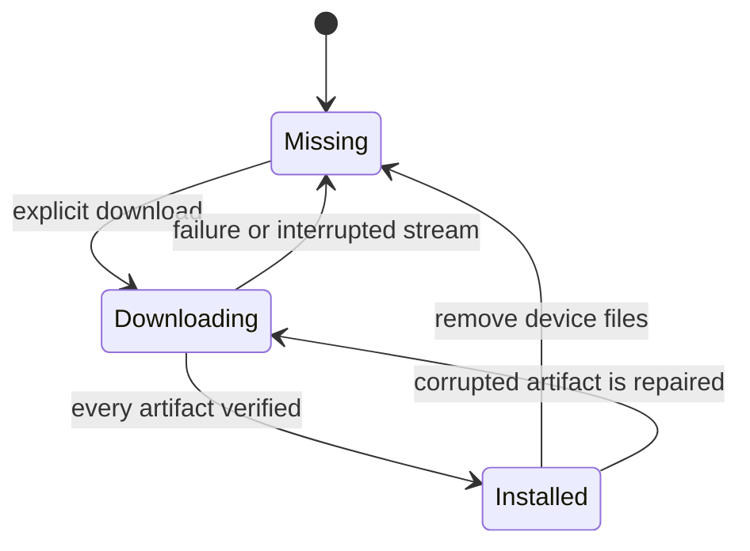
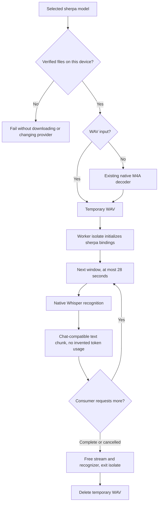

# Installation and configuration

`InferenceProviderType.sherpa` is an embedded ASR provider. It requires neither
an API key nor a server URL. Its curated catalog contains multilingual int8
Whisper Tiny and Base exports. Model files are downloaded only after the user
presses Download in the provider's model section. Model names are upstream
product names; surrounding controls are localized.

Text, image-input, and multi-turn chat calls reject this ASR-only provider
before constructing an HTTP client, including when stale configuration carries
an old server URL.

Configuration rows sync normally; downloaded files do not. Files live below
application support in `sherpa_models/<model>/<revision>/`. The manifest pins
Hugging Face revisions, byte lengths, and SHA-256 digests. Unknown model ids
cannot become paths or download URLs. Availability probes treat unknown synced
ids as unavailable; explicit installation rejects them.

Downloads stream into `.part` files, verify size and digest, then rename into
place. Concurrent requests for the same model share one future. Partial files
are deleted on failure; valid completed artifacts can be reused on retry.
Removing files preserves synced model configurations and profile references.
Provider cards and detail headers count verified local installations, refreshed
after downloads and removals. Both operations also republish changed sync-node
capabilities without requiring an app restart. A failed broadcast does not undo
the successful local file operation. If model configuration persistence fails
after installation, the row retains its downloaded state and shows a separate
configuration error; deletion remains available.
Removing a model during its download is rejected.

# Runtime flow

The archived source remains unchanged. Each request owns its worker and native
recognizer. Long recordings are covered by contiguous windows with no omitted
or duplicated samples. For non-final windows the boundary prefers the quietest
100 ms region in the final five seconds. This reduces mid-word cuts; it is not
a voice activity detector. The decoded waveform still occupies memory for the
whole recording.

Native decoding is synchronous inside the worker, never on Flutter's UI isolate.
The consumer requests one segment at a time. Cancellation sends a stop command;
the active segment finishes before native resources are freed. The caller waits
for worker exit before deleting the WAV. Force-killing the isolate would leak
native allocations. Empty results and worker failures propagate as errors.

Whisper detects language automatically and transcribes rather than translates.
This initial adapter does not feed task context or speech-dictionary hotwords
to the model: the upstream Dart Whisper configuration has no prompt parameter.
It emits text, with no fabricated token usage or cloud charges.

# Selection and sync

Installed sherpa models precede HTTP providers in automatic transcription
selection; model names break ties. Uninstalled models are excluded from direct
fallback and capture discovery. Explicit profile targets remain explicit: a
missing local model fails instead of sending the recording elsewhere.

Sherpa counts as local for profile locality and remains available on mobile.
The sync-node probe advertises `NodeCapability.sherpa` only after finding at
least one verified local model. A capability identifies a runner, not proof that
every model in an incoming profile has been downloaded on that node.

# Native packaging

`sherpa_onnx` is pinned to 1.13.7. Its native platform packages supply the C API
and binaries, including Linux x64/ARM64, Apple platforms, Android, and Windows.
The existing ONNX plugin continues to own Supertonic TTS.

Linux packages one ONNX Runtime from sherpa. Its `libonnxruntime.so` also has a
`libonnxruntime.so.1` symlink for the TTS plugin's SONAME dependency. The official
ORT headers/download and Flatpak runtime are pinned to the matching 1.27.1
release; Flatpak's declared sources keep configuration offline. Android aligns
TTS's Java/JNI dependency to the published 1.27.0 artifact (there is no 1.27.1
Maven artifact), sharing the compatible 1.27 API with sherpa's runtime. Duplicate
`libonnxruntime.so` inputs are merged into one packaged library. Apple's sherpa
frameworks hide their internal ORT symbols.

Flatpak copies the bundle with `--remove-destination`: its build-time ORT
installation links `.so` to `.so.1`, while the bundle links `.so.1` to `.so`.
Following existing destination links during the copy would create a cycle.
