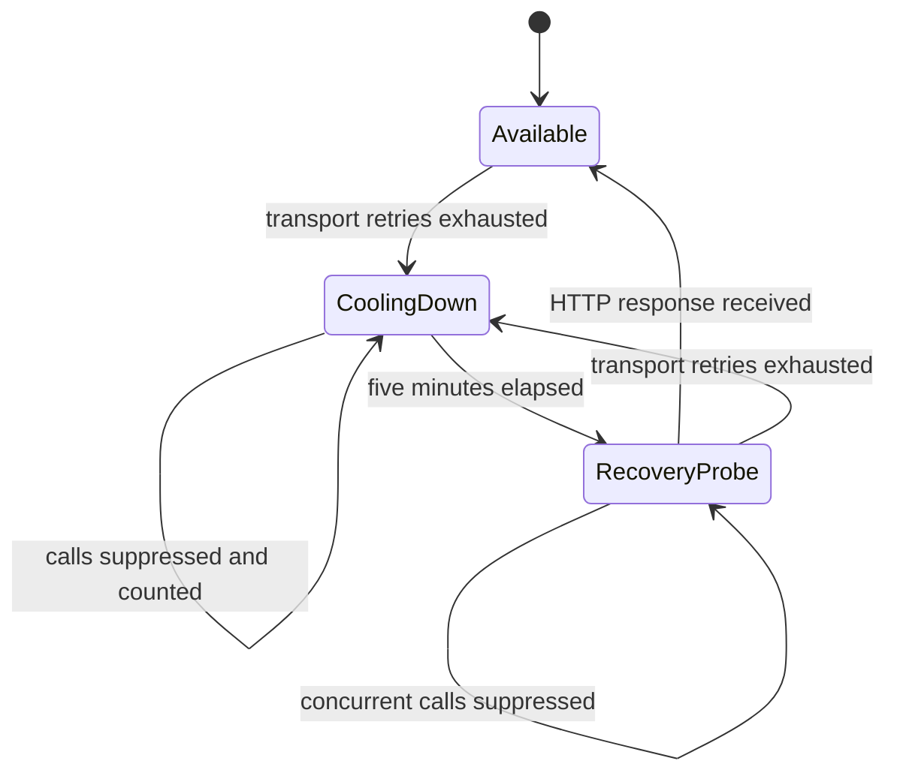

The AI feature owns local embeddings and vector search — the one place where the
app stores data outside Drift.

```mermaid
flowchart LR
  Change["Entity change notification"] --> Service["EmbeddingService"]
  Service --> Extract["EmbeddingProcessor"]
  Extract --> Chunk["TextChunker.chunk()"]
  Chunk --> Embed["OllamaEmbeddingRepository.embed()"]
  Embed --> Store["EmbeddingStore / ShardedEmbeddingStore"]
  Store --> Search["VectorSearchRepository.search*()"]
  Search --> Resolve["Resolve tasks or entries"]
```

| Component | Role |
|-----------|------|
| `EmbeddingService` | Listens to local update notifications and performs real-time embedding work |
| `EmbeddingProcessor` | Hashes content, chunks text, generates embeddings, writes atomically |
| `EmbeddingStore` | Storage abstraction |
| `ShardedEmbeddingStore` | Production implementation, backed by **per-category ObjectBox shards** |
| `VectorSearchRepository` | Embeds the query through Ollama and resolves hits back to tasks or entries |

# Constraints

- **Gated by `enableEmbeddingsFlag`.** Off by default.
- **Requires a resolvable Ollama base URL.** Embeddings currently have no other
  provider path.
- Tasks can be embedded with **label-enriched** text, not just raw title and
  body.
- Agent reports are stored with `taskId` metadata, so a search hit can resolve
  back to the owning task.
- The production `OllamaEmbeddingRepository` is shared. After three transport
  failures confirm that one base URL is unavailable, it opens a five-minute
  cooldown for that URL. Calls during the cooldown fail before network I/O and
  carry a cumulative suppressed-request count; the task-agent path does not
  emit a full stack trace for every optional report.
- The first call after the cooldown exclusively reserves the recovery probe;
  concurrent callers remain suppressed until it finishes. Any HTTP response
  proves the service is reachable and closes the circuit; another exhausted
  transport retry budget opens a fresh cooldown. Notification and manual
  backfill loops stop on a known cooldown instead of emitting one stack trace
  per remaining item. A failed optional embedding never rolls back the
  already-persisted agent report or deletes its previous embedding.

Embedding indexing participates in [work attribution](attribution.md): it begins
before its first chunk, records one interaction per chunk with digests only and
**no invented monetary cost**, and finalizes a typed `embeddingVector` output
after the store replacement succeeds.
