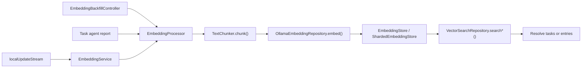
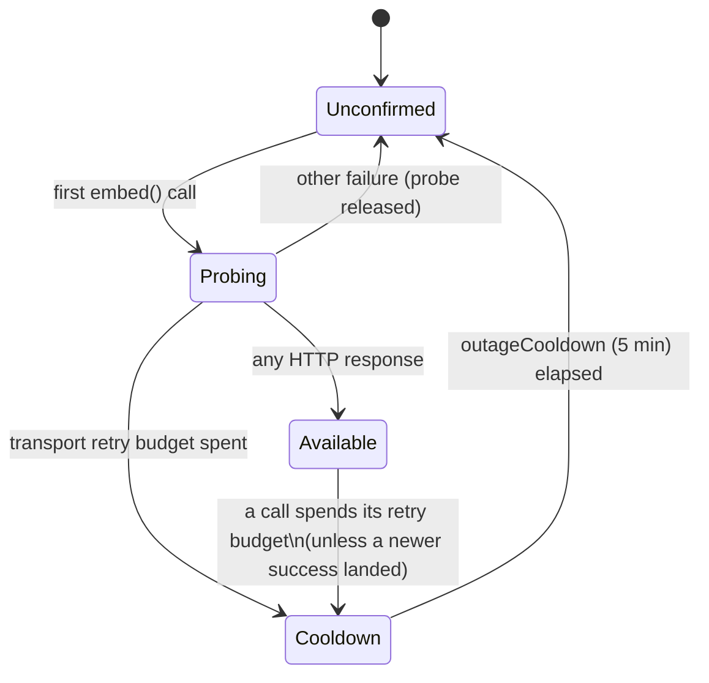
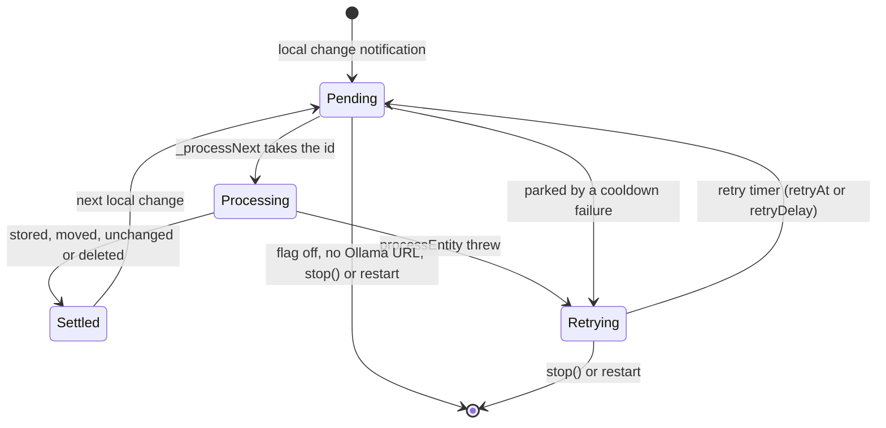

The AI feature owns local embeddings and vector search — the one place where the
app stores data outside Drift. The index is a **regenerable local cache**: each
device embeds what it holds, and nothing is synced.

| Component | Role |
|-----------|------|
| `EmbeddingService` | Listens to local update notifications and performs real-time embedding work, retrying ids that failed |
| `EmbeddingBackfillController` | The manual backfill of whole categories from settings |
| `EmbeddingProcessor` | Hashes content, chunks text, generates embeddings, writes atomically; one run per entity at a time |
| `EmbeddingStore` | Storage abstraction |
| `ShardedEmbeddingStore` | Production implementation, backed by **per-category ObjectBox shards** |
| `VectorSearchRepository` | Embeds the query through Ollama and resolves hits back to tasks or entries |

# Constraints

- **Gated by `enableEmbeddingsFlag`.** Off by default.
- **Requires a resolvable Ollama base URL.** Embeddings currently have no other
  provider path.
- **An unreachable Ollama is suppressed, not retried per entry.** See
  [Endpoint availability](#endpoint-availability).
- **Only local writes are embedded as they happen.** The service listens to
  `localUpdateStream`, so an edit that arrives by sync, or one an agent makes
  (routed through `notifyUiOnly`), is not re-embedded until the entry is next
  edited locally or a backfill covers it. See
  [Keeping up with the journal](#keeping-up-with-the-journal).
- Tasks can be embedded with **label-enriched** text, not just raw title and
  body.
- Agent reports are stored with `taskId` metadata, so a search hit can resolve
  back to the owning task.

Embedding indexing participates in [work attribution](attribution.md): it begins
before its first chunk, records one interaction per chunk with digests only and
**no invented monetary cost**, and finalizes a typed `embeddingVector` output
after the store replacement succeeds.

# Endpoint availability

Embeddings are optional, and Ollama is often simply not running. Without a
guard, every entity change, backfill item and report paid the full transport
retry budget and logged its own failure. `OllamaEmbeddingRepository` therefore
keeps a circuit per base URL. The app registers one instance, so the circuit is
shared by `EmbeddingService`, backfills, vector search and agent-report
embedding alike.

- **One probe at a time.** While a URL is unconfirmed, the first caller is the
  probe; concurrent callers wait on it rather than each opening a connection,
  then proceed if it reached the endpoint or fail fast if it found an outage.
- **Only transport failures declare an outage.** A call must spend the existing
  retry budget on timeouts or socket errors. Any HTTP response — including an
  error status or a missing model — proves the endpoint reachable.
- **Cooldown calls never touch the network.** They throw
  `EmbeddingEndpointUnavailableException` carrying `retryAt`; callers already
  treat a failed embedding as optional, so a saved agent report is never
  rolled back and its predecessor's embedding is kept.
- **Stale failures cannot hide recovery.** Every success and every declared
  outage bumps a generation, and a failure that began before a newer success is
  ignored.
- **Diagnostics stay logarithmic.** The outage and the recovery are each logged
  once under `LogDomain.ai` (`embedding_availability`); suppressed calls are
  counted cumulatively per URL and reported only at powers of two. Logs and
  the exception text name only the URL's scheme, host and port
  (`redactEndpoint`), never user info, path or query.
- **Socket failures arrive wrapped.** The production `IOClient` rethrows a
  `SocketException` as a `ClientException` subtype that still implements
  `SocketException`, so a refused connection counts against the transport
  budget; a test drives that real wrapping.

What callers do with a suppressed call is theirs to decide and is not part of
the repository: `EmbeddingService` parks the failed id and every pending one
until `retryAt`, a manual backfill logs the item and moves on, and a report
embedding is logged and not retried (the next report replaces it).

# Keeping up with the journal

Three writers feed one store with no shared queue: the service, the manual
backfill, and the task agent's report writer. Each run reads the journal,
waits on the network, then writes. Nothing corrects a stale row later, so
every rule here is about the row a run leaves behind when it is the last one.
The protocol is model-checked in
[`EmbeddingFreshness`](../../../specs/tla/README.md#embeddingfreshness--the-index-keeps-up-with-the-journal).

- **One run per entity at a time.** `EmbeddingProcessor` holds a per-entity
  lock from the journal read to the store write, so a run that read an older
  version can never land after one that read a newer version. Every local edit
  queues a run that starts after it, so the last run reads the latest text.
- **Gone means no vectors.** A run that finds the entry deleted (the read hides
  soft-deleted rows) or its text under the 20-character minimum deletes the
  entry's vectors. Search also skips hits whose entry no longer exists, which
  covers vectors left by deletions made before this rule.
- **Reports follow their task.** Every run over a task moves the task's report
  embeddings to the task's category, whether or not the task has a vector of
  its own. The report writer reads the task's category and writes under the
  task's lock, so a recategorisation is either seen by the writer or processed
  after the report is stored.
- **Failures are retried, in memory.** A failed id is kept and queued again at
  the cooldown's `retryAt`, or after `EmbeddingService.retryDelay` for any other
  failure. A restart loses the pending and retry sets; the backfill is the
  repair.
- **A crash between two shards keeps the newer copy.** A replace or a move
  writes the new shard before deleting the old copy. If the process dies in
  between, `_rebuildIndexes` keeps the copy whose chunks were written last
  (`createdAt`; a move re-stamps it), rather than the shard whose name sorts
  last.

Open questions the model leaves as residuals:

- **Synced edits are not embedded on the receiving device.** The design says
  each device embeds its own copy, which suggests they should be; embedding
  every synced write would also re-embed a whole initial sync. Undecided.
- **The model id is stored with each chunk but never compared**, and the
  content hash excludes it, so switching to another model of the same
  dimension leaves old vectors in place until each entry changes; the backfill
  skips them too, since their hashes still match.

