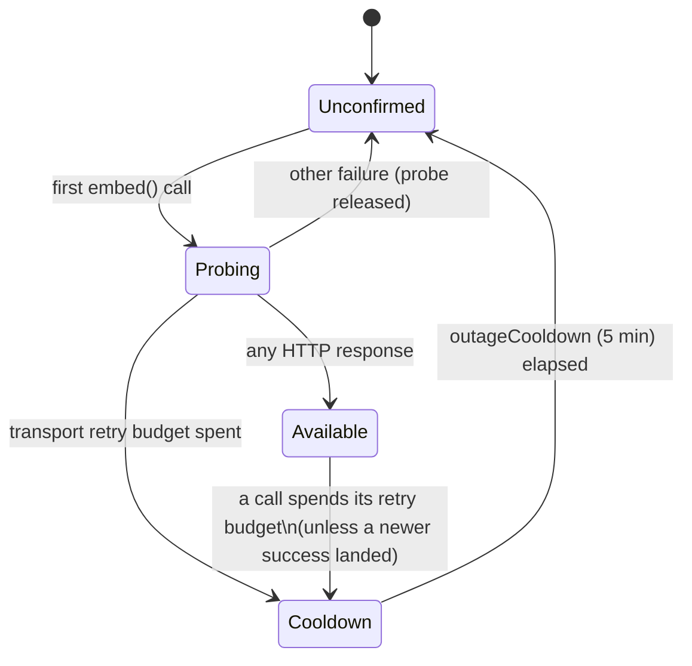

The AI feature owns local embeddings and vector search — the one place where the
app stores data outside Drift.

```mermaid
flowchart LR
  Change["Entity change notification"] --> Service["EmbeddingService"]
  Service --> Extract["EmbeddingProcessor"]
  Extract --> Chunk["TextChunker.chunk()"]
  Chunk --> Embed["OllamaEmbeddingRepository.embed()"]
  Embed --> Store["EmbeddingStore / ShardedEmbeddingStore"]
  Store --> Search["VectorSearchRepository.search*()"]
  Search --> Resolve["Resolve tasks or entries"]
```

| Component | Role |
|-----------|------|
| `EmbeddingService` | Listens to local update notifications and performs real-time embedding work |
| `EmbeddingProcessor` | Hashes content, chunks text, generates embeddings, writes atomically |
| `EmbeddingStore` | Storage abstraction |
| `ShardedEmbeddingStore` | Production implementation, backed by **per-category ObjectBox shards** |
| `VectorSearchRepository` | Embeds the query through Ollama and resolves hits back to tasks or entries |

# Constraints

- **Gated by `enableEmbeddingsFlag`.** Off by default.
- **Requires a resolvable Ollama base URL.** Embeddings currently have no other
  provider path.
- **An unreachable Ollama is suppressed, not retried per entry.** See
  [Endpoint availability](#endpoint-availability).
- Tasks can be embedded with **label-enriched** text, not just raw title and
  body.
- Agent reports are stored with `taskId` metadata, so a search hit can resolve
  back to the owning task.

Embedding indexing participates in [work attribution](attribution.md): it begins
before its first chunk, records one interaction per chunk with digests only and
**no invented monetary cost**, and finalizes a typed `embeddingVector` output
after the store replacement succeeds.

# Endpoint availability

Embeddings are optional, and Ollama is often simply not running. Without a
guard, every entity change, backfill item and report paid the full transport
retry budget and logged its own failure. `OllamaEmbeddingRepository` therefore
keeps a circuit per base URL. The app registers one instance, so the circuit is
shared by `EmbeddingService`, backfills, vector search and agent-report
embedding alike.

- **One probe at a time.** While a URL is unconfirmed, the first caller is the
  probe; concurrent callers wait on it rather than each opening a connection,
  then proceed if it reached the endpoint or fail fast if it found an outage.
- **Only transport failures declare an outage.** A call must spend the existing
  retry budget on timeouts or socket errors. Any HTTP response — including an
  error status or a missing model — proves the endpoint reachable.
- **Cooldown calls never touch the network.** They throw
  `EmbeddingEndpointUnavailableException` carrying `retryAt`; callers already
  treat a failed embedding as optional, so a saved agent report is never
  rolled back and its predecessor's embedding is kept.
- **Stale failures cannot hide recovery.** Every success and every declared
  outage bumps a generation, and a failure that began before a newer success is
  ignored.
- **Diagnostics stay logarithmic.** The outage and the recovery are each logged
  once under `LogDomain.ai` (`embedding_availability`); suppressed calls are
  counted cumulatively per URL and reported only at powers of two. Logs and
  the exception text name only the URL's scheme, host and port
  (`redactEndpoint`), never user info, path or query.
- **Socket failures arrive wrapped.** The production `IOClient` rethrows a
  `SocketException` as a `ClientException` subtype that still implements
  `SocketException`, so a refused connection counts against the transport
  budget; a test drives that real wrapping.

What callers do with a suppressed call — keeping a real-time batch, stopping a
manual backfill, deferring report embeddings — is theirs to decide and is not
part of the repository.
