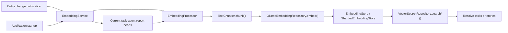
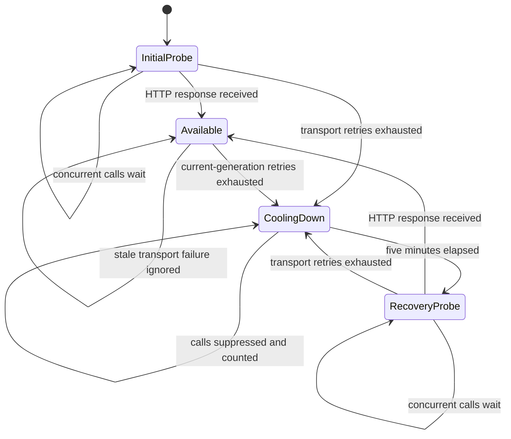

The AI feature owns local embeddings and vector search — the one place where the
app stores data outside Drift.

| Component | Role |
|-----------|------|
| `EmbeddingService` | Listens to local entities, embedding/provider configuration, and narrow synced report/head/task/link notifications; performs real-time embedding work and reconciles current task-agent reports |
| `EmbeddingProcessor` | Hashes content, chunks text, generates embeddings, writes atomically |
| `EmbeddingStore` | Storage abstraction |
| `ShardedEmbeddingStore` | Production implementation, backed by **per-category ObjectBox shards** |
| `VectorSearchRepository` | Embeds the query through Ollama and resolves hits back to tasks or entries |

# Constraints

- **Gated by `enableEmbeddingsFlag`.** Off by default.
- **Requires a resolvable Ollama base URL.** Embeddings currently have no other
  provider path.
- Tasks can be embedded with **label-enriched** text, not just raw title and
  body.
- Agent reports are stored with `taskId` metadata, so a search hit can resolve
  back to the owning task. The sharded store maintains a reverse task index for
  report-ID cleanup and coalesces concurrent opens of the same category shard,
  so startup recovery and notification writes cannot open one ObjectBox
  directory twice. Replacements, moves, and deletions are serialized per report
  ID, preventing a paused shard move from resurrecting a vector deleted by a
  newer recovery decision while unrelated reports still proceed concurrently.
  An unchanged report that moves between tasks rewrites its task metadata and
  reverse-index ownership in place, even when its category shard does not
  change, so no provider call is needed and cleanup for the old task cannot
  delete the current task's vector. If an interrupted cross-shard move leaves
  duplicate rows at startup, the later shard remains authoritative and index
  rebuild removes the earlier row's obsolete task ownership before exposing
  reverse lookups.
- The production `OllamaEmbeddingRepository` is shared. The first request for
  an unobserved base URL exclusively reserves the initial availability probe;
  concurrent callers join that probe instead of starting their own retry loops.
  If the probe succeeds, they proceed normally; if three transport failures
  confirm an outage, they wake into a five-minute cooldown. Calls during that
  interval fail before network I/O and carry a cumulative suppressed-request
  count.
- Any HTTP response confirms reachability and moves the endpoint to `Available`,
  where requests may run concurrently. Every allowed request captures the
  endpoint generation at its start. An HTTP response advances that generation,
  and an exhausted transport budget opens a cooldown only while its captured
  generation is still current. Concurrent failures share an already-opened
  cooldown and its retry timestamp, while a failure completing after a newer
  successful response cannot hide recovery by reopening the circuit or carry
  the availability marker that pauses batch callers.
- The first call after the cooldown exclusively reserves the recovery probe;
  concurrent callers join it until reachability is known. Availability is
  reserved before the invocation wrapper begins AI attribution, so a
  cooldown-suppressed embedding creates neither a provider consumption event nor
  a failed attribution projection. The notification loop requeues its current
  entity and retains the rest of the batch, then schedules one retry for the
  endpoint's `retryAt`. A fresh relevant notification joins the pending set and
  immediately re-runs preflight so endpoint recovery or a changed Ollama URL is
  used without waiting for an obsolete timer; an unchanged cooling endpoint
  still fast-fails before network I/O. Task-keyed sync recovery signals do the
  same for an already queued entity batch when they cancel its timer, even when
  the changed task itself needs no provider work. If provider configuration
  changes while
  an entity request is still using the old endpoint, the service latches a
  rerun; completion or failure of that request then cancels any obsolete
  cooldown timer and resolves the new URL before continuing queued work. Manual
  backfill loops stop when the
  initial transport budget is exhausted or a known cooldown suppresses the
  call, instead of emitting one stack trace per remaining item.
- `EmbeddingService` scans durable current task-agent report heads at startup
  and re-runs reconciliation when sync emits a dedicated current-report body,
  head, agent-identity, task-keyed change, or task-agent-link token, or when
  embedding/provider configuration changes;
  generic agent messages, state, and usage changes do not trigger a global
  scan. Identity sync retries topology that arrived before its referenced
  identity, while report-body sync closes the sequence-gap case where a head
  arrives before its referenced report. Task sync uses the keyed task ID to
  relocate only that task's current vector after a remote category change;
  generic task notifications do not launch a full agent-topology scan.
  Task-link sync includes a task-keyed token, allowing recovery to delete
  orphaned report vectors after the final link is removed even though no active
  link remains in the topology scan. Local agent hard deletion first captures
  its task links and synchronously deletes every report vector found through
  their reverse task index. Only after that durable cleanup succeeds does it
  remove the topology rows, so a crash cannot strand vectors whose last task
  link has disappeared. A post-delete keyed signal then reconciles a surviving
  canonical agent, if any, and rebuilds its current vector. A soft-deleted task
  is likewise a cleanup boundary: recovery confirms its tombstone through the
  including-deleted journal read, deletes every report vector in that task's
  reverse index, and makes no provider request. Provider
  and flag streams skip their initial snapshots because startup already
  requests one pass; later enablement resumes both pending report recovery and
  any availability-paused entity batch. Disabling embeddings cancels the retry
  timer and drops queued journal entities. Final write guards also reject
  entity or report vectors whose provider request was already in flight, and
  the guard is rechecked between chunks so no further provider calls start
  after disablement or supersession. Provider changes stop the active report
  scan after its current request and rerun with a freshly resolved URL, while
  report recovery keeps a full pass pending for the next enablement. Its
  long-lived read-only repository
  invalidates its own identity snapshot before each pass because writes happen
  through other repository wrappers. When multiple agents are linked to one
  task, the same canonical primary-link ordering used by task report reads
  selects the only report that recovery may keep searchable. Content hashes
  keep unchanged reports cheap; if only the task category or task ownership
  changed, the stored chunks and reverse indexes move to the current metadata
  without another provider call. Recovery
  revalidates the durable head, current
  primary link, and task category before and after vector storage, then reads
  cleanup candidates from the embedding store's reverse task index and checks
  all three selectors again. It never loads the agent's historical report
  bodies or treats wall-clock timestamps as ordering authority. If the head
  advances during any of those awaits, recovery removes only a stale vector it
  just wrote and follows the successor. If the primary link or category
  changes, it abandons that pass and rebuilds topology and shard state before
  cleanup. If any agent-to-task topology read fails, the pass stays pending but
  stops before selecting from the partial snapshot; it waits for a later
  external signal instead of immediately regenerating and deleting vectors in
  an unbounded retry loop. A failure inside one task continues the other tasks
  but likewise retains the full-scan latch for the next external signal. An
  availability failure leaves reconciliation
  pending on the shared retry timer and retains the failed task plus every
  unprocessed task in a coalesced targeted pass. A later journal, report-head, or
  task-link notification rechecks disabled/provider gates without requiring an
  app restart.
- Manual backfill stores a typed `ollamaUnavailable` presentation code. The UI
  maps it to the active locale; the suppression count and retry timestamp stay
  in diagnostic logs. A failed optional embedding never rolls back the
  already-persisted agent report or deletes its previous embedding. Availability
  failures defer the latest report per task until `retryAt`; a newer report
  synchronously supersedes the queued one. The workflow checks its local claim,
  durable report head, canonical primary task-agent link, and task category
  after asynchronous URL/task resolution, immediately before vector storage,
  and after the atomic store replacement. A category change removes only the
  just-written stale-shard vector and makes one bounded retry against a fresh
  category snapshot.
  Each durable lookup rechecks the local claim after its await so a successor
  cannot race an older snapshot. A report superseded during the write has only
  its newly written vector removed; it never deletes the searchable predecessor.
  Coalesced reports carry forward the last predecessor that was actually
  searchable, and a deferred retry whose head advanced through sync is
  abandoned before provider or storage work. Deferred workflow retries also
  re-read `enableEmbeddingsFlag` after their wait and stop before provider work
  when embeddings were disabled during the cooldown.

Embedding indexing participates in [work attribution](attribution.md): endpoint
availability is reserved first; allowed work then begins attribution before its
first provider invocation, records one interaction per chunk with digests only
and **no invented monetary cost**, and finalizes a typed `embeddingVector`
output after the store replacement succeeds.
