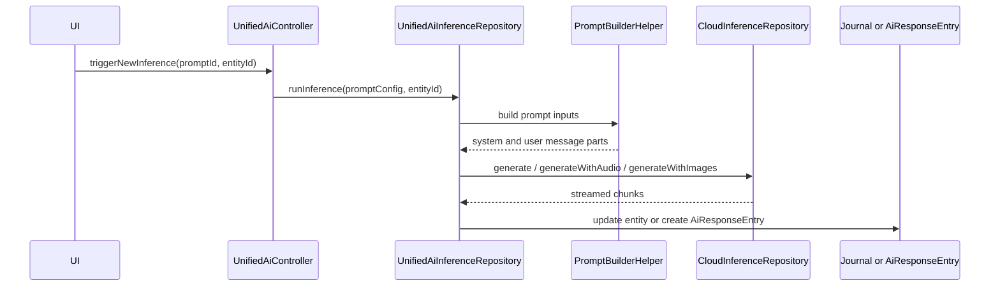
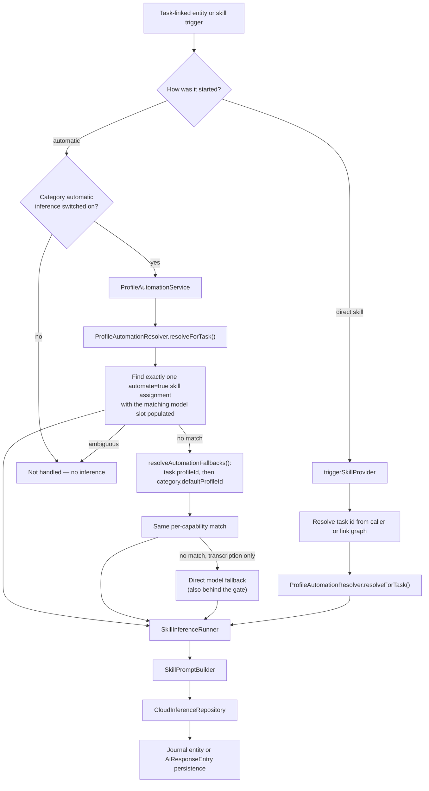
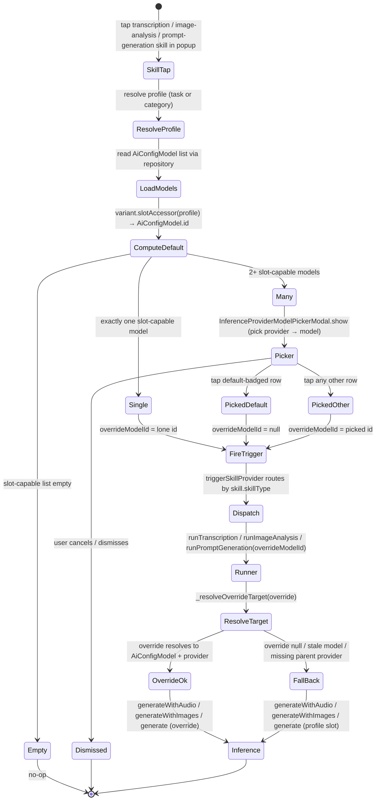

# Two systems coexist

The older **prompt path** is driven by `AiConfig.prompt`; the newer
**skill/profile path** is built around `AiConfig.skill`,
`AiConfig.inferenceProfile`, `ProfileResolver` and `SkillInferenceRunner`. Both
are live.

## Legacy prompt path

`AiResponseType.taskSummary` and `AiResponseType.checklistUpdates` are
**deprecated**, kept only for persistence compatibility. Prompt generation also
exists on the skill path via `SkillInferenceRunner.runPromptGeneration()`.

## Skill/profile path

Two entry styles, with deliberately different reach:

| Entry | Covers |
|-------|--------|
| **Automatic** — `ProfileAutomationService` | `tryTranscribe()` and `tryAnalyzeImage()` only |
| **Direct** — `triggerSkillProvider` | transcription, image analysis, prompt generation, image-prompt generation, image generation |

`promptGeneration` and `imagePromptGeneration` share one dispatch arm: both route
to `runner.runPromptGeneration()`, which derives the persisted response type from
`skill.skillType.toResponseType`. When the caller passes no parent task id,
`triggerSkillProvider` recovers one from the entry-link graph, preferring
entry → task links and falling back to task → entry child links.

For coding-prompt generation, the per-run model picker also inspects the chosen
`AiConfigModel.inputModalities` and provider route. A chat-capable model carrying
`Modality.image` opens the same task-image selector used by cover-art generation,
with the coding-specific `kMaxCodingPromptImages` limit (currently 10). A
text-only model such as GLM 5.2 dispatches immediately and never mounts the
selector. Dedicated Mistral OCR models are excluded even though their catalog
modalities include text and image: `/v1/ocr` accepts documents, not coding-prompt
instructions. Continuing with no selection keeps the historical `generate()`
request; one or more selections route through `generateWithImages()` with the
unchanged prompt text.

The selector grid is driven only by `ReferenceImageSelectionState.availableImages`:
directly linked `JournalImage` records first, then de-duplicated cover art from
linked tasks. The selection limit changes which of those records can be toggled;
it never pads the grid with empty slots. Each cell clips its stack to the rounded
tile and decodes the source through a device-pixel-ratio-sized
`CoverResizeImage` instead of allocating the full photo or screenshot as an iOS
texture. The decoder preserves the source aspect ratio and sizes the shorter
edge for the square tile, so `BoxFit.cover` crops excess pixels without
magnifying a fit-sized wide or tall thumbnail. The longer decoded edge is capped
at 4096 pixels so scrolling screenshots and other extreme aspect ratios cannot
reintroduce an oversized texture through proportional scaling.

Both inference paths read `JournalImage` bytes only from the canonical location
inside the app documents directory. This containment boundary deliberately does
not use the display resolver's compatibility fallback: screenshots written by
the legacy missing-separator bug can remain visible inline from their old
sibling directory, but are not sent to an AI provider until the user runs
Settings → Advanced → Maintenance → **Repair screenshot storage**. The repair
copies and verifies the bytes, updates the entry, and removes the legacy source
only after persistence succeeds; see [persistence](../../architecture/persistence.md#journal-image-paths-and-screenshot-repair).

# The category consent gate

Every automatic entry point — `tryTranscribe`, `tryAnalyzeImage`, and the
`hasAutomatedSkillType` affordance check — first asks whether the entry's
category has `CategoryDefinition.automaticInferenceEnabled` switched on. **Nothing
else in the chain runs until it says yes.**

This exists because **selecting a profile is not consent.** Every seeded default
profile ships `automate: true` skill assignments, so binding a profile to a
category used to silently start transcribing audio and analysing images. The flag
is nullable and an absent value means **off** — including for categories that
already had a profile before the switch existed — so no install starts spending
tokens on its own after an upgrade.

**The direct transcription fallback sits behind the same gate.** That path
synthesises a profile-shaped result from any configured speech-to-text model
without consulting a profile at all, so leaving it ungated would have preserved
exactly the behaviour the switch is meant to make explicit.

Because the fallback needs no profile, the settings switch is offered whenever
*either* the selected profile carries automated skills *or* the fallback could
run (`categoryAutomationAvailableProvider`) — otherwise a mobile install with an
MLX Audio model and no selectable desktop-only profile would lose automation with
no visible control to restore it.

Past the gate the automatic branch is intentionally strict:

- It handles a skill type only when **exactly one** automated assignment matches.
- Multiple automated skills of the same type make the profile **ambiguous** and
  automation is skipped — and that *ends the walk* rather than moving on, because
  guessing between two deliberate assignments is worse than doing nothing.
- The resolved profile must expose the required model slot for that skill type.
- The per-recording `enableSpeechRecognition: false` opt-out wins independently
  of the category switch.

# Reading the log when nothing happened

The service declines silently in several independent places, and the caller only
ever reports the generic "profile automation did not handle X". Every decline
therefore names itself under `LogDomain.ai` via `DomainLogger` (ids sanitized
through `DomainLogger.sanitizeId`). Grep the sub-domain to find which gate
rejected a recording or an image:

| subDomain | what declined |
|---|---|
| `perRecordingOptOut` | the user unticked speech recognition for that one clip |
| `categoryGate` | the category's `automaticInferenceEnabled` is off, or no lookup is wired |
| `profileResolution` | no profile resolved, or the whole walk finished without a match (reports how many profiles it tried) |
| `skillMatch` | an assignment's skill config is missing, the profile's model slot for that type is empty or unresolvable, or two skills of the same type made it ambiguous |
| `directFallback` | the profile walk found nothing **and** the direct transcription fallback could not run either — no speech-to-text model is configured at all, or every configured one was rejected (tallied by unresolvable provider vs. missing API key) |
| `resolved` | it *did* run — names the skill and whether it came from the task-linked or an inherited profile |

`resolved` is not decoration: a run against the wrong profile is as opaque as no
run at all.

Two rules keep these lines trustworthy:

- **Only the run paths write.** `hasAutomatedSkillType` and
  `hasDirectTranscriptionFallback` are capability probes evaluated during a
  widget build or on a settings screen, so they walk the same resolution with
  `_CallIntent.probe` and log nothing. Otherwise rendering a checkbox would
  manufacture a `resolved` record, and every rebuild would repeat the declines
  until the decision belonging to the actual recording was buried. Nothing is
  lost — `automatic_prompt_trigger` calls the run path whether or not the
  checkbox is visible.
- **No user-authored text.** Model rows are identified by sanitized config id
  plus provider *type*, never `providerModelId` or `name` — both are free-text
  fields that can carry private hostnames, deployment names or filesystem paths
  into an exportable log.

The trigger helpers add the outer bookends (`triggerAutomaticPrompts`,
`triggerAutomaticImageAnalysis`), including the "no linked task" early return
that happens before this service is reached.

# The per-capability profile walk

`resolveForTask` answers *which profile drives this task's agent*. That is the
right question for the thinking route and the **wrong** one for automated
capabilities, so `ProfileAutomationService` asks it per capability and walks
further when the answer does not own the one it needs:

1. `resolveForTask(taskId)` — the agent's profile.
2. `resolveAutomationFallbacks(taskId)` — the task's own inherited `profileId`,
   then the owning category's `defaultProfileId`, de-duplicated by profile id and
   resolved lazily (only reached when step 1 produced no match).

Each candidate must both automate the skill type **and** have the matching model
slot populated, so a profile deliberately chosen for a task still wins every
capability it does own, and only the missing one falls through.

**Why the walk exists:** picking a thinking model by hand resolves the task to a
bare model route. `ProfileResolver._resolveTypedSetup` returns a `ResolvedProfile`
carrying a thinking model and nothing else — no capability slots, no
`skillAssignments` — whenever `AgentInferenceSetup` has a
`thinkingModelOverrideId` and no `baseProfileId`. Treating that as the last word
switched the category's automatic transcription and image analysis off *as a side
effect of a model choice*, and no later model change brought them back, because
`updateAgentThinkingModelOverride` copies the same null `baseProfileId` forward
every time. The same hole opened for a task created before its category had a
default profile, whose `task.data.profileId` is null.

# Persistence by skill type

| Skill type | Result |
|------------|--------|
| Transcription | Updates `JournalAudio.transcripts` and `entryText`, then runs the audio-summary skill when the profile automates it (see below) |
| Audio summary | Creates an `AiResponseEntry` linked from the `JournalAudio`, carrying `oneLiner` / `tldr` on `AiResponseData` plus the full markdown in `response` — **one per run**, newest wins |
| Image analysis | Creates an `AiResponseEntry` linked from the `JournalImage` — **one per run**, so an image accumulates multiple analyses (a brief summary, a full OCR extraction), distinguished by model. Carries `oneLiner` / `tldr` when the vision model can call tools (see below) |
| Prompt generation (coding/design/research) | Creates an `AiResponseEntry` linked to the parent task when one resolves, **and** back to the source audio/text entry so the prompt appears in both linked-entries lists (falling back to a single link on the source entry when no task resolves) |
| Image-prompt generation | Keeps the entry link |
| Image generation | Imports the generated image, sets it as task cover art, then triggers automatic image analysis on it |

## Audio summaries

`SkillInferenceRunner.runAudioSummary` summarizes a recording's transcript in
three tiers. It hangs off the **end of `runTranscription`**
(`_maybeRunAudioSummary`) rather than off each of that method's six callers, so
every route that produces a transcript — automatic recording trigger, synced-audio
dispatcher, manual picker, relationship and goal check-ins, Daily OS capture —
gets the same follow-up exactly once.

Three gates, all deliberate:

- **A task must resolve.** The skill's `fullTask` context policy has nothing to
  read otherwise, and the summary is framed by the task. Goal and person
  check-ins and standalone voice notes transcribe as before and get no summary.
- **The transcription itself must have been automated**, which a non-null
  `AutomationResult.skillAssignment` records. Only the automated paths set it,
  and only those passed the category's automatic-inference consent check — the
  manual picker and `requestTranscription` skip that check because a gesture is
  its own consent, and that consent covers the transcription asked for, not a
  second call.
- **The profile must assign the summary skill with `automate: true`.** The
  already-resolved profile is reused rather than walked again.

This gate is only on the *automatic* follow-up. `SkillType.audioSummary` is
also manually selectable from the AI popup on any task-linked recording, which
is both the backfill path for recordings that predate the feature and the way
to refresh a stale snapshot. That path runs the same `runAudioSummary` through
`triggerSkillProvider` and is subject to none of the gates above beyond needing
task context.
- **Failures never propagate.** The transcript is already persisted and is the
  valuable artifact; letting a summary failure reach `_withStatusTracking`
  would mark the transcription run as `error` and invite a retry that
  re-transcribes audio that transcribed fine.

Two properties are contract rather than detail:

- **The tiers come back through a pinned tool call, never a parser.** The skill
  sends `entrySummaryTool` with `toolChoice` fixed to it, and
  `parseEntrySummaryToolCall` decodes typed arguments — the same shape the
  agents' `update_report` uses. A rejected call (no tool call, wrong tool,
  missing field, one-liner over `entrySummaryOneLinerMaxChars`) buys exactly
  one forced retry, whose tokens are merged with the first attempt's so a model
  that needed prompting twice is not billed as if it needed one.
- **It runs on the profile's thinking slot**, the same model as the task agent.
  Not for cost: the inference-profile form is the only place that slot can be
  set, its picker is filtered to `supportsFunctionCalling` models, and the slot
  is required — so it is the one slot guaranteed to be able to call a tool. Any
  other slot could hold a model that cannot. The resolve-time
  `supportsFunctionCalling` check in `runAudioSummary` is an assertion for
  programmatically-seeded profiles and wrong capability flags, not a fallback
  path.

Transcripts are sent **whole**. There is no input ceiling and no truncation: a
transcript too large for the model's context fails the call, and the failure
path above already covers it. Transcripts under `_audioSummaryMinChars` are
skipped instead — a summary of a one-sentence note would spend a call to restate
the collapsed card's existing fallback.

The collapsed audio card reads the newest summary's `oneLiner`
(`audioSummaryOneLiner`), falling back to `audioEntryOneLiner`'s transcript
preview when there is none — not yet summarized, too short, no task, or synced
from a client predating the tiers. `AiResponseSummary` renders a response that
carries a `tldr` collapsed-to-TLDR rather than collapsed-to-nothing, and is
always collapsible regardless of body length, since the tiers exist precisely so
the reader can choose the short version.

## Tiered image analysis

Image analysis publishes the same three tiers through the same
`entrySummaryTool`, with two differences from the audio path that both follow
from analysis being the older, load-bearing artifact:

- **Tiers are conditional on the model.** They are requested only when the
  resolved vision model's `supportsFunctionCalling` is true. Many capable
  vision models cannot call tools, and this skill shipped on a free-text
  contract long before the tiers existed — so tool support *upgrades* the
  output rather than gating it. Without it, no tool is attached, no tier
  instruction is appended (`SkillPromptBuilder`'s `requestTieredSummary`), and
  the result is byte-for-byte what it is today.
- **A rejected tool call is not a failure and buys no retry.** A model that
  answers in prose despite the pin simply lands on the untiered path with its
  analysis intact. Losing an analysis to reclaim a one-liner would be a bad
  trade — the inverse of the audio summary, where the tiers *are* the artifact
  and a failed run costs nothing already persisted.

When tiers do come back, the tool's `summary` argument becomes the analysis
body; `response` is never the raw streamed prose in that case.

The collapsed image card leads with a **thumbnail**, not a text line: an
image's payload is the picture, so collapsing it to text alone would be harder
to place than the card it replaced — the reverse of audio, where the verbose
transcript is what the user wanted out of the way. The label prefers
`imageAnalysisOneLiner` and falls back to the image's own `entryText`, which is
both where the legacy analysis path appends and where a user's caption lives.
With neither, the thumbnail stands alone.

Images still default to **expanded**; only audio reads a null `collapsed` as
collapsed. The row renders whenever a user collapses an image themselves.

Image analyses render through `AiResponseSummary` as a tinted, non-elevated AI
surface — the report-card colour family without its accent-blended fill and
badges. In the nested tree the cards collapse binarily, so long analyses (full
OCR) start fully collapsed to a Show more/Show less toggle plus the attribution
pill, while short summaries stay visible.

`fetchAiResponsesForImages` resolves them in bulk for task context:
`AiInputRepository.generate` nests them per image log entry as
`aiResponses: [{model, generatedAt, text}]`, and the agent capture path emits one
`image_analysis` log source per analysis.

Coding prompts use `buildTaskDetailsJson`, so those nested linked analyses are
part of the full-task JSON passed to `SkillPromptBuilder`; the analysis does not
need to be copied back into `JournalImage.entryText` to reach the model.

**After a task-linked analysis is stored**, `runImageAnalysis` marks every parent
task of the image dirty — all tasks linking to it plus the resolved
`linkedTaskId`, skipping non-task parents — with the standard child-changed
notification pairs. The analysis write itself only notifies the image, never the
tasks, so without this each parent agent would never see it. See
[wake orchestration](../agents/wake-orchestration.md).

When the attribution service is not registered (older tests, partial composition
roots) a legacy compatibility path appends the text to the `JournalImage` entry
instead.

In linked-entries lists, generated prompts render under the `Code` activity
filter pill and are **exempt** from the generic `showAiEntry` gate that keeps
transcripts and image analyses collapsed.

# Context injection

`SkillPromptBuilder` is the only place that assembles runtime skill messages,
injecting context per `ContextPolicy` and skill type:

| Policy | Injects |
|--------|---------|
| `none` | No extra task context |
| `dictionaryOnly` | Speech dictionary only |
| `taskSummary` | Current task summary only |
| `fullTask` | Task JSON, linked tasks, richer context |

In practice it may also inject speech-dictionary terms, linked task JSON, the
current task summary, audio transcript text, correction examples, and
URL-formatting rules for image analysis.

`TaskSummaryResolver` is the shared summary lookup. For single-task prompt
building it checks the current agent report first, then falls back to legacy
`AiResponseType.taskSummary` entries. Bulk linked-task builders call
`resolveMany()` so agent reports load in one batch, using prefetched legacy
entries only where no usable report exists.

# Skill filtering

`availableSkillsForEntityProvider((entityId, linkedFromId))` filters the registry
per entity; the popup uses it via `hasAvailableSkillsProvider`.

- **Modality filter** — `Modality.audio` matches only `JournalAudio`,
  `Modality.image` only `JournalImage`, `Modality.text` any entity with text
  content (`JournalAudio` qualifies via its transcript).
- **Task-context filter** — a skill needs a task iff
  `contextPolicy == ContextPolicy.fullTask`. Task context is present when the
  entity is a `Task`, when the caller passes `linkedFromId`, or when the link
  graph resolves a parent task in either direction. Full-task skills are hidden
  only when **all three** checks fail.
- **Audio-summary modality** — `SkillType.audioSummary` declares
  `Modality.audio` even though its input is the transcript's *text*. The field
  selects the source **entry** type, and `Modality.text` would also match
  notes, tasks and images.
- **Cover-art source filter** — `SkillType.imageGeneration` is narrower still:
  shown only for `JournalEntry` or `JournalAudio` sources that also have task
  context. The runner imports the generated image back onto the linked task, so a
  task-only popup would have no source note and a standalone note would have
  nowhere to save the cover art.

Seeded task-context skills are therefore hidden for truly standalone entries;
only their plain counterparts show. `triggerSkillProvider` also carries a
defensive guard: a `fullTask` skill triggered without a resolvable task id is
captured as an event and aborted — the popup should never offer one in that
state, so reaching it means the caller or link graph is missing task context.

# Per-invocation model overrides

Skill types with an override slot — transcription, image analysis, prompt
generation, image-prompt generation — open the model picker *before* firing
`triggerSkillProvider`, so a single voice note, photo or prompt run can be routed
to any modality-capable model without editing the profile.

The picker filters **provider first, then model**, with a one-tap "Current
default" shortcut pinned on top. It is adaptive: no modal for a single capable
model, and the provider step is skipped when one provider owns all capable
models.

The flow is **one parameterised path** — the variant table `_modelOverrideConfigs`
(four entries) plugs in the per-slot modality filter, profile-slot accessor and
l10n strings. Adding another override slot is a one-line entry plus a
corresponding `_resolveOverrideTarget` call on the runner.

The choice threads through as the optional `overrideModelId` on
`TriggerSkillParams`. Each per-slot resolver returns an `_InferenceTarget` record
of `(provider, modelId, model)` — the `model` field carries the resolved
`AiConfigModel` row so per-model settings such as Gemini thinking mode survive
resolution — preferring the override when it resolves to a real model plus parent
provider, and falling back to the profile slot with a warning log otherwise.

Three short-circuits keep the common case one-tap:

| Condition | Behaviour |
|-----------|-----------|
| `models.isEmpty` | Picker not shown, trigger not fired (defensive; the modality gate should prevent reaching here) |
| `models.length == 1` | Picker not shown, trigger fires with the lone id |
| `picked == defaultModelId` | Override collapsed to `null` at the callsite, so the runner reads the profile slot — and a model deleted between picker and run still falls back gracefully instead of routing to a stale id |

## Cover art

Cover-art generation is a separate path (`_handleImageGenerationSkill` →
`CoverArtSkillModal`) but offers the same provider → model choice. Before the
reference-image step the handler loads every model that *outputs* images and
opens the same picker; the chosen id threads through as `overrideModelId`,
resolved by `_resolveImageGenerationTarget` exactly like the other slots. With
fewer than two image-output models the picker is skipped.

Two built-in skills share that runtime path:

- **`Generate Cover Art`** keeps `ContextPolicy.fullTask` and builds the rich
  prompt with task JSON, related tasks, task summary and entry notes.
- **`Generate Cover Art (Flux)`** uses `ContextPolicy.taskSummary` as a compact
  mode. `SkillPromptBuilder` recognizes `imageGeneration + taskSummary` and sends
  only a short scene plus mood/task clues and explicit 16:9 / central
  square-safe composition guidance — no full task JSON, no related-task JSON, no
  `**Entry Notes:**` wrapper. This suits Flux-style models, which perform better
  with a direct visual story than with application context. Melious image
  generation also passes explicit FLUX dimensions (1792 × 1008) so the transport
  request matches the 16:9 prompt.
