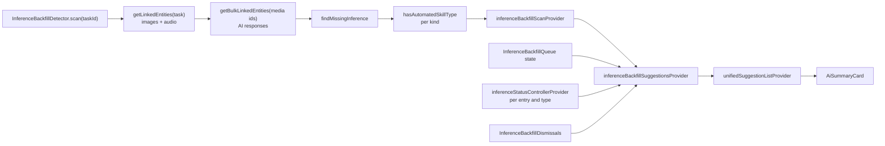
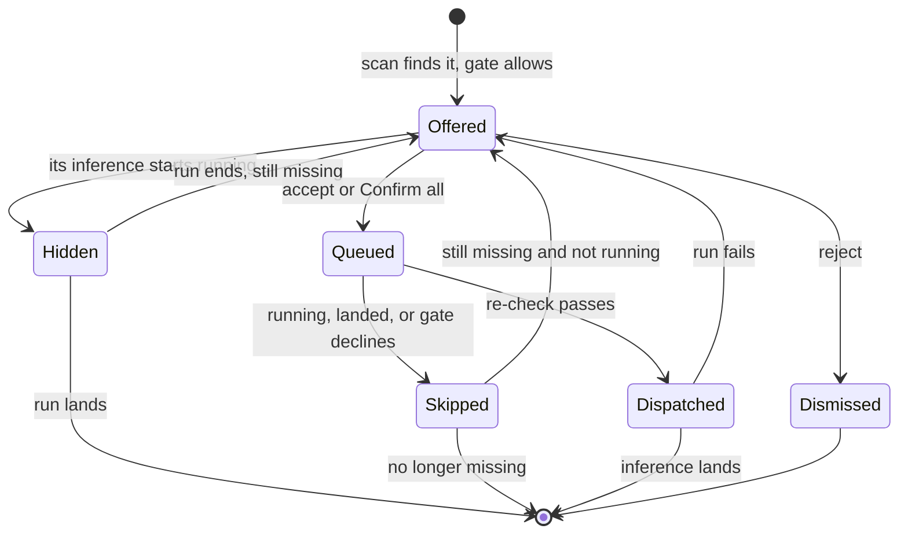

# What it is for

An image whose analysis never ran, or a recording with no transcript or no
summary, is a hole in what the task's agent can read — and on the collapsed
audio card, a missing summary leaves a one-line transcript fragment where the
summary belongs. Inference can be missing because a run failed, because the
category's automatic inference was switched on after the entry was captured,
or because the capability did not exist yet.

Backfill finds those entries and offers **one suggestion per entry** in the
task's *Proposed changes* list. Accepting one runs that entry's inference and
nothing else; *Confirm all* runs every one of them.

**It is mechanical.** Nothing here is an agent tool: no model decides what is
missing, the agent's tool list and wake context are unchanged, and no
suggestion is written to a change set. The rows are derived from stored data
every time the list is built.

# What counts as missing

`missingInferenceFor` decides, per entry, from the entry and the AI responses
linked *from* it. At most one kind per entry:

| Entry | Missing | Not missing |
|-------|---------|-------------|
| Image | no `imageAnalysis` response | an analysis response, **or** the image has text of its own |
| Audio | no transcript **and** no text → *transcription* | the user typed text but there is no transcript: a transcription run would overwrite it |
| Audio with content | no `audioSummary` response and the content passes `hasSummarizableContent` → *summary* | content under the summary run's 200-character floor |

Three of these rules exist to avoid offering something that cannot finish or
would do harm:

- **An image with its own text counts as analysed.** The legacy analysis path
  appended its result to the image's text instead of linking a response;
  analysing those again would pay twice for the same picture.
- **A recording without a transcript is offered transcription, never a
  summary.** An automated transcription runs the profile's summary straight
  after it ([audio summaries](execution-paths.md#audio-summaries)), so a separate
  summary suggestion would either race the transcript or summarise twice.
- **The summary floor is the run's own.** `hasSummarizableContent` reads the
  same content `runAudioSummary` reads (an edit before the transcript) against
  the same minimum. A suggestion the run would skip would never go away.

Deleted entries and deleted responses count for nothing.

# The consent gate

A kind is offered only when automation would run it for the task:
`ProfileAutomationService.hasAutomatedSkillType` for that skill type. That
check opens with the [category consent gate](execution-paths.md#the-category-consent-gate)
— the category's automatic inference switch — and then needs a profile the task
resolves to that automates the skill with its model slot set. Backfill offers
what the automatic triggers would have done, not more. A category with the
switch off gets no suggestions at all.

The gate is asked once per kind present, not once per entry.

# Detection and refresh

`inferenceBackfillScanProvider` rescans when an update notification names the
task, one of its media entries, or `categoriesNotification` (the switch lives on
the category). A background rescan that fails keeps the last list.

`inferenceBackfillSuggestionsProvider` then drops, on every rebuild:

- **entries whose inference is running** — from any trigger: an automatic run,
  the AI popup, another backfill. It watches each candidate's
  `inferenceStatusController`, so a row disappears the moment a run starts and
  returns if that run fails. An audio entry counts as busy while *either*
  transcription or summary runs;
- entries already queued;
- entries dismissed on this device.

It returns nothing until both the scan and the dismissals have loaded, so a
dismissed row never flashes in first.

`unifiedSuggestionListProvider` appends the rows after the agent's own
proposals. A task without an agent shows neither.

# The suggestion lifecycle

# Acceptance and the queue

A backfill row is a `PendingSuggestion` built by `PendingSuggestion.backfill`:
a `ChangeItem` with the kind's tool name (`backfill_image_analysis`,
`backfill_transcription`, `backfill_audio_summary`) and the entry's id and
capture time, wrapped in a stand-in change set that is **never persisted,
synced or shown to the agent**. It exists so the row renders, animates and
counts like every other proposal. `PendingSuggestion.backfill` carries the
candidate, and that is what routes the row:

- **Confirm** → `confirmBackfillSuggestion` → `InferenceBackfillQueue.enqueue`.
  Never `ChangeSetConfirmationService`.
- **Reject** → `dismissBackfillSuggestion` → `InferenceBackfillDismissals`, a
  device-local list in `SettingsDb`. A dismissal is a reading preference, not a
  change to the entry, so it rides on no synced entity.
- **Confirm all** → every backfill row is enqueued; the persisted change sets
  beside them go to `confirmAll` as before.

`InferenceBackfillQueue` runs jobs **one at a time, in acceptance order** — fifteen
photos must not become fifteen concurrent vision calls — and its state is the
set of queued or running keys, which is what hides a row the instant it is
accepted and makes a second accept of the same row a no-op.

**Every decision is taken when the job runs, not when it was accepted:**

1. If the entry's inference is running, skip it — the run in flight will land it.
2. If `InferenceBackfillDetector.isStillMissing` says it landed meanwhile —
   another device's result synced, an automatic run finished — skip it.
3. Resolve the profile **now** with `tryAnalyzeImage`, `tryTranscribe` or
   `trySummarizeAudio`. A profile switched while the job waited is the one that
   runs; a category whose switch was turned off runs nothing.
4. Dispatch to `SkillInferenceRunner.runImageAnalysis`, `runTranscription` or
   `runAudioSummary` with the task as `linkedTaskId` — the same task context the
   automatic triggers pass.

A failing job is logged and the next one runs. The run reports through the
entry's own inference status like any other run, and a failed one shows up again
on the next scan.

# Gotchas

- **The running check is check-then-act.** The queue reads the entry's status,
  then awaits the database and the profile walk before it dispatches. A
  transcription started by another trigger inside that window is still safe:
  `TranscriptionRuns` joins the second request to the run in flight
  (`SingleFlight` in [`TranscriptionRun.tla`](../../../specs/tla/TranscriptionRun.tla)).
  Image analysis has no such guard, so an automatic or popup analysis starting
  in that window runs twice — two responses, the newer one read. Closing it
  means single-flight for image analysis in the runner, not a stricter check
  here.
- **The status controllers are in-memory.** `inferenceStatusController` is
  autoDispose with a two-minute cache, so "running" is per device and per
  process. Another device's run is invisible until its result syncs — at which
  point the entry is no longer missing and the job is skipped.
- **Dismissals do not travel.** Rejecting on the phone leaves the row on the
  desktop.

# Related

* [Execution paths](execution-paths.md) — the runs a backfill dispatches to.
* [Profile resolution](profile-resolution.md) — which profile a task resolves to.
* [Agent UI surfaces](../agents/ui-surfaces.md) — the card that hosts the rows.
