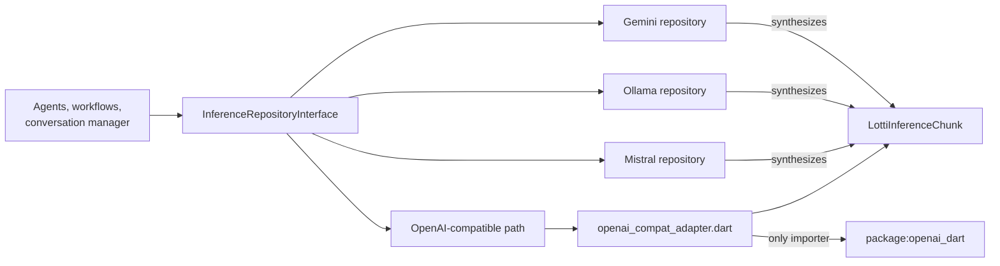

# One vocabulary, many providers

Every provider repository — Gemini, Ollama, Mistral, Melious, Voxtral, Whisper,
oMLX, DashScope and the OpenAI-compatible fallback — produces
`LottiInferenceChunk`s and consumes `LottiMessage`s. Providers that are not
OpenAI-compatible do not translate through an OpenAI payload; they **synthesize
domain chunks directly** (`gemini_chunk_factories.dart`,
`ollama_api_client.dart`), which is why the chunk types have public
constructors and no JSON parsing of their own.

`InferenceRepositoryInterface` is the contract. It names only Lotti types.

# The adapter is the only importer

`lib/features/ai/repository/openai_compat_adapter.dart` is the **single file in
`lib/` that imports `package:openai_dart`**. It owns the mapping in both
directions and nothing above it names a client-library type.

| Lotti type | Wire form the adapter produces |
|---|---|
| `LottiMessage` | `ChatMessage` subtypes (`system`/`developer`/`user`/`assistant`/`tool`) |
| `LottiUserText` vs `LottiUserParts` | a bare `content` string vs a parts array |
| `LottiToolCall` | `ToolCall` with the name and arguments nested under `function` |
| `LottiTool` | `Tool.function(...)`; `parameters` omitted when null |
| `LottiToolChoice` | `auto` / `none` / `required` / a named function |
| `LottiInferenceRequest` | `ChatCompletionCreateRequest` |
| `ChatStreamEvent` | `LottiInferenceChunk` |
| `Usage` | `LottiUsage`, with the two `*_tokens_details` blocks flattened |

`LottiInferenceClient` (`inference_client.dart`) is the injectable seam;
`OpenAiCompatInferenceClient` in the adapter is its only production
implementation, and tests mock the interface rather than the library client.

The adapter also classifies failures. `openAiErrorType` maps the library's
typed exception hierarchy onto `InferenceErrorType`, and
`isUnparseableStreamFrame` identifies a single frame the client could not
read, so `ai_error_utils.dart` and the keep-alive filter make those decisions
without naming the library.

# Deliberate asymmetries

- **The mapping is total outward, lossy inward.** Responses carry fields Lotti
  does not model — log probabilities, refusals, provider reasoning payloads,
  the `object` echo, the streamed `role` — and those are dropped on the way in.
- **Text-only user content stays a string.** Some compatible providers reject a
  one-element parts array where they accept a bare string, so
  `LottiUserText` and `LottiUserParts` are distinct types rather than one
  normalized shape.
- **`LottiTool.parameters` is nullable on purpose.** Null omits the field;
  providers disagree about accepting an empty `{}` schema.
- **Tool calls are flat.** `id`/`name`/`arguments` sit on `LottiToolCall`; the
  `function` nesting is a transport detail the adapter restores.
- **The legacy `function` message role is not modelled.** It was deprecated
  upstream and nothing in Lotti constructed one; tool results use the `tool`
  role.
- **Nothing here is persisted.** Conversations are rebuilt in memory, so these
  models carry no JSON contract of their own and changing them is never a data
  migration.
- **Streaming is a choice of call, not a request field.** The client selects it
  by which method is invoked, so `LottiInferenceRequest` does not carry a
  `stream` flag that could disagree with it; only `openAiRequestJson`, used by
  providers Lotti posts to directly, takes one explicitly.
- **A client serves one request.** `OpenAiCompatInferenceClient` owns its
  transport and closes it when the stream ends, fails or is cancelled, because
  every call site builds one per call.

# Why the boundary exists

The client library's generated types used to *be* the app's inference domain,
so a major version of it reached roughly 160 files. Confining it to the adapter
makes the next upgrade a change to one file plus its test. If a client type
appears anywhere outside the adapter, that is the defect.

# Sharp edges

- **`ToolCallDelta.index` is required upstream but nullable here.** Real
  providers always send it; the synthesized paths do not have to, and
  `ToolCallAccumulator` relies on being able to tell an opening fragment from a
  continuation.
- **A provider error reaches the UI by type, not by message.** Before the
  exceptions were typed, `ai_error_utils.dart` matched on the runtime type
  *name* containing "OpenAI". Nothing in the current hierarchy does, so that
  check would silently classify every provider failure as unknown; the
  message-shaped ladder is now the fallback for providers without typed
  errors, not the primary path.
- **Usage with no counts is not zero usage.** `LottiUsage.hasTokenData`
  distinguishes "the provider reported nothing" from "the provider reported
  zero", which is what keeps duration-only audio usage out of the books.
