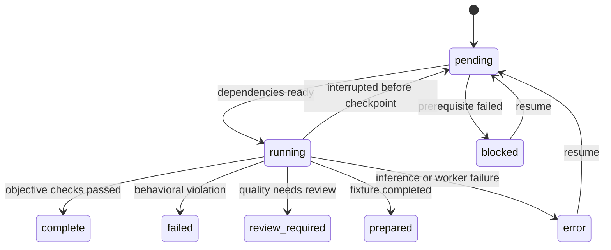
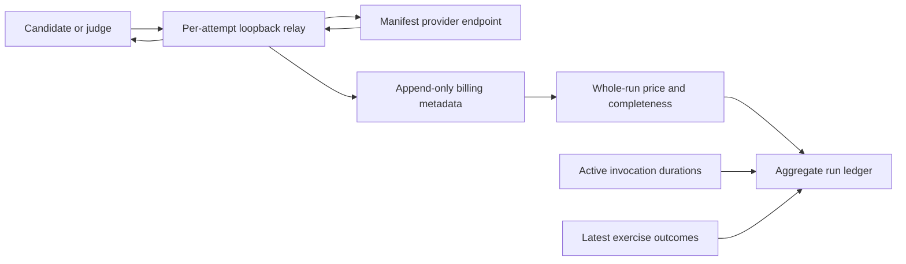

# Assessing a model

From the repository root, with dependencies installed and Melious credentials
exported or in `.env`:

```sh
python3 tool/lotti_gym.py assess --model MODEL_ID
```

This discovers the complete exercise inventory, writes an immutable manifest,
warms the Flutter builds without enabling inference, runs the candidate and
then runs the existing task-report rubric. It writes `report.html`,
`summary.json`, `jobs.json` and retained per-attempt evidence under a unique
run directory in `~/.local/share/lotti-gym/runs/`. Model output stays outside
the application repository. The command prints the directory, final verdict and
run price. Aggregate history is recorded in
`docs/evaluations/lotti-gym-runs.jsonl`; this contains no prompts, outputs,
credentials, local artifact paths or host names.

Only the Melious transport is supported by this first orchestrator. This uses
production routing through the existing harnesses, rather than treating an
arbitrary OpenAI-compatible endpoint as equivalent. `--base-url` selects an
endpoint; HTTPS is required except for explicit loopback addresses. The task
judge authorizes exactly the hostname selected by this endpoint; ambient judge
host overrides do not expand that authorization.

`--env-file` selects another local credential file. Only Melious connection
keys and their existing upstream aliases are read; dotenv text is never
executed. Empty placeholders are accepted. Exported values take precedence. API keys are passed in child
environments, never command arguments or the manifest. Ambient eval selectors,
live gates and experimental overrides are cleared before constructing the
worker environment.

The first independent batch acts as provider preflight. If it cannot complete
inference, the remaining matrix stays unassessed instead of repeating an
authentication, unavailable-model or transport failure across every exercise.
Behavioral failures still allow the complete matrix to run.

A transient provider failure on that one probe — `HTTP 5xx`, `429`, a timeout,
a dropped connection — buys up to `PREFLIGHT_RETRIES` further attempts with a
growing pause, because one wobble used to abandon a whole run. A rejected key,
an unservable model or any other permanent marker still stops on the first
attempt: those repeat forever, and retrying them only spends money. The
classifier reads the attempt's own worker log and artifact, which is where the
raw provider text lives; the consolidated report still never carries it.

Useful variations:

```sh
# Compile/discover the inventory and write the plan; no inference or judging.
python3 tool/lotti_gym.py assess --model MODEL_ID --dry-run

# A deliberately partial assessment, clearly labelled in the report.
python3 tool/lotti_gym.py assess --model MODEL_ID --suites goals,goal-outcomes

# Reuse a previous query-neutral report artifact and compare a matched run.
python3 tool/lotti_gym.py assess --model MODEL_ID \
  --summary-reports /path/to/frozen-reports.json --baseline /path/to/baseline-run

# Resume missing/error work, preserving measured behavioral failures.
python3 tool/lotti_gym.py resume /path/to/run
```

Defaults are three samples, two workers and batches of up to eight cases.
`--samples`, `--workers` and `--batch-size` change those dimensions. More workers
can increase provider contention, so concurrency is recorded as part of the
comparison contract. Temperature is not a uniform Gym control: harnesses that
consume their temperature override receive zero; the others retain their
production routing or harness defaults. Inspect the suite artifacts for effective
settings. Costs are observations, not automatic spend caps.
`--judge-model` chooses the diagnostic task judge; `--no-judge` explicitly
leaves that assessment unperformed. Neither setting changes deterministic gates.

# Inventory and fidelity

`buildLottiGymCatalog()` imports the same scenario collections used by the live
tests. Python never parses Dart enum text or maintains a second scenario list.
The catalog test checks that every live entry point is registered or explicitly
excluded, that IDs are unique and that dependencies resolve.

| Exercise | What is exercised |
|---|---|
| Task conversation | Production prompt variant, conversation/tool orchestration and production report routing |
| Task penguin | The current English penguin inference fixture; the old environment switch name is not a multilingual-coverage claim |
| Task directives | Production prompt builder with synthetic evolved report directives |
| Task workflow | `TaskAgentWorkflow` with seeded context and captured persisted proposals/reports |
| Task wake | Real task-agent context construction over seeded journal, agent and FTS databases, including restraint cases |
| Goals | Goal inference contract and tool checks |
| Goal outcomes | Goal workflow persistence and outcome checks |
| Relationships | Production-rendered facts and the relationship inference contract |
| Query reports | Query-neutral synthetic report preparation, a dependency rather than a scored exercise |
| Query | Production query pipeline, baseline and held-out questions, including follow-ups |
| Query actions | Production action planning and proposals; actions are never applied |
| Day planning | Production planning pipeline and its existing objective constraints |
| Day journey | Capture-to-plan journey metrics, retained for review |
| Compaction | Full-context and hierarchical arms paired per fixture; truncation remains a standalone experiment |

The oMLX-only Qwen compatibility harness is explicitly excluded from a Melious
assessment. Vision, audio transcription, relationship persistence and query
action application remain visible coverage gaps. A text transcript does not
measure speech recognition. Historical prompt/editor experiments remain
available through the individual harnesses; they are not multiplied into the
default production assessment.

# Worker lifecycle and recovery

A job is a bounded batch of cases for one suite and sample. Wake scenarios and
compaction fixtures each get their own job. Query cases stay together because
follow-ups depend on earlier answers. Each worker has its own process and
artifact directory; GetIt state is not shared between simultaneous workers.
Kernel locks lease stable compiler slots from
`build/test_cache/lotti_gym_leases/`. Each slot has a private Flutter project
under `build/lotti_gym_workers/`: source entries link to this checkout, while
`.dart_tool/` and `build/` are private. The copied package configuration keeps
external dependency locations absolute and points the app package at the
worker's source links. No source copy, Git checkout or credential-file link is
created. This also isolates Flutter's native libraries and test asset manifests,
which otherwise race even when kernel caches have distinct Dart defines.

Catalog discovery, warmup and paid jobs all use the leased project. Warmup
compiles at most two projects concurrently per assessment to bound local CPU
and memory use; inference uses the full `--workers` value. Cancellation stops
warmup children before waiting for the compilation pool; failures are observed
in completion order so a blocked earlier slot cannot delay cancellation. Released slots retain
their build caches for reuse, and allocation grows with peak concurrency.

For two simultaneous model assessments, start with `--workers 4 --batch-size 1`
per model. This keeps eight independent task cases in flight and avoids a slow
response holding up a sequential batch. Provider capacity is only one limit:
each resident Flutter compiler consumed roughly 1.8 GB in the September 2026
Linux assessment, before its test process. Eight workers per model exhausted a
32 GB machine plus swap; four per model stayed within available memory. Slots
isolate mutable build files, but do not bound RAM. Record worker and batch
settings when comparing latency and increase concurrency only with local
memory headroom.



Resume rebuilds the job inventory from the manifest and reads completed attempt
records, rather than trusting a potentially stale scheduler checkpoint. It
verifies manifest provenance and artifact hashes. Interrupted attempt directories
are retained, and the replacement attempt gets a new directory. Completed
behavioral failures are evidence and are not rerolled. Failed or missing task
judgments can resume without repeating candidate inference. Cancelled workers,
including negative signal exits after writing an artifact, remain retriable
errors. Both task `inferenceFailed` and agent `inferenceError` categories remain
infrastructure errors. Query failures retain measured rows: blocked follow-ups
are errors, and an unwritten tail after an infrastructure failure is marked
unassessed. Resume reruns the grouped query conversation because later answers
depend on earlier ones; prior attempts remain available.

A kernel lock prevents two coordinators writing one run. Cancellation and
worker timeouts stop the owned process group, including compiler descendants.
Atomic JSON replacement keeps the preceding checkpoint intact if a write is
interrupted. Resume currently requires the same host, calendar day, source
revision and worker count. This conservative restriction avoids silently mixing
latency conditions or the planning suite's day-dependent fixtures.

# Results and comparison

Adapters validate exact model and case identity, including missing, extra and
duplicate rows. Flutter's machine reporter establishes whether a worker actually
ran; a display string such as `All tests passed` is not an assessment. Task
inference uses `failureCategory`; goal inference uses its explicit `passed`
field. Wake/workflow artifacts are written before assertions, so their worker
outcome is also required to establish quality.

Live drivers clear Flutter's mock HTTP override before constructing clients;
otherwise the binding returns HTTP 400 without contacting the provider. The
task-workflow driver restores the previous override at teardown. Compilation
with live gates disabled cannot detect this transport trap.

Synthetic follow-up task cases use the production `TaskAgentReportPolicy`
publication state, changed-entity guidance and closing instruction. Like the
production context builder, they omit prior report prose. The real workflow
suites additionally exercise publication enforcement after successful tools.
The resurfaced-checklist case uses ordinary user-toggle provenance (`checkedBy`
and `checkedAt`). It accepts preserving completion or reopening with a
substantive reason referencing the QA source and its newer 11:20 timestamp.
Its per-item evidence
term groups are retained in scenario metadata; missing reasons, unrelated items,
title changes and archiving fail. These lexical checks do not independently
prove temporal reasoning or exercise the stricter human-approved chat guard.
The same reopening validation contributes one deterministic quality check,
including when preserving completion is the correct no-mutation choice.
Planner reservations remain forbidden in this case because the evidence gives
no scheduling request or timing urgency.
The implicit-workflow report accepts the same profile-cleanup vocabulary as
its checklist gate, including empty inference profiles. It still requires the
subject, a cleanup action, pull request, review and release; the exact phrase "profile seeding"
is not itself evidence of correctness.

The task conversation driver rethrows inference errors from both its initial
conversation and forced report pass. A provider failure cannot trigger report
recovery and become a successful or behaviorally failed assessment. When a
later request fails, the failed result retains completed-call token usage, the
forced-retry flag and consumption events already recorded for the wake.

Inference errors remain separate from behavioral failures. Missing cases remain
in the expected denominator. Day-planning heuristics cannot earn objective
credit. Journey metrics and compaction fact/recommendation quality retain their
review requirements. The task-specific rubric is not applied to unrelated
workloads. Judging remains diagnostic, including when a candidate and judge
share a model family; it never promotes a deterministic failure into a pass.

Suite verdicts distinguish checks passed, failed, incomplete, prepared and review
required. The overall result never automatically certifies unrestricted model
fitness. Exit codes are `1` for behavioral failure, `2` for incomplete/setup
failure, `3` for completed work requiring review, and `130` for interruption.
Dry-run completion exits `0`.

The report retains observed latency; P95 is omitted below twenty observations.
Detailed artifacts preserve production retry/editor behavior. Do not read one
small sample as a stable model ranking.

## Complete run billing and history

Every paid worker and judge attempt gets a loopback HTTP relay which forwards
the original request bytes to the manifest's fixed provider endpoint. Model IDs,
prompts and streaming choices are unchanged. The relay is an accounting
instrument, not another inference provider. It observes ordinary JSON and final
SSE billing packets, independently of artifact parsing or test success. It keeps
reading an in-flight provider response after a worker disconnects so a returned
bill is not lost. Each attempt's append-only `billing*.jsonl` records request
identity and validated numeric billing metadata, never provider response IDs,
authorization headers, prompts, generated content or arbitrary provider fields.
The relay forwards only SDK-relevant response headers from a fixed allowlist and
rejects any header value containing a line break.

The full run price includes failed requests when billed, all retries, report
preparation, helper-model calls, compaction digests and judge retries. Decimal
prices come from provider responses, not token-price estimates. Melious's
[pricing contract](https://melious.ai/docs/concepts/pricing) defines
`billing_cost.credits` as the EUR equivalent and `paid_with` as the actual
balance charged. The report separately shows charged credits and energy; it
does not add both denominations of the same charge together. Missing prices,
unfinished requests/sessions, malformed ledger records and older uninstrumented
attempts prevent the known subtotal from being labelled a complete run price.
An explicitly frozen report fixture is a zero-request dependency and does not
count as an untracked paid attempt.
The task-wake driver installs the shared interaction-capture bench, matching
the production billing route and retaining its per-turn consumption events.



Run history includes source revision, exact selection, sample/worker counts,
planned/completed exercises, failures, infrastructure errors, review-required
results and costs. Resuming updates the existing run's row while retaining all
attempt costs. Concurrent models use a file lock and atomic ledger replacement.
`activeWallSeconds` sums the orchestrator's invocation durations, including
discovery/warmup, inference and judging, but excludes idle gaps between resumes.
`summedExerciseSeconds` is the separately labelled sum of observed exercise
latencies; parallel exercises overlap, and missing latency remains explicit.
Older runs without invocation timing retain an unknown duration.

```sh
python3 tool/lotti_gym.py history
python3 tool/lotti_gym.py history --model glm-5.3-flash
python3 tool/lotti_gym.py history --import-run /path/to/existing/run
```

The history command sums costs and durations across recorded runs per model;
any incomplete run keeps that aggregate total incomplete. It does not combine
passes into a synthetic assessment. Importing older runs retains their known
artifact subtotal, not a fabricated full bill. Only the exact aggregate ledger
path is excluded from dirty-source provenance checks, so one completed model
can record history without invalidating another running model. Source edits and
commits still invalidate active assessments. Session finalization performs this
check even after a worker error or interruption, records the invalid result, and
then preserves the original failure. Commit ledger updates after all concurrent
runs finish; raw evidence remains outside the repository.

Baseline comparison requires matching source revision, suite definitions,
endpoint, sample count, batch size, concurrency and host. Day-planning comparisons
also require the same evaluation date. Query comparisons additionally require the same explicitly frozen report
fixture; candidate-generated summaries otherwise confound the comparison.
Incompatible baselines are reported as incompatible, not silently compared.

# Standalone task harnesses

The existing entry points remain available for focused diagnostics:

| Entry point | Scope |
|---|---|
| `tool/qwen_local_inference_eval.sh` | Local oMLX tool-call compatibility |
| `tool/local_task_agent_inference_eval.sh` | Task conversation and tool orchestration |
| `tool/local_task_agent_workflow_eval.sh` | Seeded production workflow persistence |
| `tool/melious_task_agent_model_eval.sh` | Melious model and prompt matrix |
| `scripts/penguin_wake_eval_matrix.sh` | Production context over seeded penguin databases |

For the standalone conversation harness, `LOCAL_TASK_AGENT_EVAL_STRICT=1`
makes deterministic failures fail the test; its diagnostic default still writes
weak results. `LOCAL_TASK_AGENT_EVAL_OUTPUT_ROOT` relocates retained artifacts
outside the repository. Gym supplies explicit selectors and output paths, so
ambient standalone switches do not alter a Gym run.

# Historical findings and related contracts

The archived comparisons and their methodological corrections remain in
[task-agent evaluations](../../../docs/evaluations/task_agent_models/README.md),
[goal evaluations](../../../docs/evaluations/goal_agent_models/README.md),
[relationship evaluations](../../../docs/evaluations/relationship_agent_models/README.md)
and [compaction evaluations](../../../docs/evaluations/goal_agent_models/compaction.md).
They describe the measured runs, not a current universal model ranking.

Production routing is documented in [task agents](../agents/task-agents.md).
Planning graders and their objective/heuristic distinction are documented in
[Daily OS evaluation](../daily_os_next/evaluation.md). Current model seeding is
owned by [seeding and lifecycle](seeding-and-lifecycle.md).
