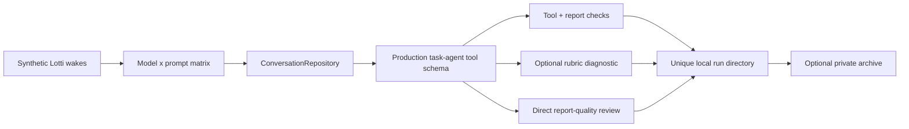

Four harnesses sit at increasing levels of fidelity. Each catches a failure the
one below it cannot.

| Harness | Exercises | Catches |
|---------|-----------|---------|
| `tool/qwen_local_inference_eval.sh` | `CloudInferenceWrapper` + real task-agent tool definitions | Whether a model emits the right function call with the right arguments |
| `tool/local_task_agent_inference_eval.sh` | `ConversationRepository`, the real system-prompt scaffold, the full tool surface, the same continuation loop | A model that emits isolated calls but **cannot complete the wake contract** |
| `tool/local_task_agent_workflow_eval.sh` | `TaskAgentWorkflow.execute` with seeded Laura directives | Whether production persistence outputs actually appear — a `ChangeSetEntity` with the expected suggestions and an `AgentReportEntity` from `update_report` |
| `tool/melious_task_agent_model_eval.sh` | The conversation-level evaluator as a Melious model × prompt matrix | Cross-model comparison on app-shaped scenarios |

None of them replays a real user database or renders UI. The workflow eval uses
test doubles with deterministic task/project context, but exercises the same
workflow, strategy, change-set, report-writing and forced-report retry mechanics
an in-app wake uses.

# The Melious matrix

The default production-prompt suite is fourteen synthetic but app-shaped wakes:
twelve core scenarios covering explicit and implicit-plan mutations, noisy
multilingual transcripts, prior reports, no-op background refreshes, stale
evidence, user overrides, checklist deduplication, external links and long
timelines; plus two held-out scenarios for deferred scope and active deployment
constraints.

Deterministic checks validate required mutations and report facts, and forbidden
tools, speculative checklist content, report churn and internal-id leakage.
Missing first reports go through the same report-only forced retry
`TaskAgentWorkflow` uses, and each result records whether that recovery was
needed.

**The live test is deliberately non-gating** unless
`LOCAL_TASK_AGENT_EVAL_STRICT=1`, because a comparison run must persist weak
outputs instead of aborting before the other candidates run.

Artifacts land in a unique run directory under `build/task_agent_model_eval/`.
Set `LOCAL_TASK_AGENT_EVAL_OUTPUT_ROOT` to a local clone of the private
evaluation archive when a run should be retained — **generated reports are not
committed to this repository.**

## Orchestration modes

`LOCAL_TASK_AGENT_EVAL_EXECUTION_MODE` selects:

| Mode | Behaviour |
|------|-----------|
| `twoPass` | Removes `update_report` from the mutation pass, then forces a report-only pass |
| `reportRevision` | Asks the same model to revise its first report against the source context |
| `reportEditing` | Always sends a draft through the configured editor — a historical control |
| `productionRouting` | Mirrors the shipped path: Mistral always uses the isolated Qwen editor, clean direct-Qwen reports stay single-pass, and reports matching the narrow known-regression detector get a bounded Qwen repair |

Scenario metadata supplies existing material due dates, estimates and priorities
to the editor, just as production supplies current task anchors.

## The judge is a diagnostic, not a gate

`tool/task_agent_model_eval_judge.py` sends the synthetic context and captured
tool calls to a separate rubric pass (`qwen3.5-122b-a10b` by default), rating
grounding, coverage, checklist quality, summary quality and format compliance.

**This automated score is a diagnostic only.** It is not an acceptance signal,
and a candidate is not accepted from a score produced by the same model family.
Deterministic checks establish mutation safety; report-quality decisions require
direct review of the candidate text. Malformed judge JSON gets one bounded repair
turn, and the artifact retains and aggregates accounting for every paid attempt.

# What the runs established

These are **one-sample synthetic comparisons**, retained for reproduction rather
than treated as universal model rankings.

- **Reasoning effort did not justify a production default.** An explicit Mistral
  `reasoning_effort=high` experiment passed 3/4 in a matched four-scenario screen
  — the same as model-default — while being 13–15% slower. The full high-effort
  run at Mistral's recommended temperature `0.7` passed 7/11 versus 10/11 in the
  archived provider-default run, and was 56% slower with nearly identical output
  volume.
- **Qwen exposes thinking as on/off, not tiers.** Requesting OpenAI-compatible
  `high` effort left the same three failures while adding 11% input tokens, 6%
  output tokens and 6% latency. Production therefore leaves reasoning at the model
  or profile default.
- **DeepSeek V4 Flash did not advance past the screen**: 2/4 cases, an
  unauthorized status change, 2.6× the input tokens, about twice the latency of
  the Mistral baseline.
- **Two-pass modes were not adopted.** The corrected temperature-0 Mistral
  two-pass rerun improved judge-rated summary prose but passed only 8 of 11
  scenarios and used 135,147 candidate tokens — 52% above the single-pass
  baseline.
- **Prompt additions alone could not remove Qwen's report defects.** Repeated
  synthetic suites at temperature `0.0` showed strong mutation handling but
  recurring defects: pending work described as underway, checklist-process
  narration, deferred-scope leakage, and causal claims inferred from user
  checkmarks. Production therefore runs a **narrow local detector** for these
  captured regressions — a clean draft stays single-pass, a matching draft gets a
  bounded isolated Qwen repair. Standalone directive-controlled headings and words
  such as `Goal`, `Checklist` and `No blockers` are not failures. The detector
  does not establish semantic correctness, score prose quality, or enforce
  arbitrary custom report structure.
- **The final matched production-routing run** (commit `8d34a3088`, 14 scenarios
  per route): direct Qwen and Mistral-plus-isolated-Qwen-editor each passed 14/14
  scenarios and 112/112 deterministic checks. Mistral used 232,322 tokens and
  145.458 s; direct Qwen 233,490 tokens and 157.180 s. Of twelve direct-Qwen
  report cases, five passed local preflight and seven received repair; one repair
  used all three allowed attempts.

Direct review found Qwen's final reports **richer and more natural**, while the
Mistral route stayed more compact and conservative. These results supported the
Qwen default at the time of the run. They do **not** prove GLM 5.2 parity or
unrestricted reliability on arbitrary user histories.

`qwen3.5-122b-a10b` is part of the curated Melious catalog. The shipped
thinking default has since moved to **GLM 5.2**, with **Kimi K3** for high-end
thinking and image recognition, and Whisper Large v3 for transcription (see
[seeding and lifecycle](seeding-and-lifecycle.md) for the current seed and the
generation-2 migration). Existing untouched Melious profiles migrate through
that generation boundary; the profile stores the applied seed generation, so
each migration runs once and a later deliberate switch is preserved. The Qwen
evaluation remains the record of why the task-agent report contract was shaped
this way; it is no longer a statement about the shipped model.

The resulting shipped routing is described in
[task agents](../agents/task-agents.md).

# Scope limits

The narrow Qwen helper does not write prompts, full responses, API keys, release
gates, attestations or decision ledgers. Its comparison targets are
`Qwen3.6-35B-A3B-TurboQuant-MLX-4bit`, `Qwen3.6-35B-A3B-4bit` and
`Qwen3.6-35B-A3B-MLX-8bit`; set `QWEN_EVAL_BASE_URL` or `OMLX_BASE_URL` when oMLX
is not at the local default.

The app-shaped eval does not mutate the database, execute write dispatchers,
render UI, or validate image input. It validates model behaviour inside the app's
conversation and tool-call orchestration layer.
