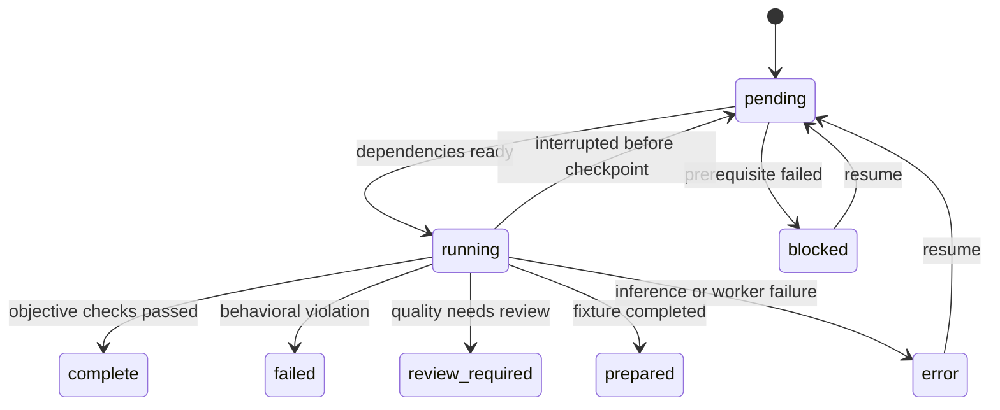

# Assessing a model

From the repository root, with dependencies installed and Melious credentials
exported or in `.env`:

```sh
python3 tool/lotti_gym.py assess --model MODEL_ID
```

This discovers the complete exercise inventory, writes an immutable manifest,
warms the Flutter builds without enabling inference, runs the candidate and
then runs the existing task-report rubric. It writes `report.html`,
`summary.json`, `jobs.json` and retained per-attempt evidence under a unique
run directory in `~/.local/share/lotti-gym/runs/`. Model output stays outside
the application repository. The command prints the directory and final verdict.

Only the Melious transport is supported by this first orchestrator. This uses
production routing through the existing harnesses, rather than treating an
arbitrary OpenAI-compatible endpoint as equivalent. `--base-url` selects an
endpoint; HTTPS is required except for explicit loopback addresses. The task
judge retains its own endpoint allowlist.

`--env-file` selects another local credential file. Only Melious connection
keys and their existing upstream aliases are read; dotenv text is never
executed. Exported values take precedence. API keys are passed in child
environments, never command arguments or the manifest. Ambient eval selectors,
live gates and experimental overrides are cleared before constructing the
worker environment.

The first independent batch acts as provider preflight. If it cannot complete
inference, the remaining matrix stays unassessed instead of repeating an
authentication, unavailable-model or transport failure across every exercise.
Behavioral failures still allow the complete matrix to run.

Useful variations:

```sh
# Compile/discover the inventory and write the plan; no inference or judging.
python3 tool/lotti_gym.py assess --model MODEL_ID --dry-run

# A deliberately partial assessment, clearly labelled in the report.
python3 tool/lotti_gym.py assess --model MODEL_ID --suites goals,goal-outcomes

# Reuse a previous query-neutral report artifact and compare a matched run.
python3 tool/lotti_gym.py assess --model MODEL_ID \
  --summary-reports /path/to/frozen-reports.json --baseline /path/to/baseline-run

# Resume missing/error work, preserving measured behavioral failures.
python3 tool/lotti_gym.py resume /path/to/run
```

Defaults are three samples, two workers and batches of up to eight cases.
`--samples`, `--workers` and `--batch-size` change those dimensions. More workers
can increase provider contention, so concurrency is recorded as part of the
comparison contract. Costs are observations, not automatic spend caps.
`--judge-model` chooses the diagnostic task judge; `--no-judge` explicitly
leaves that assessment unperformed. Neither setting changes deterministic gates.

# Inventory and fidelity

`buildLottiGymCatalog()` imports the same scenario collections used by the live
tests. Python never parses Dart enum text or maintains a second scenario list.
The catalog test checks that every live entry point is registered or explicitly
excluded, that IDs are unique and that dependencies resolve.

| Exercise | What is exercised |
|---|---|
| Task conversation | Production prompt variant, conversation/tool orchestration and production report routing |
| Task penguin | The current English penguin inference fixture; the old environment switch name is not a multilingual-coverage claim |
| Task directives | Synthetic evolved report directives |
| Task workflow | `TaskAgentWorkflow` with seeded context and captured persisted proposals/reports |
| Task wake | Real task-agent context construction over seeded journal, agent and FTS databases, including restraint cases |
| Goals | Goal inference contract and tool checks |
| Goal outcomes | Goal workflow persistence and outcome checks |
| Relationships | Production-rendered facts and the relationship inference contract |
| Query reports | Query-neutral synthetic report preparation, a dependency rather than a scored exercise |
| Query | Production query pipeline, baseline and held-out questions, including follow-ups |
| Query actions | Production action planning and proposals; actions are never applied |
| Day planning | Production planning pipeline and its existing objective constraints |
| Day journey | Capture-to-plan journey metrics, retained for review |
| Compaction | Full-context and hierarchical arms paired per fixture; truncation remains a standalone experiment |

The oMLX-only Qwen compatibility harness is explicitly excluded from a Melious
assessment. Vision, audio transcription, relationship persistence and query
action application remain visible coverage gaps. A text transcript does not
measure speech recognition. Historical prompt/editor experiments remain
available through the individual harnesses; they are not multiplied into the
default production assessment.

# Worker lifecycle and recovery

A job is a bounded batch of cases for one suite and sample. Wake scenarios and
compaction fixtures each get their own job. Query cases stay together because
follow-ups depend on earlier answers. Each worker has its own process and
artifact directory; GetIt state is not shared between simultaneous workers.
An unused `LOTTI_GYM_COMPILER_SLOT` Dart define gives each run and worker its
own incremental compiler cache. Flutter includes Dart defines in the kernel
cache path; workers can reuse their own cache without concurrently reading and
overwriting another worker's kernel. The define does not alter eval behavior.



Resume rebuilds the job inventory from the manifest and reads completed attempt
records, rather than trusting a potentially stale scheduler checkpoint. It
verifies manifest provenance and artifact hashes. Interrupted attempt directories
are retained, and the replacement attempt gets a new directory. Completed
behavioral failures are evidence and are not rerolled. Failed or missing task
judgments can resume without repeating candidate inference.

A kernel lock prevents two coordinators writing one run. Cancellation and
worker timeouts stop the owned process group, including compiler descendants.
Atomic JSON replacement keeps the preceding checkpoint intact if a write is
interrupted. Resume currently requires the same host, calendar day, source
revision and worker count. This conservative restriction avoids silently mixing
latency conditions or the planning suite's day-dependent fixtures.

# Results and comparison

Adapters validate exact model and case identity, including missing, extra and
duplicate rows. Flutter's machine reporter establishes whether a worker actually
ran; a display string such as `All tests passed` is not an assessment. Task
inference uses `failureCategory`; goal inference uses its explicit `passed`
field. Wake/workflow artifacts are written before assertions, so their worker
outcome is also required to establish quality.

Live drivers clear Flutter's mock HTTP override before constructing clients;
otherwise the binding returns HTTP 400 without contacting the provider. The
task-workflow driver restores the previous override at teardown. Compilation
with live gates disabled cannot detect this transport trap.

The task conversation driver rethrows inference errors from both its initial
conversation and forced report pass. A provider failure cannot trigger report
recovery and become a successful or behaviorally failed assessment.

Inference errors remain separate from behavioral failures. Missing cases remain
in the expected denominator. Day-planning heuristics cannot earn objective
credit. Journey metrics and compaction fact/recommendation quality retain their
review requirements. The task-specific rubric is not applied to unrelated
workloads. Judging remains diagnostic, including when a candidate and judge
share a model family; it never promotes a deterministic failure into a pass.

Suite verdicts distinguish checks passed, failed, incomplete, prepared and review
required. The overall result never automatically certifies unrestricted model
fitness. Exit codes are `1` for behavioral failure, `2` for incomplete/setup
failure, `3` for completed work requiring review, and `130` for interruption.
Dry-run completion exits `0`.

The report retains observed latency and cost, with missing telemetry marked
unknown. Candidate costs include retained attempts; cost per passed case is
only computed when all attempted rows reported cost. Judge accounting stays in
the diagnostic artifacts. P95 is omitted below twenty observations. Detailed artifacts preserve
production retry/editor behavior and the task judge's accounting. Do not read
one small sample as a stable model ranking.

Baseline comparison requires matching source revision, suite definitions,
endpoint, sample count, batch size, concurrency and host. Day-planning comparisons
also require the same evaluation date. Query comparisons additionally require the same explicitly frozen report
fixture; candidate-generated summaries otherwise confound the comparison.
Incompatible baselines are reported as incompatible, not silently compared.

# Historical findings and related contracts

The archived comparisons and their methodological corrections remain in
[task-agent evaluations](../../../docs/evaluations/task_agent_models/README.md),
[goal evaluations](../../../docs/evaluations/goal_agent_models/README.md),
[relationship evaluations](../../../docs/evaluations/relationship_agent_models/README.md)
and [compaction evaluations](../../../docs/evaluations/goal_agent_models/compaction.md).
They describe the measured runs, not a current universal model ranking.

Production routing is documented in [task agents](../agents/task-agents.md).
Planning graders and their objective/heuristic distinction are documented in
[Daily OS evaluation](../daily_os_next/evaluation.md). Current model seeding is
owned by [seeding and lifecycle](seeding-and-lifecycle.md).
