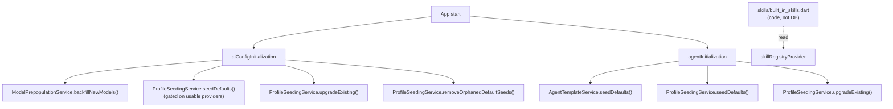
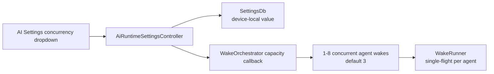
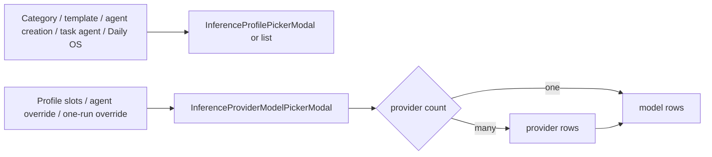

The `ai` feature is the shared AI plumbing behind manual prompts, skill-driven
flows, agent conversations and semantic search. It owns configuration
persistence, prompt assembly, provider routing, conversation state and
embeddings.

**It does not decide when an agent wakes or what an agent's lifecycle looks
like** — that boundary sits in [`features/agents`](../agents/).

# Startup

Both paths always run; neither is flag-gated.

**Skills do not participate in seeding.** They live as code and are read from
`skillRegistryProvider` at runtime. The DB-backed `SkillSeedingService` was
removed; a future skill-management feature will add a per-user override layer
rather than re-introducing seeding.

# The configuration model

`AiConfigRepository` persists provider-facing configuration in `AiConfigDb` and
syncs changes through the outbox. Device-local runtime controls use
`AiRuntimeSettingsController` and `SettingsDb` instead.

Provider API keys are included in the existing end-to-end encrypted sync
payload, but are never written to the unencrypted SQLite JSON. `AiConfigDb`
stores a stable `apiKeyStorageKey` reference and resolves the value through
platform secure storage (Keychain, Keystore, or the platform equivalent) when
loading a provider. Legacy rows containing `apiKey` are migrated lazily: the
value is written to secure storage first, then removed from the row. Migration
is retry-safe when secure storage is unavailable. Keys are scoped by world and
removed when a provider is hard-deleted.

| Object | Stored as | Used for |
|--------|-----------|----------|
| Provider | `AiConfig.inferenceProvider` | Base URL, API key, provider type |
| Model | `AiConfig.model` | Provider model id, modalities, function-calling support, Gemini thinking mode |
| Prompt | `AiConfig.prompt` | Legacy/manual prompt execution |
| Profile | `AiConfig.inferenceProfile` | Capability slots for thinking, transcription, vision, image generation |
| Skill | `AiConfig.skill` — **defined in code** | Capability contract plus `ContextPolicy`. Not persisted |
| Resolved profile | `ResolvedProfile` | Runtime profile with providers hydrated from configured model ids |
| Runtime settings | `SettingsDb`, device-local | Bounded agent-wake concurrency (1–8, default 3) |

## The split that matters

- **A skill** defines the instructions and how much context to inject.
- **A profile** defines which configured model/provider slot executes that skill.

That split is what lets the same skill move between providers without rewriting
the prompt contract.

Agent-wake concurrency is deliberately **device-local**, because device and
provider capacity differ. `WakeOrchestrator` reads the controller through a
callback at dispatch time, so a Settings change affects new wake cycles without
rebuilding the provider graph. A missing or malformed value uses the default of
3; out-of-range values are clamped.

# Built-in skills

`skills/built_in_skills.dart` exposes **ten** built-in skills:

`Transcribe Audio`, `Transcribe (Task Context)`, `Analyze Image`,
`Analyze Image (Task Context)`, `Generate Cover Art`,
`Generate Cover Art (Flux)`, `Generate Coding Prompt`, `Generate Image Prompt`,
`Generate Design Prompt`, `Generate Research Prompt`.

`Generate Design Prompt` produces a UI/UX design exploration prompt requesting
five functional prototypes by default, aligned with any design system mentioned
in task context, with clarifying questions up front — two-section Markdown ready
to paste into Claude, Figma Make or v0.dev. `Generate Research Prompt` produces a
structured Markdown research brief.

Prompt-generation and image-generation skills accept any text-bearing entry —
both `JournalAudio` (via its transcript) and `JournalEntry` — through the same
`_resolveEntryContent` resolver.

# Configuration selection UI

Editors share two design-system selection primitives rather than owning
feature-specific modal rows:

- **`DesignSystemSelectionRow`** backs every profile, provider, model and Gemini
  thinking-mode option, giving terminal choices and drill-in rows one full-width
  anatomy with token-backed selection, hover, keyboard focus, typography,
  semantics and trailing affordances. Homogeneous options carry no inset dividers
  that could remain visible through an active row.
- **`InferenceProviderSelectionRow` / `InferenceModelSelectionRow`** back the
  provider and model drill-downs, so branded provider tiles, model accent dots,
  and default/selected markers are identical in standalone pickers and embedded
  setup flows.

`InferenceProfilePickerModal` (and its embeddable list) renders named profiles
for category defaults, template settings, agent creation, task-agent setup and
Daily OS defaults, using the profile description as secondary text and marking
the persisted selection **without exposing internal model ids**.

`InferenceProviderModelPickerModal` renders model choices for profile slots,
task-agent overrides, Daily OS overrides and per-invocation skill overrides. With
multiple providers it drills provider → model; with one it opens the model list
directly. `selectedModelId` identifies the active choice while `defaultModelId`
independently marks the profile default. Callers needing an explicit
confirmation even with a single compatible model pass
`autoSelectSingleCandidate: false` — Daily OS does, so a single configured
provider/model is still an informed choice.

All standalone pickers use the adaptive Wolt modal helper: compact layouts get a
bottom sheet, wide layouts a dialog, with no change to content or selection
behaviour. Embeddable list bodies let larger flows reuse the same rows without a
modal on top of a modal.

Closed fields use `SettingsPickerField`. Async consumers retain their last
rendered values during background reloads, so a provider refresh never replaces
an established picker with a full loading shell.

# Concepts

* [Execution paths](execution-paths.md) - the legacy prompt path, the skill/profile path, the category consent gate, and per-invocation overrides.
* [Profile resolution](profile-resolution.md) - which profile drives a run, pinning, and the fail-closed locality check.
* [Provider routing](provider-routing.md) - the routing table, per-provider specifics, audio transcoding, and MLX Audio.
* [Conversations and tool calling](conversations-and-tools.md) - the reusable multi-turn loop.
* [Seeding and config lifecycle](seeding-and-lifecycle.md) - gated seeds, soft deletes, and migration-safe upgrades.
* [Embeddings and semantic search](embeddings-and-search.md) - local vector search over ObjectBox shards.
* [Work attribution](attribution.md) - how every inference call becomes an auditable, costed record.
* [Activity visualization](activity-visualization.md) - the shader-driven AI activity surfaces.
* [Model evaluation](model-evaluation.md) - the eval harnesses and what they established about production routing.

# Sharp edges

- **The prompt system and the skill/profile system coexist.** Both are active.
- **Automatic profile-driven handling covers only transcription and image
  analysis.** The direct path covers considerably more.
- **Image generation is implemented only for Gemini, Alibaba and Melious.**
- **Data residency is not enforced by code.** Request destinations are whatever
  `baseUrl` the selected provider carries. MLX Audio is the exception — it stays
  inside the app process where supported.
- **MLX Audio ships only on macOS.** Other platforms report every model
  unsupported; mobile recordings rely on the synced-audio auto-trigger to reach
  an MLX-capable desktop.

# Reading guide

`model/ai_config.dart` → `repository/ai_config_repository.dart` →
`state/ai_config_initialization.dart` → `util/profile_seeding_service.dart` →
`skills/built_in_skills.dart` → `util/profile_resolver.dart` →
`services/profile_automation_service.dart` →
`services/skill_inference_runner.dart` → `helpers/skill_prompt_builder.dart` →
`conversation/` → `repository/cloud_inference_repository.dart` →
`service/embedding_service.dart` → `repository/vector_search_repository.dart`.

`ui/settings/` holds provider and model editors; `ui/` holds the
inference-profile editors. **Skills are code-only — there is no prompt or skill
editor page.**
