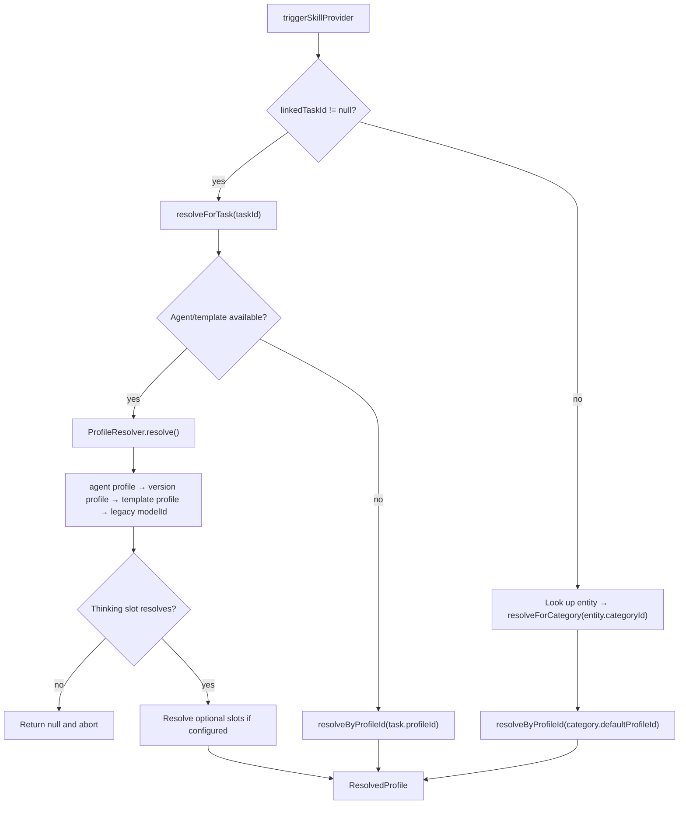

# Three entry points

`ProfileResolver` is the shared resolution engine for agent wakes.
`ProfileAutomationResolver` wraps it for skill execution:

| Entry point | Question it answers |
|-------------|---------------------|
| `resolveForTask(taskId)` | Task-linked execution. Tries the agent path, then the task's own `profileId` |
| `resolveForCategory(categoryId)` | Standalone entries with no parent task. Reads `CategoryDefinition.defaultProfileId` and resolves it directly |
| `resolveAutomationFallbacks(taskId)` | The ordered, de-duplicated profiles a task *inherits*. Used only by `ProfileAutomationService` — see [execution paths](execution-paths.md) |

`triggerSkillProvider` picks between the first two: with a non-null
`linkedTaskId` it calls `resolveForTask`, otherwise it looks up the entry, reads
its `categoryId`, and calls `resolveForCategory`. Skills whose `contextPolicy` is
`fullTask` are filtered out of the popup for standalone entries, so the
standalone branch only ever runs `dictionaryOnly` / `taskSummary` / `none`
skills.

The agent path resolution order is `agentConfig.profileId` →
`AgentTemplateVersionEntity.profileId` → `AgentTemplateEntity.profileId` →
legacy fallback `version.modelId ?? template.modelId`.

**Only the thinking slot is fatal.** Optional slots resolve best-effort.

# Model slots and sync hygiene

Model slots store `AiConfigModel.id` — the local model row id — with a legacy
`providerModelId` fallback. `resolveInferenceProviderForProfileSlot` first tries
an exact model-row id match, and only then falls back to the old provider-native
lookup for profiles written before the migration.

On that legacy path, when multiple synced model rows share the same
`providerModelId`, provider resolution **walks every candidate** and uses the
first provider row that still exists, has the required credentials, and matches
the provider type owning that known model id.

This is deliberate sync hygiene: an orphaned duplicate row from another device
must not abort an agent wake when a valid provider/model pair is still configured
locally.

# The direct transcription fallback

Recording-triggered transcription has a fallback in `ProfileAutomationService`:
it first tries the profile automation path, then scans configured audio-to-text
model rows when no profile handles transcription. The fallback builds an
**ephemeral** `ResolvedProfile` around the selected model and the built-in
`Transcribe (Task Context)` skill — it does not persist a profile.

Candidate ranking prefers the recommended MLX Audio Qwen3-ASR model, then other
MLX Qwen3-ASR rows, then other configured STT providers with the required API
key. This keeps local/mobile STT available when the user has installed MLX Audio
but the desktop-only local profile is not available on that device.

The direct `AudioTranscriptionService` path used by Daily OS capture/refine
ranks differently: a Mistral instruction-following Voxtral chat-audio model, then
a Mistral transcription-only Voxtral model, then any other configured Mistral
audio model, then contextual Melious Voxtral, Melious STT, MLX Qwen, Gemini
Flash, and finally the first remaining audio-capable model. Realtime-only Mistral
models are excluded from that batch verifier because they require the WebSocket
pipeline.

# Profile pinning

`AiConfigInferenceProfile.pinnedHostId` is the vector-clock host UUID of the
device that should auto-run this profile on **synced** audio entries.
`SyncedAudioInferenceDispatcher` consults it at trigger time: **pinned-or-skip,
with no fallback.**

The pinning UI filters the known sync-node directory by required capabilities and
is embedded in `inference_profile_form.dart`.

## Locality is fail-closed

`profileIsLocal(profile, repo)` returns true **iff every populated model id
resolves to a provider in `{ollama, voxtral, whisper, mlxAudio}`**.

A referenced-but-unresolved model id counts as **not local**. That prevents a
deleted cloud-provider config from masking a profile as safe to auto-route. The
dispatcher gates on this helper *after* the pin match, so even a buggy pinning UI
cannot route synced audio to a cloud model.

## Why the dispatcher does not reuse `tryTranscribe`

When a `JournalAudio` arrives over Matrix sync, `SyncedAudioInferenceDispatcher`
runs the inference flow itself rather than calling `AutomaticPromptTrigger`.

`tryTranscribe` would re-enter the ranked direct-model fallback described above,
which can route through Mistral, OpenAI or Gemini — silently breaking the
local-only promise of a pinned profile.

The dispatcher also uses `ProfileAutomationResolver.resolveProfileIdForTask` — a
sibling of `resolveForTask` returning the **raw profile id** rather than a
`ResolvedProfile` — so it can read `pinnedHostId` and call `profileIsLocal` on
the raw config. It deliberately does **not** consult `category.defaultProfileId`,
which would skip agent-level overrides and let a category edit retroactively
re-route which device claims an entry.

The full receive-side flow lives in
[sync node profiles and auto-trigger](../sync/node-profiles-and-auto-trigger.md).
