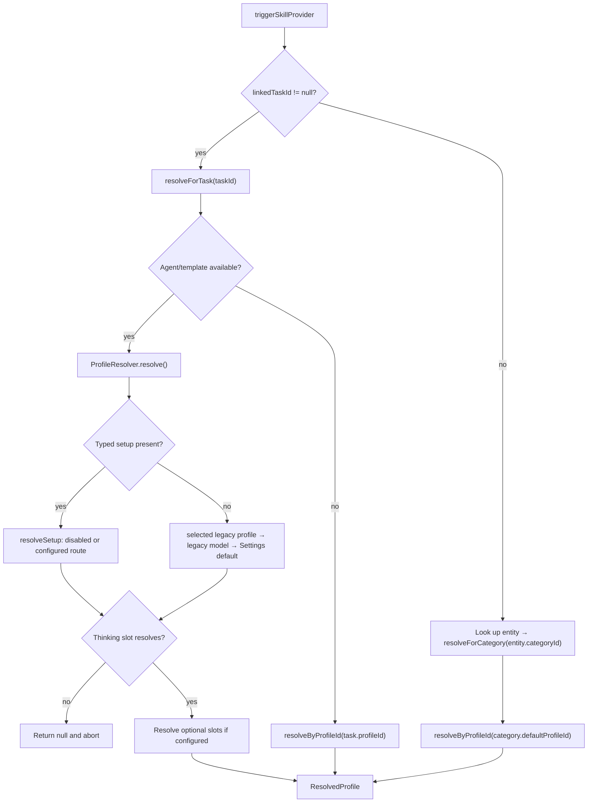

# Three entry points

`ProfileResolver` is the shared resolution engine for agent wakes.
`ProfileAutomationResolver` wraps it for skill execution:

| Entry point | Question it answers |
|-------------|---------------------|
| `resolveForTask(taskId)` | Task-linked execution. Tries the agent path, then the task's own `profileId` |
| `resolveForCategory(categoryId)` | Standalone entries with no parent task. Reads `CategoryDefinition.defaultProfileId` and resolves it directly |
| `resolveAutomationFallbacks(taskId)` | The ordered, de-duplicated profiles a task *inherits*. Used only by `ProfileAutomationService` — see [execution paths](execution-paths.md) |

`triggerSkillProvider` picks between the first two: with a non-null
`linkedTaskId` it calls `resolveForTask`, otherwise it looks up the entry, reads
its `categoryId`, and calls `resolveForCategory`. Skills whose `contextPolicy` is
`fullTask` are filtered out of the popup for standalone entries, so the
standalone branch only ever runs `dictionaryOnly` / `taskSummary` / `none`
skills.

An `AgentConfig.inferenceSetup` is authoritative: `resolveSetup` honors a direct
thinking-model override and its optional base profile, or returns disabled/broken.
It never falls through to unrelated defaults. Without a typed setup, the first
configured profile id wins selection: agent, version, then template. If that
profile cannot resolve, the legacy model (`version.modelId ?? template.modelId`)
is tried, followed by the device's selected Settings default.

`resolveStandalone` supports agents without templates. It honors a typed setup
or legacy agent profile, then the Settings default; a built-in model is used only
when no Settings default was selected. A deleted or unusable selected default
fails closed. Relationship agents additionally retain their person/category
profile steps, described in [relationships](../relationships.md).

The fallback is device-local (`AI_DEFAULT_INFERENCE_PROFILE` in `SettingsDb`),
because provider availability and credentials vary by device. Choosing or
clearing it is explicit; profile deletion never substitutes another provider.
The setting does not change authoritative setups or enable automation policies.

**Only the thinking slot is fatal to profile resolution.** Optional slots
resolve best-effort. An explicitly selected but unavailable Chat model sets
`ResolvedProfile.chatModelUnavailable`: agent wakes still resolve, while query
chat presents its existing recoverable setup error.

# Choosing a chat model

The inference profile editor has an optional **Chat model** slot. It accepts
text-input/text-output models without requiring function calling. Set this to,
for example, GLM-5.3 Flash while keeping DeepSeek Flash as Thinking for agent
work. Existing profiles have no Chat selection and retain their current route.

`chatModelId` stores a model row id and syncs with the profile. Its resolved
model, provider and configuration remain independent of an agent's direct
Thinking override. When unset, the effective Chat route inherits the resolved
Thinking route, including that override. When selected but unavailable, query
chat fails closed instead of switching models. Both retrieval and synthesis use
the effective Chat route; transcription continues using its own slot.

Chat participates in provider usage, pinning capabilities, locality checks and
demo-copy reference pruning. A selected Chat model counts as a user edit during
seed-profile migration and orphan cleanup; seeding does not introduce a Chat
default or clear an unavailable selection.

# Model slots and sync hygiene

Model slots store `AiConfigModel.id` — the local model row id — with a legacy
`providerModelId` fallback. `resolveInferenceProviderForProfileSlot` first tries
an exact model-row id match, and only then falls back to the old provider-native
lookup for profiles written before the migration.

On that legacy path, when multiple synced model rows share the same
`providerModelId`, provider resolution **walks every candidate** and uses the
first provider row that still exists, has the required credentials, and matches
the provider type owning that known model id.

This is deliberate sync hygiene: an orphaned duplicate row from another device
must not abort an agent wake when a valid provider/model pair is still configured
locally.

# The direct transcription fallback

Recording-triggered transcription has a fallback in `ProfileAutomationService`:
it first tries the profile automation path, then scans configured audio-to-text
model rows when no profile handles transcription. The fallback builds an
**ephemeral** `ResolvedProfile` around the selected model and the built-in
`Transcribe (Task Context)` skill — it does not persist a profile.

Candidate ranking prefers installed sherpa models, then Mistral, Melious,
OpenAI, Whisper, and Voxtral, followed by other audio-to-text providers.
Candidates need a resolvable provider and any required API key; sherpa also
requires a verified local model. HTTP endpoint validation is left to the
provider. Equal-ranked models are ordered by name. The fallback works without
a profile.

The direct `AudioTranscriptionService` path used by Daily OS capture/refine
prefers installed sherpa models, then Mistral contextual Voxtral and a Mistral batch audio model; next come
the seeded Melious Whisper Large v3 default, other Melious transcription models,
and contextual Melious Voxtral. Gemini Flash follows, then the first remaining
audio-capable model. Realtime-only Mistral models are excluded because they
require a WebSocket pipeline. Explicit profile targets bypass this discovery.

# Profile pinning

`AiConfigInferenceProfile.pinnedHostId` is the vector-clock host UUID of the
device that should auto-run this profile on **synced** audio entries.
`SyncedAudioInferenceDispatcher` consults it at trigger time: **pinned-or-skip,
with no fallback.**

The pinning UI filters the known sync-node directory by required capabilities and
is embedded in `inference_profile_form.dart`.

## Locality is fail-closed

`profileIsLocal(profile, repo)` returns true **iff every populated model id
resolves to a provider in `{ollama, omlx, voxtral, whisper, sherpa}`**.

A referenced-but-unresolved model id counts as **not local**. That prevents a
deleted cloud-provider config from masking a profile as safe to auto-route. The
dispatcher gates on this helper *after* the pin match, so even a buggy pinning UI
cannot route synced audio to a cloud model.

## Why the dispatcher does not reuse `tryTranscribe`

When a `JournalAudio` arrives over Matrix sync, `SyncedAudioInferenceDispatcher`
runs the inference flow itself rather than calling `AutomaticPromptTrigger`.

`tryTranscribe` would re-enter the ranked direct-model fallback described above,
which can route through Mistral, OpenAI or Gemini — silently breaking the
local-only promise of a pinned profile.

The dispatcher also uses `ProfileAutomationResolver.resolveProfileIdForTask` — a
sibling of `resolveForTask` returning the **raw profile id** rather than a
`ResolvedProfile` — so it can read `pinnedHostId` and call `profileIsLocal` on
the raw config. It deliberately does **not** consult `category.defaultProfileId`,
which would skip agent-level overrides and let a category edit retroactively
re-route which device claims an entry.

The full receive-side flow lives in
[sync node profiles and auto-trigger](../sync/node-profiles-and-auto-trigger.md).
