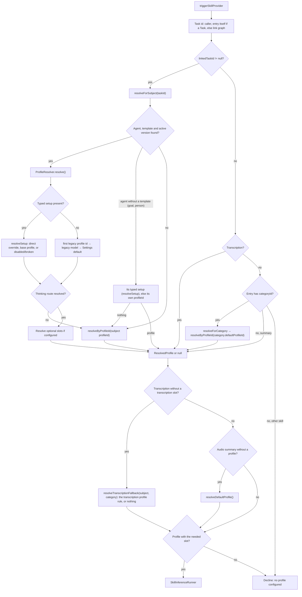
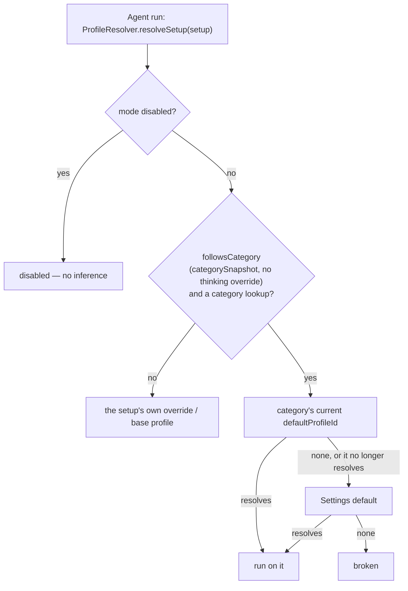
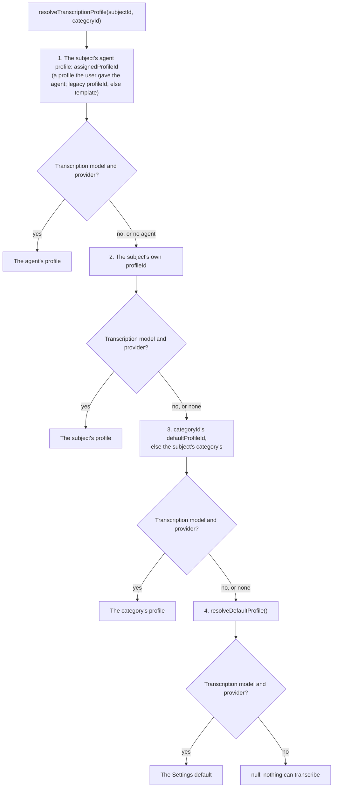

# Entry points

`ProfileResolver` is the shared resolution engine for agent wakes.
`ProfileAutomationResolver` wraps it for skill execution:

| Entry point | Question it answers |
|-------------|---------------------|
| `resolveForSubject(subjectId)` | Subject-linked execution (a task, project or person). Tries the agent path, then the subject's own `profileId` |
| `resolveForCategory(categoryId)` | Standalone entries with no parent task. Reads `CategoryDefinition.defaultProfileId` and resolves it directly |
| `resolveAutomationFallbacks(subjectId)` | The ordered, de-duplicated profiles a subject *inherits*: its own `profileId`, then its category's current `defaultProfileId`. Used only by `ProfileAutomationService` — see [execution paths](execution-paths.md) |
| `resolveDefaultProfile()` | The device's Settings default profile. Used for recording summaries no task or category reaches, and as the second step of the transcription profile |
| `resolveTranscriptionProfile({subjectId, categoryId})` | The profile a recording without a task transcribes through: the first of the subject's agent profile, the subject's own `profileId`, the category's `defaultProfileId` and the Settings default that owns a transcription slot, else null. The one rule goal and People recordings, their chats' dictation and the automation fallback all follow — see [the transcription profile](#the-transcription-profile) |
| `categoryOfSubject(subjectId)` | The category a subject (task, project, person, goal entry) is filed under, for the rule above |

The resolver reads agents and their templates through two ports the AI
feature declares in `profile_automation_providers.dart`:
`automationSubjectAgentLookupProvider` (the agent assigned to a subject) and
`automationTemplateLookupProvider` (an `AgentTemplateVersionLookup`, which the
agents feature's `AgentTemplateService` implements). Both throw until the
composition root (`buildProviderOverrides`) wires them, so the AI feature does
not depend on the agents feature.

`triggerSkillProvider` picks between the first two. It takes the caller's
`linkedTaskId`, else the entry itself when it is a `Task`, else a task found in
the entry-link graph (outgoing links first, then incoming). With a task it
calls `resolveForSubject`; otherwise it looks up the entry, reads its
`categoryId`, and calls `resolveForCategory` — for every skill but
transcription. An entry with neither declines the skill, except transcription
and recording summaries. A transcription without a task, or whose task's
profile has no transcription slot, goes to
`ProfileAutomationService.resolveTranscriptionFallback` with the recording's
subject — the task, else the first live goal, person, project or event entry
linking to the recording — and its category: that is
[the transcription profile](#the-transcription-profile) rule, or nothing; a recording
summary that resolves no profile falls back to `resolveDefaultProfile`. Skills whose
`contextPolicy` is `fullTask` are hidden from the popup for entries without task
context, except `Summarize Recording`, and the provider declines them without a
task except for transcription and audio-summary skills.

```mermaid
flowchart TD
  Trigger["triggerSkillProvider"] --> LinkTask["Task id: caller, entry itself if a Task, else link graph"]
  LinkTask --> HasTask{"linkedTaskId != null?"}

  HasTask -->|yes| SubjectBranch["resolveForSubject(taskId)"]
  HasTask -->|no| IsStt{"Transcription?"}
  IsStt -->|yes| Result
  IsStt -->|no| HasCategory{"Entry has categoryId?"}
  HasCategory -->|yes| CategoryProfile["resolveForCategory → resolveByProfileId(category.defaultProfileId)"]
  HasCategory -->|no, summary| Result
  HasCategory -->|no, other skill| Decline["Decline: no profile configured"]

  SubjectBranch --> AgentPath{"Agent, template and active version found?"}
  AgentPath -->|yes| ProfileResolve["ProfileResolver.resolve()"]
  AgentPath -->|"agent without a template (goal, person)"| Standalone["Its typed setup (resolveSetup), else its own profileId"]
  Standalone -->|nothing| SubjectProfile
  Standalone -->|profile| Result
  AgentPath -->|no| SubjectProfile["resolveByProfileId(subject profileId)"]

  ProfileResolve --> Typed{"Typed setup present?"}
  Typed -->|yes| Setup["resolveSetup: direct override, base profile, or disabled/broken"]
  Typed -->|no| Chain["first legacy profile id → legacy model → Settings default"]
  Setup --> Thinking{"Thinking route resolved?"}
  Chain --> Thinking
  Thinking -->|no| SubjectProfile
  Thinking -->|yes| Optional["Resolve optional slots if configured"]
  Optional --> Result["ResolvedProfile or null"]
  SubjectProfile --> Result
  CategoryProfile --> Result

  Result --> NeedsStt{"Transcription without a transcription slot?"}
  NeedsStt -->|yes| Direct["resolveTranscriptionFallback(subject, category): the transcription profile rule, or nothing"]
  NeedsStt -->|no| NeedsDefault{"Audio summary without a profile?"}
  NeedsDefault -->|yes| Default["resolveDefaultProfile()"]
  NeedsDefault -->|no| Runnable
  Direct --> Runnable
  Default --> Runnable
  Runnable{"Profile with the needed slot?"} -->|yes| Runner["SkillInferenceRunner"]
  Runnable -->|no| Decline
```

An `AgentConfig.inferenceSetup` is authoritative: `resolveSetup` honors a direct
thinking-model override and its optional base profile, or returns disabled/broken.
It never falls through to unrelated defaults — except a setup that only copied
its category's profile, which [follows the category](#agents-that-follow-their-category)
at every run. On the skill path, a disabled or
broken setup yields no profile, and `resolveForSubject` then resolves the
subject's own `profileId`. Without a typed setup, the first
configured profile id wins selection: agent, version, then template. If that
profile cannot resolve, the legacy model (`version.modelId ?? template.modelId`)
is tried, followed by the device's selected Settings default.

`resolveStandalone` supports agents without templates. It honors a typed setup
or legacy agent profile, then the Settings default; a built-in model is used only
when no Settings default was selected. A deleted or unusable selected default
fails closed. Relationship agents additionally retain their person/category
profile steps, described in [relationships](../relationships.md).

The fallback is device-local (`AI_DEFAULT_INFERENCE_PROFILE` in `SettingsDb`),
because provider availability and credentials vary by device. Choosing or
clearing it is explicit; profile deletion never substitutes another provider.
The setting does not change authoritative setups or enable automation policies.

**Only the thinking slot is fatal to profile resolution.** Optional slots
resolve best-effort. An explicitly selected but unavailable Chat model sets
`ResolvedProfile.chatModelUnavailable`: agent wakes still resolve, while query
chat presents its existing recoverable setup error. An unavailable audio
post-processing model sets `audioPostProcessingModelUnavailable` the same way,
and only the recording summary fails.

# Agents that follow their category

An agent's profile is resolved on every run, never fixed when the agent is
made. What a run resolves depends on who chose the setup:

1. **The user's choice for this agent** — a profile or a thinking model picked
   in the agent's setup sheet (origin `user`, or any setup carrying a
   `thinkingModelOverrideId`). Authoritative, as above.
2. **The agent's category** — a setup of origin `categorySnapshot`, written
   when the agent was created from its category's default (task, project,
   goal and person agents) or by *Copy category default*. Its
   `baseProfileId` only records what the category named that day.
   `AgentInferenceSetup.followsCategory` marks it, and
   `ProfileResolver.resolveSetup` resolves the category's **current**
   `defaultProfileId` (read through the `categoryProfileLookup` it is given,
   by `originEntityId`), else
3. **the device's Settings default**. With neither resolving, the setup is
   broken — the stale copy is never used.

So changing a category's profile, or the Settings default below it, moves
every agent that inherits it on its next run, with no write to the agents.
A disabled setup stays disabled whatever the category names, so a task agent
created switched off in a category without a profile is not turned on by
one appearing later.

```mermaid
flowchart TD
  Run["Agent run: ProfileResolver.resolveSetup(setup)"] --> Disabled{"mode disabled?"}
  Disabled -->|yes| Off["disabled — no inference"]
  Disabled -->|no| Follows{"followsCategory<br/>(categorySnapshot, no thinking override)<br/>and a category lookup?"}
  Follows -->|no| Own["the setup's own override / base profile"]
  Follows -->|yes| Cat["category's current defaultProfileId"]
  Cat -->|resolves| Use["run on it"]
  Cat -->|"none, or it no longer resolves"| Def["Settings default"]
  Def -->|resolves| Use
  Def -->|none| Broken["broken"]
```

`categoryProfileLookupProvider` (`categoryDefaultProfileLookup` over the
journal database) is the one read of a category's profile: it wires
`profileResolverProvider`, the automation resolver, and the task, project and
goal workflows, and it is what a subject's agent snapshots at creation. A
`ProfileResolver` built without it — Daily OS and event agents, whose setups
are template copies — keeps the stored profile. Person agents resolve the
same way through `resolveRelationshipAgentModel`, which uses the person's
category as it is now rather than the one the setup was copied from, and
puts the person's own profile first (see [relationships](../relationships.md)).

`AgentConfig.assignedProfileId` answers "which profile did the user give this
agent?", so it is null for a setup that follows its category: the profiles
page does not count the stale copy as in use, and the transcription rule
below reaches the category's current profile at its third tier.

# Choosing a chat model

The inference profile editor has an optional **Chat model** slot. It accepts
text-input/text-output models without requiring function calling. Set this to,
for example, GLM-5.3 Flash while keeping DeepSeek Flash as Thinking for agent
work. Existing profiles have no Chat selection and retain their current route.

`chatModelId` stores a model row id and syncs with the profile. Its resolved
model, provider and configuration remain independent of an agent's direct
Thinking override. When unset, the effective Chat route inherits the resolved
Thinking route, including that override. When selected but unavailable, query
chat fails closed instead of switching models. Both retrieval and synthesis use
the effective Chat route; transcription continues using its own slot.

Chat participates in provider usage, pinning capabilities, locality checks and
demo-copy reference pruning. A selected Chat model counts as a user edit during
seed-profile migration and orphan cleanup; seeding does not introduce a Chat
default or clear an unavailable selection.

# Choosing an audio post-processing model

The editor's optional **Audio post-processing** slot picks the model for the
step after a transcription: correcting the transcript against the speech
dictionary and writing the recording's one-liner, TLDR and summary. It
accepts tool-capable models that take text input, because the step reads the
transcript as text and publishes through a tool call. Set it to keep that step on, for example, DeepSeek while
agents think on GLM; existing profiles have no selection and keep running the
step on Thinking.

`audioPostProcessingModelId` stores a model row id and syncs with the profile.
Its resolved route is independent of an agent's direct Thinking override;
unset, `effectiveAudioPostProcessing*` inherits the resolved Thinking route.
Selected but unavailable, the step fails visibly instead of switching models —
see [execution paths](execution-paths.md) for how a held transcript is still
written.

Like Chat, the slot participates in provider usage, pinning capabilities,
locality checks — it reads the transcript of synced audio, so a cloud model
here makes a profile non-local — and demo-copy reference pruning, and counts
as a user edit during seed-profile migration and orphan cleanup. Seeding sets
no default for it.

An older client drops the field when it saves the profile, since it does not
know it: editing a profile on a device that predates the slot clears the
selection, as it did for Chat.

# Choosing a read-aloud model

The editor's optional **Read aloud** slot picks the cloud speech model that
reads summaries, goal reports and query answers aloud. It offers models whose
output is audio — today Voxtral TTS on Mistral. The voice is not chosen here:
the speech feature resolves it per language from that provider's catalog. Unset, read-aloud keeps the on-device
voice; there is no other fallback, and the on-device voice is never something
the slot has to name. Which surface resolves which profile, and how a voice is
chosen per language, is in [text-to-speech](../tts.md#which-voice-speaks).

`speechModelId` stores a model row id and syncs with the profile. It never
borrows the thinking route: unset or unresolvable, `ResolvedProfile.speech*`
stays null. It participates in provider usage, the profile cards and
demo-copy reference pruning. It is deliberately **not** part of
`profileIsLocal`: speech synthesis receives text the user asked to hear, never
the synced audio that check guards, so a cloud voice does not stop a local
transcription profile from auto-running. Nor does it take part in pinning,
since nothing is spoken automatically.

Seeding names it on the Mistral (EU) profile only (`voxtral-mini-tts-3-0`),
and only when that profile is created; an existing profile is never
rewritten to add it.

# Model slots and sync hygiene

Model slots store `AiConfigModel.id` — the local model row id — with a legacy
`providerModelId` fallback. `resolveInferenceProviderForProfileSlot` first tries
an exact model-row id match, and only then falls back to the old provider-native
lookup for profiles written before the migration. A matched row whose
provider is unusable resolves to nothing; the legacy lookup is not tried.

On that legacy path, when multiple synced model rows share the same
`providerModelId`, provider resolution **walks every candidate**. It skips rows
whose provider no longer exists or lacks required credentials, and returns the
first usable row whose provider type owns that known model id. When no usable
row matches that type, or the id is not a known model, the first usable row
wins.

This is deliberate sync hygiene: an orphaned duplicate row from another device
must not abort an agent wake when a valid provider/model pair is still configured
locally.

# The transcription profile

A recording that belongs to no task — a goal's check-in, a person's check-in,
a voice note filed in a category — transcribes through the profile
`ProfileAutomationResolver.resolveTranscriptionProfile` picks for the
recording's subject (the goal's entry, the person) and category, in a strict
order. Each tier is a profile id resolved with `resolveByProfileId`; one that
resolves without both a transcription model and provider is passed over, and
an id reached through two tiers is resolved once.

```mermaid
flowchart TD
  Start["resolveTranscriptionProfile(subjectId, categoryId)"] --> Agent["1. The subject's agent profile: assignedProfileId<br/>(a profile the user gave the agent; legacy profileId, else template)"]
  Agent --> AgentSlot{"Transcription model and provider?"}
  AgentSlot -->|yes| UseAgent["The agent's profile"]
  AgentSlot -->|"no, or no agent"| Own["2. The subject's own profileId"]
  Own --> OwnSlot{"Transcription model and provider?"}
  OwnSlot -->|yes| UseOwn["The subject's profile"]
  OwnSlot -->|"no, or none"| Cat["3. categoryId's defaultProfileId,<br/>else the subject's category's"]
  Cat --> CatSlot{"Transcription model and provider?"}
  CatSlot -->|yes| UseCat["The category's profile"]
  CatSlot -->|"no, or none"| Def["4. resolveDefaultProfile()"]
  Def --> DefSlot{"Transcription model and provider?"}
  DefSlot -->|yes| UseDef["The Settings default"]
  DefSlot -->|no| None["null: nothing can transcribe"]
```

Goal and person agents have no template: `GoalAgentService` and
`RelationshipAgentService` store the profile in `AgentConfig.inferenceSetup`
(a copy of the category's at creation, changeable in the agent's setup
sheet). Tier 1 therefore reads `AgentConfig.assignedProfileId` — a profile
the user picked for the agent is authoritative, a disabled setup assigns
nothing, and a copy of the category's assigns nothing either, so tier 3
reads what the category names *now* — and only an agent without a setup
falls back to its legacy `profileId`, then its template's. The same holds on the subject path above: a template-less agent
resolves its own setup instead of nothing, so a category's automated skill
cannot outrank the profile the user gave the agent.

Without a `subjectId` the rule starts at tier 3. The agent tier comes first
because assigning an agent a profile is the most specific choice the user
makes; it outranks the category's profile and the Settings default, so a goal
agent set to Mistral (EU) is heard by Voxtral even when its category names
Melious Whisper or the Settings default is a Whisper profile. The converse
held too, and was the bug: an agent created while its category named Melious
Whisper kept that copy at tier 1, so its recordings stayed on Whisper after
the category moved to Voxtral. A copy now assigns nothing, and the category
tier decides.

No model is named in code: the slot's provider and model, and the
post-processing route that follows, come from whichever profile wins. Who asks:

- **`ProfileAutomationService`**, whenever no automated skill owns
  transcription for a subject (`tryTranscribe`, `requestTranscription`, the
  probes), with that subject; and through `resolveTranscriptionFallback`
  for `triggerSkillProvider`, with the recording's subject and category (see
  [entry points](#entry-points)). The winning profile runs the built-in
  `Transcribe (Task Context)` skill with an automated assignment.
- **`CheckInTranscriptionService`** for every People check-in and capture,
  with the person as the subject and their category.
- **`subjectDictationProvider`** (`lib/features/ai/state/subject_dictation_providers.dart`)
  for dictation into a goal's or a person's agent chat and a goal's charter
  sheet, with the goal's entry or the person as the subject: its
  `resolveTarget` hands the chat recorder the slot's route, and its
  `correct` runs the dictionary correction on the profile's
  `ResolvedProfile.transcriptCorrectionRoute` when a speech-to-text engine
  heard the words — the step a check-in's recording gets. Those surfaces never
  reach `AudioTranscriptionService.discoverTarget`.

A goal check-in reaches the rule two ways. With the goal filed in a category
whose automatic inference is on, `tryTranscribe` matches the goal agent's
profile first when it automates transcription (the seeded profiles do). With
no category, or the switch off, the category gate declines and
`AutomaticPromptTrigger` transcribes it under the goal agent's
automatic-updates switch through `triggerSkillProvider` — the path that,
until the rule had a subject tier, never asked the goal agent at all and
transcribed on the Settings default's model.

Before this order existed, a goal check-in whose category automated nothing
went straight to a model fallback whose provider ranking put the on-device
engine first: minutes per recording on a model nobody chose,
while the Settings default named a fast one. Chat dictation in goals and
People ran on discovery, which picks the seeded Melious Whisper.

The rule itself logs nothing, because render-time probes ask it on every
rebuild. Each run path logs, by sanitized id, the profile it transcribes
through and the subject or category it resolved for. That is
`ProfileAutomationService`'s `resolved:` line (run intent only),
`CheckInTranscriptionService`'s `transcribing … through profile …` line, and
subject dictation's `dictation about … through profile …` line. Together they
answer "which model heard this recording?" from a log export.

# No model outside a profile

When no tier of the rule — the subject's agent or own profile, the category,
the Settings default — owns a transcription slot, `ProfileAutomationService`
returns not-handled and the trigger declines visibly ("no transcription
model configured"). There is no further step that
picks a configured speech model by provider type: that ranking (sherpa first,
then Mistral, Melious, OpenAI, Whisper, Voxtral) is what sent goal check-ins
to the on-device engine, and it was removed. The profile that transcribes
always carries its own post-processing route, so no route is borrowed either.

The direct `AudioTranscriptionService` path used by Daily OS capture/refine
prefers installed sherpa models, then Mistral contextual Voxtral and a Mistral batch audio model; next come
the seeded Melious Whisper Large v3 default, other Melious transcription models,
and contextual Melious Voxtral. Gemini Flash follows, then the first remaining
audio-capable model. Realtime-only Mistral models are excluded because they
require a WebSocket pipeline. Explicit profile targets bypass this discovery.

# Profile pinning

`AiConfigInferenceProfile.pinnedHostId` is the vector-clock host UUID of the
device that should auto-run this profile on **synced** audio entries.
`SyncedAudioInferenceDispatcher` consults it at trigger time: **pinned-or-skip,
with no fallback.**

The pinning UI filters the known sync-node directory by the node capabilities
the profile's local provider types require; cloud provider types are exempt, so
a profile with a cloud slot can be pinned but the locality gate then skips
every entry. The selector is embedded in `inference_profile_form.dart`.

## Locality is fail-closed

`profileIsLocal(profile, repo)` returns true **iff every populated model id
resolves to a provider in `{ollama, omlx, voxtral, whisper, sherpa}`**.

A referenced-but-unresolved model id counts as **not local**. A legacy
`providerModelId` shared by several model rows also counts as unresolved,
unlike the resolver's walk over duplicate rows. That prevents a
deleted cloud-provider config from masking a profile as safe to auto-route. The
dispatcher gates on this helper *after* the pin match, so even a buggy pinning UI
cannot route synced audio to a cloud model.

## Why the dispatcher does not reuse `tryTranscribe`

When a `JournalAudio` arrives over Matrix sync, `SyncedAudioInferenceDispatcher`
runs the inference flow itself rather than calling `AutomaticPromptTrigger`.

`tryTranscribe` would re-enter the ranked direct-model fallback described above,
which can route through Mistral, OpenAI or Gemini — silently breaking the
local-only promise of a pinned profile.

The dispatcher also uses `ProfileAutomationResolver.resolveProfileIdForSubject` — a
sibling of `resolveForSubject` returning the **raw profile id** rather than a
`ResolvedProfile` — so it can read `pinnedHostId` and call `profileIsLocal` on
the raw config. It deliberately does **not** consult `category.defaultProfileId`,
which would skip agent-level overrides and let a category edit retroactively
re-route which device claims an entry. It reads only the legacy profile ids
(agent, version, template) and never `AgentConfig.inferenceSetup`, so a typed
setup's base profile does not decide pinning. Synced audio with no linked
parent task is skipped.

The full receive-side flow lives in
[sync node profiles and auto-trigger](../sync/node-profiles-and-auto-trigger.md).
