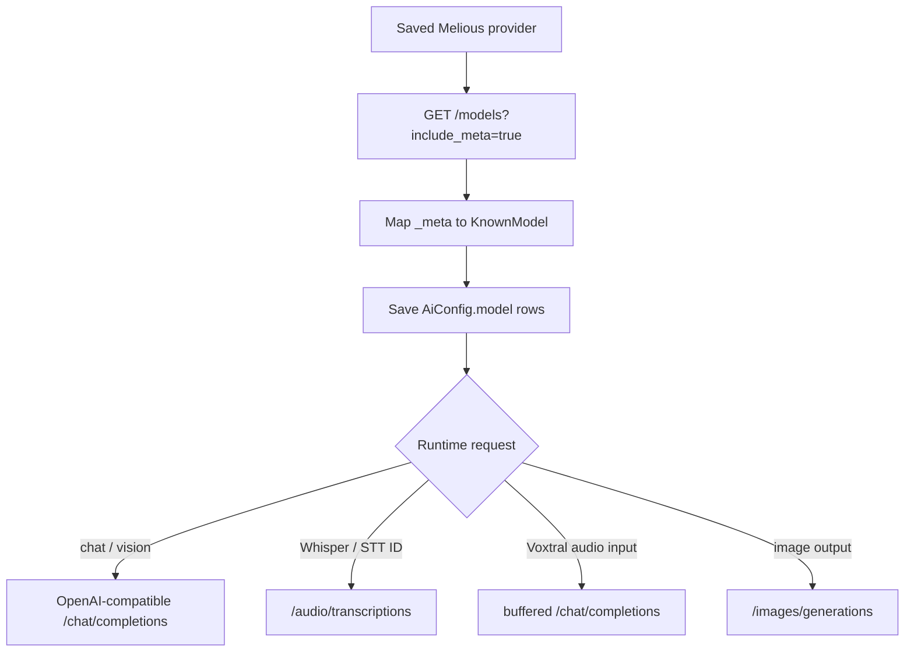
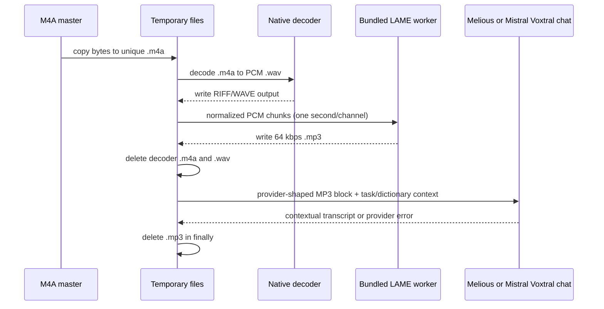
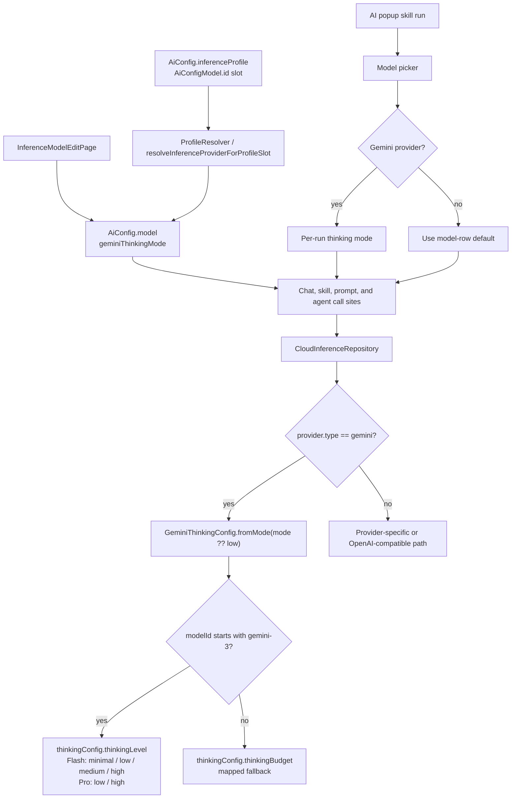
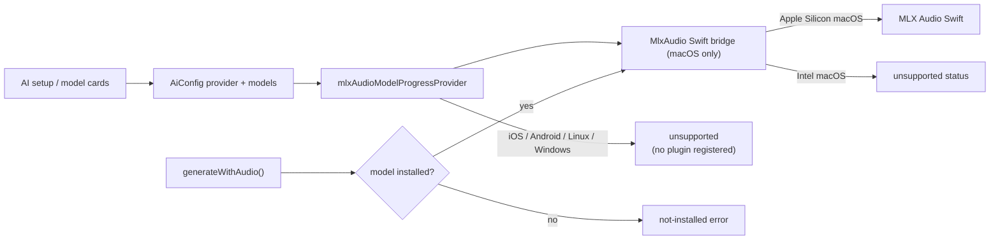

# One facade, two collaborators

`CloudInferenceRepository` is the central router despite its name — it also
handles local providers such as Ollama, Whisper, Voxtral and MLX Audio.

It is a thin **facade**: every public method delegates to
`CloudInferenceGenerate` (text + image) or `CloudInferenceGenerateMore` (audio,
multi-turn, image generation, model install/cleanup), both sharing one
`CloudInferenceRequestHelpers`. The mockable surface and all call sites are
unchanged.

| Operation | Dedicated branches | Fallback |
|-----------|--------------------|----------|
| `generate()` | Ollama, Gemini, Mistral, Melious | OpenAI-compatible chat streaming; explicit reasoning effort forwarded where supported, omitted from Mistral |
| `generateWithImages()` | Ollama, Melious, Mistral OCR (`/v1/ocr` for `mistral-ocr-*`) | OpenAI-compatible multimodal chat; Gemini receives `reasoning_effort` |
| `generateWithAudio()` | Whisper, Voxtral, MLX Audio native bridge, oMLX/OpenAI/Mistral/Melious transcription endpoints, temporary-MP3 Mistral and Melious Voxtral chat audio | OpenAI-compatible audio chat completions; Gemini receives `reasoning_effort` |
| `generateWithMessages()` | Gemini, Ollama, Mistral, Melious | OpenAI-compatible full-history chat; reasoning effort omitted from Mistral |
| `generateImage()` | Gemini, Alibaba DashScope, Melious | Unsupported — throws for every other provider type |

**This routing is implemented in code, not inferred.** A provider type not
branched explicitly for an operation falls through to the compatibility client or
throws `UnsupportedError`.

Vision-capable coding prompts reuse `generateWithImages()`. The skill runner
sends the system message normally and builds the user message as multipart text
plus `data:image/jpeg;base64,...` image parts; this is the OpenAI-compatible
vision shape used by Melious (including Kimi K3) and the generic fallback.
With no selected images the runner stays on `generate()`, preserving the exact
text-only request path.

# Usage normalization

Audio transcription responses are normalized into chat-completion stream chunks,
so downstream consumers collect text and `usage` identically for every provider.

`completion_usage_parser.dart` accepts the common OpenAI-compatible token shapes
— `prompt_tokens`/`completion_tokens`, input/output aliases, cached and reasoning
token details. **Duration-only audio usage is intentionally ignored** because it
cannot be represented as token consumption, so Whisper-style
`/audio/transcriptions` responses carry token usage only when the endpoint
actually reports it. Voxtral's streaming adapter emits final usage-only SSE
frames, which lets AI Consumption record tokens even when the accounting chunk
has no text delta.

# Live catalogs

Melious, Mistral, oMLX, Gemini and OpenAI settings use live catalogs
(`ProviderConfig.supportsDynamicCatalog`). The provider detail page and edit form
render the same `AvailableModelsSection`, so endpoint-backed rows can be installed
from the screen that shows the configured `Models · N` count. On the detail page
the installed list renders **above** the searchable catalog, so users see what
they have before scrolling to add more.

**A failed live fetch renders an inline error banner with a retry control — there
is no silent fall back to the curated list.**

## Melious

Melious uses a self-contained provider repository because its OpenAI-compatible
surface also exposes provider-specific model metadata. Settings fetch
`GET /models?include_meta=true` and map `_meta.type`, `_meta.input_modalities`,
`_meta.output_modalities` and `_meta.capabilities` into `KnownModel` rows at
runtime, preserving chat, vision, reasoning, function-calling, audio-input,
image-generation, embedding and rerank models in the installable catalog rather
than relying on a static list.

Whisper-class ids (`whisper`, `transcribe`, `asr`, `stt`) route to
`POST /audio/transcriptions`; Voxtral audio-input ids route to
`POST /chat/completions`; image-output models route to `POST /images/generations`
and decode the returned `b64_json` bytes. Chat callers may opt into an
OpenAI-compatible `reasoning_effort`; leaving it unset preserves the provider's
model default.

**Reference-image generation is rejected explicitly** rather than silently
ignored, because Melious currently documents only text-to-image generation.

## Melious reports cost and impact only off the streaming path

Alone among the providers, Melious returns per-call billing and environmental
figures — `billing_cost` and `environment_impact` at the top level of the
response body. They are **absent from streamed responses**, which carry only
token `usage`, so they cannot ride the typed stream. They travel out of band
instead: the caller passes an `InferenceImpactCollector` down the call, and
whichever repository buffers the response parses `MeliousCallImpact` into it.

That makes the collector's reach a per-endpoint property, and each buffered
endpoint has to opt in:

| Endpoint | How it buffers | Impact captured |
|----------|----------------|-----------------|
| `POST /chat/completions` | `_nonStreamingChat` when a collector is supplied — deliberately forfeiting incremental deltas, since Melious reports impact only when not streaming | Yes |
| `POST /audio/transcriptions` (whisper-class ids) | Always one buffered POST | Yes, via `executeTranscription`'s `onSuccessResponse` hook |
| `POST /chat/completions` with temporary-MP3 audio (Voxtral ids) | Always buffered | Yes |
| `POST /images/generations` | Always buffered | Yes |

A collector reaching `generateWithAudio` is routed by model id, so an endpoint
that ignores the parameter silently records nothing — the call still succeeds
and the transcript still arrives, which is why the gap is invisible until the
consumption charts come up short. Fields Melious omits leave the collector
untouched rather than writing zeros.

A small curated static catalog exists for immediate setup before live-catalog
rows are installed: `deepseek-v4-pro`, `glm-5.2`, `gemma-4-26b-a4b`,
`minimax-m2.7`, `mistral-small-4-119b-instruct`, `qwen3.5-122b-a10b`,
`deepseek-v4-flash`, `flux-2-klein-9b`, `voxtral-small-24b-2507`,
`whisper-large-v3`, `whisper-large-v3-turbo`.

## Gemini

`GeminiModelsRepository.listModels()` fetches Google's **native** catalog
`GET /v1beta/models` rather than the OpenAI-compatible `/openai/models` surface,
because the native listing carries `displayName`, `description`,
`inputTokenLimit`/`outputTokenLimit`, `supportedGenerationMethods` and a
`thinking` flag that the compatible surface flattens away.

The catalog and native generation paths preserve the configured scheme, host,
and port while replacing only the path with the native Gemini endpoint. They
authenticate with the `x-goog-api-key` **header** so the key never appears in a
request URL. Streaming, non-streaming fallback, multi-turn, and image generation
diagnostics log only the endpoint host and path. The catalog rejects a host-less
base URL up front, follows `nextPageToken` pagination (capped at
`maxCatalogPages`), skips and logs malformed rows instead of failing the whole
fetch, and drops rows not advertising `generateContent`.

Ids in the curated `geminiModels` list are returned verbatim; unknown ids are
derived from metadata plus id heuristics — `*image*` → image in/out, `*tts*` →
text→audio, `gemini-*` → natively multimodal chat with tools that reasons when
`thinking:true` or the id looks like a 2.5/3 model, any other family → a
conservative text-only chat model with no tools.

## OpenAI

`GET /v1/models` with bearer auth returns bare ids with **no capability
metadata**, so capabilities are derived from the id: the `gpt-4o-transcribe`
family → audio-to-text, `gpt-image` → image in+out, `dall-e` and other `*image*`
→ text→image, legacy completions ids → plain text-only, `o1`/`o3`/`o4` (and
`reasoning`/`thinking`) → reasoning, everything else a vision-capable text chat
model with tools.

Embedding, moderation, TTS, realtime **and unrouted transcription models** (such
as `whisper-1`, which the app cannot send to `/v1/audio/transcriptions`) are
dropped as non-installable.

## Mistral

`GET /v1/models` with bearer auth maps each row's `capabilities` object into
`KnownModel`. Modalities are inferred from capability flags plus conservative id
heuristics: `vision`/`ocr` add image input; Voxtral and other
transcription-shaped ids (or an `audio` flag) map to audio-to-text;
`magistral`/`reasoning` ids are flagged as reasoning models. Curated
`mistralModels` rows keep their hand-tuned names and descriptions, refined by
live capability metadata when present.

**Mistral OCR models are not chat-completion models.** `mistral-ocr-*` lives on
`POST /v1/ocr` and rejects `/v1/chat/completions` with `invalid_model`.
`generateWithImages` therefore special-cases Mistral + `isMistralOcrModel` and
routes to `MistralOcrRepository.extractText`, which posts each image as a base64
`image_url` document, concatenates the per-page Markdown, and emits it as a
single streamed chat-completion chunk so the existing image-analysis runner
appends the text unchanged.

Figure regions the model detects are referenced as placeholders like
``, resolved by `pages[].images[]`. The request sets
`include_image_base64: false` and those entries are never processed, so the
repository **strips the placeholders** instead of leaking broken image links into
the journal. The OCR endpoint ignores the skill's prompt entirely — it only
extracts text.

## oMLX

`GET /models` on the configured local OpenAI-compatible base URL, mapping ids
into installable `KnownModel` rows. Ids matching the bundled oMLX catalog keep
curated modality and reasoning metadata; Whisper/ASR/STT-looking ids are treated
as audio-to-text; unknown local ids remain installable as text models.

The audio branch is **model-sensitive**: regular oMLX Qwen and Gemma rows use
OpenAI-compatible chat or vision chat routes, while Whisper/ASR/STT-shaped ids
use the provider base URL plus `/audio/transcriptions` with multipart audio and
bearer auth. The static catalog includes `openai/whisper-large-v3`,
`whisper-large-v3-mlx` and `whisper-large-v3-turbo` as audio-input/text-output
models so they can fill transcription slots on Apple Silicon.

Default base URL: `http://127.0.0.1:8003/v1`.

# The audio transcoding pipeline

Melious' chat adapter stalls on the archived M4A bytes Lotti produces. Sending
decoded PCM WAV fixed short recordings but exceeded the provider request-size
limit for longer ones. The provider route therefore decodes a temporary copy to
PCM WAV, streams normalized samples through LAME in one-second chunks, and sends
a **64 kbps temporary MP3** through buffered `/chat/completions`.

**The original M4A is never modified.** Decoder scratch files are removed as soon
as decoding finishes, and the MP3 is deleted after success, provider failure,
transport failure or timeout. The audio block precedes the text block so the task
prompt and category speech dictionary guide recognition.

Mistral's instruction-following Voxtral models use the same lifecycle and
buffered chat route. `temporary_mp3_chat_audio_transcriber.dart` owns the
deadline, conversion, cleanup, request errors and response normalization for both
providers. **Only the JSON audio part differs**: Melious uses the
OpenAI-compatible `input_audio: {data, format: mp3}` object, while Mistral's
native API expects `input_audio` to contain the base64 MP3 string directly.
Mistral Transcribe 2 and other transcription-only variants stay on
`/audio/transcriptions`, where diarization, timestamps and native `context_bias`
are available.

## Platform decoders

| Platform | Decoder |
|----------|---------|
| iOS, macOS | AVFoundation |
| Android | MediaCodec |
| Windows | Media Foundation |
| Linux | Lotti's GStreamer pipeline — writes PCM WAV directly and monitors the pipeline bus so missing codecs cannot leave transcription waiting indefinitely |

AAC/M4A decoding on Linux requires `gstreamer1.0-libav` (Ubuntu/Debian),
`gstreamer1-plugin-libav` (Fedora) or `gst-libav` (Arch); the Flatpak runtime
already includes it. When the decoder is absent the native channel returns an
immediate installation hint, surfaced by the transcription request.

MP3 encoding uses the LAME C source bundled by `flutter_lame` on Android, iOS,
Linux, macOS and Windows, with synchronous native encoding kept on a worker
isolate. **No FFmpeg binary is bundled.** Conversion failure aborts the request
and surfaces decoder or encoder detail, because a transcription-endpoint fallback
cannot apply task context during recognition. Requests reject empty responses,
share one 15-minute long-audio deadline across preparation and HTTP, and surface
structured provider detail with a correlation id.

# Gemini thinking mode

Effort is stored on the model row as `AiConfigModel.geminiThinkingMode`,
defaulting to `low` so older rows without the JSON key deserialize to the faster
setting. This is a default **for the saved model row, not a global policy**:
popup-triggered skills can override it for one invocation. The model edit form
shows the selector only when the row's owning provider is Gemini.

Runtime routing uses the **resolved `AiConfigModel`**, not a provider-model-name
lookup table. `minimal` maps to no captured thought summaries
(`includeThoughts=false`); `low`, `medium` and `high` capture thought summaries so
the response modal can show the Thoughts tab. The old per-model Gemini default
helper was removed — Flash 2.5 no longer receives a special compatibility preset.

Gemini-backed transcription uses the OpenAI-compatible audio chat-completions
path. Gemini audio requests set `reasoning_effort` **only** when the provider is
Gemini and the model is a Gemini-3 variant, defaulting to `low` unless a
per-invocation mode is passed. Non-Gemini providers and non-Gemini-3 models leave
reasoning effort unset.

# MLX Audio

**MLX Audio is intentionally not a localhost provider.** Flutter owns
provider/model configuration and progress state, while `MlxAudioChannel` talks to
platform Swift over `com.matthiasn.lotti/mlx_audio`.

**The native bridge ships only on macOS.** The Swift file compiles without the
MLX package and returns `unsupported` on Intel macOS; iOS, Android, Linux and
Windows do not register the plugin at all. The Dart channel short-circuits every
method when `Platform.isMacOS` is false: `getModelStatus` returns `unsupported`,
action methods throw `PlatformException(code: 'UNSUPPORTED')`, and the event
stream emits nothing.

Three other places are gated consistently: the FTUE provider picker hides the MLX
Audio tile on non-macOS, `ProfileAutomationService._fallbackCandidateRank` demotes
MLX rows past every cloud and local non-MLX candidate on non-macOS, and the
sync-node capability probe refuses to advertise `mlxAudio`. Mobile devices
therefore defer audio inference to a capable desktop via the synced-audio
auto-trigger.

**iOS does not ship the bridge at all.** The 1.7B Qwen3-ASR model that gives
acceptable accuracy on macOS triggered immediate OOM on iPhone hardware, so
`ios/Runner` no longer links `mlx-swift` / `mlx-audio-swift` /
`swift-huggingface` and no longer registers the plugin. The iOS bundle is
correspondingly smaller.

The seeded catalog includes Voxtral Realtime, Qwen3-ASR 0.6B, Qwen3-ASR 1.7B
4-bit and 8-bit, and Parakeet. Setup asks which STT model to install
first, with **Qwen3-ASR 1.7B 8-bit preselected** because it is much faster than
Voxtral Realtime in post-recording use.

**Inference never implicitly downloads a model.** `installModel` is the only MLX
Audio path that downloads from Hugging Face; transcription runs first verify the
cache contains a complete model and otherwise return a not-installed failure.
(Scoped to MLX Audio deliberately — [text-to-speech](../tts.md) fetches its own
Supertonic model over a separate path.) This
keeps a recording-triggered STT run from starting a multi-GB background download
or loading a partial cache. The Swift bridge logs resource snapshots at
`transcribe.request`, model load, audio preparation and generation, so native
crash reports can be matched to the last MLX step that ran.

Download status is centralized in `MlxAudioModelProgressStore`, which owns the
single native EventChannel subscription and keeps the latest payload by model id.
That prevents overview rows from stealing the native stream from the modal, and
lets a running download be reopened from the model row.

AI-summary speech uses the independent on-device
[Supertonic TTS pipeline](../tts.md); MLX Audio now owns transcription and model
download lifecycle only.

# Speech dictionaries

`UnifiedAiInferenceRepository` and `SkillInferenceRunner` resolve category
dictionary terms through `PromptBuilderHelper.getSpeechDictionaryTerms()`.

| Path | How terms are delivered |
|------|-------------------------|
| MLX Audio | Forwarded across the channel with the request; Qwen3-ASR uses the list as prompt context |
| Chat-audio (including temporary-MP3 Mistral and Melious Voxtral) | Appended as a dictionary block to the user message |
| Mistral transcription-only models | The dedicated `context_bias` parameter |

Decoder-level dictionary/G2P integration remains a separate native-bridge
follow-up, pending a stable SDK surface.
