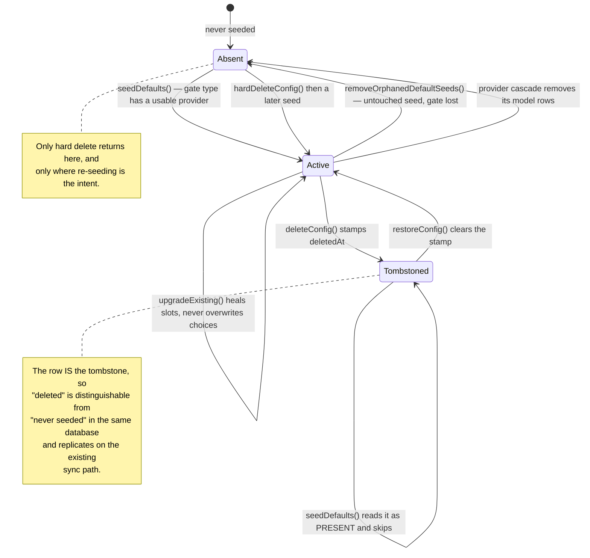
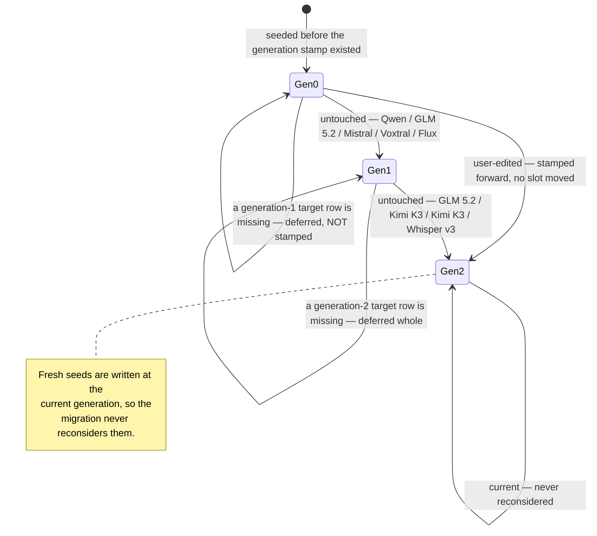

# Seeds are gated on a usable provider

`ProfileSeedingService.seedDefaults()` knows a set of default profile templates,
each gated on a provider type via `providerTypeByProfileId`:

| Profile | Gate |
|---------|------|
| `Gemini Flash`, `Gemini Pro` | Gemini provider |
| `OpenAI` | OpenAI provider |
| `Mistral (EU)` | Mistral provider |
| `Melious.ai` | Melious provider |
| `Chinese AI Profile` | Alibaba provider |
| `Anthropic Claude` | Anthropic provider |
| `Local (Ollama)`, `Local Gemma 4 (Ollama)`, `Local Gemma 4 Power (Ollama)` | Ollama provider |
| `Local Power (oMLX)`, `Local Gemma 4 (oMLX)` | oMLX provider |

A template is seeded only once a **usable** provider of its gate type exists —
`isUsable` means a non-blank API key, or for keyless local types a non-blank base
URL. A fresh install therefore starts with **zero** inference profiles;
connecting a provider seeds exactly its own.

Seeding runs at startup and again right after a provider is created, updated
(for example when an API key is added to a draft), or finishes FTUE setup — so
onboarding can bind categories to a profile immediately after the key step.

Operational details of the seeded definitions:

- The five local profiles are `desktopOnly`.
- `Local (Ollama)` and `Local Gemma 4 (Ollama)` ship with image-analysis
  automation but **no** transcription slot.
- `Local Power (oMLX)` uses `Qwen3.6-35B-A3B-4bit` for thinking and image
  recognition, `whisper-large-v3-turbo` for transcription.
- `Local Gemma 4 (oMLX)` uses `gemma-4-26B-A4B-it-QAT-MLX-4bit` plus the same
  transcription model.
- `Melious.ai` uses GLM 5.2 for thinking, Kimi K3 for **both** high-end thinking
  and image recognition, Whisper Large v3 for transcription, and Flux 2 Klein 9B
  for image generation. Melious FTUE installs a wider set than the profile
  binds — Qwen3.5 122B A10B, Mistral Small 4 119B Instruct, Voxtral Small 24B
  and Whisper Large v3 Turbo are offered as one-dropdown alternatives.
- `Local Gemma 4 Power (Ollama)` currently ships with no default skill
  assignments.

# Skills are never seeded

Everything above seeds **profiles**, **providers** and **models**. It does not
seed **skills**, and nothing else does either: `builtInSkills` is a compile-time
list, and a profile's `SkillAssignment` holds only the skill's id.

That makes the registry the sole source of truth for a built-in id, and
`resolveAssignedSkill` the only correct way to resolve one — registry first,
the config store second for ids the registry does not know (demo seeds, and
the per-user layer the skill-management UI will add).

**Resolving an assignment through the store alone is a bug, and a silent one.**
Installs that carry `skill-*` rows in `ai_config.sqlite` got them from a release
that seeded them; a fresh install has none. Every assignment on every profile
then resolves to `null`, so each automated capability is skipped without
failing:

- `ProfileAutomationService` matches nothing and transcription falls through to
  its **direct fallback** — a rank-ordered search across every configured audio
  model that never reads the subject's category or profile. A category pinned
  to one provider transcribes through whichever provider wins that ranking.
- `SyncedAudioInferenceDispatcher` has no fallback by design, so synced audio
  transcribes nothing at all.

Both symptoms look like a provider problem and are not.

# The retroactive counterpart

`removeOrphanedDefaultSeeds()` runs at startup only, after `upgradeExisting()`.
It deletes default seeds whose gate type has no usable provider — covering
installs that seeded the full catalog before the gate existed, and providers
deleted since the last launch.

It is deliberately conservative. A profile is removed only while it **still looks
like an untouched seed** — template name (or the legacy `Local Power (Ollama)`
name), no description, no pinned host, template flags — *and* none of its model
slots resolve to a model row owned by a usable provider. Renamed, described,
pinned or rewired profiles always survive.

# Deleted seeds stay deleted

Every seeding pass is idempotent **by presence**: `seedDefaults()` writes a
gated-in template whenever its row is missing, and
`ModelPrepopulationService.backfillNewModels()` recreates any known model a
configured provider lacks. Both run at startup and again after a provider is
created or updated.

So a hard delete was undone within the same session — **deletion had no memory,
only presence was state.**

Deleting an AI config therefore **soft-deletes** it: `deleteConfig` stamps
`deletedAt` on the row and re-saves it.

Because `SyncMessage.aiConfig` already carries the whole config, the deletion
replicates on the existing sync path and converges across devices with no separate
ledger and no new message type — mirroring how the journal domain deletes synced
entities.

Reads split by intent:

| Caller | Behaviour |
|--------|-----------|
| `getConfigById` / `getConfigsByType` | Hide soft-deleted rows by default, so no picker, settings tab or resolver surfaces them |
| Seeding passes | Call with `includeDeleted: true`, because they need a deleted row to read as **present** so they skip recreating it |
| `watchConfigsByType` (backs the UI) | Always filters them out |

Two paths must **not** leave a stamp and use `hardDeleteConfig`:

- **`removeOrphanedDefaultSeeds()`** sheds bundled profiles whose gate type has
  no usable provider and deliberately re-seeds them when that provider returns. A
  soft delete there would make the removal permanent — the opposite of what the
  pass means.
- **A provider cascade** removes the provider's model rows, which must come back
  if the user re-adds that provider.

`restoreConfig` clears the stamp for the one case where the user asks for
something back: re-running onboarding for a provider whose bundled profile they
had deleted, which happens before FTUE setup seeds.

# Upgrades never overwrite a choice

`seedDefaults()` is **strictly seed-on-create**: it looks each gated-in profile up
by well-known id and writes only when the row is missing. Freshly seeded profiles
write `AiConfigModel.id` slot values when the corresponding model rows exist. Once
a profile exists, the seeder never overwrites user-edited names, descriptions,
flags or skill assignments.

**`upgradeExisting()` no longer backfills default skill assignments.** The old
guard was `skillAssignments.isEmpty` — so clearing every assignment, the obvious
way to say "stop doing things automatically", was exactly what restored them with
`automate: true` on the next launch. Automation defaults are now written only
when a profile is first seeded, and an empty assignment list is treated as a
deliberate user choice rather than a gap to fill.

What `upgradeExisting()` does backfill, after model rows exist:

- **Heals dangling model slots on default profiles.** Deleting a provider
  cascade-deletes its model rows, but the seeded profile kept pointing at the dead
  ids. Each such slot resets to the seed template's provider-native default and
  re-resolves once the rows are recreated. Catalog-known provider-native values
  are treated as *pending*, not dangling.
- Rewrites legacy provider-native slot values to `AiConfigModel.id` when the
  match is unambiguous.
- Moves the untouched old `Local Power (Ollama)` seed to the oMLX
  `Qwen3.6-35B-A3B-4bit` model.
- Gives untouched local oMLX profiles the `whisper-large-v3-turbo` transcription
  slot.
- Moves legacy Melious seeds through the Qwen thinking, GLM 5.2 high-end
  thinking, Flux 2 Klein 9B image-generation and Voxtral Small 24B transcription
  defaults (**generation 1**).
- Moves untouched generation-1 Melious seeds to GLM 5.2 thinking, Kimi K3
  high-end thinking *and* image recognition, and Whisper Large v3 transcription
  (**generation 2**). Image generation already points at Flux 2 Klein 9B.

**Melious stores a seed generation** after each one-shot migration, so later user
model choices are never reclassified as legacy defaults, and provider-native
slots resolve only against Melious-owned rows. Foreign providers with a matching
provider model id cannot satisfy or capture the migration.

Each generation has a **frozen** constant and its own migration, and they run in
order, so a profile stranded at generation 0 chains all the way to the current
generation in a single pass. Bumping one shared constant would have retargeted
the older migration's guard and stamp along with it — which is how a one-shot
migration quietly stops being one.

The generation-2 move is **atomic**: it applies only once every target resolves
to a Melious-owned model row, and is otherwise deferred whole until a later
pass. Migrating slot-by-slot as rows appeared would leave a profile in a shape
that is neither generation 1 nor generation 2, and the next pass — which
recognises only the exact generation-1 shape — would read that as a user edit
and stamp it forward with the remaining slots never migrated.

**Each generation also waits for the previous one to actually complete.** A
deferred generation-1 pass leaves the profile unstamped but possibly
half-moved; generation 2 skips anything below generation 1 rather than
stamping over that shape, which would freeze the profile short of both
generations forever.

# A missing row is not a user's choice

The rule the three guards above share, and the one to keep in mind when adding
a generation: **the stamp is permanent, so it may only be written on complete
evidence.**

Model deletion is a tombstone. `backfillNewModels()` reads deleted rows with
`includeDeleted: true`, so it sees the row as present and never recreates it,
while `upgradeExisting()` reads without it and cannot see the row at all. The
two passes disagree *by design* — and the shape predicates match a slot by
looking its row up, so a deleted source row makes an untouched slot look
rewired. **A single deleted model row is enough** to make a profile look
user-edited when nothing was edited.

Three consequences, each enforced in code:

| Guard | Without it |
|---|---|
| Neither migration stamps "user edited" while a row its own shape check reads is missing | One deleted row freezes the profile on stale models, permanently |
| Each generation guards on *its own* sources, not the union | Deleting Whisper Turbo — an alternative no generation-1 profile binds — would stall a generation-1 → 2 migration |
| The dangling-slot repair is skipped while a Melious migration is pending | The repair heals to the *current* template, writing a generation-2 value into a generation-0 shape that the migrations then read as a user edit |

Legacy provider-native values (the old Flux 2 dev id) are matched as plain
strings and need no row, so they are deliberately absent from the source lists.

User-edited names, resolvable model slots outside recognized seed generations,
and skill assignments are all preserved.

Besides startup, `upgradeExisting()` also runs right after a provider is created
or re-verified, so reconnecting a provider heals its profile immediately —
onboarding's first capture resolves through the profile seconds after the key
step.

# Model prepopulation

`ModelPrepopulationService.backfillNewModels()` seeds known model rows for
configured providers at startup.

**Known-model identity is the `providerModelId`**, while the local row id may be
deterministic or a UUID depending on whether the row came from FTUE, manual setup
or sync. Backfill therefore skips an already-configured provider model id rather
than only checking the generated row id.

It treats rows as configured only under the current provider or a usable provider
of the same type, and **ignores orphaned rows whose provider has been deleted**,
so a later valid provider can repair stale synced state. FTUE setup and the
preview modal follow the same identity rule.
