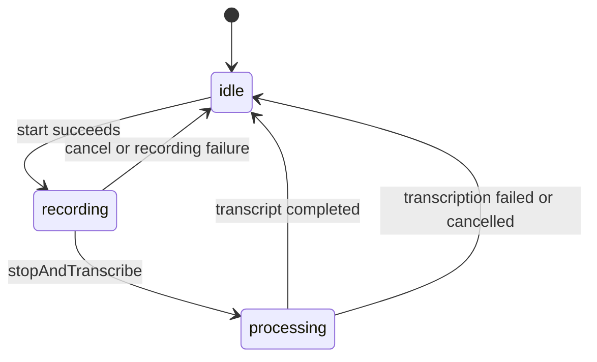
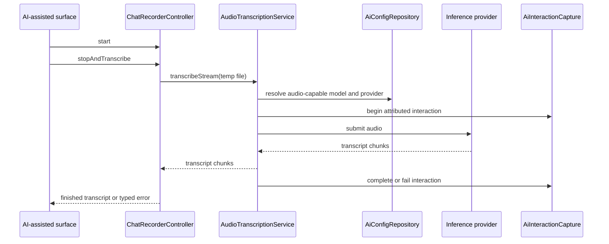

The `ai_chat` module is a support boundary, not a standalone chat feature. Its
remaining production consumers are AI-assisted surfaces that need voice input
or a reasoning disclosure. Session storage, task-summary retrieval, model
selection, and the old top-level chat UI are not part of the runtime.

# Ownership

The module owns four related primitives:

- `AudioTranscriptionService` selects an audio-capable configured model, streams
  transcript chunks, and coordinates AI-consumption attribution.
- `ChatRecorderController` records into an app-scoped temporary directory,
  samples amplitude, calls the transcription service after stop, and cleans up
  recorder and file resources.
- `ChatAmplitudeHistory` and `WaveformBars` maintain and render bounded waveform
  history.
- `thinking_parser.dart` and `ThinkingDisclosure` split hidden reasoning from
  visible text and render it behind an explicit disclosure.

Provider configuration and inference routing remain owned by [`ai`](ai/).
Agent conversations, evolution state, and wake memory remain owned by
[`agents`](agents/). Daily OS owns its processing jobs and merely calls the
transcription service.

# Batch recording lifecycle

`ChatRecorderState` exposes `idle`, `recording`, and `processing`. A monotonically
increasing operation id prevents callbacks from a cancelled or superseded
recording from overwriting a newer state.

The controller records to a temporary `.m4a` file. Amplitude callbacks update a
bounded history only while their captured operation id is current. Stop moves
the state to `processing`, streams transcription chunks, publishes the finished
transcript, and returns to `idle`. Cancel increments the operation id before
cleanup, making outstanding callbacks harmless.

# Transcription flow

An explicit transcription target bypasses discovery. Otherwise the service
loads configured models and providers, excludes realtime-only models from the
batch path, and selects a compatible audio model. Provider failures retain an
evidence state so attribution is terminalized exactly once even when publication
outcome is uncertain.

# Reasoning rendering

Callers accumulate streamed assistant text and pass it through
`thinking_parser.dart`. Visible text and thinking segments stay separate;
`ThinkingDisclosure` renders reasoning collapsed by default. The evolution UI
uses these primitives directly, so they remain independent from any chat-session
repository or screen.

# Important invariants

- Temporary recording files and directories are deleted on cancellation,
  completion, failure, and provider disposal.
- Stale async callbacks never update a newer recording operation.
- Batch transcription never selects a realtime-only model.
- Reasoning text is not mixed into the visible assistant answer.
