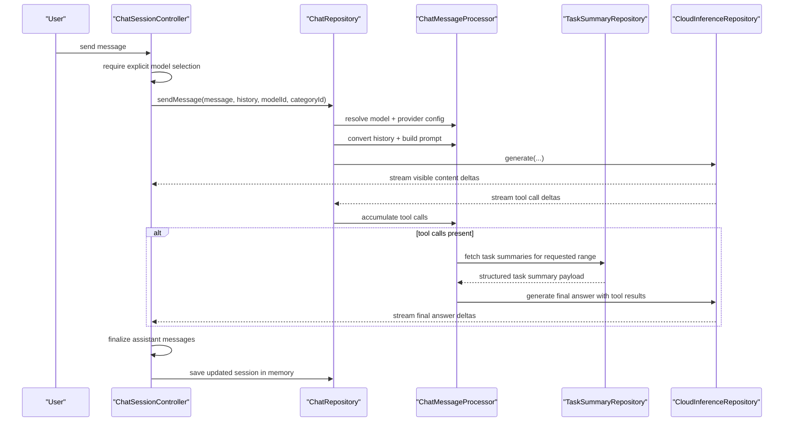
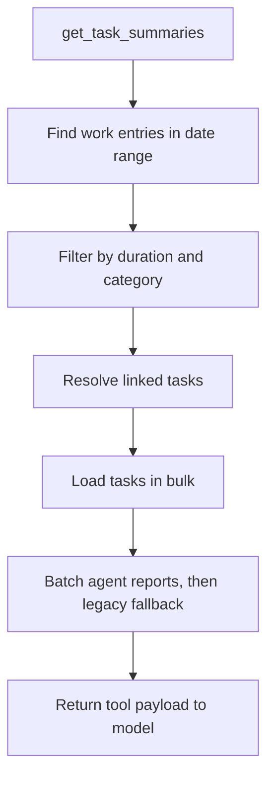

AI chat is Lotti's interactive question-and-answer surface **over task history**.
It is not the agent runtime and not the provider stack — it sits above
[`ai`](ai/) and below the chat UI.

It owns session and message state, explicit per-session model selection,
streaming assistant output including tool-calling turns, the task-summary
retrieval tool, and batch transcription for chat input.

It does **not** own provider configuration and routing policy, agent wake cycles
or memory, or durable long-term chat persistence.

# Sessions are in memory

Two controllers with different jobs: `ChatSessionsController` manages the session
list, creation, deletion and switching; `ChatSessionController` manages **one**
active conversation — streaming flags, selected model, visible messages, errors.

`ChatRepository` underneath stores `_sessions` and `_messages` **in memory only**.
That means recent sessions survive only for the app lifetime, there is no
database-backed transcript history yet, and deleting or switching a session is
cheap because there is no persistence layer to migrate.

# A turn

**Model selection is explicit per session** — the chat refuses to guess.

**Tool calls are accumulated while visible content is already streaming.** That
keeps the UI responsive even when the model is still building a tool request
behind the curtain.

# One built-in tool

The feature is deliberately narrow: **it does not expose the whole app as an
unbounded tool playground.** The assistant's structured retrieval tool is
`get_task_summaries`.

`TaskSummaryRepository` finds relevant work entries in range, filters for
meaningful spans, resolves linked task relationships, **loads tasks in bulk**,
**resolves agent reports for all tasks in one batch**, and builds fallback
summaries where none exist.

That batching is why the feature feels smarter than a plain chat wrapper — it is
not handing the model a giant pile of journal text and wishing it luck.

`ChatSessionController` also does not treat the provider stream as one text blob:
it segments visible content, reasoning and tool activity so the UI can render
them distinctly.
