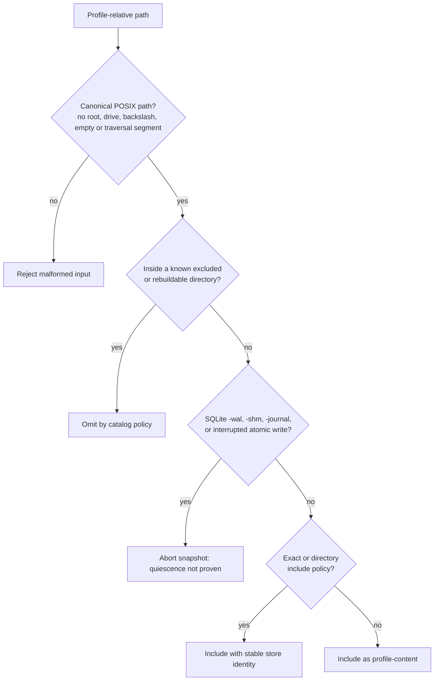
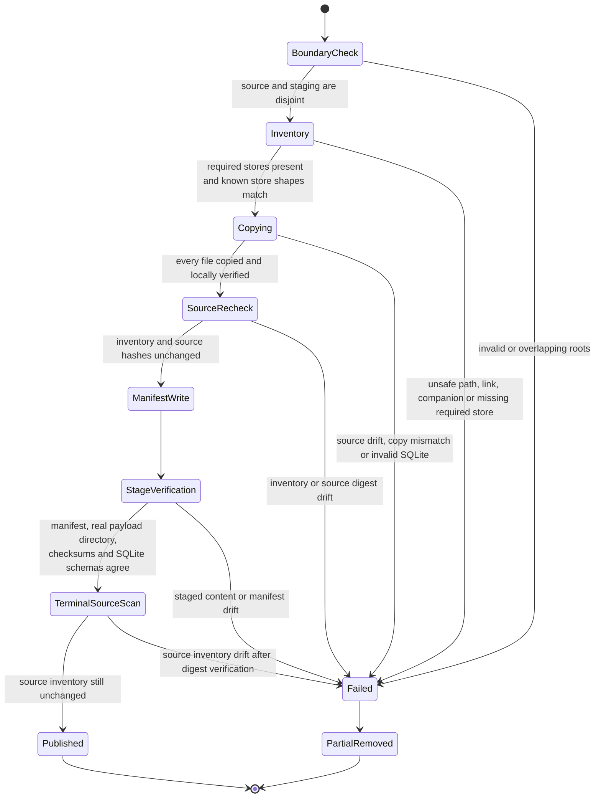
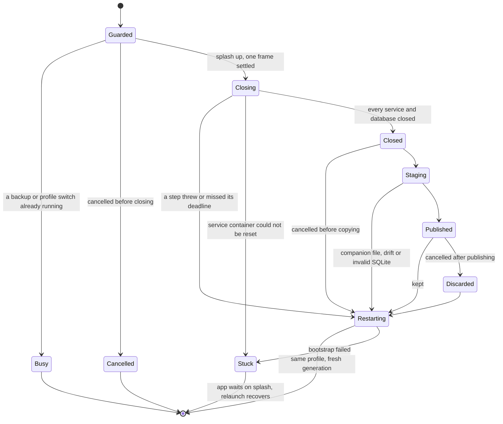
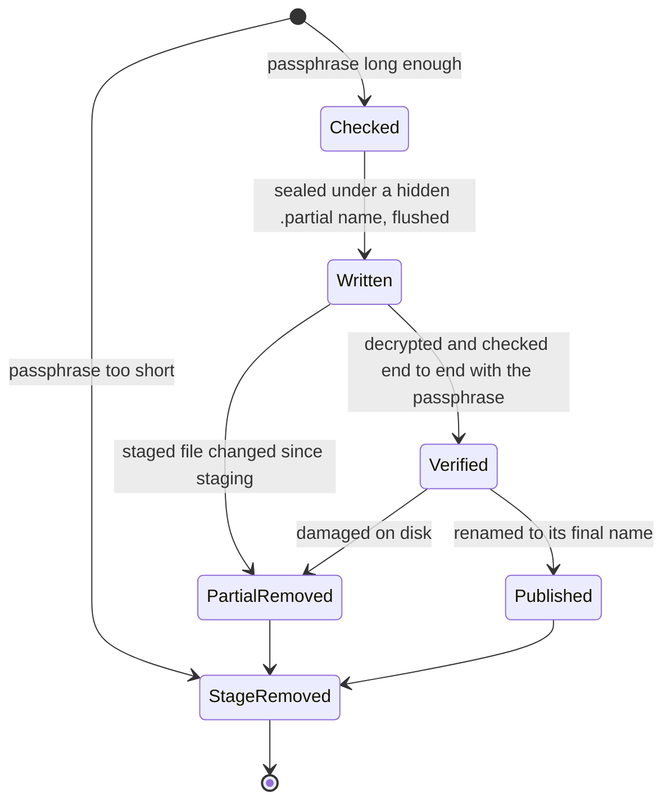
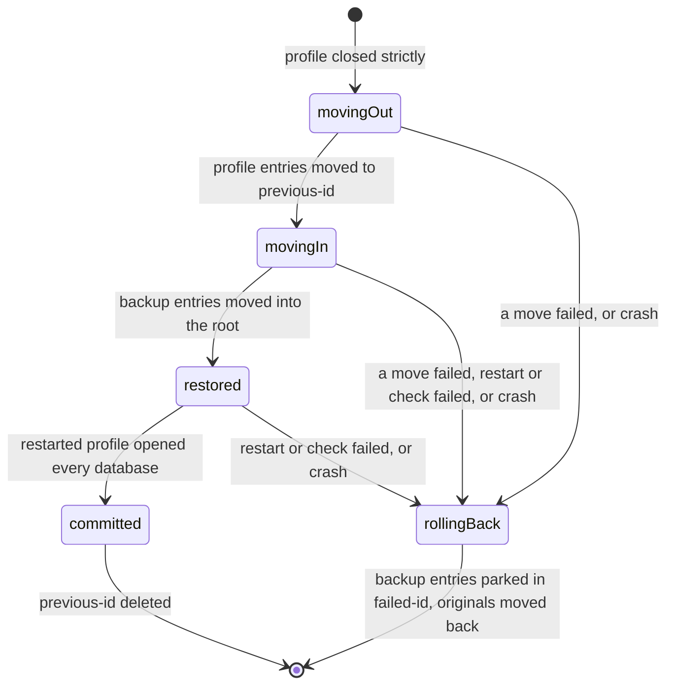

# Current boundary

The module currently defines the **capture boundary**, not a finished user
flow:

- `ProfileBackupCatalog` classifies every path below one active profile root.
- `ProfileBackupManifest` records the catalog and format versions, producing app
  version, profile type, store identities, discovered SQLite schema versions,
  file sizes, and SHA-256 digests.
- `QuiescedProfileSnapshotService` stages, verifies, and atomically publishes a
  snapshot from a profile root whose writers have already been stopped.
- `ProfileBackupCoordinator` closes the running profile strictly, stages it,
  and starts it again (see [strict quiescence](#strict-quiescence-of-a-running-profile)).
- `ProfileBackupBundleCodec` encrypts a staged snapshot into a portable
  `.lottibackup` file under the user's passphrase, and decrypts and verifies
  one back into a staged layout (see [the portable bundle](#the-portable-bundle)).
- `ProfileBackupBundleStore` names bundles, applies retention and removes what
  an interrupted backup leaves behind.
- `ProfileRestoreCoordinator` replaces the running profile with a bundle's
  contents, keeping the original until the restored one has started (see
  [restore](#restore)).

No user-facing action calls any of this yet, and automated end-to-end restore
drills are still to come.

# One profile, not one documents tree

The active `getIt<Directory>` is the profile boundary. For the real profile that
directory is also the device's real root, which contains two things that do not
belong to the profile being captured:

- `profiles.json`, the device-global registry of all worlds;
- `guest_profiles/`, the sibling guest-world container.

Both are excluded. A backup always represents exactly one world. Restoring it
must not select a device's active profile or overwrite unrelated guest worlds.

# Store inventory

The catalog imports database filenames from their owning implementations, so a
rename is a compile-time change instead of documentation drift.

| Store | Path | Treatment | Reason |
|-------|------|-----------|--------|
| Journal | `db.sqlite` | include, required | Primary journal/task/definition authority |
| Settings | `settings.sqlite` | include, required | Profile settings and authoritative host identity |
| Sync | `sync.sqlite` | include when present | Pending outbox work and local replication progress |
| Agents | `agent.sqlite` | include when present | Agent state, history, proposals, observations |
| Editor drafts | `editor_drafts_db.sqlite` | include when present | Unsaved work has no other authority |
| AI consumption | `ai_consumption.sqlite` | include when present | Local interaction and usage ledger |
| Notifications | `notifications.sqlite` | include when present | Durable notification state |
| Onboarding | `onboarding_metrics.sqlite` | include when present | Profile-local progress and measurements |
| AI configuration | `ai_config.sqlite` | include, credential-sensitive | Providers and profiles, holding only references to API keys kept in the OS keystore |
| Daily OS | `day_processing.sqlite` | include when present | Durable day-processing outbox |
| Legacy Daily OS outbox | `.day_processing_outbox/` | exclude | Mandatory startup migration imports every recoverable job into the SQLite outbox; retained files are a temporary rollback copy |
| Matrix SDK | `matrix/lotti_sync.db` | include, credential-sensitive | Login session and encryption state; absent in guest worlds |
| Full-text search | `fts5_db.sqlite` | rebuild | Derived from JournalDb |
| ObjectBox embeddings | `objectbox_embeddings*` | rebuild | Derived vector indexes |
| Waveform cache | `audio_waveforms/` | rebuild | Derived from authoritative audio |
| Media | `audio/`, `images/` | include | Bytes referenced by journal rows |
| Sync sidecars | `agent_entities/`, `agent_links/`, `notifications/`, `outbox_bundles/` | include | May be referenced by pending sync work |
| Demo seed metadata | `demo_seed_manifest.json` | include when present | Separates seed fixtures from guest-created work |
| Logs | `logs/` | exclude | Diagnostic rather than authoritative; may contain sensitive text |
| Legacy DB copies | `backup/` | exclude | Prevent recursion and importing stale migration copies |

An unrecognized canonical path receives the `profile-content` store identity and
is **included as personal data**. Completeness wins over size: newly introduced
content must not disappear merely because an older catalog does not recognize
its directory yet.

# Path classification is a safety gate



Bundle paths always use `/` regardless of host platform. Absolute paths,
Windows drive prefixes, backslashes, repeated separators, `.` and `..` are
invalid before any filesystem resolution occurs. Restore must repeat containment
checks against its staging root; manifest validation is defense in depth, not a
license to join untrusted strings directly.

SQLite companions are not silently excluded. Their presence is a hard failure
because raw-copy snapshotting is permitted only after every connection and
read-pool isolate has closed cleanly. A future live exporter may use
`VACUUM INTO` or SQLite's backup API per database, but that alone does not make
eleven databases, Matrix, ObjectBox, and media one cross-store point-in-time
snapshot. Whole-profile capture still requires a lifecycle barrier.

# Manifest invariants

`ProfileBackupManifest` accepts untrusted JSON only after these checks:

- the format and catalog versions are positive and no newer than this build;
- `createdAt` is canonical UTC with `Z` notation;
- profile type is `real` or `guest`;
- store ids and store paths are unique and canonical;
- a schema version is non-negative and appears only on a SQLite store;
- every file path is unique, belongs to its declared store, and has a
  non-negative byte length plus a lowercase 64-character SHA-256 digest;
- every file references a declared store.

Stores and files are sorted before serialization. Deterministic manifests make
encryption input, tests, diagnostics, and future signatures reproducible.

# Verified quiesced staging

`QuiescedProfileSnapshotService` accepts only an already-closed profile root.
It deliberately does not reach into GetIt or own database shutdown: making a
filesystem service pretend it can quiesce Drift read pools, Matrix, ObjectBox,
and background workers would turn a lifecycle failure into a plausible-looking
backup.



The service creates a uniquely named partial directory with the platform's
temporary-directory primitive, then publishes with one directory rename. It
never replaces an existing destination. Every copied file is SHA-256 checked
against both the source and destination. Known included stores must have their
catalog-declared filesystem shape, and the whole source is checked after two
post-copy inventory scans; the terminal scan runs after digest and staged-byte
verification, immediately before publication. SQLite copies are opened
read-only with the `immutable=1` URI option, checked with
`PRAGMA integrity_check`, and recorded with their `user_version`. A final
verification requires the payload root itself to be a real directory, then
repeats payload membership, checksums, integrity, and schema-version checks.

The immutable open is safe here only because strict quiescence is a caller
precondition and the catalog rejects transaction companions. It must not be
reused as a shortcut for inspecting a live WAL database.

# Strict quiescence of a running profile

`ProfileBackupCoordinator.capture` is the only way to snapshot the profile the
app is running. It borrows the profile switch's machinery through
`ProfileSwitcher.runWithGenerationClosed`, with one difference that matters:
**closing is strict.** A profile switch logs a service that fails to stop and
boots the next world anyway; a backup refuses to copy anything.



- **Closing** runs the switch's quiesce steps (`StartupTasks.settle`,
  `TimeService.stop`, the audio player, the app-exit listener, the window
  service) and then `ServiceDisposer.disposeAll`, which now *returns* every
  service or database that threw or missed its 3-second deadline instead of
  only logging it. Any entry means `ProfileQuiescenceException`, listing the
  steps, and the snapshot never starts.
- **Two independent proofs.** Beyond every close reporting success, SQLite
  deletes a database's `-wal` and `-shm` only when its last connection
  closes, Drift read pools included. The catalog refuses any companion file,
  so a connection nobody knew about aborts staging before the first byte is
  copied. A clean close also checkpoints the WAL, so commits made before the
  backup started are in the database file the snapshot copies.
- **The profile always comes back.** After success, after a close failure,
  after a staging failure and after a cancellation, the same profile is
  bootstrapped onto a fresh service generation. The active-world marker is
  never touched. Only two cases leave the app on the splash, both reported as
  `ProfileRestartException`: the service container could not be reset (booting
  onto it would be unsafe), or the bootstrap itself failed. A relaunch boots
  the same, unmodified profile.
- **One lifecycle operation at a time.** Backups and profile switches share the
  switcher's guard. A backup requested during a switch, or during another
  backup, fails with `ProfileBackupBusyException` and touches nothing; a switch
  requested during a backup is ignored, as a second switch always has been.
- **Cancellation** is checked at phase boundaries only: before closing, after
  closing but before copying, and after publishing, where the published
  snapshot is deleted. Staging itself is not interrupted.

The splash replaces the whole widget tree, so every Riverpod provider of the
old generation is disposed, an active audio recording included. Offering the
backup action only when nothing is being recorded is the caller's job.

# The portable bundle

`ProfileBackupBundleCodec.package` turns a staged snapshot into one file,
`lotti-backup-<UTC yyyyMMddTHHmmssZ>-<8 hex>.lottibackup`. Nothing in the name
describes the profile.

```text
"LOTTIBAK" | version u8 | header length u32 BE | header JSON | sealed chunks…
```

- **Header** — the only readable part: container version, cipher, chunk size,
  a random 16-byte bundle id, and the key slots. No profile name, type, app
  version, file list or size. Restore tries the key slots one after
  another before it knows whether the passphrase is right, so a tampered
  header is bounded twice: no slot may ask for more than 256 MiB, 16 passes or
  8 lanes of Argon2id, and all slots together no more than four derivations
  at the default cost.
- **Key flow** — a random 256-bit data key encrypts the payload. Each key slot
  holds it wrapped with ChaCha20-Poly1305 under a key derived from the
  passphrase with Argon2id (64 MiB, 3 passes, one lane by default; the
  parameters travel in the slot). The wrap authenticates the header core and
  the slot's own derivation parameters. **The passphrase is the recovery
  path**: it is never stored, the backup opens on any device that knows it,
  and a forgotten passphrase cannot be recovered. Slots are kept out of what
  the payload authenticates, so a recovery-code slot can be added later
  without re-encrypting. Packaging refuses a passphrase shorter than 12
  characters.
- **Payload** — one plaintext stream: `LOTTIARC`, version, the manifest as the
  first record, every manifest file as a `payload/<path>` record in manifest
  order, then an end record. It is sealed in 64 KiB ChaCha20-Poly1305 chunks.
  Chunk *i* uses *i* as an 11-byte big-endian nonce plus a final-chunk flag,
  and authenticates SHA-256 of the magic, version and header core. Only the
  real last chunk carries the flag, so a dropped, appended, reordered or
  foreign chunk fails authentication.



The staged snapshot is plaintext, so it is deleted whatever the outcome. An
existing bundle is never touched, because each run publishes under a new name.
All of it runs in a background isolate with synchronous file I/O.

`extract` is the reverse: it refuses an existing target directory, unwraps the
data key, authenticates every chunk before its bytes are used, checks each
file's size and SHA-256 against the manifest, keeps each path inside the
target, and removes the target again on any failure. Every output file is
created exclusively: two manifest paths that name one file on the target
volume (`A.jpg` and `a.jpg` on a case-insensitive disk) fail the extraction
instead of one silently overwriting the other. Each file's parent folder is
resolved and must still lie inside the target, and the exclusive create
refuses a symlink in the file's own place. Dart offers no descriptor-relative,
no-follow create, so a process that can write into the new restore folder
while extraction runs could still race these checks; such a process already
runs as the user, and restore verifies the payload again before activating
it. A wrong passphrase and a
damaged key slot are deliberately indistinguishable. The result has the staged
snapshot's layout, which restore will verify again before activating it.

## Retention and leftovers

`ProfileBackupBundleStore` only ever touches names Lotti itself creates:

- `applyRetention(keep: n)` keeps the *n* newest bundles, ordered by the
  timestamp and suffix in their names rather than file-system times, and never
  keeps fewer than one;
- `removeLeftovers` deletes partial bundles and staged or partially staged
  snapshots — the plaintext an interrupted backup can leave — matching each
  complete name, and must not run while a backup is in progress.

# Restore

A restore replaces the files of the **running** profile. It never changes
which profile is active, never touches the device registry, guest worlds or
diagnostic logs, and keeps the original until the restored profile has
started and opened every database.

## Preflight, with the profile still running

`ProfileRestorePreflight` decrypts the bundle into
`<root>/.restore/incoming-<id>/` — inside the root, so the later moves are
same-filesystem renames — and checks it without touching the live files:

- the codec's authentication and per-file checks;
- the backup is of the same kind of profile (`real` or `guest`);
- every store the catalog marks required is present;
- no database schema is newer than this build's
  (`restorableSchemaVersions`, built from each database's
  `currentSchemaVersion`); an older one is fine, Drift migrates it on first
  open;
- every database passes `integrity_check`, opened `immutable=1` so no
  companion file is created, and its real `user_version` matches the manifest;
- nothing would land on a device-owned entry.

It also refuses to start while another restore is pending. Any failure deletes
the staged copy; the live profile was never involved. The catalog excludes
`.restore/`, so a restore in progress is never itself backed up.

## Swap, start, verify, commit



`ProfileRootSwap` records the phase in `.restore/restore-journal.json` —
written to a temporary file and renamed — **before** each step. Every move is
one rename of a whole top-level entry, and a batch of moves checks every
destination before moving anything, so nothing is ever half-copied or
overwritten. Top-level entries that belong to the device (the registry, guest
worlds, logs and `.restore/` itself) are never moved.

The swap runs inside `ProfileSwitcher.runWithGenerationClosed`, strictly
closed exactly as a backup is. Its `verifyRestarted` step is
`verifyProfileDatabasesOpen`, which queries every registered database: Drift
opens a database and runs its migrations on the first query, so a bootstrap
that returned proves nothing yet. If the restart or that check fails, the
switcher tears the rejected generation down, `rollBack` puts the original
entries back, the original boots again, and the caller gets
`ProfileRolledBackException`. A swap that fails partway undoes itself before
anything starts; if even that undo fails, the profile is left closed
(`ProfileRestartException`) rather than started on a half-swapped folder where
Drift would create empty databases in place of missing ones.

## Recovery at launch

`main` calls `ProfileRootSwap.recover` on the active root after resolving the
active profile and before bootstrapping it. A pending restore is rolled back,
unless it reached `committed`, which is finished instead; a staged copy
without a journal is deleted. `rollBack` resumes from whatever phase was
recorded, including a rollback that was itself interrupted, and always acts on
the restore the journal names. Because a restore never changes the active
profile, the profile a crash interrupted is always the one the next launch
boots — and recovers — first.

## Open questions

- **Sync after a restore.** The restored `matrix/` database carries the
  session of the device that made the backup, while this device's keystore
  keeps its own sync credentials. What sync should do after a restore from
  another device is not designed yet.
- **Disk space.** A restore holds about one extra copy of the profile while it
  runs, and nothing checks for the space up front.

# Privacy and packaging boundary

All included content is personal. `ai_config.sqlite` and the Matrix subtree have
the stricter `credentials` classification: the Matrix database holds access and
session tokens and encryption material, and it travels only inside the
encrypted payload. AI provider API keys live in the OS keystore, which is not
part of the profile root, so **a backup carries no API keys**; after a restore
on another device the keys have to be entered again. The same holds for
anything else device-global: sync provisioning credentials in the keystore are
neither backed up nor replaced by a restore. The manifest lives inside
the encrypted payload, and the staged directory must never be published as a
plaintext backup.

Rebuildable indexes are omitted both to reduce size and to avoid treating a
derived projection as authority. Logs are excluded rather than merely marked
sensitive because they are diagnostic history, not required for recovery.

# Three operations that must stay distinct

1. **Migration-time database fallback** — the existing `createDbBackup()` is a
   best-effort copy of one database around a schema migration. It is not a
   profile backup and carries no manifest or restore contract.
2. **Whole-profile capture** — stop new work, strictly close all profile-bound
   writers, classify and stage every file, validate databases and hashes, then
   encrypt and atomically publish the artifact.
3. **Restore** — authenticate and validate into an isolated staging profile,
   quiesce the active world, preserve it for rollback, activate the candidate,
   and delete the original only after the restored world boots successfully.

Conflating these operations is the shortest route to a backup that looks real
but loses WAL commits, sibling stores, media, or credentials.

# Next implementation seams

The catalog, manifest, and staging service are intentionally free of
service-locator and UI dependencies, and the coordinator reaches the profile
lifecycle only through a `ClosedGenerationRunner` function. The remaining
layers are localized UI — passphrase entry and confirmation, the managed
backups directory and its retention setting, restore preflight and
destructive confirmation, and a recovery affordance on the splash for a failed
restart — and automated end-to-end restore drills.

Related: [persistence](../architecture/persistence.md) for database connection
and WAL behavior, [profiles and demo mode](../architecture/profiles-and-demo-mode.md)
for world lifecycle, and [security and privacy](../architecture/security-and-privacy.md)
for the current at-rest threat model.
