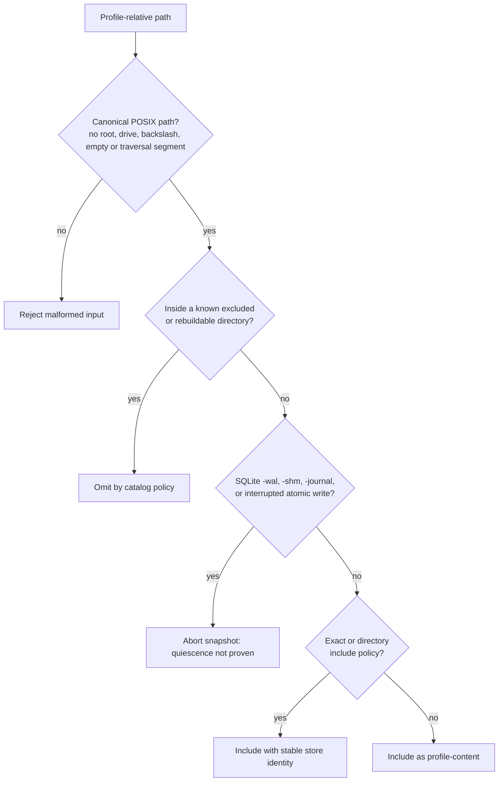
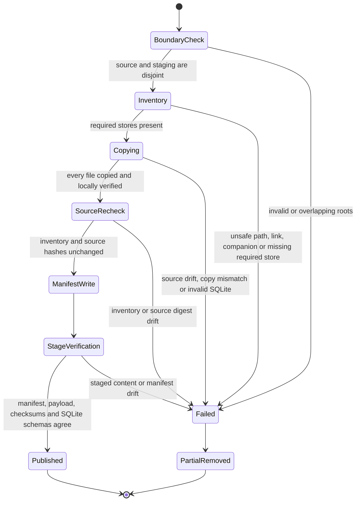

# Current boundary

The module currently defines the **capture boundary**, not a finished user
flow:

- `ProfileBackupCatalog` classifies every path below one active profile root.
- `ProfileBackupManifest` records the catalog and format versions, producing app
  version, profile type, store identities, discovered SQLite schema versions,
  file sizes, and SHA-256 digests.
- `QuiescedProfileSnapshotService` stages, verifies, and atomically publishes a
  snapshot from a profile root whose writers have already been stopped.

No runtime coordinator proves quiescence, encrypts, packages, or restores a
bundle yet. A caller must not present the staged directory as a supported or
portable backup until strict quiescence, authenticated encryption, restore
rollback, and automated restore drills are all connected.

# One profile, not one documents tree

The active `getIt<Directory>` is the profile boundary. For the real profile that
directory is also the device's real root, which contains two things that do not
belong to the profile being captured:

- `profiles.json`, the device-global registry of all worlds;
- `guest_profiles/`, the sibling guest-world container.

Both are excluded. A backup always represents exactly one world. Restoring it
must not select a device's active profile or overwrite unrelated guest worlds.

# Store inventory

The catalog imports database filenames from their owning implementations, so a
rename is a compile-time change instead of documentation drift.

| Store | Path | Treatment | Reason |
|-------|------|-----------|--------|
| Journal | `db.sqlite` | include, required | Primary journal/task/definition authority |
| Settings | `settings.sqlite` | include, required | Profile settings and authoritative host identity |
| Sync | `sync.sqlite` | include when present | Pending outbox work and local replication progress |
| Agents | `agent.sqlite` | include when present | Agent state, history, proposals, observations |
| Editor drafts | `editor_drafts_db.sqlite` | include when present | Unsaved work has no other authority |
| AI consumption | `ai_consumption.sqlite` | include when present | Local interaction and usage ledger |
| Notifications | `notifications.sqlite` | include when present | Durable notification state |
| Onboarding | `onboarding_metrics.sqlite` | include when present | Profile-local progress and measurements |
| AI configuration | `ai_config.sqlite` | include, credential-sensitive | Providers and profiles; API keys currently live here |
| Daily OS | `day_processing.sqlite` | include when present | Durable day-processing outbox |
| Legacy Daily OS outbox | `.day_processing_outbox/` | exclude | Mandatory startup migration imports every recoverable job into the SQLite outbox; retained files are a temporary rollback copy |
| Matrix SDK | `matrix/lotti_sync.db` | include, credential-sensitive | Login session and encryption state; absent in guest worlds |
| Full-text search | `fts5_db.sqlite` | rebuild | Derived from JournalDb |
| ObjectBox embeddings | `objectbox_embeddings*` | rebuild | Derived vector indexes |
| Waveform cache | `audio_waveforms/` | rebuild | Derived from authoritative audio |
| Media | `audio/`, `images/` | include | Bytes referenced by journal rows |
| Sync sidecars | `agent_entities/`, `agent_links/`, `notifications/`, `outbox_bundles/` | include | May be referenced by pending sync work |
| Demo seed metadata | `demo_seed_manifest.json` | include when present | Separates seed fixtures from guest-created work |
| Logs | `logs/` | exclude | Diagnostic rather than authoritative; may contain sensitive text |
| Legacy DB copies | `backup/` | exclude | Prevent recursion and importing stale migration copies |

An unrecognized canonical path receives the `profile-content` store identity and
is **included as personal data**. Completeness wins over size: newly introduced
content must not disappear merely because an older catalog does not recognize
its directory yet.

# Path classification is a safety gate

Bundle paths always use `/` regardless of host platform. Absolute paths,
Windows drive prefixes, backslashes, repeated separators, `.` and `..` are
invalid before any filesystem resolution occurs. Restore must repeat containment
checks against its staging root; manifest validation is defense in depth, not a
license to join untrusted strings directly.

SQLite companions are not silently excluded. Their presence is a hard failure
because raw-copy snapshotting is permitted only after every connection and
read-pool isolate has closed cleanly. A future live exporter may use
`VACUUM INTO` or SQLite's backup API per database, but that alone does not make
eleven databases, Matrix, ObjectBox, and media one cross-store point-in-time
snapshot. Whole-profile capture still requires a lifecycle barrier.

# Manifest invariants

`ProfileBackupManifest` accepts untrusted JSON only after these checks:

- the format and catalog versions are positive and no newer than this build;
- `createdAt` is canonical UTC with `Z` notation;
- profile type is `real` or `guest`;
- store ids and store paths are unique and canonical;
- a schema version is non-negative and appears only on a SQLite store;
- every file path is unique, belongs to its declared store, and has a
  non-negative byte length plus a lowercase 64-character SHA-256 digest;
- every file references a declared store.

Stores and files are sorted before serialization. Deterministic manifests make
encryption input, tests, diagnostics, and future signatures reproducible.

# Verified quiesced staging

`QuiescedProfileSnapshotService` accepts only an already-closed profile root.
It deliberately does not reach into GetIt or own database shutdown: making a
filesystem service pretend it can quiesce Drift read pools, Matrix, ObjectBox,
and background workers would turn a lifecycle failure into a plausible-looking
backup.

The service creates a uniquely named partial directory with the platform's
temporary-directory primitive, then publishes with one directory rename. It
never replaces an existing destination. Every copied file is SHA-256 checked
against both the source and destination, and the whole source is checked again
after a second inventory scan. SQLite copies are opened read-only with the
`immutable=1` URI option, checked with `PRAGMA integrity_check`, and recorded
with their `user_version`. A final verification repeats payload membership,
checksums, integrity, and schema-version checks before publication.

The immutable open is safe here only because strict quiescence is a caller
precondition and the catalog rejects transaction companions. It must not be
reused as a shortcut for inspecting a live WAL database.

# Privacy and packaging boundary

All included content is personal. `ai_config.sqlite` and the Matrix subtree have
the stricter `credentials` classification because they currently contain API
keys, access/session tokens, and encryption material. The manifest lives inside
the protected payload; an implementation must not publish the staged directory
or those fields as a plaintext portable backup.

Rebuildable indexes are omitted both to reduce size and to avoid treating a
derived projection as authority. Logs are excluded rather than merely marked
sensitive because they are diagnostic history, not required for recovery.

# Three operations that must stay distinct

1. **Migration-time database fallback** — the existing `createDbBackup()` is a
   best-effort copy of one database around a schema migration. It is not a
   profile backup and carries no manifest or restore contract.
2. **Whole-profile capture** — stop new work, strictly close all profile-bound
   writers, classify and stage every file, validate databases and hashes, then
   encrypt and atomically publish the artifact.
3. **Restore** — authenticate and validate into an isolated staging profile,
   quiesce the active world, preserve it for rollback, activate the candidate,
   and delete the original only after the restored world boots successfully.

Conflating these operations is the shortest route to a backup that looks real
but loses WAL commits, sibling stores, media, or credentials.

# Next implementation seams

The catalog, manifest, and staging service are intentionally free of
service-locator and UI dependencies. The next layers attach in order:

1. a strict lifecycle coordinator that fails closed if any writer cannot stop;
2. authenticated encrypted packaging and retention;
3. staged restore with compatibility checks, activation, and rollback;
4. localized UI and end-to-end restore drills.

Related: [persistence](../architecture/persistence.md) for database connection
and WAL behavior, [profiles and demo mode](../architecture/profiles-and-demo-mode.md)
for world lifecycle, and [security and privacy](../architecture/security-and-privacy.md)
for the current at-rest threat model.
