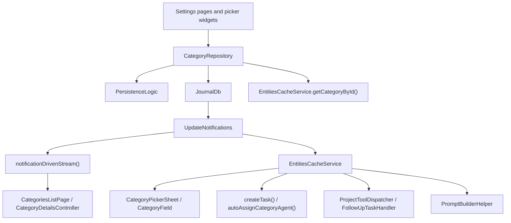

Categories are persisted `CategoryDefinition` entities. The feature does three
concrete jobs: power the settings UI for creating, editing and browsing
categories; provide the reusable category-picking UI other features embed; and
store the category-scoped defaults and vocabulary that downstream task, AI and
speech code consumes.

**Two read paths, on purpose.** List and detail surfaces read
`notificationDrivenStream()` so they stay live; hot paths — pickers, task
creation, agent auto-assign, prompt building — read
`EntitiesCacheService.getCategoryById()` synchronously, because they run inside
gestures and prompt assembly where an async round trip would be visible.

# What it owns

- `CategoryRepository` — create, update, soft delete, stream reads, task counts.
- Settings surfaces: `CategoriesListPage`, `CategoryDetailsPage`, create mode.
- Reusable pickers: `CategoryField`, `CategoryPickerSheet`, `CategoryCreateModal`.
- Presentation metadata (`name`, `color`, `icon`) and flags (`private`, `active`,
  `favorite`, `isAvailableForDayPlan`, `automaticInferenceEnabled`,
  `automaticAgentWakesEnabled`).
- Stored defaults: `defaultLanguageCode`, `defaultProfileId`, `defaultTemplateId`,
  `defaultEventTemplateId`.
- Category-scoped AI and speech context: `speechDictionary`,
  `correctionExamples`.

# The consent flag

`automaticInferenceEnabled` is the category's explicit opt-in to running
inference **without a user gesture**. It is nullable, and **an absent value means
off** — including for categories that already carry a `defaultProfileId`.

Seeded inference profiles ship `automate: true` skill assignments, so selecting a
profile alone would otherwise start spending tokens silently.
`ProfileAutomationService` consults this flag before **every** automatic path, so
the flag — not the profile — is the switch.

Two callers set it. The category settings form owns it from then on — a
`SettingsSwitchRow` bound to `CategoryDetailsController
.setAutomaticInferenceEnabled`, which stages the change on the pending category
like any other field and saves with the form. That row is **conditional**: it
renders only when `categoryAutomationAvailableProvider(defaultProfileId)`
resolves true, so a category whose profile automates nothing shows no switch
rather than a switch that controls nothing.

Onboarding is the other, and the only one that sets it **without the user
touching a switch**: at the moment it creates the areas, having just connected a
provider and picked those areas *is* the consent. It is written **before** the
first capture is recorded, not because of it — otherwise the flow would go on
teaching "speak and it transcribes" while the app stopped doing so the next day.

**Reused categories are the exception.** An existing `false` is the user having
switched automation off, so onboarding only fills in a `null`.

See [AI execution paths](../ai/execution-paths.md) for where the gate sits in the
chain, and [entity definitions](../../domain/entity-definitions.md) for the model.

# The agent-wake seed

`automaticAgentWakesEnabled` seeds `AgentConfig.automaticUpdatesEnabled` on the
task agents this category auto-creates — whether each one wakes on task changes or
only when asked.

**It is a seed, not a gate.** The per-task switch on the AI summary card owns the
preference afterwards, so turning this on later does **not** reach back into tasks
that already exist. The service mirrors the value into the wake orchestrator as
well as persisting it, so a seeded-on agent wakes in the session it was created in
rather than after the next restart.

Two boundaries keep it honest:

- **The details-page row is hidden without a `defaultTemplateId`**, since no agent
  is created there for it to govern.
- **It is independent of `automaticInferenceEnabled`** — switching wakes off leaves
  automatic transcription and image analysis running.

See [task agents](../agents/task-agents.md) for the creation paths that forward it.

# Model boundaries

- `CategoryDefinition` does **not** contain prompt allowlists such as
  `allowedPromptIds`.
- The old `automaticPrompts` concept is **not** part of the current model.
- `defaultLanguageCode` is referenced by this feature's model, controller and UI,
  but a code sweep found **no downstream consumer outside the feature**.
